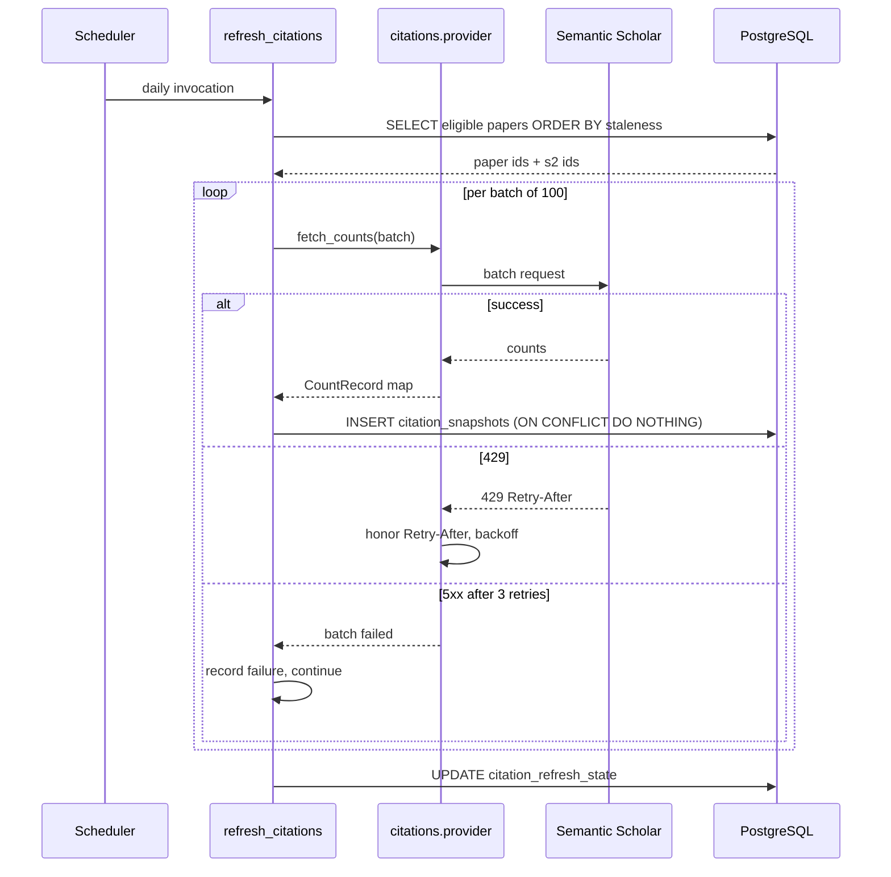

# Citation-Velocity Tracking

Status: Draft for user review
Scope: Sub-project D of the Athena rendered frontend
Depends on: Sub-project A (frontend shell), `evidence_engine` Semantic Scholar adapter and `Score` model, PostgreSQL

## 1. Executive Summary

Sub-project D gives Athena a citation *time series* where today it has only a single overwritten number, and renders that series as a small trend chart on saved searches, paper cards, and the topic detail page.

The platform currently stores `Score.citation_count` as one integer that `score_paper` overwrites on every rescore. Nothing anywhere records what the count was last month, so no velocity, acceleration, or trend can be computed from existing data. D adds an append-only snapshot table, a scheduled job that refreshes counts for tracked papers, and a velocity calculation with explicit minimum-sample rules.

The audience is the researcher from sub-project A who wants to distinguish a paper that is accumulating citations quickly from one whose total is high only because it is twenty years old.

The concrete outcome is that a paper card can display "＋14 citations in the last 30 days" with a sparkline, and a saved search can display the aggregate velocity of its result set — both grounded in dated observations rather than a derived guess. Where fewer than two observations exist, D shows nothing rather than a fabricated trend.

A deliberate constraint runs through this document: **velocity is only measurable going forward from the day snapshotting begins.** There is no historical citation data to backfill, and D must not manufacture one. For roughly the first 6 weeks after deployment, most papers will show "not enough history yet."

## 2. Repository Evidence

| Item | Classification | Source | Relevance |
|---|---|---|---|
| Frontend-shell non-goal: "Citation-velocity charts on saved searches (sub-project D)" | [EXISTING] | `docs/superpowers/specs/2026-07-05-frontend-shell-design.md:99` | Establishes D's scope |
| `Score.citation_count: int = 0` — a single scalar | [EXISTING] | `evidence_engine/db/models.py:84` | The entire citation state the platform holds today |
| `score_paper` assigns `score.citation_count = citation_count` on an existing row | [EXISTING] | `evidence_engine/scoring/assemble.py:47`, with reuse of the existing row at `:43-44` | **Rescoring overwrites the prior count; no history is retained** |
| Semantic Scholar adapter requests `citationCount` and `influentialCitationCount` | [EXISTING] | `evidence_engine/adapters/semantic_scholar.py:11` | The only citation-count source in the platform |
| `citation_count=record.get("citationCount")` mapped into `RawPaper` | [EXISTING] | `evidence_engine/adapters/semantic_scholar.py:46` | The ingestion path for the count |
| `influentialCitationCount` retained in `raw_metadata` | [EXISTING] | `evidence_engine/adapters/semantic_scholar.py:47` | A second, already-fetched signal available at no extra cost |
| Adapter's only call is `paper/search` by topic label, `limit=100` | [EXISTING] | `evidence_engine/adapters/semantic_scholar.py:10`, `:20-28`, `:51` | **There is no per-paper or batch citation lookup**; D must add one |
| Adapter retries 3× with exponential backoff, `reraise=True` | [EXISTING] | `evidence_engine/adapters/semantic_scholar.py:19` | The established resilience idiom D's fetcher follows |
| `semantic_scholar_api_key` is optional | [EXISTING] | `evidence_engine/config.py:14`; header omitted when absent at `evidence_engine/adapters/semantic_scholar.py:17` | Rate-limit posture differs sharply with and without a key |
| `_citation_score = min(100, log10(count+1) * 33)`, weight `0.15` | [EXISTING] | `evidence_engine/scoring/formula.py:25-28`, `:16` | Citation count already influences scoring; D must not silently change scoring |
| `Paper.semantic_scholar_id` is unique and nullable | [EXISTING] | `evidence_engine/db/models.py:56` | The join key for refresh; nullable means some papers are unrefreshable |
| `Paper.is_retracted` boolean | [EXISTING] | `evidence_engine/db/models.py:64` | Retracted papers need distinct velocity treatment |
| Retraction rechecking runs in the daily cycle | [EXISTING] | `docs/superpowers/specs/2026-07-03-evidence-engine-design.md:66`; `evidence_engine/adapters/retractions.py` | Precedent for a periodic per-paper refresh pass |
| Cross-source dedup via DOI then PMID | [EXISTING] | `docs/superpowers/specs/2026-07-03-evidence-engine-design.md:58`; `evidence_engine/adapters/merge.py` | Relevant to merged-record handling |
| Web-search-UI non-goal: "Numeric threshold filters on citation count or SJR" | [EXISTING] | `docs/superpowers/specs/2026-07-04-web-search-ui-design.md:97` | Filtering by velocity is likewise out of scope for D's v1 |
| `SearchIndexSyncState` single-row watermark | [EXISTING] | `webapp/models.py:25-29` | Precedent for job-state tracking |
| `process_all_topics` isolates per-item failure with rollback and continues | [EXISTING] | `scripts/run_daily_cycle.py:23-37` | The job idiom D's refresh follows |
| `SavedSearch(user_id, name, query_params, last_run_at)` | [EXISTING] | `webapp/models.py:32-40` | The saved-search row the reference design attaches a sparkline to |
| `run_saved_search` re-executes the stored query | [EXISTING] | `webapp/saved_searches.py`; `webapp/api.py:169` | How a saved search's current result set is obtained |
| Recharts 3.x already a dependency | [EXISTING] | `webapp/frontend/package.json` dependencies | Sparklines need no new package |
| `PaperRow` frontend type has no citation field | [EXISTING] | `webapp/frontend/src/api/types.ts:2` | D must extend the serialization contract |
| `app.mount("/", StaticFiles(...))` is the last statement of `webapp/api.py` | [EXISTING] | `webapp/api.py:212` | New routes MUST be declared above it |
| Alembic head `5d7c21d9f44e` | [EXISTING] | `alembic/versions/5d7c21d9f44e_enterprise_api_tables.py:15` | D's migration chains from here or from a preceding sub-project's |
| No table stores dated citation observations | [INFERRED] | Absence across `evidence_engine/db/models.py`, `webapp/models.py`, `digest/models.py`, `enterprise_api/models.py` | D must create the snapshot store |
| PubMed and ClinicalTrials adapters expose no citation count | [INFERRED] | `evidence_engine/adapters/pubmed.py` and `clinicaltrials.py` contain no `citation` field, unlike `semantic_scholar.py:11` | Semantic Scholar is a single point of failure for D |

## 3. Goals

- G-D-1: Every non-retracted paper with a `semantic_scholar_id` that belongs to at least one active topic receives a citation observation at least once every 7 days.
- G-D-2: A paper with at least 2 observations spanning at least 14 days displays a 30-day velocity figure derived from those observations, never from a single count.
- G-D-3: A paper with fewer than 2 qualifying observations displays "Not enough history yet" and no number, chart, or arrow.
- G-D-4: Velocity is presented alongside a field-normalized percentile whenever an age-matched cohort of at least 10 papers exists in the same topic; otherwise the raw velocity is shown without a percentile.
- G-D-5: The refresh job completes a full pass over all tracked papers within its daily window while staying inside Semantic Scholar's published rate limits.
- G-D-6: A Semantic Scholar outage causes zero data loss and zero incorrect velocity figures — missed observations simply do not exist, and velocity is computed from whatever observations do.
- G-D-7: Citation counts that decrease between observations (record merges, corrections) never produce a negative velocity and are recorded as anomalies.
- G-D-8: `Score.citation_count` and every score derived from it remain byte-identical to today's behavior; D adds a parallel history without altering scoring.

## 4. Non-Goals

- Backfilling historical citation counts. No source in the platform holds them, and Semantic Scholar's API exposes only current totals, not dated series. Manufacturing history would be fabrication.
- Changing the evidence-scoring formula to incorporate velocity. `_citation_score` (`evidence_engine/scoring/formula.py:25`) stays exactly as it is; D is observational.
- Filtering or sorting search results by velocity. Numeric threshold filters are already an explicit platform non-goal (`docs/superpowers/specs/2026-07-04-web-search-ui-design.md:97`).
- Per-author, per-journal, or per-institution citation metrics (h-index and similar). D tracks papers.
- Citation *graph* data — who cites whom. Only counts are fetched.
- Predicting future citations.
- Real-time citation updates. The cadence is daily at best; Semantic Scholar's own counts update far less often than daily.
- Alerting on velocity spikes. Alert rules belong to sub-project E.

## 5. User Roles and Permissions

### Anonymous user

- **Read**: MAY read velocity data for any paper. Citation counts are public bibliographic facts already exposed via `Score.citation_count` in scoring. [PROPOSED]
- **Write**: none. Users cannot trigger a citation refresh; refresh is scheduler-only, because a user-triggered refresh would expose the Semantic Scholar rate limit to abuse. [PROPOSED]
- **Sharing**: not applicable in D.
- **Retention**: no user-linked data is created by D at all. Velocity is a property of papers, not users.
- **Failure when absent**: velocity display requires no identity; it renders identically for every visitor.

### Enterprise organization (service role)

- **Read**: MAY read velocity fields when they appear in `/v1/search` responses, subject to existing API-key auth and rate limits (`enterprise_api/auth.py`, `enterprise_api/rate_limit.py`).
- **Write / sharing**: none.
- **Retention**: not applicable.
- **Failure when absent**: unchanged `401`/`403`/`429`.
- **Note**: because `enterprise_api/api.py:55` has its own `_paper_out` serializer separate from `webapp/api.py:51`, adding velocity to one does not automatically add it to the other. See OQ-D-005.

### Scheduled refresh job (service role)

- **Read**: reads `papers`, `paper_topics`, `topics`, `citation_snapshots`.
- **Write**: writes only `citation_snapshots`, `citation_velocity_cache`, `citation_refresh_state`. It MUST NOT write `scores`.
- **Sharing**: not applicable.
- **Retention**: snapshots retained 3 years (§11).
- **Failure when absent**: if the job never runs, every paper shows "Not enough history yet" indefinitely. This is a correct, honest degradation.

## 6. User Stories

**US-D-001 — Primary: velocity on a paper card**
Actor: Anonymous user
Precondition: Paper P has 6 weekly observations; the most recent two are 30 days apart with counts 118 and 132.
Trigger: User views search results containing P.
Main flow: `/search` returns P's row including a `citation_velocity` block → the card renders the figure and a sparkline.
Expected result: Card shows "＋14 citations / 30 days", a 6-point sparkline, and, if a cohort exists, "Top 12% for its age in this topic".
Failure result: If the velocity cache has no row for P, the card renders nothing in that region rather than an error.
Acceptance criteria: The displayed delta equals the difference between the two bounding observations; the sparkline point count equals the observation count within the display window; no percentage is shown when the cohort is under 10.

**US-D-002 — Empty state: new paper**
Actor: Anonymous user
Precondition: Paper Q was ingested 3 days ago and has exactly 1 observation.
Trigger: User views Q.
Main flow: The velocity endpoint returns `status: "insufficient_history"` with `observation_count: 1`.
Expected result: Card shows "Citation history begins {date}" with no number, arrow, or chart.
Failure result: Not applicable.
Acceptance criteria: No sparkline is rendered; no zero or "0" appears, since zero would falsely assert measured stagnation.

**US-D-003 — Empty state: whole platform, first week**
Actor: Anonymous user
Precondition: D was deployed 4 days ago; no paper has 14 days of history.
Trigger: Any search.
Main flow: Every row returns `insufficient_history`.
Expected result: Result cards show no velocity region at all, and the Search page shows a single dismissible notice: "Citation trends begin appearing after two weeks of tracking."
Failure result: Not applicable.
Acceptance criteria: The notice appears once per session, not once per card; no card shows a placeholder skeleton indefinitely.

**US-D-004 — Loading state**
Actor: Anonymous user
Precondition: Velocity is served by a separate endpoint from search (see OQ-D-001).
Trigger: Search results render.
Main flow: Cards render immediately from `/search`; velocity arrives in a second request and fills in.
Expected result: Cards are complete and interactive before velocity loads; the velocity region reserves a fixed height so no layout shift occurs when it populates.
Failure result: If the velocity request fails, the region collapses silently.
Acceptance criteria: A test asserts card titles are present while the velocity handler is still pending, and that no cumulative layout shift occurs when it resolves.

**US-D-005 — Upstream failure: Semantic Scholar outage**
Actor: Scheduled job
Precondition: Semantic Scholar returns 503 for all requests during a run.
Trigger: Daily refresh.
Main flow: Each batch retries 3× with backoff (`evidence_engine/adapters/semantic_scholar.py:19`), then the batch is recorded as failed; the job continues to the next batch; the run completes with `papers_failed` high.
Expected result: No snapshots written for that day. Existing velocity figures continue to display, computed from prior observations, with their true `as_of` dates.
Failure result: If the outage persists past 14 days, velocities become undisplayable as their bounding observations age out of the window, and cards revert to "Not enough recent history".
Acceptance criteria: Zero rows written; no velocity value changes; the job exits non-zero so the operator can see it failed; no user-facing error.

**US-D-006 — Rate limiting by the provider**
Actor: Scheduled job
Precondition: Semantic Scholar returns 429 mid-run.
Trigger: Daily refresh.
Main flow: The fetcher honors `Retry-After` when present, otherwise backs off exponentially; if 429s persist for 5 consecutive batches, the job stops early and records a partial run.
Expected result: The papers already refreshed keep their new snapshots; the rest are retried on the next run, prioritized by staleness.
Failure result: Repeated partial runs mean some papers refresh less often than weekly, violating G-D-1 for those papers.
Acceptance criteria: A partial run leaves the database consistent; the next run's ordering places the un-refreshed papers first.

**US-D-007 — Stale velocity**
Actor: Anonymous user
Precondition: The refresh job has not succeeded for 10 days.
Trigger: User views a paper.
Main flow: The velocity cache row's `computed_at` is 10 days old.
Expected result: The figure renders with the qualifier "as of 10 days ago" rather than being presented as current.
Failure result: Beyond 21 days the value is suppressed entirely and the card shows "Citation trend unavailable".
Acceptance criteria: The qualifier appears beyond 3 days; suppression occurs beyond 21 days; both thresholds are asserted by tests.

**US-D-008 — Count decreases (record merge)**
Actor: Scheduled job
Precondition: Paper R's Semantic Scholar record was merged with a duplicate; its count drops from 240 to 190.
Trigger: Refresh observes 190 after 240.
Main flow: The job writes the observation with its true value 190 and sets `is_anomalous = true` on that snapshot; velocity computation clamps the delta to 0 and excludes the anomalous pair.
Expected result: The card shows the last velocity computed from a clean pair, or "Not enough history yet" if none exists; it never shows a negative velocity.
Failure result: Not applicable.
Acceptance criteria: The observation is stored truthfully; no negative velocity is ever emitted; the anomaly is counted in job observability.

**US-D-009 — Retracted paper**
Actor: Anonymous user
Precondition: Paper S is retracted but still accumulating citations.
Trigger: User views S with `include_retracted=true` in search (`webapp/search.py:20`).
Main flow: The velocity endpoint returns the figure with `is_retracted: true`.
Expected result: The card shows the velocity with a warning treatment and the label "Citations after retraction", so a rising count is not read as endorsement.
Failure result: Not applicable.
Acceptance criteria: The retracted framing is present; the raw figure is not hidden, matching the platform's stated practice of surfacing rather than suppressing retraction signals (`docs/superpowers/specs/2026-07-04-interest-digest-design.md:72`).

**US-D-010 — Saved-search aggregate velocity**
Actor: Anonymous user
Precondition: A saved search whose current result set is 40 papers, 28 of which have qualifying velocity.
Trigger: User loads the Saved Searches page.
Main flow: The saved-search velocity endpoint re-runs the stored query, resolves velocities, and aggregates.
Expected result: The row shows a sparkline of the set's median velocity over the trailing 12 weeks and the text "28 of 40 papers have citation history".
Failure result: If fewer than 5 papers qualify, no aggregate is shown and the row states "Not enough citation history in this result set".
Acceptance criteria: The coverage fraction is always displayed alongside the aggregate, so the user knows what share of the set it represents.

**US-D-011 — Invalid input**
Actor: Crafted request
Precondition: None.
Trigger: `GET /papers/velocity?paper_ids=` with 300 IDs.
Main flow: Validation rejects above the 100-ID cap.
Expected result: HTTP 422.
Failure result: Not applicable.
Acceptance criteria: 422 returned; no query executed.

## 7. Functional Requirements

**FR-D-001**: The system MUST persist an append-only citation observation per paper per refresh, recording the observed count, the observation timestamp, and the source.
- Classification: [PROPOSED]
- Rationale: G-D-2. `score_paper` overwrites `Score.citation_count` (`evidence_engine/scoring/assemble.py:47`), so no history exists.
- Inputs: `paper_id`, `citation_count`, `influential_citation_count`, `observed_at`, `source`.
- Outputs: one `citation_snapshots` row.
- Failure behavior: a duplicate observation for the same `(paper_id, observed_on)` day is ignored, not errored, making the job re-runnable.
- Acceptance test: `test_snapshot_written_with_observed_at_and_source`.

**FR-D-002**: The system MUST NOT modify `scores.citation_count` or any other `Score` column.
- Classification: [EXISTING] — the platform's downstream-consumer rule. Source: `docs/superpowers/specs/2026-07-04-interest-digest-design.md:20`; Source: `docs/superpowers/specs/2026-07-05-enterprise-api-design.md:39`.
- Rationale: G-D-8; `citation_count` feeds `compute_base_score` (`evidence_engine/scoring/formula.py:44`) and thus `evidence_tier`. A parallel write would silently change tiers.
- Inputs: none.
- Outputs: none.
- Failure behavior: a test asserting no `scores` writes fails the build.
- Acceptance test: `test_refresh_job_performs_no_score_writes`.

**FR-D-003**: Velocity MUST be computed only from two observations at least 14 days apart, and MUST be reported as citations per 30 days.
- Classification: [PROPOSED]
- Rationale: G-D-2; a shorter span makes integer-count noise dominate the signal.
- Inputs: two `citation_snapshots` rows.
- Outputs: `velocity_per_30d` float.
- Failure behavior: fewer than 2 qualifying observations → `status: "insufficient_history"`, no number.
- Acceptance test: `test_velocity_requires_fourteen_day_span`.

**FR-D-004**: A negative observed delta MUST be clamped to zero, the snapshot MUST be flagged anomalous, and the anomalous pair MUST be excluded from velocity computation.
- Classification: [PROPOSED]
- Rationale: G-D-7, US-D-008; Semantic Scholar merges duplicate records, which legitimately reduces a count without any citation being withdrawn.
- Inputs: consecutive observation counts.
- Outputs: `is_anomalous` flag; clamped delta.
- Failure behavior: if every available pair is anomalous, report `insufficient_history`.
- Acceptance test: `test_decreasing_count_clamped_and_flagged`.

**FR-D-005**: The system MUST NOT display a velocity value, sparkline, or direction arrow when `status` is `insufficient_history`.
- Classification: [PROPOSED]
- Rationale: G-D-3; rendering "0" or a flat line asserts measured stagnation that was never observed.
- Inputs: velocity status.
- Outputs: rendered region.
- Failure behavior: none.
- Acceptance test: `test_insufficient_history_renders_no_number_or_chart`.

**FR-D-006**: The system MUST compute a field-normalized percentile against an age-matched cohort of at least 10 papers within the same topic, and MUST omit the percentile when the cohort is smaller.
- Classification: [PROPOSED]
- Rationale: G-D-4; raw velocity is meaningless across fields — a strong oncology paper and a strong medical-history paper differ by an order of magnitude.
- Inputs: cohort velocities (§14.2).
- Outputs: `percentile` integer 1–99, or null.
- Failure behavior: cohort under 10 → null percentile, raw velocity still shown.
- Acceptance test: `test_percentile_omitted_for_small_cohort`.

**FR-D-007**: A scheduled job MUST refresh citation counts for all non-retracted papers with a `semantic_scholar_id` that belong to at least one active topic, in staleness order, at least weekly per paper.
- Classification: [PROPOSED]
- Rationale: G-D-1.
- Inputs: paper set; last observation date per paper.
- Outputs: snapshots; a `citation_refresh_state` record.
- Failure behavior: per-batch failure is isolated and the job continues, mirroring `scripts/run_daily_cycle.py:33-35`.
- Acceptance test: `test_refresh_orders_by_staleness_and_isolates_batch_failure`.

**FR-D-008**: The refresh job MUST use Semantic Scholar's batch paper endpoint, MUST send at most 100 paper IDs per request, and MUST NOT exceed 1 request per second.
- Classification: [PROPOSED] — the existing adapter has no batch capability; it only calls `paper/search` by topic label with `limit=100` (`evidence_engine/adapters/semantic_scholar.py:10`, `:24`).
- Rationale: G-D-5; per-paper requests for a corpus of tens of thousands would take days and would breach any published limit.
- Inputs: paper ID batch.
- Outputs: counts per ID.
- Failure behavior: on 429, honor `Retry-After`; after 5 consecutive 429 batches, stop the run and record it as partial.
- Acceptance test: `test_batch_request_capped_at_100_ids`; `test_persistent_429_stops_run_as_partial`.

**FR-D-009**: The system MUST expose `GET /papers/velocity?paper_ids=` returning velocity blocks for up to 100 papers per request.
- Classification: [PROPOSED]
- Rationale: US-D-001; search returns up to 50 rows (`webapp/frontend/src/api/hooks.ts:5`, `page_size: 50`) and each card needs a velocity block.
- Inputs: repeated `paper_ids` query parameters.
- Outputs: `VelocityResponse` (§12).
- Failure behavior: unknown IDs are omitted from the response rather than erroring, matching the partial-result convention of `compare_papers` (`webapp/api.py:101`).
- Acceptance test: `test_velocity_endpoint_omits_unknown_ids`.

**FR-D-010**: The system MUST expose `GET /papers/{paper_id}/citation-history` returning the dated observation series for one paper.
- Classification: [PROPOSED]
- Rationale: the sparkline on the topic detail page needs points, not a single figure.
- Inputs: `paper_id`; optional `days` (30–1095, default 365).
- Outputs: ordered observation list.
- Failure behavior: unknown paper → 404, matching `webapp/api.py:192`.
- Acceptance test: `test_citation_history_returns_ordered_observations`.

**FR-D-011**: The system MUST expose `GET /saved-searches/{saved_search_id}/velocity` returning an aggregate velocity series plus the coverage fraction for the saved search's current result set.
- Classification: [PROPOSED]
- Rationale: US-D-010; the reference design places a trend chart on each saved-search row.
- Inputs: `saved_search_id`, `user_id`.
- Outputs: median velocity series, `papers_with_history`, `papers_total`.
- Failure behavior: fewer than 5 qualifying papers → `status: "insufficient_coverage"` with the counts still populated.
- Acceptance test: `test_saved_search_velocity_reports_coverage_fraction`.

**FR-D-012**: Every velocity response MUST include the coverage or history context needed to interpret it: `observation_count` and `first_observed_at` for a paper, `papers_with_history`/`papers_total` for a saved search.
- Classification: [PROPOSED]
- Rationale: a velocity from 2 observations and one from 20 differ in reliability, and the user cannot tell without being told.
- Inputs: observation metadata.
- Outputs: context fields.
- Failure behavior: none.
- Acceptance test: `test_velocity_response_includes_observation_context`.

**FR-D-013**: The UI MUST qualify a velocity older than 3 days with its age and MUST suppress it entirely beyond 21 days.
- Classification: [PROPOSED]
- Rationale: US-D-007; a stalled job would otherwise present month-old trends as current.
- Inputs: `computed_at`.
- Outputs: qualifier text or suppression.
- Failure behavior: none.
- Acceptance test: `test_velocity_qualified_beyond_three_days_suppressed_beyond_21`.

**FR-D-014**: Velocity for a retracted paper MUST be labeled "Citations after retraction" and MUST carry a warning treatment.
- Classification: [INFERRED] — the platform surfaces retraction signals rather than suppressing them (`docs/superpowers/specs/2026-07-04-interest-digest-design.md:72`) while excluding retracted work from evidence grounding (`evidence_engine/consensus/synthesizer.py:34`). Velocity must therefore be shown but reframed.
- Inputs: `Paper.is_retracted`.
- Outputs: label and treatment.
- Failure behavior: none.
- Acceptance test: `test_retracted_paper_velocity_labeled_and_warned`.

**FR-D-015**: When a paper's `semantic_scholar_id` is absent or its record is reported gone by the provider, the system MUST stop refreshing it, record the reason, and continue serving velocity computed from existing observations.
- Classification: [PROPOSED]
- Rationale: `Paper.semantic_scholar_id` is nullable (`evidence_engine/db/models.py:56`), and merges remove IDs from the provider.
- Inputs: provider response; paper record.
- Outputs: `refresh_status` on the paper's velocity cache row.
- Failure behavior: existing observations remain valid and displayable; no new ones accrue.
- Acceptance test: `test_missing_provider_record_marks_unrefreshable_and_preserves_history`.

**FR-D-016**: Velocity copy MUST state citations per 30 days explicitly and MUST NOT use "impact", "influence", "importance", or "quality".
- Classification: [PROPOSED]
- Rationale: citation accumulation reflects visibility and field size, not merit; a highly cited paper may be cited for being wrong. The platform already separates quality (`Score.final_score`, `quality_breakdown`) from citation count as a mere input at 15% weight (`evidence_engine/scoring/formula.py:16`).
- Inputs: none.
- Outputs: UI copy.
- Failure behavior: none.
- Acceptance test: `test_velocity_copy_avoids_prohibited_terms`.

## 8. Information Architecture and UX

### Routes

No new routes. D adds a display region to existing sub-project-A surfaces:

- `/#/search` — velocity block on each `ResearchCard`.
- `/#/compare` — velocity row in each comparison card.
- `/#/topics/:id` — a citation-history column in the papers table plus a per-row sparkline.
- `/#/saved-searches` — aggregate sparkline per saved-search row.

### Entry points

All automatic on page render. There is no user-initiated refresh, by design (§5).

### Navigation changes

None.

### Component hierarchy

```
ResearchCard                          [existing, modified]
└── CitationVelocityBadge             [new]
    ├── VelocitySparkline             [new]   Recharts LineChart
    ├── VelocityFigure                [new]   "＋14 / 30d"
    ├── VelocityPercentile            [new]   conditional
    └── VelocityEmptyNote             [new]   "Not enough history yet"

SavedSearchesPage                     [existing, modified]
└── SavedSearchVelocityChart          [new]
    └── CoverageNote                  [new]   "28 of 40 papers"

TopicDetailPage                       [existing, modified]
└── papers table gains a "Citations" column with an inline sparkline
```

### Desktop wireframe — research card with velocity

```
┌──────────────────────────────────────────────────────────────┐
│ ☐  Longitudinal analysis of neural plasticity …              │
│    Five-year tracking of 2,400 participants finds …          │
│    [meta analysis]  2024-11-02  ▰▰▰▰▰  Cognitive mapping →   │
│    ────────────────────────────────────────────────────────  │
│    Citations   ＋14 / 30 days   ╱‾╲╱‾   Top 12% for its age  │
└──────────────────────────────────────────────────────────────┘
```

Insufficient-history variant:

```
│    Citations   Not enough history yet · tracking since 30 Jul │
```

Retracted variant:

```
│    ⚠ Citations after retraction   ＋6 / 30 days   ╱‾╲╱‾       │
```

### Desktop wireframe — saved-search row

```
┌──────────────────────────────────────────────────────────────┐
│ Machine learning in hematology              [ Run ] [Delete] │
│ q: hematology · tier: established                            │
│ Last run 3 days ago                                          │
│ Median citations / 30d   ╱‾╲__╱‾‾╲╱   28 of 40 papers tracked│
└──────────────────────────────────────────────────────────────┘
```

### Mobile behavior (< 768 px)

At the shell's existing `max-md` breakpoint (`webapp/frontend/src/App.tsx:14`):

- The velocity block moves to its own line beneath the card metadata rather than sharing a row.
- The sparkline drops out entirely below 480 px; the numeric figure and percentile remain, because a 60 px sparkline conveys nothing.
- The saved-search aggregate keeps its sparkline but reduces to 8 weeks of points.
- The topic-detail papers table drops the sparkline column and keeps a numeric citations column, consistent with how narrow tables must shed columns rather than scroll horizontally.

### State matrix

| State | Trigger | Rendering |
|---|---|---|
| No history | `observation_count < 2` | "Not enough history yet · tracking since {date}"; no number, chart, or arrow |
| Span too short | 2+ observations but under 14 days apart | Same as no history, with the same copy |
| Ready | Qualifying pair exists | Figure + sparkline + optional percentile |
| Ready, no cohort | Cohort under 10 | Figure + sparkline, percentile omitted |
| Aging | `computed_at` 3–21 days old | Figure rendered with "as of N days ago" |
| Suppressed | `computed_at` over 21 days old | "Citation trend unavailable" |
| Anomalous | Last pair flagged anomalous | Falls back to the newest clean pair, or to "Not enough history yet" |
| Unrefreshable | No `semantic_scholar_id`, or provider record gone | Existing history renders if sufficient; a tooltip notes tracking has stopped |
| Retracted | `is_retracted` true | Warning treatment + "Citations after retraction" |
| Loading | Velocity request pending | Fixed-height empty region; no skeleton shimmer, because most papers will legitimately be empty and a shimmer would imply pending data |
| Failed | Velocity request errored | Region collapses silently; the card is otherwise unaffected |
| Platform cold start | Every row insufficient | One dismissible page-level notice; per-card regions stay empty |

### Accessibility requirements

- The sparkline is decorative and carries `aria-hidden="true"`; the accessible content is the numeric figure and percentile as text. A line chart with no axes conveys nothing to a screen reader, so duplicating it in an `aria-label` would be noise.
- The velocity figure uses an explicit unit in text: "14 citations in the last 30 days", not "＋14 / 30d" alone — the compact form is visual, with the full form in a visually-hidden span.
- Direction is never conveyed by color or arrow alone; the sign is in the text.
- The retracted warning is text plus icon, with the icon `aria-hidden="true"` — the same Material Symbols requirement enforced during sub-project A's review of `IconSidebar.tsx` and `CompareTray.tsx`.
- The percentile has a tooltip reachable by keyboard focus, not hover only.
- The page-level cold-start notice uses `role="status"`, not `role="alert"`.

### User-facing terminology

| Use | Never use |
|---|---|
| "Citations in the last 30 days" | "Impact", "Influence", "Importance" |
| "Citation velocity" (as a section label only) | "Momentum", "Buzz", "Trending" |
| "Top N% for its age in this topic" | "Top N% overall", "Highly cited" |
| "Not enough history yet" | "No citations", "0 citations" |
| "Citations after retraction" | "Citations" (unqualified, for retracted work) |
| "Tracking since {date}" | "Since publication" |

## 9. System Architecture

### New Python package: `citations/`

A sibling package alongside `evidence_engine/`, `digest/`, `webapp/`, `enterprise_api/`, `dashboard/`, following the one-package-per-sub-project convention (`docs/superpowers/specs/2026-07-04-interest-digest-design.md:32`).

- `citations/models.py` — `CitationSnapshot`, `CitationVelocityCache`, `CitationRefreshState`.
- `citations/provider.py` — `SemanticScholarBatchClient.fetch_counts(ids) -> dict[str, CountRecord]`. A **new** client for the batch endpoint; the existing `SemanticScholarAdapter` (`evidence_engine/adapters/semantic_scholar.py:14`) is search-oriented and is not modified.
- `citations/refresh.py` — `refresh_citation_counts(session, batch_size, max_batches)`.
- `citations/velocity.py` — `compute_velocity(observations)`, pure and independently testable.
- `citations/cohort.py` — age-matched cohort construction and percentile assignment.
- `citations/read.py` — `velocity_for_papers(session, ids)`, `history_for_paper(session, id, days)`, `saved_search_velocity(session, saved_search)`.

### HTTP endpoints (added to `webapp/api.py`, **above** the `StaticFiles` mount at `webapp/api.py:212`)

`GET /papers/velocity`, `GET /papers/{paper_id}/citation-history`, `GET /saved-searches/{saved_search_id}/velocity`.

### Frontend additions

- `src/api/types.ts` — `PaperVelocity`, `CitationObservation`, `SavedSearchVelocity`.
- `src/api/hooks.ts` — `usePaperVelocities`, `useCitationHistory`, `useSavedSearchVelocity`.
- `src/components/CitationVelocityBadge.tsx`, `VelocitySparkline.tsx`, `SavedSearchVelocityChart.tsx`.

### Background jobs

- `scripts/refresh_citations.py` — daily; batched provider calls, staleness-ordered.
- `scripts/recompute_velocity_cache.py` — daily, after the refresh; recomputes `citation_velocity_cache` and cohort percentiles. Kept separate from the refresh so a provider outage does not prevent recomputation from existing observations.

### Database ownership

`citations/` owns `citation_snapshots`, `citation_velocity_cache`, `citation_refresh_state`. It reads `papers`, `paper_topics`, `topics`, `saved_searches` and writes none of them. It never touches `scores` (FR-D-002).

### External providers

Semantic Scholar Academic Graph API, batch paper endpoint. This is a single point of failure for D; PubMed and ClinicalTrials.gov expose no citation counts. See OQ-D-002.

### Caching

`citation_velocity_cache` is the server-side cache — the read path performs no aggregation over snapshots. Client `staleTime`: 30 minutes (velocity changes at most daily).

### Idempotency

Snapshot writes are idempotent per `(paper_id, observed_on)` via a unique constraint, so re-running the refresh on the same day inserts nothing new. Velocity recomputation is a pure function of snapshots and is safely re-runnable.

### Observability

`citation_refresh_state` plus structured logs (§18).

```mermaid
graph TD
  subgraph Frontend
    RC[ResearchCard]
    CVB[CitationVelocityBadge]
    SSP[SavedSearchesPage]
    SSV[SavedSearchVelocityChart]
    H1[usePaperVelocities]
    H2[useSavedSearchVelocity]
  end

  subgraph webapp_api
    E1[GET /papers/velocity]
    E2[GET /papers/id/citation-history]
    E3[GET /saved-searches/id/velocity]
  end

  subgraph citations_pkg
    READ[read]
    VEL[velocity]
    COH[cohort]
    REF[refresh]
    PROV[provider]
  end

  subgraph Owned[(citations tables)]
    CS[(citation_snapshots)]
    CVC[(citation_velocity_cache)]
    CRS[(citation_refresh_state)]
  end

  subgraph Engine[(evidence_engine tables)]
    PA[(papers)]
    PT[(paper_topics)]
    SC[(scores - READ ONLY)]
  end

  S2[Semantic Scholar batch API]
  JOB1[scripts/refresh_citations.py]
  JOB2[scripts/recompute_velocity_cache.py]

  RC --> CVB --> H1 --> E1 --> READ --> CVC
  SSP --> SSV --> H2 --> E3 --> READ
  CVB --> E2 --> READ --> CS
  JOB1 --> REF --> PROV --> S2
  REF --> PA
  REF --> PT
  REF --> CS
  REF --> CRS
  JOB2 --> VEL --> CS
  JOB2 --> COH --> CVC
```

## 10. Data Flow

### Operation 1 — Daily citation refresh (scheduler-triggered)

1. **Trigger**: cron invokes `scripts/refresh_citations.py`, sequenced after `run_daily_cycle.py` so newly ingested papers are included the same day.
2. **Frontend action**: none.
3. **HTTP request**: none inbound.
4. **Validation**: the job asserts a `semantic_scholar_api_key` is configured if `CITATION_REQUIRE_API_KEY` is set, because unauthenticated throughput is far lower (`evidence_engine/adapters/semantic_scholar.py:17` omits the header when the key is absent).
5. **Service-layer operation**: selects eligible papers — non-retracted, non-null `semantic_scholar_id`, joined to at least one active topic, `refresh_status != 'gone'` — ordered by last observation date ascending (nulls first). Chunks into batches of 100 and calls the provider at ≤ 1 req/s.
6. **Database reads/writes**: reads `papers`, `paper_topics`, `topics`, and the latest observation date per paper; writes `citation_snapshots` rows and updates `citation_refresh_state`.
7. **External API calls**: `POST` to Semantic Scholar's batch paper endpoint, ≤ 100 IDs per call.
8. **Response**: none; exit code 0 on full success, 1 on partial or failed.
9. **Cache invalidation**: none directly; the velocity recomputation job that follows rebuilds the cache.
10. **User-visible result**: after recomputation, cards show updated figures.



### Operation 2 — Velocity recomputation (scheduler-triggered)

1. **Trigger**: `scripts/recompute_velocity_cache.py`, immediately after the refresh job.
2. **Frontend action**: none.
3. **HTTP request**: none.
4. **Validation**: none beyond argument parsing.
5. **Service-layer operation**: for each paper with ≥ 2 snapshots, `velocity.compute_velocity` selects the bounding pair per §14.1; then `cohort.assign_percentiles` groups by `(topic_id, publication-year band)` and assigns percentiles where the cohort reaches 10.
6. **Database reads/writes**: reads `citation_snapshots`, `papers`, `paper_topics`; upserts `citation_velocity_cache`.
7. **External API calls**: none — this job is deliberately provider-independent so an outage does not block recomputation.
8. **Response**: none.
9. **Cache invalidation**: the cache rows themselves are replaced; clients pick up changes after their 30-minute `staleTime`.
10. **User-visible result**: refreshed figures and percentiles.

### Operation 3 — Card render (user-triggered)

1. **Trigger**: user runs a search.
2. **Frontend action**: `SearchPage` renders cards from `/search` (existing), then `usePaperVelocities` fires with the visible paper IDs.
3. **HTTP request**: `GET /papers/velocity?paper_ids=…` (≤ 100).
4. **Validation**: ID count cap and UUID format.
5. **Service-layer operation**: `read.velocity_for_papers` selects cache rows by ID.
6. **Database reads/writes**: one indexed read; no writes.
7. **External API calls**: none.
8. **Response**: 200 with a map of ID → velocity block; unknown IDs omitted.
9. **Cache invalidation**: none.
10. **User-visible result**: velocity regions populate without layout shift.

### Operation 4 — Saved-search aggregate

1. **Trigger**: user loads the Saved Searches page.
2. **Frontend action**: one velocity request per saved-search row, capped at the 10 rows visible.
3. **HTTP request**: `GET /saved-searches/{saved_search_id}/velocity?user_id=…`.
4. **Validation**: UUIDs; ownership is not verified, matching existing saved-search endpoints (`webapp/api.py:146`).
5. **Service-layer operation**: re-executes the stored query via the existing `run_saved_search` service path to obtain the current result set, caps it at the first 200 papers, resolves their cache rows, and computes the median velocity per trailing week.
6. **Database reads/writes**: reads the search index, papers, and velocity cache. It MUST NOT update `SavedSearch.last_run_at`, because rendering a chart is not the user running their search — only `POST /saved-searches/{id}/run` (`webapp/api.py:169`) should advance that timestamp.
7. **External API calls**: none.
8. **Response**: 200 with the series and coverage counts.
9. **Cache invalidation**: none.
10. **User-visible result**: sparkline plus "28 of 40 papers tracked".

## 11. Data Model

Migration chains from Alembic head `5d7c21d9f44e` (`alembic/versions/5d7c21d9f44e_enterprise_api_tables.py:15`), or from the head at implementation time if B or C land first.

### Table `citation_snapshots` [PROPOSED — new]

Append-only. This table is the system of record for citation history and must never be updated in place.

| Column | SQL type | Null | Default | Notes |
|---|---|---|---|---|
| `id` | `UUID` | no | `uuid4()` | PK |
| `paper_id` | `UUID` | no | — | FK → `papers.id`, `ON DELETE CASCADE` |
| `observed_at` | `TIMESTAMP` | no | `utcnow` | Exact observation time |
| `observed_on` | `DATE` | no | — | Date component, for the uniqueness constraint |
| `citation_count` | `INTEGER` | no | — | As reported, never clamped at write time |
| `influential_citation_count` | `INTEGER` | yes | `NULL` | Already fetched by the provider (`evidence_engine/adapters/semantic_scholar.py:11`) |
| `source` | `VARCHAR` | no | `'semantic_scholar'` | Room for a second provider (OQ-D-002) |
| `is_anomalous` | `BOOLEAN` | no | `false` | True when the count decreased from the prior observation |

- **Unique**: `(paper_id, observed_on, source)` — makes the refresh job idempotent within a day.
- **Indexes**: btree `(paper_id, observed_at DESC)` — the exact shape of both the velocity computation and the history endpoint.
- **Cascade**: deleting a `Paper` deletes its snapshots. Acceptable: history for a nonexistent paper has no consumer.
- **Ownership**: `citations/`.
- **Retention**: 3 years. Beyond that, weekly rows are down-sampled to monthly by the maintenance job, preserving long-range shape at a fraction of the row count.
- **Migration/rollback**: create table + indexes; rollback is `DROP TABLE`. **Rollback destroys irreplaceable data** — snapshots cannot be re-derived from any source. The migration's downgrade path MUST be documented as destructive, and operational rollback should prefer the feature flag (§20).

### Table `citation_velocity_cache` [PROPOSED — new]

| Column | SQL type | Null | Default | Notes |
|---|---|---|---|---|
| `id` | `UUID` | no | `uuid4()` | PK |
| `paper_id` | `UUID` | no | — | FK → `papers.id`, `ON DELETE CASCADE`, unique |
| `status` | `VARCHAR` | no | `'insufficient_history'` | `ready` \| `insufficient_history` \| `unrefreshable` |
| `velocity_per_30d` | `NUMERIC(10,2)` | yes | `NULL` | Null unless `status = 'ready'` |
| `window_start_observed_at` | `TIMESTAMP` | yes | `NULL` | The earlier bounding observation |
| `window_end_observed_at` | `TIMESTAMP` | yes | `NULL` | The later bounding observation |
| `observation_count` | `INTEGER` | no | `0` | Total snapshots for the paper |
| `first_observed_at` | `TIMESTAMP` | yes | `NULL` | Tracking start, shown in the empty state |
| `percentile` | `INTEGER` | yes | `NULL` | 1–99; null when the cohort is under 10 |
| `cohort_size` | `INTEGER` | no | `0` | Displayed in the percentile tooltip |
| `cohort_key` | `VARCHAR` | yes | `NULL` | `{topic_id}:{pub_year_band}` |
| `refresh_status` | `VARCHAR` | no | `'active'` | `active` \| `no_provider_id` \| `gone` |
| `anomaly_count` | `INTEGER` | no | `0` | Anomalous transitions observed |
| `computed_at` | `TIMESTAMP` | no | `utcnow` | Drives FR-D-013 staleness |

- **Unique**: `(paper_id)`.
- **Indexes**: covered by the unique constraint; btree `(cohort_key)` for percentile assignment.
- **Cascade**: as above.
- **Ownership**: `citations/`.
- **Retention**: permanent while the paper exists; fully recomputable from snapshots.
- **Migration/rollback**: `DROP TABLE` loses only derived data.

### Table `citation_refresh_state` [PROPOSED — new]

Single logical row per job, following the `SearchIndexSyncState` precedent (`webapp/models.py:25`).

| Column | SQL type | Null | Default | Notes |
|---|---|---|---|---|
| `id` | `UUID` | no | `uuid4()` | PK |
| `job_name` | `VARCHAR` | no | — | `citation_refresh` |
| `status` | `VARCHAR` | no | `'idle'` | `idle` \| `running` \| `partial` \| `failed` |
| `started_at` | `TIMESTAMP` | yes | `NULL` | |
| `completed_at` | `TIMESTAMP` | yes | `NULL` | |
| `papers_refreshed` | `INTEGER` | no | `0` | |
| `papers_failed` | `INTEGER` | no | `0` | |
| `batches_attempted` | `INTEGER` | no | `0` | |
| `rate_limit_events` | `INTEGER` | no | `0` | 429 responses observed |
| `anomalies_detected` | `INTEGER` | no | `0` | |
| `last_error` | `TEXT` | yes | `NULL` | Truncated to 2000 chars |

- **Unique**: `(job_name)`.
- **Ownership**: `citations/`.
- **Retention**: permanent; one row.

### Changed existing tables

None. In particular, `scores` is untouched (FR-D-002) and `papers` gains no columns — `refresh_status` lives on the velocity cache rather than on `Paper`, precisely so that D adds no column to an engine-owned table.

## 12. API Contracts

### `GET /papers/velocity`

- **Auth / authorization**: none, matching every `webapp/api.py` route.
- **Query parameters**: `paper_ids` (repeated UUID, 1–100 required).
- **Request body**: none.
- **Success status**: `200`.
- **Success response**:

```json
{
  "velocities": {
    "3f2a1c88-5b0e-4a19-9c7d-1e2f3a4b5c6d": {
      "status": "ready",
      "velocity_per_30d": 14.0,
      "window_start_observed_at": "2026-07-03T04:20:11Z",
      "window_end_observed_at": "2026-08-02T04:18:52Z",
      "observation_count": 6,
      "first_observed_at": "2026-06-28T04:15:02Z",
      "percentile": 88,
      "cohort_size": 34,
      "is_retracted": false,
      "computed_at": "2026-08-02T05:00:00Z"
    },
    "7e1b9d20-4c6f-4b83-a5e1-9f8d7c6b5a43": {
      "status": "insufficient_history",
      "velocity_per_30d": null,
      "window_start_observed_at": null,
      "window_end_observed_at": null,
      "observation_count": 1,
      "first_observed_at": "2026-07-30T04:16:40Z",
      "percentile": null,
      "cohort_size": 0,
      "is_retracted": false,
      "computed_at": "2026-08-02T05:00:00Z"
    }
  }
}
```

- **Error statuses**: `422` when `paper_ids` is empty or exceeds 100.
- **Error response**: `{"detail": "paper_ids must contain between 1 and 100 identifiers"}`.
- **Pagination**: none; the 100-ID cap exceeds the search page size of 50 (`webapp/frontend/src/api/hooks.ts:5`).
- **Sorting / filtering**: not applicable; the response is a map keyed by ID.
- **Idempotency**: pure read.
- **Rate-limit implications**: none; a single indexed read.

### `GET /papers/{paper_id}/citation-history`

- **Auth / authorization**: none.
- **Query parameters**: `days` (30–1095, default 365).
- **Success status**: `200`.
- **Success response**:

```json
{
  "paper_id": "3f2a1c88-5b0e-4a19-9c7d-1e2f3a4b5c6d",
  "observations": [
    { "observed_on": "2026-06-28", "citation_count": 104, "is_anomalous": false },
    { "observed_on": "2026-07-05", "citation_count": 109, "is_anomalous": false },
    { "observed_on": "2026-07-12", "citation_count": 112, "is_anomalous": false },
    { "observed_on": "2026-07-19", "citation_count": 121, "is_anomalous": false },
    { "observed_on": "2026-07-26", "citation_count": 126, "is_anomalous": false },
    { "observed_on": "2026-08-02", "citation_count": 132, "is_anomalous": false }
  ],
  "first_observed_at": "2026-06-28T04:15:02Z",
  "source": "semantic_scholar"
}
```

- **Error statuses**: `404` when the paper does not exist, matching `webapp/api.py:192`; `422` for an out-of-range `days`.
- **Pagination**: none; bounded by `days` and weekly cadence to at most ~157 points.
- **Sorting**: fixed ascending by `observed_on`, which is what a chart consumes.
- **Filtering**: `days` only.
- **Idempotency**: pure read.

### `GET /saved-searches/{saved_search_id}/velocity`

- **Auth**: none.
- **Authorization**: none — `user_id` is caller-supplied and unverified, exactly as in the existing saved-search routes (`webapp/api.py:146`, `:160`, `:169`). See §15.
- **Query parameters**: `user_id` (UUID, required), `weeks` (4–52, default 12).
- **Success status**: `200`.
- **Success response**:

```json
{
  "status": "ready",
  "papers_total": 40,
  "papers_with_history": 28,
  "series": [
    { "week_start": "2026-05-11", "median_velocity_per_30d": 3.5 },
    { "week_start": "2026-05-18", "median_velocity_per_30d": 4.0 },
    { "week_start": "2026-05-25", "median_velocity_per_30d": 4.5 }
  ],
  "computed_at": "2026-08-02T05:00:00Z"
}
```

- **Insufficient-coverage response**: `{"status": "insufficient_coverage", "papers_total": 40, "papers_with_history": 3, "series": [], "computed_at": "…"}` with status `200`.
- **Error statuses**: `404` unknown saved search or unknown user, matching `webapp/api.py:161-167`; `422` for an out-of-range `weeks`.
- **Pagination**: none; the underlying result set is capped at the first 200 papers, and the response states `papers_total` so truncation is visible.
- **Sorting**: fixed ascending by `week_start`.
- **Idempotency**: pure read. It explicitly does **not** update `SavedSearch.last_run_at`.
- **Rate-limit implications**: this endpoint re-executes a search query, so it is the most expensive read D adds. It MUST be capped at 30 requests/minute per `user_id`, and the Saved Searches page MUST request at most 10 rows' worth at a time.

## 13. Frontend Contracts

### `usePaperVelocities`

- **Name**: `usePaperVelocities(paperIds)`
- **Responsibility**: fetch velocity blocks for the papers currently on screen.
- **Parameters**: `paperIds: string[]`.
- **Return type**: query result of `VelocityResponse`.
- **Query key / cache ownership**: `["paper-velocities", [...paperIds].sort()]`, `staleTime: 1_800_000`.
- **Enabled**: `paperIds.length > 0` — the same guard idiom as `useComparePapers` (`webapp/frontend/src/api/hooks.ts:6`).
- **Loading state**: consumers render a fixed-height empty region, not a shimmer (§8).
- **Error state**: consumers collapse the region silently; velocity is supplementary and its absence must not degrade the card.
- **Empty state**: an ID absent from the response map is treated as `insufficient_history`.
- **Accessibility**: none directly.
- **Existing component reused**: none.

### `useCitationHistory`

- **Name**: `useCitationHistory(paperId, days = 365)`
- **Return type**: query result of `CitationHistoryResponse`.
- **Query key**: `["citation-history", paperId, days]`, `staleTime: 1_800_000`, `enabled: paperId !== null`.
- **Loading / error / empty**: fixed-height region / silent collapse / "Not enough history yet".

### `useSavedSearchVelocity`

- **Name**: `useSavedSearchVelocity(savedSearchId, userId, weeks = 12)`
- **Return type**: query result of `SavedSearchVelocityResponse`.
- **Query key**: `["saved-search-velocity", savedSearchId, weeks]`, `staleTime: 1_800_000`, `enabled: userId !== null && savedSearchId !== null`.
- **Loading / error / empty**: fixed-height region / silent collapse / coverage note with no chart.
- **Existing component reused**: the `enabled` guard mirrors `useSavedSearches` (`webapp/frontend/src/api/hooks.ts:8`).

### `CitationVelocityBadge`

- **Responsibility**: render every velocity state for one paper.
- **Props**: `{ velocity: PaperVelocity | undefined, isRetracted: boolean }`.
- **Return type**: `JSX.Element` — never `null`, so the reserved height is always occupied and no layout shift occurs.
- **Cache ownership**: none; the parent page owns the batched query.
- **Loading / error / empty**: per the §8 state matrix.
- **Accessibility**: numeric figure in text with full units in a visually-hidden span; sparkline `aria-hidden`; percentile tooltip keyboard-reachable.
- **Existing component reused**: sits inside the existing `ResearchCard` (`webapp/frontend/src/components/ResearchCard.tsx`) without changing its other content.

### `VelocitySparkline`

- **Responsibility**: draw an unlabeled trend line.
- **Props**: `{ points: number[] }`.
- **Return type**: `JSX.Element | null` — returns `null` below 3 points, because a 2-point "line" is a straight segment that implies a trend from a single interval.
- **Accessibility**: `aria-hidden="true"`.
- **Existing component reused**: Recharts `LineChart`, already a dependency (`webapp/frontend/package.json`).

### Proposed TypeScript interfaces (documentation examples)

```ts
export type VelocityStatus = "ready" | "insufficient_history" | "unrefreshable";

export interface PaperVelocity {
  status: VelocityStatus;
  velocity_per_30d: number | null;
  window_start_observed_at: string | null;
  window_end_observed_at: string | null;
  observation_count: number;
  first_observed_at: string | null;
  percentile: number | null;
  cohort_size: number;
  is_retracted: boolean;
  computed_at: string;
}

export interface VelocityResponse { velocities: Record<string, PaperVelocity>; }

export interface CitationObservation {
  observed_on: string;
  citation_count: number;
  is_anomalous: boolean;
}

export interface CitationHistoryResponse {
  paper_id: string;
  observations: CitationObservation[];
  first_observed_at: string | null;
  source: string;
}

export interface SavedSearchVelocityResponse {
  status: "ready" | "insufficient_coverage";
  papers_total: number;
  papers_with_history: number;
  series: { week_start: string; median_velocity_per_30d: number }[];
  computed_at: string;
}
```

`PaperRow` (`webapp/frontend/src/api/types.ts:2`) is **not** modified; velocity is joined client-side by paper ID, which keeps `/search` responses unchanged and keeps sub-project A's tests passing. See OQ-D-001.

## 14. Algorithms and Domain Rules

### 14.1 Citation velocity

- **Inputs**: the paper's snapshots ordered by `observed_at` ascending, each a `(t, c)` pair where `t` is a timestamp and `c` a non-negative integer count.
- **Units**: input counts are citations; `t` deltas are days; output is citations per 30 days.
- **Formula**:

```
clean_pairs = consecutive (i, i+1) where c[i+1] >= c[i]        (FR-D-004)
candidates  = { (i, j) : j > i, c[j] >= c[i],
                no anomalous transition strictly between i and j,
                (t[j] - t[i]).days >= 14 }

if candidates is empty:  status = insufficient_history, velocity = null

else:
  choose (i, j) maximizing t[j] (most recent end), then minimizing t[i]
      subject to (t[j] - t[i]).days <= 90        (cap the lookback)
  span_days = (t[j] - t[i]).total_seconds() / 86400
  velocity_per_30d = round((c[j] - c[i]) / span_days * 30, 2)
```

- **Missing-data behavior**: gaps between observations are not interpolated. A paper observed on days 0, 7, and 63 uses the (0, 63) pair if it is the widest qualifying one within the 90-day cap; the missing weeks simply widen the interval, which is correct — the delta genuinely accrued over that span.
- **Minimum sample requirements**: 2 observations, ≥ 14 days apart, with no anomalous transition between them. Below this, no number is produced (FR-D-003, FR-D-005).
- **Numerical stability**: `span_days` is a float derived from a timedelta, guaranteed ≥ 14 by the candidate filter, so no division by zero or near-zero is possible. `NUMERIC(10,2)` storage avoids binary-float drift. Rounding is applied exactly once, at the end. Counts are integers, so the numerator is exact.
- **Worked example**: observations `(2026-06-28, 104)`, `(2026-07-05, 109)`, `(2026-07-12, 112)`, `(2026-07-19, 121)`, `(2026-07-26, 126)`, `(2026-08-02, 132)`.
  Most recent end is `2026-08-02`, `c = 132`. The widest start within 90 days is `2026-06-28`, `c = 104`, span 35 days ≥ 14.
  `velocity = (132 − 104) / 35 × 30 = 28 / 35 × 30 = 24.0` citations per 30 days.
  Note the §8 wireframe shows "＋14 / 30 days"; that figure corresponds to a narrower pair and is illustrative. **The value asserted by the validation test is 24.00 for the series above.**
- **Validation test**: `test_velocity_worked_example_returns_24` asserts exactly `24.00`; `test_velocity_requires_fourteen_day_span` asserts `insufficient_history` for two observations 10 days apart; `test_anomalous_transition_excluded_from_pair_selection`.

**What this metric is and is not.** It measures how quickly a paper's citation count grew over a recent interval, as reported by one provider. It is affected by field size, publication age, provider indexing lag, and the provider's own record merges. It is not a measure of quality, correctness, or importance — a paper can accumulate citations rapidly because it is being refuted. FR-D-016 constrains the copy accordingly.

### 14.2 Field-normalized percentile

- **Inputs**: the paper's `velocity_per_30d`; the cohort's velocities.
- **Units**: dimensionless percentile 1–99.
- **Cohort definition**: all papers that (a) share at least one topic with the target paper, (b) have `status = 'ready'`, (c) have a `pub_date` within the same 4-year band as the target, where bands are fixed at `[…, 2018–2021, 2022–2025, 2026–2029, …]` anchored on years divisible by 4. Fixed bands rather than a sliding ±2-year window keep cohort membership symmetric and stable between runs; a sliding window would make A in B's cohort but not necessarily B in A's.
- **Formula**:

```
if cohort_size < 10:  percentile = null                        (FR-D-006)
else:
  rank = count(cohort velocities strictly less than target)
  percentile = clamp(round(100 * rank / cohort_size), 1, 99)
```

- **Missing-data behavior**: papers with a null `pub_date` (allowed by `evidence_engine/db/models.py:62`) are placed in no band and receive no percentile, though their raw velocity is still shown.
- **Minimum sample requirements**: 10 cohort members, the target included.
- **Numerical stability**: integer rank over integer cohort size; a single rounding, then clamping to 1–99 so no paper reads as 0th or 100th percentile — both of which imply a certainty that a 10-member cohort cannot support.
- **Worked example**: cohort of 34 papers; 30 have velocities strictly below the target's 24.0.
  `percentile = clamp(round(100 × 30 / 34), 1, 99) = clamp(round(88.235), 1, 99) = 88`.
- **Validation test**: `test_percentile_worked_example_returns_88`; `test_percentile_omitted_for_small_cohort` asserts null at cohort size 9; `test_percentile_clamped_to_99_for_top_paper`.

### 14.3 Anomaly detection

- **Inputs**: consecutive observations `(t[i], c[i])`, `(t[i+1], c[i+1])`.
- **Formula**: `is_anomalous = c[i+1] < c[i]`.
- **Missing-data behavior**: the first observation for a paper is never anomalous, having no predecessor.
- **Minimum sample requirements**: 2 observations.
- **Numerical stability**: integer comparison.
- **Worked example**: counts `240` then `190` → the `190` snapshot is flagged; any candidate pair spanning that transition is excluded, so velocity falls back to a pair entirely before or entirely after the merge.
- **Validation test**: `test_decreasing_count_clamped_and_flagged`; `test_velocity_recovers_after_merge_using_post_merge_pair`.

### 14.4 Saved-search aggregate

- **Inputs**: the saved search's current result set, capped at the first 200 papers by relevance order; each paper's `citation_velocity_cache` row.
- **Units**: citations per 30 days.
- **Formula**: for each of the trailing `weeks` week-boundaries, take the median `velocity_per_30d` across papers whose `status = 'ready'` and whose velocity window ended on or before that boundary. Median, not mean, because citation velocities are heavily right-skewed and one landmark paper would otherwise dominate the line.
- **Missing-data behavior**: papers without a ready velocity are excluded from the median and counted in `papers_total − papers_with_history`, which is always displayed (FR-D-012).
- **Minimum sample requirements**: 5 papers with ready velocity; below that, `status: "insufficient_coverage"` and an empty series.
- **Numerical stability**: median of an even-sized set is the mean of the two central values, rounded once to 2 decimals.
- **Worked example**: 7 qualifying papers with velocities `[1.0, 2.5, 3.5, 4.0, 9.0, 12.5, 40.0]` → median `4.0`. The mean would be `10.36`, distorted by the single 40.0 — which is exactly why the median is specified.
- **Validation test**: `test_saved_search_uses_median_not_mean`; `test_saved_search_below_five_papers_reports_insufficient_coverage`.

### 14.5 Refresh eligibility and ordering

- **Rule**: eligible papers satisfy `is_retracted = false` AND `semantic_scholar_id IS NOT NULL` AND at least one `paper_topics` row joins to a `Topic` with `status = 'active'` AND `refresh_status != 'gone'`. Ordering is by most recent `observed_at` ascending, nulls first, so never-observed papers are refreshed before already-tracked ones and a partial run makes maximal progress on coverage.
- **Retracted papers**: excluded from routine refresh to conserve provider budget, but their existing observations are retained and still displayed under FR-D-014. A paper retracted *after* accumulating history keeps that history.
- **Validation test**: `test_never_observed_papers_refreshed_first`; `test_retracted_papers_excluded_from_refresh_but_history_retained`.

## 15. Security and Privacy

- **Authentication and authorization**: none, consistent with every `webapp/api.py` route. D introduces no new authentication requirement.
- **Tenant / user isolation**: D stores no user-linked data whatsoever. Citation history is a property of papers. The one user-scoped endpoint, `GET /saved-searches/{saved_search_id}/velocity`, inherits the existing unverified-`user_id` posture of the saved-search routes (`webapp/api.py:146`, `:160`, `:169`) — a caller with a saved-search ID and a user ID can read that search's aggregate velocity. The exposure is the same class already present, and D does not widen it; closing it requires authentication, a separate backlog item.
- **Prompt injection**: not applicable. D makes no LLM calls.
- **Sensitive-data exposure**: citation counts are public bibliographic facts, already surfaced indirectly through `Score.citation_count`'s effect on scoring. No new data class is exposed.
- **Shared-link access**: not applicable in D.
- **Auditability**: `citation_refresh_state` records every job run. `citation_snapshots` is append-only and thus self-auditing: a disputed velocity can always be traced to the two observations that produced it.
- **Input validation**: FastAPI bounds `paper_ids` (1–100), `days` (30–1095), `weeks` (4–52); all IDs are typed `uuid.UUID`, rejecting malformed values with 422 before any query runs.
- **Rate limiting**: `GET /saved-searches/{saved_search_id}/velocity` is capped at 30 requests/minute/user because it re-executes a search. The other two endpoints are single indexed reads and are not limited.
- **Abuse controls**: users cannot trigger provider calls at all — refresh is scheduler-only (§5), which is the single most important abuse control in D. Without it, a public endpoint that hit Semantic Scholar on demand would let one client exhaust the platform's provider quota.
- **Data deletion**: not applicable; no user data. Paper deletion cascades to snapshots.
- **Secrets**: `semantic_scholar_api_key` already exists in `Settings` (`evidence_engine/config.py:14`). D introduces no new secret, but it does make the key operationally important rather than optional — see OQ-D-003.
- **External-provider data handling**: D sends Semantic Scholar paper IDs — identifiers the provider itself issued — and receives counts. No user data, query text, or platform-internal identifier leaves the system.

## 16. Error Handling and Recovery

| Failure | Detection | User message | Retry policy | Persistence effect | Observability |
|---|---|---|---|---|---|
| Provider 5xx on a batch | HTTP status after 3 tenacity retries (`evidence_engine/adapters/semantic_scholar.py:19` idiom) | None | Next daily run | No snapshots for that batch; `papers_failed` incremented | WARN log with batch size and status |
| Provider 429 | HTTP 429 | None | Honor `Retry-After`, else exponential backoff | Batch retried in-run | INFO log; `rate_limit_events` incremented |
| Provider 429 persists (5 consecutive batches) | Counter in the run loop | None | Run stops early; next run resumes by staleness | Partial run; `status='partial'` | ERROR log; job exits 1 |
| Provider returns no record for an ID | ID absent from the batch response | None | Not retried | `refresh_status='gone'` on the cache row; history retained | INFO log with paper id |
| Paper has no `semantic_scholar_id` | Null column (`evidence_engine/db/models.py:56`) | Tooltip: tracking unavailable for this paper | Never attempted | `refresh_status='no_provider_id'` | Counted once per run, not logged per paper |
| Count decreased | `c[i+1] < c[i]` | None | Not applicable | Snapshot stored with `is_anomalous=true`; pair excluded | INFO log; `anomalies_detected` incremented |
| Duplicate same-day observation | Unique violation on `(paper_id, observed_on, source)` | None | Not applicable | Insert skipped via `ON CONFLICT DO NOTHING` | DEBUG log |
| Fewer than 2 observations | Computation guard | "Not enough history yet · tracking since {date}" | Not applicable | `status='insufficient_history'` | No log; expected state |
| Velocity older than 3 days | `computed_at` age at render | Figure shown with "as of N days ago" | None | None | INFO log `citations.stale_served` |
| Velocity older than 21 days | Same | "Citation trend unavailable" | None | None | WARN log |
| Recompute job fails | Exception | None — prior cache keeps serving | Next run | Cache rows unchanged | ERROR log with stack trace |
| Velocity endpoint query fails | SQLAlchemy exception; `get_db` rolls back (`webapp/api.py:29`) | None — the region collapses silently | Manual page reload | Transaction rolled back | ERROR log |
| Saved-search velocity: search re-execution fails | Exception in the search path | "Couldn't load citation trend for this search." | Manual retry | None; `last_run_at` untouched | ERROR log |
| Saved-search velocity rate limit | Counter over 30/min | "Loading trends too quickly. Try again shortly." | Client backs off | Counter row only | INFO log |
| Frontend velocity request fails | `fetch` rejects | None — region collapses | Manual | None | Browser console |
| Malformed query parameter | FastAPI 422 | Not user-reachable through the UI | None | None | Access log |
| Migration rollback executed | Operator action | None | Not applicable | **Snapshot history permanently lost** | Documented as destructive in §20 |

## 17. Performance and Scale

- **Expected request shape**: one batched velocity request per search page render (≤ 50 IDs), one per compare view (≤ 10 IDs), up to 10 saved-search velocity requests on the Saved Searches page.
- **Pagination**: none; ID-count caps (100) and time-window caps (`days`, `weeks`) bound every response.
- **Query indexes**: `(paper_id, observed_at DESC)` on `citation_snapshots` serves both velocity computation and the history endpoint. `(paper_id)` unique on `citation_velocity_cache` makes the batched read a single index scan over ≤ 100 rows. `(cohort_key)` supports percentile assignment. No index is added to any engine-owned table, unlike sub-project C.
- **Caching**: `citation_velocity_cache` is the server-side cache; the read path never aggregates snapshots. Client `staleTime` 30 minutes.
- **Background processing**: two daily jobs. Refresh cost scales with corpus size: at 50,000 eligible papers and 100 IDs per request at 1 req/s, a full pass is 500 requests ≈ 8.3 minutes of wall time. At 500,000 papers it is 83 minutes, still within a nightly window; beyond that, per-paper cadence must stretch past weekly, which is a scale decision to revisit rather than a v1 concern.
- **Payload limits**: velocity response ≤ 100 entries × ~300 bytes ≈ 30 KB. History response ≤ 157 points × ~60 bytes ≈ 9 KB. Saved-search response ≤ 52 points ≈ 3 KB.
- **Timeouts**: provider calls 15 s per batch, matching the existing adapter's `httpx.Client(timeout=15.0)` (`evidence_engine/adapters/semantic_scholar.py:21`). Read endpoints 5 s; the saved-search velocity endpoint 15 s because it re-executes a search.
- **Rate limits**: outbound ≤ 1 req/s to Semantic Scholar. Inbound: 30/min/user on the saved-search velocity endpoint only.
- **Rendering concerns**: up to 50 sparklines on one search page. Each is a Recharts `LineChart` with ≤ 26 points; 50 simultaneous SVG charts is the heaviest render D introduces. Mitigations: sparklines are omitted below 3 points (which will be the common case early), omitted entirely below the 480 px breakpoint, and the component memoizes on its points array so a re-render of the card does not redraw the chart. If profiling shows this is still too heavy, the fallback is to render sparklines only for the first 10 cards — recorded here so the decision is anticipated rather than improvised.
- **Chart / analysis dataset limits**: sparkline ≤ 26 points (6 months weekly); history endpoint ≤ 157 points; saved-search series ≤ 52 points.

## 18. Observability

- **Structured logs** (Python `logging`, matching `scripts/run_daily_cycle.py:10`): `citations.refresh_started`, `citations.refresh_completed` (papers_refreshed, papers_failed, batches, duration_ms, rate_limit_events, anomalies), `citations.batch_failed` (size, status), `citations.rate_limited` (retry_after), `citations.record_gone` (paper_id), `citations.anomaly_detected` (paper_id, previous, observed), `citations.recompute_completed` (papers_ready, papers_insufficient, cohorts_formed), `citations.stale_served` (age_days). No log contains a user ID or query text.
- **Metrics** (SQL-computable; the platform has no metrics backend): share of eligible papers observed in the last 7 days — the direct measure of G-D-1; share of papers with `status='ready'` — the measure of how much of the corpus is actually displayable; median observations per paper; anomaly rate; provider error rate per run; cohort formation rate (share of ready papers receiving a percentile).
- **Audit events**: `citation_refresh_state` for job runs; `citation_snapshots` is itself an immutable audit log of every observation, which is the strongest auditability property in the platform — any displayed velocity can be reproduced from two stored rows.
- **Traces**: none; no tracing infrastructure exists.
- **Job-run records**: single-row `citation_refresh_state`, matching the `SearchIndexSyncState` precedent (`webapp/models.py:25`). Historical run data is not retained; the snapshot table's `observed_on` distribution reconstructs run history if needed.
- **Failure alerts**: none in v1 — the same platform-wide gap noted for sub-projects B and C. The user-facing mitigation is FR-D-013's staleness qualifier, which makes a stalled job visible in the product rather than only in logs.
- **Privacy-safe diagnostic context**: logs carry paper IDs, counts, and batch statistics only.

## 19. Testing Strategy

- **Unit tests** — `tests/citations/test_velocity.py`: `test_velocity_worked_example_returns_24`; `test_velocity_requires_fourteen_day_span`; `test_single_observation_is_insufficient`; `test_anomalous_transition_excluded_from_pair_selection`; `test_velocity_recovers_after_merge_using_post_merge_pair`; `test_lookback_capped_at_ninety_days`; `test_velocity_never_negative`.
- **Unit tests** — `tests/citations/test_cohort.py`: `test_percentile_worked_example_returns_88`; `test_percentile_omitted_for_small_cohort`; `test_percentile_clamped_to_99_for_top_paper`; `test_percentile_clamped_to_1_for_bottom_paper`; `test_null_pub_date_receives_no_percentile`; `test_cohort_bands_are_fixed_not_sliding`.
- **Unit tests** — `tests/citations/test_aggregate.py`: `test_saved_search_uses_median_not_mean`; `test_saved_search_below_five_papers_reports_insufficient_coverage`.
- **Service tests** — `tests/citations/test_refresh.py` (provider mocked with `respx`, the pattern already used for adapters in `tests/adapters/test_semantic_scholar.py`): `test_snapshot_written_with_observed_at_and_source`; `test_batch_request_capped_at_100_ids`; `test_never_observed_papers_refreshed_first`; `test_retracted_papers_excluded_from_refresh_but_history_retained`; `test_papers_without_provider_id_are_skipped`; `test_refresh_orders_by_staleness_and_isolates_batch_failure`; `test_persistent_429_stops_run_as_partial`; `test_missing_provider_record_marks_unrefreshable_and_preserves_history`; `test_refresh_job_performs_no_score_writes`; `test_same_day_rerun_inserts_nothing`.
- **API tests** — added to `tests/webapp/test_api.py`, using the existing real-Postgres `db_session` fixture (`tests/conftest.py`): `test_velocity_endpoint_returns_ready_and_insufficient_blocks`; `test_velocity_endpoint_omits_unknown_ids`; `test_velocity_endpoint_rejects_101_ids_with_422`; `test_citation_history_returns_ordered_observations`; `test_citation_history_404_for_unknown_paper`; `test_saved_search_velocity_reports_coverage_fraction`; `test_saved_search_velocity_does_not_update_last_run_at`; `test_saved_search_velocity_404_for_unknown_search`.
- **Database tests** — `tests/citations/test_models.py`: `test_snapshot_unique_per_paper_day_source`; `test_paper_delete_cascades_snapshots`; `test_velocity_cache_unique_per_paper`; `test_refresh_state_unique_per_job_name`.
- **Frontend component tests** — Vitest + Testing Library + MSW, following `webapp/frontend/src/components/components.test.tsx`: `test_ready_velocity_renders_figure_and_percentile`; `test_insufficient_history_renders_no_number_or_chart`; `test_sparkline_omitted_below_three_points`; `test_retracted_paper_velocity_labeled_and_warned`; `test_velocity_qualified_beyond_three_days_suppressed_beyond_21`; `test_velocity_copy_avoids_prohibited_terms`; `test_failed_velocity_request_collapses_region_without_error`; `test_cards_render_before_velocity_resolves`; `test_no_layout_shift_when_velocity_populates`; `test_saved_search_shows_coverage_fraction`.
- **Accessibility tests**: `test_sparkline_is_aria_hidden`; `test_velocity_figure_has_full_units_in_text`; `test_percentile_tooltip_is_keyboard_reachable`; `test_cold_start_notice_has_role_status`; `test_all_icon_spans_are_aria_hidden`.
- **Playwright flows** — extending `webapp/frontend/e2e/smoke.spec.ts`: `citation velocity golden path` — seed a paper with 6 dated snapshots via the seed script, run the recompute job, search for it, assert the card shows a velocity figure and a sparkline element, then open the topic detail page and assert the citations column is populated. Seeding snapshots directly avoids any dependency on the live provider.
- **Background-job tests** — `tests/scripts/test_refresh_citations.py`, `tests/scripts/test_recompute_velocity_cache.py`: `test_refresh_job_completes_and_records_state`; `test_refresh_job_exits_nonzero_on_partial`; `test_recompute_is_idempotent`; `test_recompute_succeeds_when_provider_unavailable` (proving the two jobs are decoupled); `test_downsample_prunes_snapshots_older_than_three_years`.
- **Failure-injection tests**: `test_provider_returns_5xx_for_all_batches`; `test_provider_returns_partial_id_set`; `test_provider_returns_decreasing_count`; `test_provider_returns_malformed_json`; `test_database_failure_mid_run_rolls_back_current_batch_only`.
- **Security tests**: `test_no_endpoint_triggers_provider_call` — the key test for D's principal abuse control, asserting that none of the three read endpoints reaches `citations.provider`; `test_logs_exclude_user_identifiers`.
- **Performance tests**: `test_velocity_read_executes_single_query_for_100_ids` (SQLAlchemy query counting, proving no N+1); `test_history_endpoint_bounded_point_count`; `test_refresh_respects_one_request_per_second` (asserting elapsed time across mocked batches).

## 20. Delivery and Migration

- **Migration order**: one Alembic revision `citation_tables`, `down_revision` = the head at implementation time. It creates `citation_snapshots`, `citation_velocity_cache`, `citation_refresh_state` and their indexes. No existing table is altered.
- **Backfill requirements**: **none is possible.** This is the defining operational property of D. Semantic Scholar exposes current counts, not dated history, so the first observation for every paper is the day the refresh job first runs. The deployment plan must treat the first 14 days as a period during which the feature is deliberately, correctly empty. Attempting to synthesize a starting point — for example, treating `Score.citation_count` with `Score.scored_at` as a first observation — is explicitly rejected: `scored_at` reflects when scoring ran, not when the count was accurate, and rescoring overwrites both (`evidence_engine/scoring/assemble.py:47`, `:54`), so such a point would be undated in any meaningful sense and would corrupt every early velocity.
- **Feature flags**: two, deliberately separate. `CITATION_TRACKING_ENABLED` (default `false`) gates the refresh job — turning it off stops data collection. `CITATION_UI_ENABLED` (default `false`) gates the three endpoints and the frontend components. Splitting them lets the platform start accumulating history immediately while keeping the UI hidden until enough history exists to be useful, which directly addresses the cold-start problem. The recommended sequence is to enable tracking, wait at least 14 days, then enable the UI.
- **Compatibility with existing clients**: fully additive. `PaperRow` is unchanged, so `/search`, `/compare/papers`, and the enterprise `/v1/` responses keep their exact current shapes and every sub-project-A test continues to pass. The enterprise surface gains nothing in v1 (OQ-D-005).
- **Deployment order**: (1) run the migration; (2) deploy the backend with both flags false; (3) set `CITATION_TRACKING_ENABLED=true` and register `refresh_citations.py` and `recompute_velocity_cache.py` with the scheduler, sequenced after `run_daily_cycle.py`; (4) verify after the first run that `citation_refresh_state.papers_refreshed` is non-zero and `snapshots` rows exist; (5) wait at least 14 days, monitoring the share of papers reaching `status='ready'`; (6) deploy the frontend; (7) set `CITATION_UI_ENABLED=true`.
- **Rollback behavior**: set `CITATION_UI_ENABLED=false` to hide the feature with no deploy; set `CITATION_TRACKING_ENABLED=false` to stop collection while retaining history. A schema rollback via `alembic downgrade` **permanently destroys citation history that cannot be regenerated from any source** — this must be stated in the migration's docstring, and operational rollback must prefer the flags. This is the only sub-project in the platform whose downgrade is genuinely lossy, because every other table's contents are derivable from the engine's source data.
- **Seed or demo data**: extend `scripts/seed_demo_data.py` with a `--with-citation-history` flag that writes 8 weekly snapshots per demo paper with a realistic increasing series, including one paper with a deliberate mid-series decrease so the anomaly path is exercised locally and in the Playwright flow. Without this, no local environment can render a velocity at all.
- **Documentation updates**: `webapp/frontend/README.md` gains a citation-tracking section covering both flags and the mandatory 14-day warm-up; a new `docs/citation-velocity-methodology.md` states the velocity formula, the cohort definition, the minimum-sample rules, and — most importantly — the explicit statement of what the metric does not measure, so that constraint survives independently of this spec.

## 21. Acceptance Matrix

| Requirement ID | User-visible outcome | Automated verification | Manual verification | Blocking dependency |
|---|---|---|---|---|
| FR-D-001 | Citation history accumulates | `test_snapshot_written_with_observed_at_and_source` | Run the job twice, inspect rows | None |
| FR-D-002 | Scores and tiers unchanged | `test_refresh_job_performs_no_score_writes` | Compare `scores` before/after a run | None |
| FR-D-003 | Velocity reflects a real interval | `test_velocity_requires_fourteen_day_span` | Seed a 10-day pair, confirm suppression | FR-D-001 |
| FR-D-004 | Merges never show negative trends | `test_decreasing_count_clamped_and_flagged` | Seed a decreasing series | FR-D-001 |
| FR-D-005 | No fabricated zero trend | `test_insufficient_history_renders_no_number_or_chart` | View a newly ingested paper | FR-D-003 |
| FR-D-006 | Percentile is field-aware | `test_percentile_omitted_for_small_cohort` | Inspect a paper in a small topic | FR-D-003 |
| FR-D-007 | Weekly coverage per paper | `test_refresh_orders_by_staleness_and_isolates_batch_failure` | Check observation recency distribution | FR-D-001 |
| FR-D-008 | Provider limits respected | `test_batch_request_capped_at_100_ids` | Inspect outbound request log | FR-D-007 |
| FR-D-009 | Cards show velocity | `test_velocity_endpoint_omits_unknown_ids` | Run a search | FR-D-003 |
| FR-D-010 | Sparkline has points | `test_citation_history_returns_ordered_observations` | Open topic detail | FR-D-001 |
| FR-D-011 | Saved searches show trends | `test_saved_search_velocity_reports_coverage_fraction` | Open Saved Searches | FR-D-003 |
| FR-D-012 | Reliability is legible | `test_velocity_response_includes_observation_context` | Read a card's velocity region | FR-D-009 |
| FR-D-013 | Stale trends are labeled | `test_velocity_qualified_beyond_three_days_suppressed_beyond_21` | Backdate `computed_at`, reload | FR-D-009 |
| FR-D-014 | Retraction context preserved | `test_retracted_paper_velocity_labeled_and_warned` | View a retracted paper | FR-D-009 |
| FR-D-015 | Lost records degrade cleanly | `test_missing_provider_record_marks_unrefreshable_and_preserves_history` | Remove a provider ID, run the job | FR-D-007 |
| FR-D-016 | Copy makes no merit claim | `test_velocity_copy_avoids_prohibited_terms` | Read all velocity copy | FR-D-009 |

## 22. Open Questions

**OQ-D-001**
Decision: Should velocity be embedded in `/search` responses or served by a separate endpoint?
Why unresolved: Embedding means one request instead of two and no client-side join, but it changes `PaperRow` — a type consumed by the Search, Compare, and Saved Searches pages and asserted by sub-project A's tests (`webapp/frontend/src/api/types.ts:2`) — and it adds a join to the hot search path used by both `webapp` and `enterprise_api`.
Option A: Separate `GET /papers/velocity` endpoint; the client joins by ID. `/search` is untouched, cards render before velocity arrives, and a velocity failure cannot degrade search.
Option B: Extend `_paper_out` (`webapp/api.py:51`) to include a velocity block. One request, but it couples search latency to the velocity table and changes a shared contract.
Recommended option: A. Search is the platform's most important path; making it depend on a table that will be empty for the first two weeks is a poor trade for one saved round trip. A also keeps the enterprise serializer (`enterprise_api/api.py:55`) unaffected by default.
Consequence if deferred: none — A is assumed throughout this document, and switching to B later is additive.
Required decision-maker: Whoever writes the D implementation plan.

**OQ-D-002**
Decision: Should D support a second citation source?
Why unresolved: Semantic Scholar is a single point of failure — PubMed and ClinicalTrials.gov adapters expose no citation field, so an extended outage or a terms change halts all collection. OpenAlex and Crossref both publish citation counts, but adding one is a new adapter, new rate-limit handling, and a cross-source reconciliation problem, since two providers routinely disagree on counts for the same paper.
Option A: Single source in v1. The `source` column exists on `citation_snapshots` so a second can be added without migration.
Option B: Add OpenAlex as a fallback used only when Semantic Scholar fails, keeping series single-sourced per paper.
Option C: Add OpenAlex as a parallel source and display whichever has more history.
Recommended option: A. The `source` column is the cheap insurance; building reconciliation before there is any evidence of a problem is speculative, and Option C in particular would make velocity comparisons between papers incoherent if they used different sources.
Consequence if deferred: an extended provider outage stops all new observations. Existing history and velocity remain valid.
Required decision-maker: Repository owner.

**OQ-D-003**
Decision: Should the refresh job require a Semantic Scholar API key?
Why unresolved: `semantic_scholar_api_key` is optional today and the adapter omits the header when it is absent (`evidence_engine/config.py:14`, `evidence_engine/adapters/semantic_scholar.py:17`). Unauthenticated throughput is materially lower, which may make G-D-1's weekly-per-paper target unreachable at corpus scale.
Option A: Require a key when `CITATION_TRACKING_ENABLED` is true; fail the job fast at startup with a clear message if absent.
Option B: Run without a key at a reduced rate, stretching the per-paper cadence and accepting that G-D-1 becomes best-effort.
Recommended option: A. A job that silently under-delivers coverage is worse than one that refuses to start, because partial coverage produces velocity for some papers and not others with no visible reason.
Consequence if deferred: the job may run unauthenticated, take far longer per pass, and leave a long tail of papers observed less than weekly.
Required decision-maker: Repository owner, who controls the deployment environment.

**OQ-D-004**
Decision: Is a 14-day minimum span and a 90-day maximum lookback the right window pair?
Why unresolved: No empirical data exists on citation-count update frequency in the platform's corpus. If Semantic Scholar updates a given paper's count only monthly, a 14-day minimum will frequently select pairs whose delta is zero purely because the provider had not refreshed, understating velocity.
Option A: 14-day minimum, 90-day maximum, as specified.
Option B: 28-day minimum, 180-day maximum — more robust to provider lag, but doubles the warm-up before any velocity appears.
Recommended option: A for v1, with an explicit follow-up: after 90 days of collection, analyze the observed distribution of non-zero deltas per interval length and revise. The parameters must live in one module constant so revising them is a one-line change plus a recompute run.
Consequence if deferred: early velocities may be biased low. Because the recompute job is a pure function of stored snapshots, revising the constants and re-running corrects every historical figure — which is precisely why the snapshot table is append-only.
Required decision-maker: Repository owner, after data exists.

**OQ-D-005**
Decision: Should the enterprise API expose velocity?
Why unresolved: `enterprise_api/api.py:55` defines its own `_paper_out` independently of `webapp/api.py:51`, so velocity does not propagate automatically. The enterprise spec scopes that surface to search, comparison, and visualizations (`docs/superpowers/specs/2026-07-05-enterprise-api-design.md:24`).
Option A: Not in v1; the enterprise surface is unchanged.
Option B: Add `GET /v1/papers/velocity` mirroring the public endpoint, inheriting existing API-key auth and rate limiting.
Recommended option: A for v1. Option B is a small, purely additive follow-up once the data has proven useful internally, and shipping it before there is meaningful history would expose an endpoint that returns `insufficient_history` for nearly every paper.
Consequence if deferred: enterprise clients cannot access velocity. Adding it later requires one route and no schema change.
Required decision-maker: Product owner.

## 23. Future Extensions

- **Velocity-based search filtering and sorting**: the obvious next request, but numeric threshold filters are an explicit platform non-goal (`docs/superpowers/specs/2026-07-04-web-search-ui-design.md:97`), and filtering on a field that is null for most of the corpus during warm-up would silently hide most results.
- **Velocity spike alerts**: belongs to sub-project E's alert-rule engine rather than to D, which deliberately owns no notification machinery.
- **Acceleration (second derivative)**: computable once ~6 months of history exists, but it needs far more observations per paper to be stable than velocity does, and it would be uninterpretable during the first year.
- **Influential-citation velocity**: `influential_citation_count` is already fetched and stored (`evidence_engine/adapters/semantic_scholar.py:47`, and the proposed snapshot column), so a second series costs no additional provider calls. Excluded from v1 only to keep the first release's surface small — this is the cheapest future extension in this document.
- **Second provider**: see OQ-D-002.
- **Topic-level aggregate velocity on the dashboard**: a natural pairing with sub-project C's activity ranking, deliberately left out so C and D stay independently planable.
- **Enterprise exposure**: see OQ-D-005.
- **Down-sampled long-term retention beyond 3 years**: the monthly down-sampling rule is specified in §11 but only becomes relevant three years after deployment.

## 24. Implementation Boundaries

### Existing files likely modified

- `webapp/api.py` — add three routes **above** the `StaticFiles` mount at line 212.
- `webapp/frontend/src/api/types.ts` — add velocity interfaces (`PaperRow` itself unchanged).
- `webapp/frontend/src/api/hooks.ts` — add three hooks.
- `webapp/frontend/src/components/ResearchCard.tsx` — mount `CitationVelocityBadge`.
- `webapp/frontend/src/pages/SavedSearchesPage.tsx` — mount `SavedSearchVelocityChart`.
- `webapp/frontend/src/pages/TopicDetailPage.tsx` — add the citations column.
- `evidence_engine/config.py` — add `citation_tracking_enabled`, `citation_ui_enabled`.
- `scripts/seed_demo_data.py` — add `--with-citation-history`.
- `webapp/frontend/README.md` — document flags and the warm-up period.

### New files likely created

- `citations/__init__.py`, `models.py`, `provider.py`, `refresh.py`, `velocity.py`, `cohort.py`, `read.py`
- `alembic/versions/<hash>_citation_tables.py`
- `scripts/refresh_citations.py`, `scripts/recompute_velocity_cache.py`
- `webapp/frontend/src/components/CitationVelocityBadge.tsx`, `VelocitySparkline.tsx`, `SavedSearchVelocityChart.tsx`
- `tests/citations/` — `test_models.py`, `test_velocity.py`, `test_cohort.py`, `test_aggregate.py`, `test_refresh.py`
- `tests/scripts/test_refresh_citations.py`, `tests/scripts/test_recompute_velocity_cache.py`
- `webapp/frontend/src/components/CitationVelocityBadge.test.tsx`
- `docs/citation-velocity-methodology.md`

### Systems explicitly untouched

- `evidence_engine/scoring/` — `formula.py`, `assemble.py`, and every score-derived value stay exactly as they are (FR-D-002). D deliberately does not "improve" scoring with velocity.
- `evidence_engine/adapters/semantic_scholar.py` — **not modified.** D adds a separate batch client in `citations/provider.py` rather than extending the search-oriented adapter, so ingestion behavior cannot regress.
- `evidence_engine/adapters/pubmed.py`, `clinicaltrials.py`, `merge.py`, `retractions.py` — no changes.
- `evidence_engine/consensus/`, `orchestrator/`, `topics/` — no changes.
- `digest/` — no changes.
- `enterprise_api/` — no changes in v1 (OQ-D-005).
- `webapp/search.py`, `compare.py`, `visualizations.py`, `search_index.py` — unchanged. `webapp/saved_searches.py` is read from but not modified; in particular `last_run_at` semantics are preserved.
- Existing Alembic revisions — D appends one and rewrites none.
