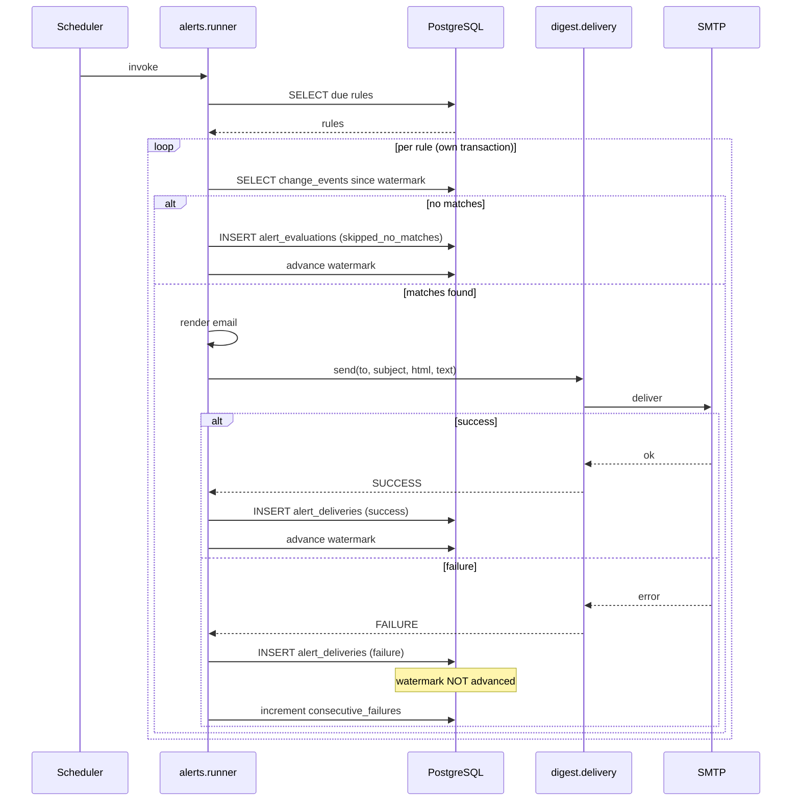
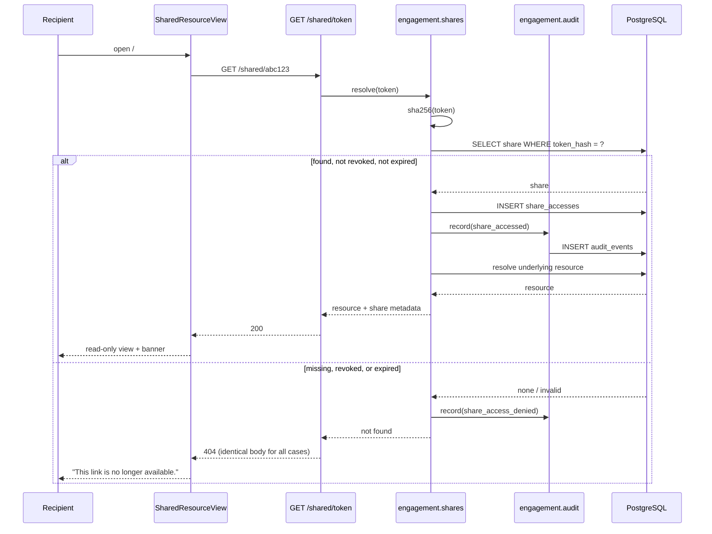

# Bookmarks, Alerts, Sharing, and Audit Logs

Status: Draft for user review
Scope: Sub-project E of the Athena rendered frontend
Depends on: Sub-project A (frontend shell), `digest` user + email-delivery infrastructure, `evidence_engine` `ChangeEvent` stream, `enterprise_api` organization model, PostgreSQL. **Conditionally depends on individual-user authentication, which does not exist — see §5 and OQ-E-001.**

## 1. Executive Summary

Sub-project E covers four related but genuinely distinct capabilities that together turn Athena from a stateless query tool into something a user accumulates value in:

- **Bookmarks** — save individual papers and topics to a personal collection, distinct from saved *searches* (which store a query, not a result).
- **Alerts** — standing rules that watch a topic or saved search and notify the user by email when matching change events occur, reusing the digest package's existing `EmailSender` infrastructure.
- **Sharing** — read-only links that let a user hand a colleague a specific comparison, bookmark collection, or topic view without that colleague needing an account.
- **Activity and audit records** — two separate logs with different purposes, retention, and audiences: a user-facing *activity history* ("what have I looked at and saved?") and an administrative *security audit log* ("who accessed what, and when").

The audience spans the anonymous researcher from sub-project A, a returning identified user, and — for the audit log specifically — an operator or enterprise administrator.

**This document deliberately describes one architecture and recommends four separate implementation plans.** The four capabilities share a permission model, an ownership model, and an event-recording substrate, so designing them together prevents four incompatible answers to the same questions. But they have different dependencies, different risk profiles, and different blocking questions — bookmarks need almost nothing new, while alerts need a delivery decision and sharing needs a threat model. Bundling them into one implementation cycle would make the whole thing wait on the slowest part. §20 gives the recommended split.

The single most important finding in this document: **three of the four capabilities are unsafe to build on the platform's current identity model**, which is an unauthenticated UUID in `localStorage`. §5 and OQ-E-001 address this directly rather than working around it.

## 2. Repository Evidence

| Item | Classification | Source | Relevance |
|---|---|---|---|
| Frontend-shell non-goal: "Bookmarks, alerts, sharing/workspaces, audit log (sub-project E)" | [EXISTING] | `docs/superpowers/specs/2026-07-05-frontend-shell-design.md:100` | Establishes E's scope |
| Frontend-shell non-goal: "Real user authentication (anonymous `localStorage` identity only; real auth is a separate backlog item)" | [EXISTING] | `docs/superpowers/specs/2026-07-05-frontend-shell-design.md:101` | Authentication is explicitly deferred and not part of A |
| Identity is a `localStorage` UUID under key `athena_user_id` | [EXISTING] | `webapp/frontend/src/identity/identity.tsx:3`, `:6` | The entire identity model; no credential, no session, no proof of ownership |
| `create_anonymous_user` generates `anon-<uuid>@no-reply.local` | [EXISTING] | `digest/profiles.py:25` | Anonymous users have no reachable email address |
| Comment: "Anonymous placeholder addresses must never enter digest delivery" | [EXISTING] | `digest/profiles.py:24` | An explicit, deliberate constraint E's alerts must honor |
| `User.email` is `unique=True, nullable=False` | [EXISTING] | `digest/models.py:32` | Any real-email migration must respect uniqueness |
| `GET /saved-searches?user_id=` accepts any caller-supplied UUID | [EXISTING] | `webapp/api.py:146-150` | No ownership verification anywhere in the platform |
| `DELETE /saved-searches/{id}?user_id=` likewise | [EXISTING] | `webapp/api.py:160-167` | Destructive operation with no authorization |
| `_require_user` only checks existence, not identity | [EXISTING] | `webapp/api.py:126-131` | Confirms the platform's authorization posture is "none" |
| `EmailSender` `Protocol` with `send(to_email, subject, html_body, text_body)` | [EXISTING] | `digest/delivery.py:20-23` | The exact interface alerts reuse |
| `ConsoleSender` (default) and `SmtpSender` selected by config | [EXISTING] | `digest/delivery.py:26`, `:37`, `:59-63` | Alerts inherit a working, testable delivery abstraction |
| `persist_digest_email` writes a record regardless of send outcome | [EXISTING] | `digest/delivery.py:66-87` | The audit-before-send precedent alerts must follow |
| `DigestRun` / `DigestEmail` audit tables | [EXISTING] | `digest/models.py:67-89` | Precedent for per-attempt audit rows with status enums |
| Digest idempotency via a `last_digest_sent_at` watermark | [EXISTING] | `digest/models.py:62`; `docs/superpowers/specs/2026-07-04-interest-digest-design.md:62` | The pattern alerts must copy to avoid duplicate notifications |
| Watermark advances on `sent` and `skipped_no_changes`, not on `failed` | [EXISTING] | `docs/superpowers/specs/2026-07-04-interest-digest-design.md:63`; `digest/runner.py:61`, `:81` | Exact retry semantics for alert delivery |
| `select_due_users` skips users with no `InterestProfile` | [EXISTING] | `digest/runner.py:31-35` | The guard keeping anonymous users out of email |
| `get_delivery_preference` ends in `.scalar_one()` and is called outside the `try` at `digest/runner.py:39` | [EXISTING] | `digest/profiles.py:77`; `digest/runner.py:38` | A latent uncaught-exception path E must not trigger |
| `SavedSearch(user_id, name, query_params, last_run_at)` | [EXISTING] | `webapp/models.py:32-40` | Bookmarks are a *different* concept and need their own table |
| `ChangeEvent(topic_id, paper_id, event_type, detected_at)` | [EXISTING] | `evidence_engine/db/models.py:111-118` | The trigger source for topic alerts |
| `ChangeEventType` enum, 4 values | [EXISTING] | `evidence_engine/db/models.py:31-35` | Alert rules filter on these |
| `Organization` / `ApiKey` / `RateLimitWindow` | [EXISTING] | `enterprise_api/models.py:13`, `:23`, `:34` | The only real authentication in the platform, and it is org-scoped, not user-scoped |
| API keys are hashed at rest, shown once, checked for revocation every request | [EXISTING] | `docs/superpowers/specs/2026-07-05-enterprise-api-design.md:51`, `:53` | The security pattern share tokens should copy |
| Enterprise non-goal: "Per-organization result-level data scoping/partitioning — the evidence data is not org-owned; v1 scopes access, not data" | [EXISTING] | `docs/superpowers/specs/2026-07-05-enterprise-api-design.md:89` | Org-scoped bookmarks would be a genuinely new concept, not an extension |
| Enterprise non-goal: "Self-serve organization signup (admin-provisioned only)" | [EXISTING] | `docs/superpowers/specs/2026-07-05-enterprise-api-design.md:86` | No user-to-org membership concept exists |
| `Organization` has no user relationship | [EXISTING] | `enterprise_api/models.py:13-20` — columns are `id`, `name`, `status`, `rate_limit_per_hour`, `created_at` | **There is no way to say "user U belongs to org O"**; enterprise tenant isolation for user data has no substrate |
| `app.mount("/", StaticFiles(...))` is the final statement of `webapp/api.py` | [EXISTING] | `webapp/api.py:212` | New routes MUST be declared above it |
| Alembic head `5d7c21d9f44e` | [EXISTING] | `alembic/versions/5d7c21d9f44e_enterprise_api_tables.py:15` | E's migrations chain from the head at implementation time |
| No bookmark, alert, share, or audit table exists | [INFERRED] | Absence across `evidence_engine/db/models.py`, `webapp/models.py`, `digest/models.py`, `enterprise_api/models.py` — the complete set of ORM modules | All four capabilities need new storage |
| No password, session, token, or credential column exists anywhere | [INFERRED] | Same four model modules; `User` has only `id`, `email`, `status`, `created_at` (`digest/models.py:28-34`) | Confirms authentication must be built, not extended |

## 3. Goals

- G-E-1: A user can bookmark a paper or topic from any surface that displays one, and see their collection on a dedicated page.
- G-E-2: Bookmarks survive across sessions on the same browser, and are never visible to another browser identity by accident.
- G-E-3: A user with a verified email address can create an alert rule on a topic or saved search and receive at most one notification email per rule per 24 hours.
- G-E-4: An alert never sends to a placeholder `@no-reply.local` address, verified by an automated test.
- G-E-5: A user can generate a read-only share link for a comparison, a bookmark collection, or a topic view; the recipient needs no account.
- G-E-6: A share link can be revoked immediately and expires automatically at a default of 30 days.
- G-E-7: A revoked or expired share link returns a clear, non-leaking response that discloses nothing about whether the underlying resource exists.
- G-E-8: A user can see their own recent activity (bookmarks added, searches saved, alerts created, links shared) on an activity page.
- G-E-9: Every security-relevant event — share creation, share access, share revocation, alert delivery, data deletion — is recorded in an append-only audit log that no product code path can modify or delete.
- G-E-10: A user can delete their account data, and that deletion removes bookmarks, alerts, shares, saved searches, and interests while preserving the audit log's record that a deletion occurred.

## 4. Non-Goals

- Building the authentication system itself. E *depends* on it (OQ-E-001) but does not specify login, password storage, session management, or account recovery. That is a separate backlog item with its own security design.
- Collaborative editing, comments, or annotations on shared content. Shares are strictly read-only.
- Workspaces or teams as a first-class concept with membership and roles. The reference design shows "Workspace Shared" activity, but there is no user-to-organization relationship in the platform (`enterprise_api/models.py:13-20`), and inventing one is a larger project than E.
- Real-time or push notifications (web push, WebSocket, SMS). Email only, reusing `EmailSender` (`digest/delivery.py:20`).
- Alert rules over arbitrary numeric thresholds, including citation-velocity spikes. Velocity is sub-project D and its data will be sparse for months; alerting on it in E's v1 would produce mostly-silent rules.
- Bookmark folders, tags, or hierarchical organization. A flat collection with a note field is v1.
- Exporting bookmarks to reference managers (BibTeX, RIS, Zotero).
- Public discovery of shared links — no directory, no search, no listing.
- Enterprise per-organization data partitioning of user content, which the enterprise spec explicitly excludes (`docs/superpowers/specs/2026-07-05-enterprise-api-design.md:89`) and which has no schema substrate today.

## 5. User Roles and Permissions

**The controlling constraint for this entire section**: the platform has no authentication. Identity is a UUID in `localStorage` (`webapp/frontend/src/identity/identity.tsx:3`) that is sent as a plain query parameter and never verified (`webapp/api.py:126-131`, `:146`, `:160`). Anyone who learns another user's UUID can act as them completely. Today the exposure is limited to saved searches. E would extend it to bookmarks, alert rules that send email, and share-link management — a materially worse position. §15 and OQ-E-001 treat this as the blocking issue it is.

### Anonymous user (unverified `localStorage` identity)

- **Read**: MAY read their own bookmarks and activity history, subject to the caveat that "their own" means "whatever UUID they present."
- **Write**: MAY create, annotate, and delete bookmarks. MAY create share links. MUST NOT create alert rules, because alerts send email and this user has only a placeholder `anon-<uuid>@no-reply.local` address (`digest/profiles.py:25`) that the platform is explicitly forbidden from delivering to (`digest/profiles.py:24`).
- **Sharing**: MAY create read-only share links for content they own. Because ownership is unverifiable, share creation MUST be rate-limited and every creation MUST be audit-logged.
- **Retention**: bookmarks and shares persist until deleted or expired. Clearing browser storage orphans the rows permanently — there is no recovery path, and the UI MUST warn about this before the user invests in a large collection.
- **Failure when absent**: if `useIdentity()` has not resolved, bookmark and share controls render disabled with an explanatory tooltip rather than being hidden, so the feature is discoverable.

### Verified user (requires authentication — does not exist today)

- **Read**: their own bookmarks, alerts, shares, activity, saved searches, interests.
- **Write**: all of the above, plus alert rules.
- **Sharing**: MAY create, revoke, and list their own share links.
- **Retention**: data persists until the user deletes it or the account is removed (G-E-10).
- **Failure when absent**: every alert-related surface is hidden and replaced by a single "Verify your email to enable alerts" prompt. This is the one capability that hard-requires the role.

### Share-link recipient (bearer of a token, no account)

- **Read**: exactly the one resource the token grants, at the version-defining scope the token records. Nothing else.
- **Write**: none. Every write endpoint MUST reject a share token.
- **Sharing**: MUST NOT re-share. A share token cannot mint another token.
- **Retention**: not applicable; the recipient owns nothing.
- **Failure when absent/invalid/expired/revoked**: a single indistinguishable `404` for all four cases (G-E-7), so an attacker cannot use response differences to enumerate valid tokens or confirm that a resource exists.

### Enterprise organization (service role, API key)

- **Read**: unchanged from today — search, comparison, visualizations (`docs/superpowers/specs/2026-07-05-enterprise-api-design.md:59-63`).
- **Write**: none. Organizations have no bookmarks, alerts, or shares in v1, because no user-to-organization relationship exists (`enterprise_api/models.py:13-20`).
- **Sharing / retention**: not applicable.
- **Failure when absent**: unchanged `401`/`403`/`429`.
- **Tenant isolation**: there is nothing to isolate. E introduces no org-scoped user data. This is a deliberate deferral, recorded as OQ-E-005 rather than silently skipped.

### Operator / administrator

- **Read**: MAY read the security audit log via direct database access. There is no admin HTTP surface anywhere in the platform (`enterprise_api` provisioning is CLI-only, `scripts/provision_organization.py`), and E does not add the platform's first one.
- **Write**: MAY run retention and deletion jobs. MUST NOT be able to modify audit rows through any application code path (G-E-9).
- **Sharing**: not applicable.
- **Retention**: operator actions are themselves audit-logged where they run through provided scripts.
- **Failure when absent**: not applicable.

## 6. User Stories

**US-E-001 — Primary: bookmark a paper**
Actor: Anonymous user
Precondition: Identity resolved; user is viewing search results.
Trigger: User clicks the bookmark control on a research card.
Main flow: Optimistic UI toggle → `POST /bookmarks` with subject type and ID → row created → activity event recorded.
Expected result: The control shows the bookmarked state; the paper appears on the Bookmarks page.
Failure result: On error the toggle reverts and an inline message appears; the card is otherwise unaffected.
Acceptance criteria: The bookmark persists across a page reload; a second click removes it; the round trip completes in under 500 ms p95.

**US-E-002 — Bookmark idempotency**
Actor: Anonymous user
Precondition: Paper P is already bookmarked.
Trigger: A duplicate `POST /bookmarks` arrives, e.g. from a double-click or an offline replay.
Main flow: The unique constraint on `(user_id, subject_type, subject_id)` collapses the write.
Expected result: HTTP 200 with the existing bookmark and `created: false`.
Failure result: Not applicable.
Acceptance criteria: Exactly one row exists; no error is surfaced; this mirrors the idempotency of `ProfileTopic`'s unique `(profile_id, topic_id)` (`digest/models.py:47`).

**US-E-003 — Empty bookmark collection**
Actor: Anonymous user
Precondition: No bookmarks.
Trigger: User opens the Bookmarks page.
Main flow: Empty list returned.
Expected result: "Nothing saved yet — use the bookmark icon on any paper or topic to keep it here." plus a link to Search.
Failure result: Not applicable.
Acceptance criteria: The empty state names the action that populates it, matching the copy pattern already used on the Saved Searches page in sub-project A.

**US-E-004 — Storage-loss warning**
Actor: Anonymous user
Precondition: User has 10 or more bookmarks and is unverified.
Trigger: Bookmarks page render.
Main flow: The page detects an unverified identity and a collection above the threshold.
Expected result: A persistent, non-dismissible notice: "These bookmarks are tied to this browser. Clearing site data will remove them permanently."
Failure result: Not applicable.
Acceptance criteria: The notice appears at 10+ bookmarks for unverified users and never for verified ones.

**US-E-005 — Create an alert (blocked without verification)**
Actor: Anonymous user
Precondition: Unverified identity with a placeholder email.
Trigger: User clicks "Create alert" on a topic.
Main flow: The UI checks verification state and does not issue a request.
Expected result: A prompt explaining that alerts require a verified email, with the verification entry point.
Failure result: If a request is crafted anyway, the API returns `403` with a machine-readable reason.
Acceptance criteria: No `alert_rules` row is created; no email is ever queued for an `@no-reply.local` address (G-E-4).

**US-E-006 — Alert fires**
Actor: Verified user
Precondition: An enabled alert rule on topic T for event types `new_paper` and `contradiction_flagged`; 3 matching events occurred since the rule's watermark; the rule has not fired in the last 24 hours.
Trigger: The scheduled alert runner.
Main flow: The runner selects due rules → aggregates matching events since `last_evaluated_at` → renders an email → sends via `EmailSender` → persists an `AlertDelivery` row → advances the watermark.
Expected result: One email listing all 3 events; the watermark advances to the evaluation time.
Failure result: On send failure the delivery row records `failure`, the watermark does **not** advance, and the rule retries next run — exactly the digest's semantics (`docs/superpowers/specs/2026-07-04-interest-digest-design.md:63`).
Acceptance criteria: One email for 3 events, not 3 emails; a same-day re-run sends nothing; a failed send leaves the events unconsumed.

**US-E-007 — Alert with no matching events**
Actor: Verified user
Precondition: Enabled rule; no matching events in the window.
Trigger: Alert runner.
Main flow: No events found.
Expected result: No email; an `AlertEvaluation` row with `skipped_no_matches`; the watermark advances so the window does not grow unbounded.
Failure result: Not applicable.
Acceptance criteria: Zero emails sent; the watermark advanced — matching the digest's `skipped_no_changes` handling (`docs/superpowers/specs/2026-07-04-interest-digest-design.md:67`).

**US-E-008 — Create and use a share link**
Actor: Anonymous user → recipient
Precondition: User is viewing a 3-paper comparison.
Trigger: User clicks "Share".
Main flow: `POST /shares` with the resource descriptor → server generates a random token, stores only its hash → returns the plaintext token exactly once → user copies the URL → recipient opens it.
Expected result: Recipient sees a read-only comparison view with a banner naming it as a shared link and its expiry date.
Failure result: See US-E-009.
Acceptance criteria: The plaintext token appears in exactly one response and is never retrievable again — the same discipline as `create_api_key` (`docs/superpowers/specs/2026-07-05-enterprise-api-design.md:53`); the recipient has no write controls anywhere in the view.

**US-E-009 — Revoked, expired, or invalid share link**
Actor: Recipient
Precondition: The token is revoked, expired, malformed, or was never valid.
Trigger: Recipient opens the URL.
Main flow: Token lookup fails or the row is revoked/expired.
Expected result: A single generic page: "This link is no longer available." for all four cases.
Failure result: Not applicable.
Acceptance criteria: All four cases return identical HTTP status (`404`), identical body, and indistinguishable response timing to within measurement noise; nothing in the response reveals whether the underlying resource exists (G-E-7).

**US-E-010 — Revoke a share**
Actor: Anonymous user
Precondition: An active share link exists.
Trigger: User clicks "Revoke" on the Shares list.
Main flow: `revoked_at` is set; an audit event is recorded.
Expected result: The link stops working on the very next request.
Failure result: If revocation fails, the list shows an error and the link remains active; the UI must not claim success.
Acceptance criteria: A request immediately after revocation returns `404`; revocation is checked on every access with no caching, mirroring the API-key rule (`docs/superpowers/specs/2026-07-05-enterprise-api-design.md:51`).

**US-E-011 — View activity history**
Actor: Anonymous user
Precondition: The user has taken several actions.
Trigger: User opens the Activity page.
Main flow: `GET /activity?user_id=` returns the user's product events, newest first, paginated.
Expected result: A dated list: "Bookmarked *Anticoagulation in adults over 85*", "Saved search *Hematology ML*", "Shared a comparison".
Failure result: Empty state if nothing recorded.
Acceptance criteria: Only the requesting user's events appear; security audit events (share *access* by third parties, for instance) do not appear here — see FR-E-013.

**US-E-012 — Loading and partial states**
Actor: Any user
Precondition: None.
Trigger: Bookmarks page mount.
Main flow: Bookmark rows load, then each row hydrates its paper or topic metadata.
Expected result: Skeleton rows, then content; a bookmark whose underlying paper was deleted renders as "This item is no longer available" with a remove control, rather than vanishing silently or breaking the page.
Failure result: A failed hydration for one row leaves other rows intact.
Acceptance criteria: A dangling bookmark is visible and removable; no page-level error.

**US-E-013 — Delete all my data**
Actor: Anonymous user
Precondition: The user has bookmarks, saved searches, interests, alerts, and shares.
Trigger: User confirms deletion in Settings, typing a confirmation phrase.
Main flow: `DELETE /me?user_id=` → all owned rows removed in one transaction → all share tokens revoked → an audit event recorded → `localStorage` cleared client-side.
Expected result: A confirmation page; a subsequent visit bootstraps a fresh anonymous identity.
Failure result: A partial failure rolls the whole transaction back and reports that nothing was deleted, so the user is never left in an ambiguous half-deleted state.
Acceptance criteria: Every owned row is gone; the audit log retains a record that a deletion occurred for this user ID, with no restored content (G-E-10).

**US-E-014 — Invalid input**
Actor: Crafted request
Precondition: None.
Trigger: `POST /bookmarks` with `subject_type: "author"`, or a note over the length cap.
Main flow: Pydantic validation rejects.
Expected result: `422` with a field-level message.
Failure result: Not applicable.
Acceptance criteria: `422`; no row written.

**US-E-015 — Upstream failure: email provider down**
Actor: Verified user
Precondition: SMTP is unreachable.
Trigger: Alert runner.
Main flow: `SmtpSender.send` catches the exception and returns a failure outcome (`digest/delivery.py:54-55`) → an `AlertDelivery` row records the failure → the watermark does not advance.
Expected result: No user-visible error; the alert is retried next run.
Failure result: After 5 consecutive failures the rule is auto-paused and flagged so a permanently bad address does not retry forever.
Acceptance criteria: The delivery row exists with `failure`; the watermark is unchanged; the auto-pause triggers at exactly 5.

**US-E-016 — Stale share content**
Actor: Recipient
Precondition: A share created 20 days ago points at a comparison whose papers have since been rescored, and one has been retracted.
Trigger: Recipient opens the link.
Main flow: The share resolves current data, not a snapshot.
Expected result: Current data renders, with a banner: "Shared 20 days ago. Evidence may have changed since." Retracted members carry their normal retraction treatment.
Failure result: Not applicable.
Acceptance criteria: The banner shows the share's age; a retracted member is visibly marked — see OQ-E-004 for the snapshot-versus-live decision this story assumes.

## 7. Functional Requirements

### Bookmarks

**FR-E-001**: The system MUST allow a user to bookmark a paper or a topic, storing owner, subject type, subject ID, an optional note, and creation time.
- Classification: [PROPOSED]
- Rationale: G-E-1. Bookmarks are distinct from `SavedSearch` (`webapp/models.py:32`), which stores a query rather than a result.
- Inputs: `user_id`, `subject_type` (`paper` \| `topic`), `subject_id`, optional `note` (≤ 1000 chars).
- Outputs: the created bookmark.
- Failure behavior: unknown user → `404`; unknown subject → `404`; invalid type → `422`.
- Acceptance test: `test_create_bookmark_for_paper_and_topic`.

**FR-E-002**: Bookmark creation MUST be idempotent per `(user_id, subject_type, subject_id)`, returning the existing row with `created: false`.
- Classification: [INFERRED] — mirrors the unique-constraint idempotency of `ProfileTopic` (`digest/models.py:47`).
- Rationale: US-E-002.
- Inputs: a duplicate create request.
- Outputs: existing bookmark, `200`.
- Failure behavior: none.
- Acceptance test: `test_duplicate_bookmark_returns_existing_not_created`.

**FR-E-003**: A bookmark whose subject no longer exists MUST render as unavailable with a remove control, and MUST NOT cause an error.
- Classification: [PROPOSED]
- Rationale: US-E-012; papers can be deleted, and a dangling bookmark that breaks the page is worse than one that admits it is dangling.
- Inputs: bookmark rows; subject existence.
- Outputs: `subject_available: false` on the row.
- Failure behavior: none.
- Acceptance test: `test_bookmark_with_deleted_subject_renders_unavailable`.

### Alerts

**FR-E-004**: The system MUST NOT create an alert rule for a user whose email is unverified or matches the placeholder pattern `%@no-reply.local`.
- Classification: [EXISTING constraint, newly enforced] — the prohibition is stated at `digest/profiles.py:24` ("Anonymous placeholder addresses must never enter digest delivery"); E extends the same rule to alerts.
- Rationale: G-E-4.
- Inputs: `User.email`, verification state.
- Outputs: `403` with reason `email_unverified`.
- Failure behavior: no rule created.
- Acceptance test: `test_alert_rule_rejected_for_placeholder_email`.

**FR-E-005**: The alert runner MUST NOT send to any address matching `%@no-reply.local`, independently of FR-E-004, as a defense in depth.
- Classification: [PROPOSED]
- Rationale: G-E-4; a rule could be created before a later migration changes an address, or by a direct database write. The send path must refuse regardless of how the rule was created.
- Inputs: recipient address at send time.
- Outputs: skipped delivery with reason `placeholder_address`.
- Failure behavior: rule auto-paused; audit event recorded.
- Acceptance test: `test_runner_refuses_placeholder_address_even_if_rule_exists`.

**FR-E-006**: An alert rule MUST fire at most once per 24 hours, aggregating all matching events since its last successful evaluation into a single email.
- Classification: [PROPOSED]
- Rationale: G-E-3, US-E-006; per-event email on a busy topic would be unusable.
- Inputs: `last_evaluated_at`; matching events.
- Outputs: at most one `AlertDelivery` per rule per day.
- Failure behavior: a rule already fired today is skipped without evaluation.
- Acceptance test: `test_three_events_produce_one_email`; `test_second_run_same_day_sends_nothing`.

**FR-E-007**: The alert watermark MUST advance on successful send and on no-matches, and MUST NOT advance on send failure.
- Classification: [EXISTING pattern] — the digest's exact rule. Source: `docs/superpowers/specs/2026-07-04-interest-digest-design.md:63`; implemented at `digest/runner.py:61` and `:81`.
- Rationale: no change may be lost to a transient delivery failure.
- Inputs: send outcome.
- Outputs: watermark state.
- Failure behavior: failed rules retry next run with the same window.
- Acceptance test: `test_watermark_advances_on_send_and_no_match_but_not_on_failure`.

**FR-E-008**: A rule with 5 consecutive delivery failures MUST be auto-paused and flagged.
- Classification: [PROPOSED]
- Rationale: US-E-015; a permanently invalid address would otherwise retry forever.
- Inputs: `consecutive_failures`.
- Outputs: `status = 'paused_delivery_failure'`.
- Failure behavior: user-visible on the Alerts page with a resume control.
- Acceptance test: `test_fifth_consecutive_failure_pauses_rule`.

**FR-E-009**: Per-user alert email volume MUST be capped at 10 messages per day across all rules.
- Classification: [PROPOSED]
- Rationale: a user with 30 rules on busy topics would otherwise receive 30 emails daily, which is indistinguishable from spam and risks the sending domain's reputation.
- Inputs: deliveries sent today for the user.
- Outputs: excess rules deferred to the next run, oldest-watermark first.
- Failure behavior: deferred rules do not advance their watermarks, so nothing is lost.
- Acceptance test: `test_eleventh_daily_alert_is_deferred_not_dropped`.

### Sharing

**FR-E-010**: The system MUST generate share tokens with at least 128 bits of entropy from a cryptographically secure source, MUST store only a hash, and MUST return the plaintext exactly once.
- Classification: [INFERRED] — directly mirrors the API-key discipline already specified and implemented: hashed at rest, shown once at creation, never re-displayed (`docs/superpowers/specs/2026-07-05-enterprise-api-design.md:19`, `:53`; `enterprise_api/models.py:28-29`).
- Rationale: a share token is a bearer credential; treating it as less sensitive than an API key would be inconsistent.
- Inputs: none.
- Outputs: plaintext token (once), stored hash and prefix.
- Failure behavior: none.
- Acceptance test: `test_share_token_not_persisted_in_plaintext`; `test_token_entropy_at_least_128_bits`.

**FR-E-011**: Share access MUST verify revocation and expiry on every request with no caching.
- Classification: [INFERRED] — mirrors the API-key rule that revocation takes effect on the very next request and is never cached (`docs/superpowers/specs/2026-07-05-enterprise-api-design.md:51`).
- Rationale: G-E-6, US-E-010.
- Inputs: token; `revoked_at`; `expires_at`.
- Outputs: resource or `404`.
- Failure behavior: `404`.
- Acceptance test: `test_revoked_share_fails_on_next_request`.

**FR-E-012**: Invalid, unknown, revoked, and expired tokens MUST produce identical responses — same status, same body, and no timing signal that distinguishes them.
- Classification: [PROPOSED]
- Rationale: G-E-7; differing responses turn the share endpoint into an oracle for token and resource enumeration.
- Inputs: any token.
- Outputs: `404` with a fixed body.
- Failure behavior: none.
- Acceptance test: `test_all_invalid_token_cases_return_identical_response`; `test_token_lookup_uses_constant_time_comparison`.

### Activity and audit

**FR-E-013**: The system MUST maintain two separate records: a user-facing `activity_events` log and an append-only `audit_events` log, with different schemas, retention, and access paths.
- Classification: [PROPOSED]
- Rationale: they answer different questions for different audiences. Activity is a product feature the user reads and whose rows are deleted when the user deletes their account. Audit is a security record the user cannot read and which must survive that deletion (G-E-10) to preserve evidence that the deletion happened. Conflating them would force one retention policy onto both and would either leak security data to users or destroy evidence on deletion.
- Inputs: product actions; security-relevant actions.
- Outputs: rows in the respective tables.
- Failure behavior: audit-write failure MUST abort the originating transaction; activity-write failure MUST NOT.
- Acceptance test: `test_audit_write_failure_aborts_share_creation`; `test_activity_write_failure_does_not_abort_bookmark`.

**FR-E-014**: `audit_events` MUST be append-only: no application code path may update or delete a row, enforced by a database-level restriction in addition to code discipline.
- Classification: [PROPOSED]
- Rationale: G-E-9; an audit log that application code can rewrite provides no assurance.
- Inputs: none.
- Outputs: none.
- Failure behavior: an attempted update or delete raises a database error.
- Acceptance test: `test_audit_row_update_is_rejected_by_database`; `test_audit_row_delete_is_rejected_by_database`.

**FR-E-015**: Share *access* by a recipient MUST be recorded in `audit_events` and MUST NOT appear in the owner's activity history.
- Classification: [PROPOSED]
- Rationale: recording who opened a link is security-relevant, but surfacing "someone in Berlin opened your link" to the owner turns a share feature into a tracking feature the recipient never consented to.
- Inputs: token hash, timestamp, coarse request metadata.
- Outputs: an audit row.
- Failure behavior: audit failure blocks the access (per FR-E-013).
- Acceptance test: `test_share_access_audited_but_absent_from_owner_activity`.

**FR-E-016**: Audit rows MUST NOT store raw IP addresses; where a network identifier is needed it MUST be a salted hash.
- Classification: [PROPOSED]
- Rationale: the platform stores no IPs today; introducing raw IP retention in an append-only never-deleted table would be the most privacy-consequential change in the codebase.
- Inputs: request metadata.
- Outputs: salted hash.
- Failure behavior: none.
- Acceptance test: `test_audit_never_stores_raw_ip`.

### Deletion and identity

**FR-E-017**: The system MUST provide account-data deletion that removes bookmarks, alert rules, shares, saved searches, and interests in a single transaction, revokes all share tokens, and records one audit event.
- Classification: [PROPOSED]
- Rationale: G-E-10.
- Inputs: `user_id`.
- Outputs: `204`; audit row.
- Failure behavior: any failure rolls back the entire transaction; the user is told nothing was deleted.
- Acceptance test: `test_delete_me_removes_all_owned_rows_atomically`; `test_delete_me_preserves_audit_events`.

**FR-E-018**: When an anonymous user completes email verification, the system MUST migrate their existing content to the verified identity without creating a duplicate `User` row, and MUST reject the migration if the target email already belongs to another user.
- Classification: [PROPOSED]
- Rationale: `User.email` is `unique=True, nullable=False` (`digest/models.py:32`), so a naive "create a verified user and copy rows" approach would either violate uniqueness or silently orphan the anonymous content the user spent effort building.
- Inputs: anonymous `user_id`; target email.
- Outputs: the same `User` row with its email updated, or `409` on conflict.
- Failure behavior: on conflict, no data moves and the user is told the address is already in use — the platform cannot merge two users' content without a way to authenticate both, which does not exist.
- Acceptance test: `test_verification_updates_email_in_place_preserving_bookmarks`; `test_verification_conflict_returns_409_and_moves_nothing`.

**FR-E-019**: Share creation MUST be rate-limited to 20 per hour per user, and bookmark creation to 200 per hour per user.
- Classification: [PROPOSED]
- Rationale: with unverifiable ownership (§5), these are the only bounds on an automated client creating unbounded rows against arbitrary UUIDs.
- Inputs: per-user hourly counters.
- Outputs: `429`.
- Failure behavior: none.
- Acceptance test: `test_twenty_first_share_in_hour_returns_429`.

## 8. Information Architecture and UX

### Routes

| Route | Status | Purpose |
|---|---|---|
| `/#/bookmarks` | New | The user's bookmark collection |
| `/#/alerts` | New | Alert rule management |
| `/#/activity` | New | Personal activity history |
| `/#/settings` | New | Email verification, data deletion, share management |
| `/#/shared/:token` | New | Read-only share view (no sidebar) |
| `/#/search`, `/#/compare`, `/#/topics/:id`, `/#/saved-searches` | Modified | Gain bookmark controls and share actions |

### Entry points

- Bookmark toggle on every research card, comparison card, and topic detail header.
- "Share" action on the Compare page, Topic Detail page, and Bookmarks page.
- New sidebar destinations for Bookmarks and Alerts; Activity and Settings live under a footer menu in the sidebar rather than as top-level icons, to avoid a six-icon primary nav.

### Navigation changes

`IconSidebar` (`webapp/frontend/src/components/IconSidebar.tsx`) gains Bookmarks and Alerts. The share view at `/#/shared/:token` renders **without** the sidebar entirely — a recipient has no account and no navigation targets, and showing them a nav they cannot use invites confusion about what they are looking at.

### Component hierarchy

```
BookmarksPage                        [new]
├── StorageWarningNotice             [new]   unverified + 10 or more items
├── BookmarkRow × N                  [new]
│   ├── BookmarkNoteEditor           [new]
│   └── UnavailableSubjectNotice     [new]
├── BookmarksEmptyState              [new]
└── ShareCollectionButton            [new]

AlertsPage                           [new]
├── VerificationPrompt               [new]   unverified users
├── AlertRuleRow × N                 [new]
│   └── PausedRuleNotice             [new]
└── CreateAlertDialog                [new]

ActivityPage                         [new]
└── ActivityDayGroup × N             [new]

SettingsPage                         [new]
├── EmailVerificationPanel           [new]
├── ActiveSharesList                 [new]
└── DeleteAccountPanel               [new]   confirmation-phrase gated

SharedResourceView                   [new]   no sidebar
├── ShareBanner                      [new]   age + expiry + read-only
└── (reuses ComparePage / TopicDetail / bookmark list in read-only mode)

BookmarkToggle                       [new]   embedded in ResearchCard
ShareButton                          [new]   embedded in Compare / TopicDetail
```

### Desktop wireframe — Bookmarks page

```
┌──────────────────────────────────────────────────────────────┐
│ Bookmarks                                    [ Share list ]  │
│ ⓘ These bookmarks are tied to this browser. Clearing site    │
│   data will remove them permanently.  [ Verify email ]       │
├──────────────────────────────────────────────────────────────┤
│ ★ Anticoagulation in adults over 85: a pooled analysis       │
│   [meta analysis] established  ·  saved 2 Aug                │
│   Note: cite in the Q3 review                        [ ✎ ][✕]│
├──────────────────────────────────────────────────────────────┤
│ ★ Atrial fibrillation  (topic)                               │
│   44 papers tracked  ·  saved 28 Jul                  [ ✎ ][✕]│
├──────────────────────────────────────────────────────────────┤
│ ★ This item is no longer available                    [  ✕  ]│
│   Saved 12 Jul                                               │
└──────────────────────────────────────────────────────────────┘
```

### Desktop wireframe — shared view

```
┌──────────────────────────────────────────────────────────────┐
│ 🔗 Shared comparison · read-only · shared 20 days ago        │
│    Evidence may have changed since. Expires 1 Sep 2026.      │
├──────────────────────────────────────────────────────────────┤
│  ┌───────────┐ ┌───────────┐ ┌───────────┐                   │
│  │ [1] Paper │ │ [2] Paper │ │ ⚠ RETRACTED│                  │
│  └───────────┘ └───────────┘ └───────────┘                   │
│                                                              │
│  (no bookmark, share, or edit controls anywhere)             │
└──────────────────────────────────────────────────────────────┘
```

### Mobile behavior (< 768 px)

At the shell's existing `max-md` breakpoint (`webapp/frontend/src/App.tsx:14`):

- Bookmark rows stack; the note editor becomes a full-width sheet rather than an inline field.
- Row actions (edit, remove) move into an overflow menu to keep tap targets at 44 × 44 CSS pixels.
- The sidebar's two new destinations join the existing bottom-bar collapse.
- The share banner stays pinned at the top of the shared view and does not scroll away, since it is the only thing telling the recipient what they are looking at.
- The delete-account confirmation keeps its typed-phrase requirement on mobile; it is deliberately not reduced to a single tap.

### State matrix

| State | Trigger | Rendering |
|---|---|---|
| Bookmarks empty | No rows | "Nothing saved yet — use the bookmark icon on any paper or topic." |
| Bookmark dangling | Subject deleted | "This item is no longer available" + remove control |
| Bookmark loading | Query pending | Skeleton rows |
| Bookmark write failed | Mutation error | Toggle reverts; inline message; card otherwise unaffected |
| Alerts unverified | Placeholder email | Verification prompt replaces the entire rule list |
| Alerts empty | Verified, no rules | "No alerts yet — create one from any topic." |
| Alert paused | 5 consecutive failures | Row shows "Paused after repeated delivery failures" + Resume |
| Alert deferred | Daily cap reached | Row shows "Deferred — daily limit reached" |
| Share created | Token returned | One-time modal showing the URL with a copy control and an explicit "you will not see this again" warning |
| Share list empty | No active shares | "No active share links." |
| Share invalid | Any of four failure cases | Single generic "This link is no longer available." |
| Share stale | Created over 7 days ago | Banner with age and change warning |
| Activity empty | No events | "No activity recorded yet." |
| Identity unresolved | `userId === null` | Bookmark and share controls disabled with an explanatory tooltip, not hidden |
| Deletion in progress | Mutation pending | All controls disabled; progress indicator; no navigation |
| Deletion failed | Mutation error | "Nothing was deleted." — explicitly reassuring, since a partial-deletion fear is the user's main concern here |

### Accessibility requirements

- `BookmarkToggle` is a `<button aria-pressed>` reflecting state, with an accessible name including the subject title — not a bare star icon.
- The bookmark state change is announced once via a polite live region; it is not announced per keystroke in the note editor.
- The share URL modal moves focus to the URL field on open, traps focus while open, returns focus to the trigger on close, and is dismissible with Escape.
- The one-time-token warning is text, not color or icon alone.
- `DeleteAccountPanel` requires typing a confirmation phrase; the input has a visible label and the button's disabled state has an accessible explanation via `aria-describedby`.
- The share banner is a `role="status"` region, read once on load.
- The shared view sets an accurate `<title>` so a recipient's tab is identifiable.
- All Material Symbols icon spans carry `aria-hidden="true"` — the same defect class found and fixed in sub-project A's `IconSidebar.tsx` and `CompareTray.tsx` reviews.

### User-facing terminology

| Use | Never use |
|---|---|
| "Bookmarks" | "Favorites", "Library", "Collection" (inconsistent with the icon) |
| "Saved searches" (existing, unchanged) | "Saved" alone — ambiguous with bookmarks |
| "Alerts" | "Notifications" (implies in-app, which E does not build) |
| "Share link" | "Public link" (it is unlisted, not public) |
| "Read-only" | "View-only" (inconsistent with the rest of the product) |
| "This link is no longer available" | "Expired", "Revoked", "Not found" — all four cases must read identically |
| "Activity" | "History" (ambiguous with browser history) |
| "Delete my data" | "Deactivate", "Close account" |

## 9. System Architecture

### New Python package: `engagement/`

A sibling package alongside `evidence_engine/`, `digest/`, `webapp/`, `enterprise_api/`, following the one-package-per-sub-project convention (`docs/superpowers/specs/2026-07-04-interest-digest-design.md:32`). It is internally divided along the four capability lines so the recommended plan split (§20) maps onto module boundaries.

- `engagement/models.py` — `Bookmark`, `AlertRule`, `AlertEvaluation`, `AlertDelivery`, `Share`, `ShareAccess`, `ActivityEvent`, `AuditEvent`.
- `engagement/bookmarks.py` — CRUD plus subject-availability hydration.
- `engagement/alerts/rules.py` — rule CRUD and eligibility checks (FR-E-004).
- `engagement/alerts/runner.py` — the scheduled evaluator, structurally parallel to `digest/runner.py`.
- `engagement/alerts/render.py` — Jinja2 alert email bodies, reusing the pattern of `digest/render.py`.
- `engagement/shares.py` — token generation, hashing, resolution, revocation.
- `engagement/activity.py` — product-event recording and reads.
- `engagement/audit.py` — append-only security-event recording.
- `engagement/deletion.py` — the transactional account-data deletion of FR-E-017.
- `engagement/ratelimit.py` — per-user hourly counters (FR-E-019).

### HTTP endpoints (added to `webapp/api.py`, **above** the `StaticFiles` mount at `webapp/api.py:212`)

Bookmarks: `POST /bookmarks`, `GET /bookmarks`, `PATCH /bookmarks/{id}`, `DELETE /bookmarks/{id}`.
Alerts: `POST /alerts`, `GET /alerts`, `PATCH /alerts/{id}`, `DELETE /alerts/{id}`.
Shares: `POST /shares`, `GET /shares`, `DELETE /shares/{id}`, `GET /shared/{token}`.
Activity and account: `GET /activity`, `DELETE /me`.

### Frontend additions

Four new pages, one share view, two embedded controls, and hooks for each resource, following the existing `useSavedSearches`/`useCreateSavedSearch` shapes (`webapp/frontend/src/api/hooks.ts:8-10`).

### Background jobs

- `scripts/run_alerts.py` — scheduled evaluator, mirroring `scripts/run_digests.py`.
- `scripts/expire_shares.py` — marks expired shares and prunes access rows past retention.
- `scripts/prune_activity.py` — enforces activity retention (audit is never pruned by this job).

### Database ownership

`engagement/` owns all eight new tables. It reads `users`, `papers`, `topics`, `change_events`, `saved_searches` and writes none of them. Alert delivery calls `digest.delivery.get_email_sender` (`digest/delivery.py:59`) but writes its own delivery rows rather than `DigestEmail`, keeping digest and alert audit trails separate.

### External providers

SMTP via the existing `SmtpSender` (`digest/delivery.py:37`). No new provider.

### Caching

None server-side. Bookmark and alert lists are small and per-user; caching them would add invalidation complexity for no measurable gain. Client-side TanStack Query with a 60-second `staleTime`, deliberately short because these are user-mutable resources where staleness is confusing.

### Idempotency

Bookmark creation is idempotent by unique constraint (FR-E-002). Alert evaluation is idempotent by watermark, exactly as digests are (`docs/superpowers/specs/2026-07-04-interest-digest-design.md:62`). Share creation is deliberately **not** idempotent — each call mints a distinct token, because two colleagues should receive independently revocable links.

### Observability

`AlertEvaluation` and `AlertDelivery` mirror `DigestRun`/`DigestEmail`; `AuditEvent` is the security record (§18).

```mermaid
graph TD
  subgraph Frontend
    BP[BookmarksPage]
    AP[AlertsPage]
    ACP[ActivityPage]
    SP[SettingsPage]
    SV[SharedResourceView]
    BT[BookmarkToggle]
  end

  subgraph webapp_api
    EB[bookmarks routes]
    EA[alerts routes]
    ES[shares routes]
    EV[activity + delete routes]
    ESH[GET /shared/token]
  end

  subgraph engagement
    BK[bookmarks]
    AR[alerts.rules]
    ARUN[alerts.runner]
    SH[shares]
    ACT[activity]
    AUD[audit]
    DEL[deletion]
    RL[ratelimit]
  end

  subgraph digest_pkg
    SEND[delivery.get_email_sender]
  end

  subgraph Owned[(engagement tables)]
    TB[(bookmarks)]
    TA[(alert_rules)]
    TAE[(alert_evaluations)]
    TAD[(alert_deliveries)]
    TS[(shares)]
    TSA[(share_accesses)]
    TAC[(activity_events)]
    TAU[(audit_events)]
  end

  subgraph Engine[(read-only)]
    CE[(change_events)]
    PA[(papers)]
    TP[(topics)]
    US[(users)]
  end

  JOB[scripts/run_alerts.py]
  SMTP[SMTP server]

  BT --> EB --> BK --> TB
  BP --> EB
  BK --> ACT --> TAC
  AP --> EA --> AR --> TA
  AR --> US
  SP --> ES --> SH --> TS
  SH --> AUD --> TAU
  SV --> ESH --> SH
  SH --> TSA
  ACP --> EV --> ACT
  SP --> EV --> DEL --> TB
  DEL --> AUD
  EB --> RL
  ES --> RL
  JOB --> ARUN --> TA
  ARUN --> CE
  ARUN --> SEND --> SMTP
  ARUN --> TAE
  ARUN --> TAD
  BK --> PA
  BK --> TP
```

## 10. Data Flow

### Operation 1 — Bookmark a paper

1. **Trigger**: user clicks the bookmark toggle on a research card.
2. **Frontend action**: optimistic toggle; `useCreateBookmark` mutation fires.
3. **HTTP request**: `POST /bookmarks` with `{user_id, subject_type, subject_id}`.
4. **Validation**: enum membership, UUID format, note length.
5. **Service-layer operation**: rate-limit check → `bookmarks.create` → on unique violation, return the existing row.
6. **Database reads/writes**: reads `users`, `papers`; writes `bookmarks` and `activity_events`.
7. **External API calls**: none.
8. **Response**: `201` (created) or `200` (existing).
9. **Cache invalidation**: client invalidates `["bookmarks", userId]`.
10. **User-visible result**: the toggle settles into the bookmarked state.

### Operation 2 — Alert evaluation and delivery

1. **Trigger**: cron invokes `scripts/run_alerts.py`.
2. **Frontend action**: none.
3. **HTTP request**: none.
4. **Validation**: the runner asserts the configured sender and refuses to run with `ConsoleSender` when `ALERTS_REQUIRE_REAL_SENDER` is set, so a misconfiguration cannot silently swallow every alert.
5. **Service-layer operation**: select due rules (enabled, not fired in 24 h, user verified, address not placeholder) → per rule, gather matching `ChangeEvent`s since `last_evaluated_at` → render → send → persist → advance watermark. Each rule runs in its own transaction so one failure cannot block others, exactly as `digest/runner.py` isolates per user and `scripts/run_daily_cycle.py:33-37` isolates per topic.
6. **Database reads/writes**: reads `alert_rules`, `users`, `change_events`, `papers`, `topics`; writes `alert_evaluations`, `alert_deliveries`, and updates the rule's watermark.
7. **External API calls**: SMTP via `SmtpSender.send` (`digest/delivery.py:40`).
8. **Response**: none; exit code reflects failures.
9. **Cache invalidation**: none.
10. **User-visible result**: an email; the Alerts page shows an updated last-fired time.



### Operation 3 — Create and resolve a share link

1. **Trigger**: user clicks "Share" on a comparison.
2. **Frontend action**: `useCreateShare` mutation.
3. **HTTP request**: `POST /shares` with `{user_id, resource_type, resource_ref}`.
4. **Validation**: resource type enum; reference shape per type; rate limit (FR-E-019).
5. **Service-layer operation**: generate 32 random bytes via `secrets.token_urlsafe`, hash with SHA-256, store hash and a non-secret prefix, set `expires_at` to now + 30 days, write an audit event.
6. **Database reads/writes**: writes `shares`, `audit_events`, `activity_events`.
7. **External API calls**: none.
8. **Response**: `201` with the plaintext token, returned exactly once.
9. **Cache invalidation**: client invalidates `["shares", userId]`.
10. **User-visible result**: a one-time modal with the URL.

Resolution: recipient opens `/#/shared/{token}` → the SPA extracts the token → `GET /shared/{token}` → the server hashes it, looks up the row with a constant-time comparison, checks `revoked_at` and `expires_at` on every request, writes a `share_accesses` row and an audit event, then resolves the underlying resource through the same read services sub-project A already uses. Any failure yields the single generic `404` of FR-E-012.



### Operation 4 — Delete my data

1. **Trigger**: user types the confirmation phrase and submits.
2. **Frontend action**: `useDeleteAccount` mutation; all controls disabled.
3. **HTTP request**: `DELETE /me?user_id=`.
4. **Validation**: UUID; user exists.
5. **Service-layer operation**: in one transaction — revoke all shares, delete `bookmarks`, `alert_rules`, `activity_events`, `saved_searches`, `profile_topics`, `interest_profiles`; write one `audit_events` row recording the deletion. `audit_events` rows are **not** deleted (FR-E-014).
6. **Database reads/writes**: deletes across six tables; one audit insert.
7. **External API calls**: none.
8. **Response**: `204`.
9. **Cache invalidation**: the client clears the entire query cache and `localStorage`.
10. **User-visible result**: a confirmation page; the next visit bootstraps a fresh anonymous identity via the existing provider (`webapp/frontend/src/identity/identity.tsx:6`).

## 11. Data Model

Migrations chain from the head at implementation time. §20 recommends four separate migrations aligned to the four plans.

### Table `bookmarks` [PROPOSED — new]

| Column | SQL type | Null | Default | Notes |
|---|---|---|---|---|
| `id` | `UUID` | no | `uuid4()` | PK |
| `user_id` | `UUID` | no | — | FK → `users.id`, `ON DELETE CASCADE` |
| `subject_type` | `VARCHAR` | no | — | `paper` \| `topic` |
| `subject_id` | `UUID` | no | — | No FK: polymorphic across two tables |
| `note` | `TEXT` | yes | `NULL` | ≤ 1000 chars, enforced in validation |
| `created_at` | `TIMESTAMP` | no | `utcnow` | |
| `updated_at` | `TIMESTAMP` | no | `utcnow` | |

- **Unique**: `(user_id, subject_type, subject_id)` — the basis of FR-E-002's idempotency.
- **Indexes**: btree `(user_id, created_at DESC)` for the list query.
- **Cascade**: user deletion removes bookmarks. Subject deletion does **not** cascade (no FK), which is deliberate — FR-E-003 renders dangling bookmarks rather than silently discarding what the user chose to save.
- **Ownership**: `engagement/`. **Retention**: until deleted. **Rollback**: `DROP TABLE`, losing user-created content.

### Table `alert_rules` [PROPOSED — new]

| Column | SQL type | Null | Default | Notes |
|---|---|---|---|---|
| `id` | `UUID` | no | `uuid4()` | PK |
| `user_id` | `UUID` | no | — | FK → `users.id`, `ON DELETE CASCADE` |
| `name` | `VARCHAR` | no | — | User-supplied |
| `trigger_type` | `VARCHAR` | no | — | `topic` \| `saved_search` |
| `topic_id` | `UUID` | yes | `NULL` | FK → `topics.id`, `ON DELETE CASCADE`; set when `trigger_type='topic'` |
| `saved_search_id` | `UUID` | yes | `NULL` | FK → `saved_searches.id`, `ON DELETE CASCADE` |
| `event_types` | `VARCHAR[]` | no | `{}` | Subset of `ChangeEventType` values (`evidence_engine/db/models.py:31-35`) |
| `status` | `VARCHAR` | no | `'enabled'` | `enabled` \| `paused_by_user` \| `paused_delivery_failure` |
| `last_evaluated_at` | `TIMESTAMP` | yes | `NULL` | The watermark |
| `last_delivered_at` | `TIMESTAMP` | yes | `NULL` | Drives the 24-hour cap |
| `consecutive_failures` | `INTEGER` | no | `0` | Drives FR-E-008 |
| `created_at` | `TIMESTAMP` | no | `utcnow` | |

- **Check constraint**: exactly one of `topic_id` / `saved_search_id` non-null, matching `trigger_type`.
- **Indexes**: btree `(status, last_delivered_at)` for due selection; btree `(user_id)`.
- **Ownership**: `engagement/`. **Retention**: until deleted. **Rollback**: `DROP TABLE`.

### Tables `alert_evaluations` and `alert_deliveries` [PROPOSED — new]

Structurally parallel to `DigestRun` and `DigestEmail` (`digest/models.py:67-89`), deliberately separate so alert and digest audit trails never interleave.

`alert_evaluations`: `id`, `rule_id` (FK, cascade), `window_start`, `window_end`, `status` (`delivered` \| `skipped_no_matches` \| `failed` \| `deferred_daily_cap`), `matched_event_count`, `created_at`.

`alert_deliveries`: `id`, `evaluation_id` (FK, unique, cascade), `to_email`, `subject`, `html_body`, `text_body`, `sender_name`, `send_result` (reuses `digest.models.EmailSendResult`), `send_detail`, `sent_at` (nullable).

- **Indexes**: `(rule_id, created_at DESC)` on evaluations.
- **Retention**: 180 days, then pruned. Bodies are the bulk of the storage; pruning them is why this is separate from `audit_events`.

### Table `shares` [PROPOSED — new]

| Column | SQL type | Null | Default | Notes |
|---|---|---|---|---|
| `id` | `UUID` | no | `uuid4()` | PK |
| `user_id` | `UUID` | no | — | FK → `users.id`, `ON DELETE CASCADE` |
| `token_hash` | `VARCHAR(64)` | no | — | SHA-256; **the plaintext is never stored** (FR-E-010) |
| `token_prefix` | `VARCHAR(8)` | no | — | Non-secret, for display in the shares list |
| `resource_type` | `VARCHAR` | no | — | `comparison` \| `bookmark_collection` \| `topic` |
| `resource_ref` | `JSONB` | no | `{}` | e.g. `{"paper_ids": [...]}` |
| `expires_at` | `TIMESTAMP` | no | — | Default now + 30 days |
| `revoked_at` | `TIMESTAMP` | yes | `NULL` | Non-null disables immediately |
| `access_count` | `INTEGER` | no | `0` | Denormalized counter for the owner's list |
| `created_at` | `TIMESTAMP` | no | `utcnow` | |

- **Unique**: `(token_hash)` — mirrors `ApiKey.key_hash`'s unique constraint (`enterprise_api/models.py:28`).
- **Indexes**: covered by the unique constraint; btree `(user_id, created_at DESC)`.
- **Ownership**: `engagement/`. **Retention**: revoked/expired rows retained 90 days for audit correlation, then deleted. **Rollback**: `DROP TABLE` — all outstanding links break, which is the correct behavior for a rollback.

### Table `share_accesses` [PROPOSED — new]

`id`, `share_id` (FK, cascade), `accessed_at`, `ip_hash` (`VARCHAR(64)`, salted — never raw, per FR-E-016), `user_agent_family` (coarse, e.g. `Chrome`; not the full string).

- **Indexes**: `(share_id, accessed_at DESC)`.
- **Retention**: 90 days.

### Table `activity_events` [PROPOSED — new]

`id`, `user_id` (FK, `ON DELETE CASCADE`), `event_type` (`bookmark_added`, `bookmark_removed`, `search_saved`, `alert_created`, `alert_deleted`, `share_created`, `share_revoked`), `subject_type`, `subject_id`, `summary` (`VARCHAR(500)`), `created_at`.

- **Indexes**: `(user_id, created_at DESC)`.
- **Cascade**: deleted with the user (FR-E-017) — this is user-readable product data, not evidence.
- **Retention**: 365 days.

### Table `audit_events` [PROPOSED — new]

Append-only. **Never cascade-deleted, never updated.**

`id`, `event_type` (`share_created`, `share_accessed`, `share_access_denied`, `share_revoked`, `alert_delivered`, `alert_send_refused`, `account_data_deleted`), `actor_user_id` (`UUID`, nullable, **no FK** — the referenced user may be deleted and the record must survive), `subject_ref` (`JSONB`), `ip_hash` (nullable, salted), `occurred_at`, `detail` (`JSONB`).

- **Indexes**: `(occurred_at DESC)`; `(event_type, occurred_at DESC)`.
- **Append-only enforcement**: a `BEFORE UPDATE OR DELETE` trigger that raises an exception, plus a dedicated database role for the application that lacks `UPDATE`/`DELETE` on this table. Both, because the trigger protects against application bugs and the role protects against a bad migration. This is the only place in the platform where a trigger is warranted.
- **`actor_user_id` deliberately has no foreign key**, so that deleting a user (FR-E-017) does not cascade away the audit trail — the record that a deletion happened must outlive the deleted row.
- **Retention**: 2 years, pruned only by a dedicated operator-run script that is itself audit-logged. Not pruned by the general activity job.
- **Rollback**: `DROP TABLE` destroys the security record; the migration downgrade must be documented as destructive.

### Changed existing tables

None required. FR-E-018's email migration updates a value in the existing `users.email` column but adds no column. Email *verification state* needs somewhere to live; because that is authentication's concern rather than E's, its schema is deferred to OQ-E-001's resolution rather than being invented here.

## 12. API Contracts

All endpoints are unauthenticated in the current platform (§5). Every `user_id` below is caller-supplied and unverified until OQ-E-001 is resolved.

### `POST /bookmarks`

- **Auth / authorization**: none today; verified-user session once authentication exists.
- **Request body**: `{"user_id": "0a1b2c3d-4e5f-4061-8273-849506172839", "subject_type": "paper", "subject_id": "3f2a1c88-5b0e-4a19-9c7d-1e2f3a4b5c6d", "note": "cite in the Q3 review"}`
- **Success status**: `201` created, `200` already existed.
- **Success response**:

```json
{
  "bookmark": {
    "id": "c1d2e3f4-a5b6-4789-9012-3456789abcde",
    "subject_type": "paper",
    "subject_id": "3f2a1c88-5b0e-4a19-9c7d-1e2f3a4b5c6d",
    "note": "cite in the Q3 review",
    "created_at": "2026-08-02T14:31:07Z",
    "subject_available": true,
    "subject_label": "Anticoagulation in adults over 85: a pooled analysis"
  },
  "created": true
}
```

- **Error statuses**: `404` unknown user or subject; `422` invalid type or over-length note; `429` rate limit.
- **Error response**: `{"detail": "note must be at most 1000 characters"}`
- **Pagination / sorting / filtering**: not applicable.
- **Idempotency**: idempotent per FR-E-002.
- **Rate limits**: 200/hour/user.

### `GET /bookmarks`

- **Query parameters**: `user_id` (required), `subject_type` (optional filter), `limit` (1–100, default 50), `cursor` (opaque).
- **Success response**:

```json
{
  "bookmarks": [
    {
      "id": "c1d2e3f4-a5b6-4789-9012-3456789abcde",
      "subject_type": "paper",
      "subject_id": "3f2a1c88-5b0e-4a19-9c7d-1e2f3a4b5c6d",
      "note": "cite in the Q3 review",
      "created_at": "2026-08-02T14:31:07Z",
      "subject_available": true,
      "subject_label": "Anticoagulation in adults over 85: a pooled analysis"
    },
    {
      "id": "d2e3f4a5-b6c7-4890-a123-456789abcdef",
      "subject_type": "paper",
      "subject_id": "99999999-9999-4999-8999-999999999999",
      "note": null,
      "created_at": "2026-07-12T09:02:41Z",
      "subject_available": false,
      "subject_label": null
    }
  ],
  "next_cursor": null
}
```

- **Error statuses**: `404` unknown user; `422` bad parameters.
- **Pagination**: cursor-based on `(created_at, id)`. Cursor rather than offset because bookmarks are user-mutable and offset pagination would skip or repeat rows as the list changes under the user.
- **Sorting**: fixed, `created_at` descending.
- **Filtering**: `subject_type` only.
- **Idempotency**: pure read.

### `POST /alerts`

- **Request body**: `{"user_id": "…", "name": "AF contradictions", "trigger_type": "topic", "topic_id": "9c1e77a2-…", "event_types": ["new_paper", "contradiction_flagged"]}`
- **Success status**: `201`.
- **Success response**:

```json
{
  "alert": {
    "id": "e3f4a5b6-c7d8-4901-b234-56789abcdef0",
    "name": "AF contradictions",
    "trigger_type": "topic",
    "topic": { "id": "9c1e77a2-4b3d-4f18-9a2b-6d5e4c3b2a10", "canonical_label": "Atrial fibrillation" },
    "event_types": ["new_paper", "contradiction_flagged"],
    "status": "enabled",
    "last_delivered_at": null,
    "created_at": "2026-08-02T14:35:00Z"
  }
}
```

- **Error statuses**: `403` `{"detail": "Alerts require a verified email address", "reason": "email_unverified"}` (FR-E-004); `404` unknown user or topic; `422` empty `event_types` or unknown value.
- **Idempotency**: not idempotent; duplicate rules are permitted, matching the saved-search precedent that imposes no name uniqueness (`docs/superpowers/specs/2026-07-04-web-search-ui-design.md:62`).
- **Rate limits**: 20 rules per user maximum, enforced as a `422` on the 21st.

### `POST /shares`

- **Request body**: `{"user_id": "…", "resource_type": "comparison", "resource_ref": {"paper_ids": ["3f2a1c88-…", "7e1b9d20-…"]}}`
- **Success status**: `201`.
- **Success response** (the token appears here and nowhere else, ever):

```json
{
  "share": {
    "id": "f4a5b6c7-d8e9-4012-c345-6789abcdef01",
    "resource_type": "comparison",
    "token_prefix": "sh_7f2a",
    "url": "https://athena.example.com/#/shared/sh_7f2a9c1e77a24b3d4f189a2b6d5e4c3b",
    "expires_at": "2026-09-01T14:36:00Z",
    "created_at": "2026-08-02T14:36:00Z"
  },
  "warning": "This link is shown once. Copy it now — it cannot be retrieved later."
}
```

- **Error statuses**: `404` unknown user; `422` malformed `resource_ref` for the type; `429` rate limit.
- **Idempotency**: deliberately **not** idempotent (§9).
- **Rate limits**: 20/hour/user.

### `GET /shared/{token}`

- **Auth**: the bearer token itself.
- **Query parameters**: none.
- **Success status**: `200`.
- **Success response**:

```json
{
  "share": {
    "resource_type": "comparison",
    "created_at": "2026-07-13T10:00:00Z",
    "expires_at": "2026-09-01T14:36:00Z",
    "age_days": 20
  },
  "resource": {
    "rows": [],
    "unresolved_ids": []
  }
}
```

(`resource` carries the same shape the corresponding sub-project-A endpoint returns for that resource type — for `comparison`, the `compare_papers` shape from `webapp/api.py:101`.)

- **Error statuses**: `404` for **all** of: unknown token, malformed token, revoked share, expired share (FR-E-012).
- **Error response** (identical in all four cases): `{"detail": "This link is no longer available."}`
- **Pagination / sorting / filtering**: inherited from the underlying resource.
- **Idempotency**: read-only, but it does write a `share_accesses` row and an audit event as a side effect of access.
- **Rate limits**: 60/hour per token, to bound scraping of a shared resource.

### `DELETE /me`

- **Query parameters**: `user_id` (required), `confirm` (must equal the literal `delete my data`).
- **Success status**: `204`, no body.
- **Error statuses**: `404` unknown user; `422` missing or wrong `confirm`.
- **Idempotency**: a second call returns `404` because the user no longer exists.
- **Rate limits**: 5/hour/user.

### `GET /activity`

- **Query parameters**: `user_id` (required), `limit` (1–100, default 50), `cursor`.
- **Success response**:

```json
{
  "events": [
    { "event_type": "bookmark_added", "summary": "Bookmarked \"Anticoagulation in adults over 85\"", "created_at": "2026-08-02T14:31:07Z" },
    { "event_type": "share_created", "summary": "Shared a comparison of 3 papers", "created_at": "2026-08-02T14:36:00Z" }
  ],
  "next_cursor": null
}
```

- **Error statuses**: `404` unknown user.
- **Pagination**: cursor-based.
- **Note**: security audit events never appear here (FR-E-015).

## 13. Frontend Contracts

### `useBookmarks` / `useCreateBookmark` / `useDeleteBookmark` / `useUpdateBookmarkNote`

- **Responsibility**: read and mutate the collection.
- **Parameters**: `userId: string | null` for the read; `{userId, subjectType, subjectId, note?}` for the create.
- **Return type**: query result of `BookmarksResponse`; mutation results of `BookmarkResponse` / `void`.
- **Query key / cache ownership**: `["bookmarks", userId]`, `staleTime: 60_000`, `enabled: userId !== null`.
- **Loading state**: skeleton rows.
- **Error state**: inline notice with retry; the optimistic toggle reverts.
- **Empty state**: `BookmarksEmptyState`.
- **Accessibility**: the consuming `BookmarkToggle` owns `aria-pressed` and the live-region announcement.
- **Existing component reused**: the `enabled` guard and invalidate-on-success shape mirror `useSavedSearches` and `useCreateSavedSearch` (`webapp/frontend/src/api/hooks.ts:8-9`).

### `useAlerts` / `useCreateAlert` / `useUpdateAlert` / `useDeleteAlert`

- **Query key**: `["alerts", userId]`, `staleTime: 60_000`, `enabled: userId !== null`.
- **Loading / error / empty**: skeleton / inline notice / "No alerts yet".
- **Special state**: a `403` with `reason: "email_unverified"` renders `VerificationPrompt` instead of an error, because it is an expected state rather than a failure.

### `useCreateShare` / `useShares` / `useRevokeShare`

- **Return type**: `useCreateShare` returns the one-time token payload; the consuming component must render it immediately and must never persist it to state that outlives the modal.
- **Query key**: `["shares", userId]`.
- **Accessibility**: the modal traps focus and returns it on close.

### `useSharedResource`

- **Name**: `useSharedResource(token)`
- **Responsibility**: resolve a share token to its resource.
- **Query key**: `["shared", token]`, `staleTime: 0` — deliberately zero, because revocation must take effect immediately (FR-E-011) and a cached response would keep a revoked link working in an open tab.
- **Loading / error / empty**: full-page spinner / the single generic unavailable page / not applicable.
- **Accessibility**: sets `document.title` so the tab is identifiable.

### `BookmarkToggle`

- **Props**: `{ subjectType: "paper" | "topic", subjectId: string, subjectLabel: string, isBookmarked: boolean, disabled: boolean }`.
- **Return type**: `JSX.Element`.
- **Accessibility**: `<button aria-pressed={isBookmarked} aria-label={...}>`; disabled state carries `aria-describedby` pointing at the explanatory tooltip.
- **Existing component reused**: embedded in `ResearchCard` (`webapp/frontend/src/components/ResearchCard.tsx`) without altering its other content.

### Proposed TypeScript interfaces (documentation examples)

```ts
export type SubjectType = "paper" | "topic";

export interface Bookmark {
  id: string;
  subject_type: SubjectType;
  subject_id: string;
  note: string | null;
  created_at: string;
  subject_available: boolean;
  subject_label: string | null;
}

export interface BookmarksResponse { bookmarks: Bookmark[]; next_cursor: string | null; }

export type AlertStatus = "enabled" | "paused_by_user" | "paused_delivery_failure";

export interface AlertRule {
  id: string;
  name: string;
  trigger_type: "topic" | "saved_search";
  topic: TopicRef | null;
  saved_search_id: string | null;
  event_types: string[];
  status: AlertStatus;
  last_delivered_at: string | null;
  created_at: string;
}

export interface Share {
  id: string;
  resource_type: "comparison" | "bookmark_collection" | "topic";
  token_prefix: string;
  expires_at: string;
  revoked_at: string | null;
  access_count: number;
  created_at: string;
}

export interface CreatedShare extends Share { url: string; }

export interface SharedResourceResponse {
  share: { resource_type: string; created_at: string; expires_at: string; age_days: number };
  resource: unknown;
}

export interface ActivityEvent {
  event_type: string;
  summary: string;
  created_at: string;
}
```

`TopicRef` is reused unchanged from sub-project A (`webapp/frontend/src/api/types.ts:1`).

## 14. Algorithms and Domain Rules

### 14.1 Share-token generation and verification

- **Inputs**: none for generation; a presented token string for verification.
- **Units**: bytes of entropy; hex digest characters.
- **Formula**:

```
generation:
  raw    = secrets.token_urlsafe(32)          # 32 bytes = 256 bits of entropy
  token  = "sh_" + raw
  hash   = sha256(token).hexdigest()          # 64 hex chars
  prefix = token[:8]                          # non-secret, for display
  store (hash, prefix); return token once

verification:
  candidate_hash = sha256(presented_token).hexdigest()
  row = SELECT ... WHERE token_hash = candidate_hash
  valid = row is not None
          and row.revoked_at is None
          and row.expires_at > now()
```

- **Missing-data behavior**: a malformed or absent token skips the query entirely and returns the same generic `404`.
- **Minimum sample requirements**: not applicable.
- **Numerical stability**: not applicable. The security-relevant property is that the lookup is by exact hash equality on an indexed unique column, and that the *response* is identical across all failure modes. Because the comparison happens inside the database on a hash rather than on the secret itself, a timing side channel on the secret is not exposed; the remaining timing difference between "row found but revoked" and "row not found" is eliminated by performing the revocation and expiry checks unconditionally after the lookup rather than short-circuiting.
- **Worked example**: `raw = "8Kq2mZ..."` → `token = "sh_8Kq2mZ..."` → `prefix = "sh_8Kq2"` → the owner's share list shows `sh_8Kq2…`, which identifies the link without enabling its use.
- **Validation test**: `test_token_entropy_at_least_128_bits` (asserting `secrets.token_urlsafe(32)` is used and the decoded length is 32 bytes); `test_share_token_not_persisted_in_plaintext` (asserting the plaintext appears in no column of any table); `test_all_invalid_token_cases_return_identical_response`.

### 14.2 Alert due-selection and windowing

- **Inputs**: rule status, `last_delivered_at`, `last_evaluated_at`, `now`.
- **Units**: timestamps; hours.
- **Formula**:

```
due = status == 'enabled'
      and user.email is verified
      and user.email NOT LIKE '%@no-reply.local'          (FR-E-005)
      and (last_delivered_at is NULL or now - last_delivered_at >= 24h)

window_start = last_evaluated_at or rule.created_at
window_end   = now
matches      = ChangeEvent where topic matches the rule
               and event_type in rule.event_types
               and detected_at >  window_start
               and detected_at <= window_end
```

- **Missing-data behavior**: a rule that has never evaluated uses `created_at` as its window start, so it cannot notify about events that predate its own creation — the direct analogue of the digest's first-send rule, which uses user creation time to avoid an unbounded first window (`docs/superpowers/specs/2026-07-04-interest-digest-design.md:61`).
- **Minimum sample requirements**: one matching event to send.
- **Numerical stability**: not applicable.
- **Boundary convention**: half-open `(window_start, window_end]`, identical to `change_timeline` (`webapp/visualizations.py:51-53`) and `aggregate_changes_for_user` (`digest/aggregate.py:52-53`). Using the same convention platform-wide is what keeps an alert's event count consistent with the counts a user sees on the topic timeline.
- **Worked example**: rule created 1 Aug 09:00, never evaluated. Runner at 2 Aug 06:00. Window is `(2026-08-01T09:00, 2026-08-02T06:00]`. An event at exactly 1 Aug 09:00 is excluded; one at exactly 2 Aug 06:00 is included.
- **Validation test**: `test_event_at_window_start_excluded_and_at_window_end_included`; `test_new_rule_does_not_notify_about_prior_events`.

### 14.3 Watermark advancement

- **Rule**: advance `last_evaluated_at` to `window_end` on `delivered` and on `skipped_no_matches`. Do **not** advance on `failed` or `deferred_daily_cap`. Set `last_delivered_at` only on `delivered`.
- **Rationale**: this is exactly the digest's rule (`docs/superpowers/specs/2026-07-04-interest-digest-design.md:63`; implemented at `digest/runner.py:61`, `:81`), and duplicating its semantics means an operator reasoning about one system reasons correctly about the other. Advancing on no-matches prevents the window growing unbounded; not advancing on failure guarantees no change is lost.
- **Worked example**: 3 events match, SMTP fails. Delivery row records failure; watermark stays at the old value; the next run re-selects the same 3 events plus anything new, and one email covers all of them.
- **Validation test**: `test_watermark_advances_on_send_and_no_match_but_not_on_failure`; `test_failed_delivery_events_reappear_in_next_window`.

### 14.4 Daily volume cap and deferral ordering

- **Inputs**: deliveries already sent to the user today; the user's due rules.
- **Formula**: process due rules ordered by `last_evaluated_at` ascending (nulls first) so the longest-waiting rule is served first. Stop sending once 10 deliveries have succeeded for that user in the current UTC day; mark remaining rules `deferred_daily_cap` without advancing their watermarks.
- **Missing-data behavior**: a rule that has never evaluated sorts first, so new rules are not starved by established ones.
- **Minimum sample requirements**: not applicable.
- **Numerical stability**: not applicable.
- **Worked example**: 12 due rules, cap 10. The 2 with the most recent `last_evaluated_at` are deferred; tomorrow they sort first and are served.
- **Validation test**: `test_eleventh_daily_alert_is_deferred_not_dropped`; `test_deferred_rule_sorts_first_next_run`.

### 14.5 Bookmark subject-availability resolution

- **Rule**: for each bookmark, resolve the subject by type — `paper` against `papers.id`, `topic` against `topics.id` — using one batched query per type rather than one per bookmark. A missing subject yields `subject_available: false` and a null label.
- **Rationale**: FR-E-003. The batching requirement exists because a 50-bookmark page resolving individually would issue 50 queries.
- **Worked example**: 30 paper bookmarks and 20 topic bookmarks resolve in exactly 2 queries.
- **Validation test**: `test_availability_resolution_uses_two_queries_for_mixed_collection`.

### 14.6 Activity versus audit classification

- **Rule**: an event is written to `activity_events` when it is an action the *owner took* and would want to review. It is written to `audit_events` when it is security-relevant — specifically when it involves credential issuance, credential use, access by a party other than the owner, or destruction of data. Some events are written to both, with different content: `share_created` appears in activity as "Shared a comparison of 3 papers" and in audit with the token prefix and actor. `share_accessed` appears **only** in audit (FR-E-015).
- **Rationale**: the two logs have different readers, different retention, and different deletion semantics (FR-E-013, FR-E-017).
- **Worked example**: a user creates a share, a recipient opens it twice, the user revokes it, then deletes their account. Activity holds: created, revoked — then all activity rows are deleted with the account. Audit holds: created, accessed, accessed, revoked, account_data_deleted — and retains all five permanently.
- **Validation test**: `test_share_access_audited_but_absent_from_owner_activity`; `test_account_deletion_removes_activity_but_retains_audit`.

## 15. Security and Privacy

**Authentication and authorization.** This is the section's dominant concern, and E cannot resolve it alone. Today no endpoint verifies that the caller owns the `user_id` they present (`webapp/api.py:126-131`, `:146`, `:160`). Sub-project A accepted this because its user-linked data was limited to saved searches. E changes the calculus in three specific ways:

1. **Alerts send email.** A rule created against another user's ID delivers to *that user's* address, making the platform a vector for unsolicited mail attributed to a victim's own account.
2. **Shares are bearer credentials.** An attacker who can create shares against arbitrary user IDs can mint links, and one who can revoke can deny service to a legitimate user's outstanding links.
3. **Deletion is destructive.** `DELETE /me` against a guessed UUID would irreversibly destroy another user's collection.

UUIDv4 identifiers are not secret-quality credentials, but they are also not trivially guessable; the practical attack requires obtaining a UUID through a leak (a shared screenshot, a URL, a support log). The mitigation is not to pretend the risk is absent but to state it and gate the highest-risk operations. E's position:

- **Bookmarks** MAY ship on the current identity model. The blast radius of a leaked UUID is another user reading or altering a bookmark list — unpleasant, comparable to today's saved-search exposure, and non-destructive beyond that list.
- **Alerts MUST NOT ship before authentication**, because FR-E-004's verified-email requirement is itself an authentication feature; there is no way to verify an email without a credential flow.
- **Sharing SHOULD NOT ship before authentication**, or must ship with `DELETE /shares/{id}` and `POST /shares` gated behind a stronger check than a caller-supplied UUID.
- **`DELETE /me` MUST NOT ship before authentication.** An unauthenticated irreversible-destruction endpoint keyed on a guessable-in-principle identifier is not defensible.

This ordering is the substance of OQ-E-001 and drives the plan split in §20.

**Tenant / user isolation.** Every query filters by `user_id`. There is no cross-user read path except share links, which are explicit and revocable. Enterprise organizations have no user-scoped data in E (§5), so there is no tenant boundary to enforce — a deliberate deferral recorded as OQ-E-005, not an oversight.

**Prompt injection.** Not applicable; E makes no LLM calls. Note that a bookmark `note` is user-supplied text that sub-project B might later include in a prompt; if that ever happens, B's injection mitigations must cover it. Recorded here so the coupling is not discovered later.

**Sensitive-data exposure.** Bookmark notes are free text a user may treat as private. They are returned only to the presenting `user_id` and are never included in a share payload unless the share's resource type is `bookmark_collection`, in which case the share creation UI MUST warn that notes will be visible to recipients.

**Shared-link access.** Tokens carry 256 bits of entropy, are stored hashed (FR-E-010), expire by default at 30 days (G-E-6), are revocable with immediate effect (FR-E-011), and fail indistinguishably (FR-E-012). Share URLs use the fragment portion of the URL (`/#/shared/{token}`), which browsers do not transmit in the `Referer` header — this materially reduces the chance of a token leaking to a third-party site the recipient navigates to next, and it is a direct benefit of sub-project A's `HashRouter` choice (`webapp/frontend/src/App.tsx:14`). The token still appears in browser history and in any screenshot of the address bar, which the share dialog's copy must acknowledge.

**Auditability.** `audit_events` is append-only, enforced by both a database trigger and a restricted role (§11). `actor_user_id` deliberately carries no foreign key so account deletion cannot cascade away evidence.

**Input validation.** Enum membership on every type field, ≤ 1000 characters on notes, ≤ 200 on alert names, UUID typing on every ID, bounded `limit` parameters, and a required literal confirmation string on `DELETE /me`.

**Rate limiting.** Shares 20/hour/user, bookmarks 200/hour/user, share access 60/hour/token, `DELETE /me` 5/hour/user, alert rules capped at 20 per user.

**Abuse controls.** The daily alert cap (FR-E-009) protects both the recipient and the sending domain's reputation. The placeholder-address refusal (FR-E-005) is enforced at send time as well as creation time specifically so that a rule created through any path — including a direct database write or a future migration — still cannot emit mail to a non-existent address.

**Data deletion.** FR-E-017 provides transactional deletion. Audit records survive by design and by schema (no FK on `actor_user_id`). Users are told this in the deletion confirmation copy, since a promise of total erasure that the system does not keep would be worse than an accurate one.

**Secrets.** Share tokens are the only new secret. They follow the API-key discipline already in the codebase: hashed at rest, displayed once, never recoverable (`enterprise_api/models.py:28-29`; `docs/superpowers/specs/2026-07-05-enterprise-api-design.md:53`). The audit table's IP salt is a new configuration secret.

**External-provider data handling.** Alert emails carry paper titles and topic labels to the configured SMTP server — the same data class the weekly digest already sends (`digest/render.py`, `digest/delivery.py:40`). No new provider and no new data class.

## 16. Error Handling and Recovery

| Failure | Detection | User message | Retry policy | Persistence effect | Observability |
|---|---|---|---|---|---|
| Bookmark create conflict | Unique violation on `(user_id, subject_type, subject_id)` | None — treated as success | Not applicable | No duplicate row | DEBUG log |
| Bookmark subject deleted | Availability resolution finds no row | "This item is no longer available" + remove control | Not applicable | Bookmark row retained | No log; expected state |
| Bookmark write fails | Mutation error | Toggle reverts; inline message | Manual | None | ERROR log |
| Bookmark rate limit | Counter over 200/hour | "You're saving items very quickly. Try again shortly." | Client backs off | Counter row only | INFO log |
| Alert creation, unverified email | `User.email` matches placeholder or unverified | Verification prompt, not an error | Not applicable | No rule created | INFO log |
| Alert send fails (SMTP) | `SmtpSender` returns `FAILURE` (`digest/delivery.py:54-55`) | None (asynchronous) | Next scheduled run | Delivery row `failure`; watermark **not** advanced; `consecutive_failures` incremented | WARN log with rule id |
| 5 consecutive alert failures | `consecutive_failures >= 5` | Alerts page: "Paused after repeated delivery failures" + Resume | Manual resume | `status='paused_delivery_failure'` | ERROR log; audit event |
| Alert would send to placeholder | Address check at send time | None | Not applicable | Rule auto-paused; nothing sent | ERROR log; audit `alert_send_refused` |
| Alert daily cap reached | 10 deliveries today | Alerts page: "Deferred — daily limit reached" | Next run | Evaluation row `deferred_daily_cap`; watermark not advanced | INFO log |
| Alert runner misconfigured with `ConsoleSender` | Startup assertion when `ALERTS_REQUIRE_REAL_SENDER` is set | None | Not applicable | Job refuses to run | ERROR log; non-zero exit |
| Share token invalid / unknown / revoked / expired | Lookup and unconditional state checks | "This link is no longer available." — identical for all four | Not applicable | `share_accesses` not written; audit `share_access_denied` written | INFO log without the token |
| Share creation rate limit | Counter over 20/hour | "You've created many links recently. Try again in M minutes." | Client backs off | Counter row only | INFO log |
| Share revoke fails | Mutation error | "Couldn't revoke this link. It may still be active." | Manual | Link remains active | ERROR log |
| Audit write fails | Exception during audit insert | The originating operation fails with a generic error | Manual | **Originating transaction rolled back** (FR-E-013) | ERROR log; alerting-worthy |
| Activity write fails | Exception during activity insert | None | Not applicable | Originating operation **still succeeds** | WARN log |
| Account deletion partial failure | Exception mid-transaction | "Nothing was deleted." | Manual | Full rollback; user data intact | ERROR log |
| Account deletion, unknown user | `db.get(User, id)` is `None` | "Nothing was deleted." | Not applicable | None | INFO log |
| Email migration conflict | Unique violation on `users.email` | "That address is already in use." | User chooses another | No data moved | INFO log |
| Frontend network failure | `fetch` rejects | Per-surface inline notice | Manual | None | Browser console |
| Malformed request | FastAPI `422` | Not user-reachable through the UI | None | None | Access log |

## 17. Performance and Scale

- **Expected request shape**: bookmark list ≤ 50 rows per page; alert list ≤ 20 rows (the per-user cap); activity ≤ 50 rows per page; share resolution is a single-token lookup.
- **Pagination**: cursor-based on `(created_at, id)` for bookmarks and activity — chosen over offset because both lists are user-mutable and offset pagination visibly skips or repeats rows when the underlying set changes mid-browse.
- **Query indexes**: `(user_id, created_at DESC)` on `bookmarks`, `activity_events`, and `shares` serves every list query as an index range scan. `(token_hash)` unique on `shares` makes resolution a single probe. `(status, last_delivered_at)` on `alert_rules` serves due-selection. `(occurred_at DESC)` and `(event_type, occurred_at DESC)` on `audit_events` serve operator queries.
- **Caching**: none server-side. Client `staleTime` 60 s for owned resources, **0 for share resolution** (FR-E-011 requires revocation to be immediate).
- **Background processing**: the alert runner is the only meaningful job. Cost scales with enabled rules, not corpus size: at 1,000 rules it is 1,000 windowed `change_events` queries plus at most 1,000 SMTP sends, each in its own transaction. At that scale a run is minutes; beyond ~10,000 rules the per-rule transaction pattern would need batching, which is a scale concern rather than a v1 one.
- **Payload limits**: bookmark list ≤ 50 × ~400 bytes ≈ 20 KB; note ≤ 1000 characters; `resource_ref` JSONB capped at 4 KB to prevent a share from embedding an arbitrarily large ID list; alert email bodies capped at 100 KB before send.
- **Timeouts**: read endpoints 5 s; `DELETE /me` 30 s (a multi-table transaction); SMTP send 30 s per message.
- **Rate limits**: as enumerated in §15.
- **Rendering concerns**: the bookmark list is at most 50 rows with no charts. The share modal must render and copy a token without ever writing it to persistent client state.
- **Chart / analysis dataset limits**: E renders no charts.

## 18. Observability

- **Structured logs** (Python `logging`, matching `scripts/run_daily_cycle.py:10`): `engagement.bookmark_created`, `engagement.bookmark_conflict`, `engagement.alert_rule_created`, `engagement.alert_rule_rejected_unverified`, `engagement.alert_evaluated` (rule_id, matched_count, outcome), `engagement.alert_send_failed` (rule_id, consecutive_failures), `engagement.alert_rule_auto_paused`, `engagement.alert_send_refused_placeholder`, `engagement.share_created` (share_id, prefix — never the token), `engagement.share_access_denied`, `engagement.account_deleted` (user_id), `engagement.audit_write_failed`. No log line ever contains a share token, a bookmark note, or a raw IP.
- **Metrics** (SQL-computable; the platform has no metrics backend): bookmarks per active user; alert rules by status; alert delivery success rate; rules auto-paused per week; median matched events per delivery; share creation and access counts; share revocation rate; account deletions per week; audit-write failure count, which must be zero.
- **Audit events**: `audit_events` is the security record, covering share lifecycle, share access, alert delivery, refused sends, and account deletion. It is append-only and outlives the users it references.
- **Traces**: none; no tracing infrastructure exists.
- **Job-run records**: `alert_evaluations` records every rule evaluation with its outcome — the direct analogue of `DigestRun` (`digest/models.py:67`). Unlike the dashboard's single-row job state, per-evaluation rows are warranted here because each is user-attributable and supports "why didn't I get an alert?".
- **Failure alerts**: `engagement.audit_write_failed` is the one condition in this document that genuinely warrants operator notification, because it means a security-relevant action was blocked or, worse, that the audit path is broken. The platform has no alerting infrastructure, so v1 records it as a distinctively-tagged ERROR log and this document flags it as the strongest existing case for building alerting.
- **Privacy-safe diagnostic context**: logs carry resource IDs, rule IDs, share ID and prefix, and counts. They never carry tokens, notes, email bodies, addresses, or raw IPs.

## 19. Testing Strategy

- **Unit tests** — `tests/engagement/test_shares.py`: `test_token_entropy_at_least_128_bits`; `test_share_token_not_persisted_in_plaintext`; `test_hash_lookup_matches_only_exact_token`; `test_expiry_default_is_thirty_days`.
- **Unit tests** — `tests/engagement/test_alert_windows.py`: `test_event_at_window_start_excluded_and_at_window_end_included`; `test_new_rule_does_not_notify_about_prior_events`; `test_watermark_advances_on_send_and_no_match_but_not_on_failure`.
- **Unit tests** — `tests/engagement/test_classification.py`: `test_share_access_audited_but_absent_from_owner_activity`; `test_share_created_appears_in_both_logs_with_different_content`.
- **Service tests** — `tests/engagement/test_bookmarks.py`: `test_create_bookmark_for_paper_and_topic`; `test_duplicate_bookmark_returns_existing_not_created`; `test_bookmark_with_deleted_subject_renders_unavailable`; `test_availability_resolution_uses_two_queries_for_mixed_collection`.
- **Service tests** — `tests/engagement/test_alert_runner.py` (email sender mocked with `ConsoleSender`, the pattern `tests/digest/test_delivery.py` already uses): `test_three_events_produce_one_email`; `test_second_run_same_day_sends_nothing`; `test_alert_rule_rejected_for_placeholder_email`; `test_runner_refuses_placeholder_address_even_if_rule_exists`; `test_fifth_consecutive_failure_pauses_rule`; `test_eleventh_daily_alert_is_deferred_not_dropped`; `test_deferred_rule_sorts_first_next_run`; `test_failed_delivery_events_reappear_in_next_window`; `test_per_rule_failure_does_not_block_other_rules`.
- **Service tests** — `tests/engagement/test_deletion.py`: `test_delete_me_removes_all_owned_rows_atomically`; `test_delete_me_preserves_audit_events`; `test_delete_me_revokes_outstanding_shares`; `test_partial_failure_rolls_back_everything`; `test_account_deletion_removes_activity_but_retains_audit`.
- **API tests** — added to `tests/webapp/test_api.py` using the existing real-Postgres `db_session` fixture (`tests/conftest.py`): `test_bookmark_endpoints_crud_round_trip`; `test_bookmark_rejects_unknown_subject_type_with_422`; `test_alert_creation_returns_403_for_unverified`; `test_share_creation_returns_token_once`; `test_shared_endpoint_returns_resource_for_valid_token`; `test_all_invalid_token_cases_return_identical_response`; `test_revoked_share_fails_on_next_request`; `test_delete_me_requires_confirmation_phrase`; `test_activity_excludes_audit_events`; `test_twenty_first_share_in_hour_returns_429`.
- **Database tests** — `tests/engagement/test_models.py`: `test_bookmark_unique_per_user_subject`; `test_audit_row_update_is_rejected_by_database`; `test_audit_row_delete_is_rejected_by_database`; `test_audit_survives_user_deletion` (proving the absent FK on `actor_user_id`); `test_alert_rule_check_constraint_rejects_both_targets_null`; `test_share_token_hash_is_unique`.
- **Frontend component tests** — Vitest + Testing Library + MSW, following `webapp/frontend/src/pages/SavedSearchesPage.test.tsx`: `test_bookmark_toggle_reflects_aria_pressed`; `test_optimistic_toggle_reverts_on_error`; `test_dangling_bookmark_shows_remove_control`; `test_storage_warning_appears_at_ten_bookmarks_unverified`; `test_alerts_page_shows_verification_prompt_when_403`; `test_paused_rule_shows_resume_control`; `test_share_modal_traps_focus_and_returns_it`; `test_share_modal_warns_token_shown_once`; `test_shared_view_renders_without_sidebar`; `test_shared_view_shows_age_banner`; `test_invalid_share_shows_generic_message`; `test_delete_panel_requires_confirmation_phrase`.
- **Accessibility tests**: `test_bookmark_toggle_has_descriptive_aria_label`; `test_bookmark_state_change_announced_once`; `test_share_modal_dismissible_with_escape`; `test_share_banner_has_role_status`; `test_delete_button_disabled_state_has_accessible_explanation`; `test_all_icon_spans_are_aria_hidden`.
- **Playwright flows** — extending `webapp/frontend/e2e/smoke.spec.ts`: `bookmark golden path` — search, bookmark a paper, open Bookmarks, assert presence, remove, assert absence. `share golden path` — build a comparison, create a share, capture the URL, open it in a fresh browser context with cleared storage, assert the read-only view renders with no bookmark controls, revoke it, reload, assert the generic unavailable message. The share flow deliberately uses a second browser context to prove the recipient path needs no identity.
- **Background-job tests** — `tests/scripts/test_run_alerts.py`: `test_runner_processes_all_due_rules`; `test_runner_isolates_per_rule_failure`; `test_runner_refuses_console_sender_when_real_sender_required`.
- **Failure-injection tests**: `test_audit_write_failure_aborts_share_creation`; `test_activity_write_failure_does_not_abort_bookmark`; `test_smtp_exception_records_failure_and_preserves_watermark`; `test_database_failure_during_deletion_rolls_back`.
- **Security tests**: `test_share_token_never_appears_in_any_log_line`; `test_audit_never_stores_raw_ip`; `test_token_lookup_uses_constant_time_comparison`; `test_share_response_timing_indistinguishable_across_failure_modes` (statistical, with a generous tolerance to avoid flakiness); `test_write_endpoints_reject_share_token_as_credential`; `test_bookmark_note_not_included_in_comparison_share_payload`.
- **Cross-package regression test**: `test_alert_rules_do_not_affect_digest_due_selection` — asserting that creating alert rules for a user leaves `select_due_users` (`digest/runner.py:27`) behavior unchanged, since E and the digest both key off `User` and both send email.
- **Performance tests**: `test_bookmark_list_executes_three_queries_regardless_of_size` (one for rows, two for subject batching); `test_share_resolution_is_single_indexed_lookup`.

## 20. Delivery and Migration

### Recommended split into four implementation plans

E is too large for one implementation cycle. The four capabilities have different dependencies and risk profiles, and bundling them makes the whole release wait on authentication, which only two of them need. The recommended sequence:

**Plan E1 — Bookmarks.** No authentication dependency; the risk profile matches sub-project A's existing saved searches. Delivers standalone user value. Migration: `bookmarks` + `activity_events`. This plan can start immediately.

**Plan E2 — Activity and audit substrate.** Establishes `audit_events` with its append-only enforcement and the classification rule (§14.6). Small, but it must precede sharing, because share creation and access are audit-critical. Migration: `audit_events` and its trigger and role.

**Plan E3 — Sharing.** Depends on E2 for audit. Gated on OQ-E-001: ships either after authentication, or with share mutation restricted per §15. Migration: `shares` + `share_accesses`.

**Plan E4 — Alerts.** Hard-blocked on authentication, because FR-E-004's verified-email requirement is an authentication feature. Largest of the four; reuses the digest runner's shape. Migration: `alert_rules` + `alert_evaluations` + `alert_deliveries`.

`DELETE /me` (FR-E-017) is delivered with E3, because it must revoke shares, and it MUST NOT be exposed before authentication (§15).

- **Migration order**: four separate Alembic revisions in the plan order above, each chaining from the previous head. Splitting them means a rollback of alerts does not disturb bookmarks.
- **Backfill requirements**: none. Every table starts empty.
- **Feature flags**: `BOOKMARKS_ENABLED`, `SHARING_ENABLED`, `ALERTS_ENABLED`, `ACCOUNT_DELETION_ENABLED`, all defaulting to `false`, all in `Settings` alongside the existing configuration (`evidence_engine/config.py`). Four separate flags rather than one, so each capability can be enabled independently as its blocking question resolves. Additionally `ALERTS_REQUIRE_REAL_SENDER` (default `true` in production) makes the alert runner refuse to start with `ConsoleSender`, preventing a misconfiguration in which every alert is silently swallowed.
- **Compatibility with existing clients**: purely additive to the API. The one change to existing surfaces is the bookmark toggle inside `ResearchCard`, which adds an element without altering existing content or the `PaperRow` contract. The enterprise API is untouched.
- **Deployment order**: per plan — (1) migration; (2) backend with the flag false; (3) verify endpoints directly; (4) frontend; (5) enable the flag; (6) for E4 only, verify a real send to a test address before enabling broadly.
- **Rollback behavior**: each flag is an instant rollback with no deploy. Schema rollback is per-plan. Two are destructive and must be documented as such in their migration docstrings: dropping `bookmarks` destroys user-created content, and dropping `audit_events` destroys the security record. Dropping `shares` invalidates outstanding links, which is the correct behavior rather than a data-loss concern.
- **Seed or demo data**: extend `scripts/seed_demo_data.py` with `--with-engagement` creating a demo user holding 5 bookmarks (including one deliberately dangling, so FR-E-003's path is exercised locally), 1 active share, 1 revoked share, and 1 expired share, so all three share failure modes and the availability logic are testable without manual setup.
- **Documentation updates**: `webapp/frontend/README.md` gains a section per capability with its flag; a new `docs/sharing-security.md` records the token model, the indistinguishable-failure requirement, and the fragment-URL rationale; a new `docs/audit-log.md` records the activity-versus-audit classification rule and the append-only enforcement, so both survive independently of this spec.

## 21. Acceptance Matrix

| Requirement ID | User-visible outcome | Automated verification | Manual verification | Blocking dependency |
|---|---|---|---|---|
| FR-E-001 | Papers and topics can be bookmarked | `test_create_bookmark_for_paper_and_topic` | Bookmark from a search result | None |
| FR-E-002 | Double-click does not duplicate | `test_duplicate_bookmark_returns_existing_not_created` | Click the toggle rapidly | FR-E-001 |
| FR-E-003 | Deleted items degrade visibly | `test_bookmark_with_deleted_subject_renders_unavailable` | Delete a bookmarked paper, reload | FR-E-001 |
| FR-E-004 | Alerts require a real address | `test_alert_rule_rejected_for_placeholder_email` | Attempt alert creation while anonymous | Authentication (OQ-E-001) |
| FR-E-005 | No mail to placeholder addresses | `test_runner_refuses_placeholder_address_even_if_rule_exists` | Insert a rule directly, run the job | FR-E-004 |
| FR-E-006 | One email per rule per day | `test_three_events_produce_one_email` | Seed 3 events, run twice | FR-E-004 |
| FR-E-007 | No change lost to a failed send | `test_watermark_advances_on_send_and_no_match_but_not_on_failure` | Break SMTP, run, restore, run | FR-E-006 |
| FR-E-008 | Broken alerts stop retrying | `test_fifth_consecutive_failure_pauses_rule` | Fail delivery 5 times | FR-E-007 |
| FR-E-009 | Inbox volume bounded | `test_eleventh_daily_alert_is_deferred_not_dropped` | Create 12 firing rules | FR-E-006 |
| FR-E-010 | Tokens are credential-grade | `test_share_token_not_persisted_in_plaintext` | Inspect the row after creation | E2 audit substrate |
| FR-E-011 | Revocation is immediate | `test_revoked_share_fails_on_next_request` | Revoke, then reload the link | FR-E-010 |
| FR-E-012 | Links cannot be enumerated | `test_all_invalid_token_cases_return_identical_response` | Try all four failure modes | FR-E-010 |
| FR-E-013 | Two logs, two purposes | `test_share_access_audited_but_absent_from_owner_activity` | Open a shared link, check Activity | None |
| FR-E-014 | Audit cannot be rewritten | `test_audit_row_update_is_rejected_by_database` | Attempt an UPDATE as the app role | FR-E-013 |
| FR-E-015 | Recipients are not tracked to owners | `test_share_access_audited_but_absent_from_owner_activity` | Same as FR-E-013 | FR-E-013 |
| FR-E-016 | No raw IP retention | `test_audit_never_stores_raw_ip` | Inspect audit rows after access | FR-E-013 |
| FR-E-017 | Data deletion works and is atomic | `test_delete_me_removes_all_owned_rows_atomically` | Delete an account with data | Authentication (OQ-E-001) |
| FR-E-018 | Verification preserves content | `test_verification_updates_email_in_place_preserving_bookmarks` | Verify an anonymous account | Authentication (OQ-E-001) |
| FR-E-019 | Automated abuse is bounded | `test_twenty_first_share_in_hour_returns_429` | Create 21 shares in an hour | FR-E-010 |

## 22. Open Questions

**OQ-E-001**
Decision: Does sub-project E ship before individual-user authentication, and if so, which capabilities?
Why unresolved: Authentication does not exist and is explicitly a separate backlog item (`docs/superpowers/specs/2026-07-05-frontend-shell-design.md:101`). Identity is an unverified `localStorage` UUID (`webapp/frontend/src/identity/identity.tsx:3`) sent as an unchecked query parameter (`webapp/api.py:146`, `:160`). Three of E's four capabilities have materially worse consequences under that model than saved searches do: alerts send mail attributable to a victim, shares are bearer credentials, and `DELETE /me` is irreversible destruction.
Option A: Ship bookmarks and the audit substrate now (Plans E1 and E2); defer sharing, alerts, and deletion until authentication exists. Delivers value immediately with a risk profile identical to what sub-project A already accepted.
Option B: Build authentication first, then all of E. Cleanest end state, but it stalls all engagement features behind a project that has its own design, and E1's risk is genuinely no worse than today.
Option C: Ship everything now on the current model. Not recommended under any circumstance — it exposes an unauthenticated irreversible-deletion endpoint and an unauthenticated email-sending capability.
Recommended option: A. It is the only option that delivers user value without either stalling on an unrelated project or accepting an indefensible risk. **Option C must be explicitly rejected in writing before implementation begins**, because it is the path of least resistance and the one an implementer will drift toward if the question is left open.
Consequence if deferred: an implementer will make this call implicitly, most likely by building whatever is next in the document order — which is exactly Option C.
Required decision-maker: Repository owner.

**OQ-E-002**
Decision: Should the alert runner be a separate scheduled job or an extension of the existing digest runner?
Why unresolved: Both send email to the same users about the same change events. `digest/runner.py` already implements due-selection, per-user isolation, and watermark advancement — the exact machinery alerts need. But digests are weekly and alerts are daily, and merging them would couple two cadences and two failure domains.
Option A: A separate `scripts/run_alerts.py` with its own tables, structurally parallel to the digest runner but independent. Duplicates some logic; keeps failure domains separate; a digest bug cannot suppress alerts.
Option B: Extend `digest/runner.py` to handle both. Less duplication, but a single failure now stops both, and the digest's per-user transaction model does not map cleanly onto per-rule evaluation.
Recommended option: A. The duplication is modest and mostly structural, while the coupling in B is real — and the digest runner already has a latent uncaught-exception path at `digest/runner.py:38` (`get_delivery_preference` ending in `.scalar_one()`, `digest/profiles.py:77`) that E should not inherit or entangle itself with.
Consequence if deferred: an implementer may extend the digest runner by default because it is closest to hand, coupling the two systems without the trade-off ever being weighed.
Required decision-maker: Whoever writes the E4 plan.

**OQ-E-003**
Decision: What is the default share-link expiry, and may a user change it?
Why unresolved: 30 days is proposed with no usage evidence. Shorter is safer; longer is friendlier for a link pasted into a document that will be read months later.
Option A: Fixed 30 days, not user-configurable. Simplest; one rule to explain.
Option B: User-selectable from 7 / 30 / 90 days, defaulting to 30.
Option C: Fixed 30 days with an extend action on an unexpired link.
Recommended option: A for v1. Option B adds a control to a dialog whose most important job is warning the user that the token is shown once; adding a picker there competes with that message. C is a small additive follow-up if users ask.
Consequence if deferred: links expire at 30 days and some users will be surprised. Because expiry is a stored column, changing the policy later affects only new shares.
Required decision-maker: Product owner.

**OQ-E-004**
Decision: Should a share resolve live data or a frozen snapshot?
Why unresolved: §8's wireframe and US-E-016 assume live resolution with an age banner. But a user sharing a comparison to make a point may find the evidence has changed underneath them — including a member being retracted — which is either a feature or a broken promise depending on intent.
Option A: Live data with an age banner and normal retraction treatment. The recipient always sees current evidence, which is the platform's core value; storage cost is zero.
Option B: Snapshot the resolved content at share time and serve it frozen. The sender's intent is preserved exactly, but recipients can be shown evidence the platform now knows is retracted — actively harmful in a biomedical context.
Recommended option: A. Option B's failure mode is showing a recipient a retracted study with no indication, which contradicts the platform's treatment of retractions as first-class signals (`docs/superpowers/specs/2026-07-04-interest-digest-design.md:72`; `evidence_engine/consensus/synthesizer.py:34`).
Consequence if deferred: A is assumed throughout this document; switching to B later would require a new storage design and a migration.
Required decision-maker: Product owner.

**OQ-E-005**
Decision: Should enterprise organizations have org-scoped bookmarks, alerts, or shares?
Why unresolved: There is no user-to-organization relationship anywhere — `Organization` has only `id`, `name`, `status`, `rate_limit_per_hour`, `created_at` (`enterprise_api/models.py:13-20`) — and the enterprise spec explicitly excludes per-org data scoping (`docs/superpowers/specs/2026-07-05-enterprise-api-design.md:89`) and self-serve signup (`:86`). Org-scoped user content would require inventing membership, roles, and invitation flows.
Option A: No org-scoped engagement data in v1. Organizations remain a server-to-server query audience.
Option B: Add an `organization_id` to `bookmarks` and friends now, nullable and unused, so a future migration is cheaper.
Recommended option: A. Option B adds a column that nothing writes and nothing reads, which will drift out of sync with whatever membership model is eventually chosen; the migration it saves is trivial compared to the design it presumes.
Consequence if deferred: enterprise customers cannot share collections internally. That is a substantial product gap, but closing it properly is a membership-and-roles project, not a column.
Required decision-maker: Product owner.

**OQ-E-006**
Decision: Where does email-verification state live?
Why unresolved: FR-E-004 requires knowing whether an address is verified, but `User` has only `id`, `email`, `status`, `created_at` (`digest/models.py:28-34`) and no verification column. Verification is properly authentication's concern, but E4 cannot ship without it.
Option A: Authentication owns it; E4 reads whatever column or table authentication defines and does not specify it here.
Option B: E adds an `email_verified_at` column to `users` now, and authentication later builds on it.
Recommended option: A, because a verification flow (token issuance, expiry, resend throttling, address-change re-verification) is a security design in its own right, and a column added in isolation would likely be the wrong shape. E4's plan should treat this as an explicit precondition rather than something it defines.
Consequence if deferred: E4 cannot begin. This is by design — it is the same blocking relationship as OQ-E-001.
Required decision-maker: Repository owner, jointly with whoever designs authentication.

## 23. Future Extensions

- **Bookmark folders and tags**: the obvious next request once collections grow. Excluded from v1 because a flat list with notes covers the common case and folders introduce a hierarchy to design, migrate, and render.
- **Export to reference managers** (BibTeX, RIS): high value for the research audience and mostly a serialization problem, but it needs per-format field mapping and correctness testing against real reference managers, which is its own effort.
- **Alert digests** (roll several rules into one daily email): the natural successor to FR-E-009's daily cap, but it needs a per-user composition step that overlaps considerably with `digest/compose.py` and should be designed alongside it.
- **Velocity-spike alerts**: blocked on sub-project D having enough history to make such a rule fire meaningfully; a rule that never fires is worse than no rule.
- **Shared collections with comments**: crosses from read-only sharing into collaboration, which needs identity for the recipient and therefore authentication for both parties.
- **Workspaces and teams**: see OQ-E-005; requires a membership model the platform lacks.
- **In-app notification centre**: would reduce email dependence, but it needs a read/unread model and polling or push, neither of which exists.
- **Admin audit-log UI**: the platform has no admin HTTP surface at all; building the first one is a project with its own authentication and authorization requirements.
- **Self-service data export** (download everything): a natural companion to FR-E-017's deletion, deferred because it needs a format decision and an async job for large collections.

## 24. Implementation Boundaries

### Existing files likely modified

- `webapp/api.py` — add the bookmark, alert, share, activity, and deletion routes **above** the `StaticFiles` mount at line 212.
- `webapp/frontend/src/App.tsx` — add five routes, including `/shared/:token` rendered outside the sidebar layout.
- `webapp/frontend/src/components/IconSidebar.tsx` — add Bookmarks and Alerts destinations.
- `webapp/frontend/src/components/ResearchCard.tsx` — embed `BookmarkToggle`.
- `webapp/frontend/src/pages/ComparePage.tsx`, `TopicDetailPage.tsx` — embed `ShareButton` and `BookmarkToggle`.
- `webapp/frontend/src/api/types.ts`, `hooks.ts` — add engagement types and hooks.
- `evidence_engine/config.py` — add the four capability flags plus `ALERTS_REQUIRE_REAL_SENDER` and the audit IP salt.
- `scripts/seed_demo_data.py` — add `--with-engagement`.
- `webapp/frontend/README.md` — document each capability and its flag.

### New files likely created

- `engagement/__init__.py`, `models.py`, `bookmarks.py`, `shares.py`, `activity.py`, `audit.py`, `deletion.py`, `ratelimit.py`
- `engagement/alerts/__init__.py`, `rules.py`, `runner.py`, `render.py`
- `engagement/templates/alert.html.j2`, `alert.txt.j2` — mirroring `digest/templates/`
- Four Alembic revisions, one per plan (§20)
- `scripts/run_alerts.py`, `scripts/expire_shares.py`, `scripts/prune_activity.py`
- `webapp/frontend/src/pages/BookmarksPage.tsx`, `AlertsPage.tsx`, `ActivityPage.tsx`, `SettingsPage.tsx`, `SharedResourceView.tsx`
- `webapp/frontend/src/components/BookmarkToggle.tsx`, `ShareButton.tsx`, `ShareUrlModal.tsx`, `VerificationPrompt.tsx`, `DeleteAccountPanel.tsx`, `StorageWarningNotice.tsx`
- `tests/engagement/` — `test_models.py`, `test_bookmarks.py`, `test_shares.py`, `test_alert_windows.py`, `test_alert_runner.py`, `test_classification.py`, `test_deletion.py`
- `tests/scripts/test_run_alerts.py`
- Frontend test files per new page and component
- `docs/sharing-security.md`, `docs/audit-log.md`

### Systems explicitly untouched

- `evidence_engine/` — E reads `change_events`, `papers`, `topics` and modifies nothing. No index is added to engine tables, unlike sub-project C.
- `digest/models.py`, `aggregate.py`, `compose.py`, `render.py`, `runner.py` — unchanged. E **calls** `digest.delivery.get_email_sender` (`digest/delivery.py:59`) but writes its own delivery records rather than reusing `DigestEmail`, so the two audit trails stay separate and a change to one cannot corrupt the other.
- `digest/profiles.py` — read for user lookup; not modified.
- `enterprise_api/` — no changes (OQ-E-005).
- `webapp/search.py`, `compare.py`, `visualizations.py`, `saved_searches.py`, `search_index.py` — unchanged. Share resolution calls these read services without altering them; in particular `run_saved_search`'s `last_run_at` semantics are untouched.
- Existing Alembic revisions — E appends four and rewrites none.
