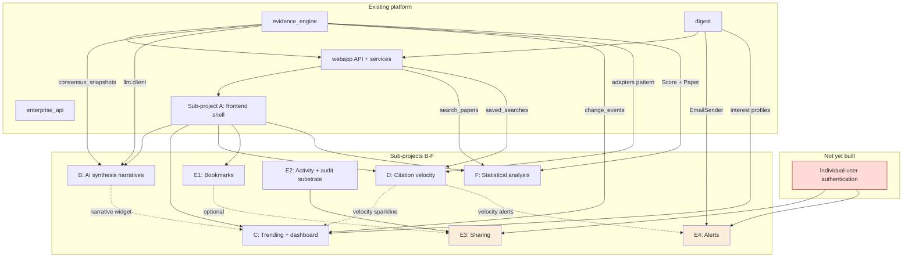

# Rendered Frontend B–F Roadmap

Status: Draft for user review
Scope: Sequencing, cross-cutting architecture, and readiness assessment for sub-projects B through F of the Athena rendered frontend
Companion documents: the five design specs dated 2026-08-02 in `docs/superpowers/specs/`

## 1. Current Foundation

Sub-project A — the frontend shell — is complete and merged on branch `codex/frontend-shell`, ten commits from `6131575` (anonymous-user endpoint) through `f13928a` (Playwright golden path and demo seed).

**What A provides, verified against the branch:**

| Capability | Evidence |
|---|---|
| React 18 + TypeScript + Vite 8 SPA | `webapp/frontend/package.json` dependencies |
| Hash-based routing, four pages plus a default redirect | `webapp/frontend/src/App.tsx:14` |
| TanStack Query v5 for all server state | `webapp/frontend/src/api/hooks.ts:1` |
| Typed API layer: 10 hooks over 10 types | `webapp/frontend/src/api/hooks.ts:4-14`; `webapp/frontend/src/api/types.ts:1-10` |
| Anonymous identity bootstrap via `localStorage` | `webapp/frontend/src/identity/identity.tsx:3`, `:6` |
| Search page with tier-grouped card sections | `webapp/frontend/src/pages/SearchPage.tsx` |
| Compare, Saved Searches, Topic Detail pages | `webapp/frontend/src/pages/{ComparePage,SavedSearchesPage,TopicDetailPage}.tsx` |
| Shared evidence components | `webapp/frontend/src/components/{EvidenceIndicator,ResearchCard,TierSection,CompareTray,FilterSidebar,SaveSearchDialog,IconSidebar}.tsx` |
| Scholastic Precision design tokens | `webapp/frontend/src/index.css:3-31` |
| FastAPI JSON endpoints, 11 routes | `webapp/api.py:70`–`:199` |
| Static asset serving from the same origin | `webapp/api.py:210-212` |
| Recharts for visualization | `webapp/frontend/package.json` dependencies |
| Vitest + Testing Library + MSW test infrastructure | `webapp/frontend/src/test/{setup,server}.ts` |
| Playwright end-to-end smoke test | `webapp/frontend/e2e/smoke.spec.ts` |
| Anonymous-user creation endpoint | `webapp/api.py:133`; `digest/profiles.py:23` |
| Topics list + enriched paper serialization | `webapp/api.py:185`; `webapp/api.py:51` |

**Every architectural assumption stated in the task brief was verified present.** Two additions to the assumed list matter for B–F: the `StaticFiles` mount is the *final* statement of `webapp/api.py` (`webapp/api.py:212`), so every new route must be declared above it or be shadowed; and `TopicDetailPage` is lazily loaded (`webapp/frontend/src/App.tsx:11`), establishing the pattern for the heavier pages C and F introduce.

**What A does not provide, and B–F must not assume:** authentication of any kind, any ownership verification on user-scoped endpoints, effect-size or citation-history data, cross-topic aggregates, and any LLM-generated content in the frontend.

## 2. Dependency Graph

Solid arrows are hard dependencies. Dotted arrows are optional enhancements that neither sub-project requires. Red marks the missing prerequisite; amber marks the two plans it blocks.

**Notable independence**: B, D, F, and E1 each depend only on sub-project A and existing backend packages. None depends on another of B–F. This is deliberate — every design document was written so its sub-project is independently planable.

**The one genuine cross-sub-project hazard** is not a dependency but a conflict: sub-project C's personalization requires giving anonymous users an `InterestProfile`, which would break the weekly digest runner for all users. See §6, R-1.

## 3. Recommended Execution Order

**1. D — citation tracking only (data collection), immediately.**
D is the only sub-project whose value is gated on elapsed wall-clock time rather than on engineering effort. No citation history exists, and none can be backfilled — Semantic Scholar exposes current counts, not dated series. A paper needs two observations at least 14 days apart before any velocity can be shown. Starting collection first means that by the time the other sub-projects are built, D's data is ready. D's design splits its flags precisely for this: `CITATION_TRACKING_ENABLED` starts the job, `CITATION_UI_ENABLED` reveals the feature. Ship the migration, the provider client, and the refresh job first; leave the UI for step 5. This is the single highest-leverage sequencing decision in the roadmap.

**2. B — AI synthesis narratives.**
Highest user-visible value per unit of work, no blocking open questions, and no dependency on any other sub-project. It fills the two panels sub-project A deliberately left empty on pages that already exist, so it needs no new routes and no navigation changes. Its infrastructure — a forced-tool LLM call with structured-output validation — already exists and is proven (`evidence_engine/llm/client.py:12`, `evidence_engine/consensus/synthesizer.py:43`). Its one non-trivial decision, token accounting (OQ-B-003), has a recommended answer that touches no existing code.

**3. F — statistical analysis.**
The most self-contained sub-project in the set: no external providers, no LLM calls, no new dependencies, no writes to any table it does not own, and no scheduled job on the critical path. Its blocking question (OQ-F-001, effect-size extraction) has the recommendation "do not", which unblocks rather than blocks it. It is placed third rather than second only because B delivers more immediately visible value on surfaces users already visit.

**4. C — trending and dashboard, after resolving OQ-C-001.**
C is ready except for one genuine safety problem that must be settled first (§5, D-1). The fix is small — two lines in `digest/runner.py` plus a regression test — but it must be made deliberately, because getting it wrong silently breaks weekly digest delivery platform-wide. C is placed after F because it is the only sub-project that changes existing user-visible behavior (the root redirect moves from `/#/search` to `/#/dashboard`), and doing that once the surrounding features exist makes for a more complete landing page.

**5. D — citation velocity UI.**
Return to D once at least 14 days of collection have elapsed, ideally 6 weeks so most papers have crossed the threshold. This step is small: three read endpoints, three hooks, three components. Splitting D across two positions in the order is unusual but is the correct response to a feature whose data has a mandatory warm-up.

**6. E1 — bookmarks.**
The one part of sub-project E that is safe on the current identity model. Its risk profile is identical to saved searches, which sub-project A already shipped. Independent of everything else.

**7. E2 — activity and audit substrate.**
Small, and a prerequisite for sharing. Establishes the append-only audit table and the activity-versus-audit classification rule. Worth doing before E3 rather than alongside it, so the audit path is proven before anything security-relevant depends on it.

**8. E3 — sharing, and 9. E4 — alerts.** Both gated on individual-user authentication, which does not exist and is a separate backlog item. E4 is additionally gated on email-verification state (OQ-E-006). Neither should start until authentication has its own design.

**Parallelization**: B, F, and E1 touch disjoint files and could proceed concurrently if capacity allows. C should not run concurrently with anything touching `digest/`, given R-1.

## 4. Cross-Cutting Architecture

### Shared models and tables

No sub-project shares a table with another. Each owns its own, following the platform's established one-package-per-sub-project convention (`docs/superpowers/specs/2026-07-04-interest-digest-design.md:32`). All read the same engine tables and none writes them, with one sanctioned exception: sub-project C's `POST /interests` creates a `Topic` through `evidence_engine.topics.registry.get_or_create_topic`, exactly as `digest.profiles.add_interest` already does.

New packages, in execution order: `citations/`, `synthesis/`, `analysis/`, `dashboard/`, `engagement/`.

### Rate limiting — the clearest consolidation opportunity

Four of the five sub-projects need per-user or per-client rate limiting, and none can reuse the only existing implementation: `enterprise_api.rate_limit` is foreign-keyed to `organizations.id` (`enterprise_api/models.py:39`) and cannot represent an anonymous user or an IP.

| Sub-project | Limit | Reason |
|---|---|---|
| B | 20 synthesis generations/hour/user | LLM cost |
| C | 30 interest additions/hour/user | Outbound PubMed calls |
| D | 30 saved-search velocity requests/minute/user | Re-executes a search |
| E | 20 shares/hour, 200 bookmarks/hour | Unverified ownership |
| F | 30 analyses/hour, 60 exports/hour | Compute cost |

**Recommendation**: whichever sub-project ships first — B under the recommended order — should create a single `rate_windows` table keyed by an opaque `subject_key` (`user:{uuid}` or `ip:{salted-hash}`) plus a `scope` string, in a shared location rather than inside its own package. Sub-projects C, D, E, and F then add a scope value rather than a table. Without this decision, the platform accumulates four near-identical tables. This is recorded as OQ-C-004 in sub-project C, but it is really a roadmap-level decision and should be made here.

### Shared UI components

Three components are specified independently in more than one document and should be built once:

- **`StalenessBanner`** — C (activity data age), D (velocity age), F (analysis drift). Same shape: a timestamp, a threshold, an amber treatment, `role="status"`.
- **`WidgetErrorNotice`** — C names it; B, D, and F all describe per-panel error notices with a retry control.
- **`ProvenanceFooter`** — B (model and generation time), F (computation time and spec version). Both need "who or what produced this, and when".

**Recommendation**: sub-project B builds `StalenessBanner` and `ProvenanceFooter` in a shared `src/components/common/` directory; C, D, and F import them.

### Provider abstractions

Only two external providers are involved across B–F, and neither introduces a new pattern:

- **Anthropic** (B only) via the existing `call_forced_tool` (`evidence_engine/llm/client.py:12`). B proposes a parallel `call_forced_tool_with_usage` rather than modifying the shared function (OQ-B-003).
- **Semantic Scholar** (D only) via a new batch client in `citations/provider.py`. D deliberately does **not** modify the existing search-oriented adapter (`evidence_engine/adapters/semantic_scholar.py:14`), so ingestion cannot regress.

F, C, and E introduce no new external provider. F introduces no outbound call at all.

### Permissions

All five sub-projects inherit the platform's current posture: no authentication, and caller-supplied `user_id` accepted without verification (`webapp/api.py:126-131`, `:146`, `:160`). B, D, and F store no user-linked data and are unaffected. C stores interest topics — low sensitivity, comparable to saved searches. E is where this becomes blocking, and its §15 sets out exactly which capabilities are safe on the current model and which are not.

### Scheduled jobs

Five new jobs join the two that exist (`run_daily_cycle.py`, `run_digests.py`):

| Job | Sub-project | Cadence | Ordering constraint |
|---|---|---|---|
| `refresh_citations.py` | D | Daily | After `run_daily_cycle.py` |
| `recompute_velocity_cache.py` | D | Daily | After `refresh_citations.py`; must run even if it failed |
| `refresh_dashboard_activity.py` | C | Daily | After `run_daily_cycle.py` |
| `run_alerts.py` | E4 | Daily | Independent |
| `prune_analyses.py` / `purge_synthesis_attribution.py` / `expire_shares.py` | F / B / E3 | Daily | Independent |

Every job follows the per-item isolation idiom already established at `scripts/run_daily_cycle.py:23-37` — loop, isolate failure per item, roll back, log, continue.

### Observability

**The platform has no metrics backend, no tracing, and no alerting.** All five documents note this and none proposes building it, since doing so inside a feature sub-project would be smuggling in infrastructure. Every document instead specifies SQL-computable metrics and structured logs, and each surfaces staleness to the user so a silently stalled job is visible in the product rather than only in logs.

The strongest case for building alerting comes from sub-project E: `engagement.audit_write_failed` means a security-relevant action was blocked or the audit path is broken, and nothing else in the platform is comparably urgent. If alerting is ever built, that condition should be its first consumer.

### Accessibility conventions

Every document repeats four rules that emerged from sub-project A's own review findings, and they should be treated as platform conventions rather than per-document requirements: Material Symbols spans always carry `aria-hidden="true"` (the ligature name is otherwise read aloud — the defect fixed in `IconSidebar.tsx` and `CompareTray.tsx`); charts are `aria-hidden` with adjacent text equivalents; loading regions announce once via a single polite live region; and status information is never conveyed by color alone.

## 5. Decision Register

Every blocking or near-blocking open question from the five documents, consolidated. Twenty-six open questions exist in total; the eight below are the ones that gate work.

| ID | Decision | Blocks | Recommendation | Decision-maker |
|---|---|---|---|---|
| ~~**D-1** (OQ-C-001)~~ **RESOLVED 2026-08-03, commit `a5a4117`** | How anonymous users acquire an `InterestProfile` without breaking the digest runner | ~~All of C's personalization~~ — **C is unblocked** | Done: both `list_interests` and `get_delivery_preference` now sit inside `select_due_users`' `try`, so a profile-less user is skipped and logged. Two regression tests added, confirmed RED before and GREEN after. The defect proved **live rather than latent** — sub-project A's anonymous users already triggered it, and six digest tests were failing on `main`. | Repository owner — decided |
| ~~**D-2** (OQ-E-001)~~ **ANSWERED 2026-08-03** | Whether E ships before individual-user authentication, and which parts | E3, E4, and `DELETE /me` | Owner chose to design authentication rather than defer or ship unsafely. See `docs/superpowers/specs/2026-08-03-user-authentication-design.md`. E1 and E2 remain shippable immediately; E3 and E4 are unblocked once authentication is implemented. `DELETE /me` stays deferred by that document's own §15 until E1 and E3 have added their tables to the cascade. | Repository owner — decided |
| ~~**D-3** (OQ-E-006)~~ **ANSWERED 2026-08-03** | Where email-verification state lives | E4 entirely | Authentication owns it, as recommended. The magic-link design verifies by construction — possession of the mailbox produces the session — and stores it as `users.email_verified_at`. No separate verification flow is needed. | Repository owner — decided |
| **D-4** (OQ-D-003) | Whether the citation refresh job requires a Semantic Scholar API key | D's weekly-coverage goal | Require the key when tracking is enabled; fail fast at startup rather than under-delivering coverage silently. | Repository owner (controls deployment env) |
| **D-5** (OQ-C-004, elevated) | Where the shared rate limiter lives | Consistency across B, C, D, E, F | Build one `rate_windows` table with a `scope` column in the first sub-project to ship; others add a scope value. See §4. | Whoever sequences B and C |
| **D-6** (OQ-F-001) | Whether Athena extracts effect sizes, enabling true meta-analysis | Nothing in F's v1 | Do not, for now. If ever pursued, it is a separate sub-project with a clinical reviewer and a golden-set evaluation — **not** an incremental extension of F. | Repository owner, with clinical input |
| **D-7** (OQ-B-003) | Whether `call_forced_tool` is changed to return token usage | B's cost accounting only | Add a parallel `call_forced_tool_with_usage` used only by `synthesis/`, leaving the four existing call sites untouched. | Repository owner |
| **D-8** (new, 2026-08-03) | How to restore a green backend test baseline — 17 tests fail on `main` from committed state leaking into the shared dev Postgres | **TDD reliability for B, C, D, E, and F.** Not a product defect; a workflow blocker | Three options, in ascending cost. **(a)** Add an autouse fixture that truncates the leak-prone tables (`users`, `search_index_sync_state`, `paper_search_index`) before each test — smallest change, keeps one database. **(b)** Point `pytest` at a dedicated test database created and dropped per session — strongest isolation, needs a second `DATABASE_URL` and CI wiring. **(c)** Make the API's `get_db` non-committing under test via a dependency override in `tests/webapp/`, plus a one-off cleanup of existing rows — fixes the source but not the residue already present. Recommend **(a)** now and **(b)** when CI is set up. | Repository owner |
| **D-8** (OQ-B-004 / OQ-D-005 / OQ-F-005) | Whether the enterprise API exposes synthesis, velocity, or analysis | Nothing in v1 | No, for all three, consistently. Each is purely additive later; exposing compute-heavy endpoints under a request-count quota is a quota-model decision. | Product owner |

**D-1 and D-2 must be answered before their sub-projects begin.** The remaining six have recommendations that allow work to proceed.

The other eighteen open questions are genuine but non-blocking design choices — window sizes, expiry defaults, filter affordances — each documented in place with two or three concrete options and a recommendation.

## 6. Risk Register

| Risk | Probability | Impact | Mitigation | Affected sub-projects |
|---|---|---|---|---|
| ~~**R-1**~~ **CLOSED 2026-08-03, commit `a5a4117`**: `select_due_users` raised uncaught for any user missing an `InterestProfile` or `DeliveryPreference`, aborting the weekly digest for **every** user | Was **already occurring** — not a future risk. Sub-project A's `POST /users/anonymous` created 8 such users in the dev database and 6 digest tests were failing on `main` | Critical — silent platform-wide digest failure | Fixed: both lookups guarded inside the existing `try`. Two regression tests added, RED before / GREEN after | C (and A, which was the actual trigger) |
| **R-1b** (new, open): 17 backend tests still fail on `main` because the suite shares one dev Postgres and code paths that **commit** (the API's `get_db`, seed scripts) leave rows the rollback-based `db_session` fixture never removes. A committed `SearchIndexSyncState` watermark at `2026-08-02 01:44:36` blocks the search-index tests from indexing their own fixtures | Certain — currently occurring | Medium — no production impact, but a permanently red baseline makes TDD unreliable for every future sub-project, since an implementer cannot distinguish their RED from ambient noise | Unresolved; see D-8 below | B, C, D, E, F — all of them |
| **R-2**: Sharing or alerts ship on unverified `user_id`, enabling mail attributable to a victim or destruction of another user's data | Medium — it is the path of least resistance | Critical for `DELETE /me`; high for alerts and sharing | Resolve D-2 in writing; keep the four E flags separate so each capability is independently gateable | E |
| **R-3**: Citation velocity ships before enough history accumulates, so nearly every paper shows "not enough history" and the feature reads as broken | High if D is built in one pass | Medium — reputational, recoverable by waiting | Split D across positions 1 and 5 of the execution order; separate `CITATION_TRACKING_ENABLED` from `CITATION_UI_ENABLED` | D |
| **R-4**: An LLM cost spike from synthesis generation goes unnoticed | Medium — no cost monitoring exists | Medium — financial | 20/hour/user cap, 10-member cap, 1200-token cap, content-addressed caching, `SYNTHESIS_ENABLED` kill switch requiring no deploy | B |
| **R-5**: Users read the activity ranking as scientific importance, or the composition gauge as statistical confidence | High — the inference is natural | High — reputational and epistemic; the platform's core claim is trustworthy evidence | Prohibited-terminology requirements enforced by tests (FR-C-015, FR-C-016, FR-B-016, FR-F-017); mandatory non-dismissible methodology notice (FR-F-012) | B, C, F |
| **R-6**: An implementer adds a forest plot, pooled estimate, or p-value to F because users ask for it | Medium over time | Critical — fabricated clinical synthesis presented authoritatively | Schema-guard tests asserting no such field exists; a test asserting `analysis/` imports no scientific library; the reasoning recorded in `docs/analysis-methodology.md` rather than only in the spec | F |
| **R-7**: Semantic Scholar outage, terms change, or rate-limit tightening halts all citation collection | Medium | Medium — no new data; existing history and velocities stay valid | `source` column on snapshots allows a second provider without migration; jobs decoupled so recompute works during an outage; graceful "not enough recent history" degradation | D |
| **R-8**: Prompt injection via a paper abstract biases a synthesis narrative | Low for envelope compromise, medium for wording influence | Medium | Forced-tool schema constrains the output envelope; index validation bounds citations; plain-text rendering (FR-B-017); no tools or network in the call; golden-set evaluation | B |
| **R-9**: A migration rollback destroys irreplaceable data | Low | High for D (citation history cannot be regenerated); high for E (audit log) | Both documented as destructive in migration docstrings; feature flags are the preferred operational rollback | D, E |
| **R-10**: Four near-identical rate-limit tables accumulate | High if D-5 is unresolved | Low — maintenance burden | Resolve D-5 at roadmap level before the first sub-project ships | B, C, D, E, F |
| **R-11**: Sub-project C's root-redirect change breaks the existing Playwright smoke test and any bookmark to `/` | High — it is a certainty, not a risk, unless handled | Low — caught by CI | C's plan explicitly updates `webapp/frontend/e2e/smoke.spec.ts` to navigate to `/#/search` directly; `/#/search` remains permanently valid; `DASHBOARD_ENABLED` reverts the redirect without a deploy | C |
| **R-12**: Analysis statistics mislead because `sample_size` coverage is low and unnoticed | Medium — coverage depends on abstract availability | Medium | Coverage mandatory on every statistic (FR-F-005); prominent warning below 50%; suppression below 5 observations; coverage distribution tracked as the key platform-health metric | F |
| **R-13**: Two sub-projects add conflicting routes or shadow the `StaticFiles` mount | Low | Medium — routes silently stop working | Every document states the constraint explicitly; §7 below confirms no proposed path collides with an existing one | All |

## 7. Documentation Coverage Matrix

| Feature area | Existing documentation | New document | Remaining ambiguity |
|---|---|---|---|
| Comparison synthesis narrative | Named only as a non-goal (`docs/superpowers/specs/2026-07-05-frontend-shell-design.md:97`) | `2026-08-02-ai-synthesis-narratives-design.md` | Playwright LLM stubbing approach (OQ-B-002); enterprise exposure (OQ-B-004) |
| Consensus report panel | Data model exists (`evidence_engine/db/models.py:98`); no endpoint or UI | Same document | Whether the panel appears for free-text queries or only explicit topic filters (OQ-B-001) |
| Evidence composition gauge | None — the reference design shows a gauge with no defined formula | Same document, §14.1 | None; formula, thresholds, and worked example specified |
| Trending topics | Deferred twice (`docs/superpowers/specs/2026-07-04-web-search-ui-design.md:27`, `:98`) | `2026-08-02-trending-dashboard-design.md` | Window shape (OQ-C-003); feed type filtering (OQ-C-005) |
| Dashboard page | Named only as a non-goal (`docs/superpowers/specs/2026-07-05-frontend-shell-design.md:98`) | Same document | Whether a templated non-LLM blurb ships in C (OQ-C-002) |
| Anonymous user personalization | Intent implied by the reusable aggregation core (`docs/superpowers/specs/2026-07-04-interest-digest-design.md:25`), but the code path raises | Same document, OQ-C-001 | **Blocking** — D-1 |
| Citation velocity | Named only as a non-goal (`docs/superpowers/specs/2026-07-05-frontend-shell-design.md:99`) | `2026-08-02-citation-velocity-design.md` | Window parameters pending real data (OQ-D-004); second provider (OQ-D-002) |
| Citation history storage | None — `Score.citation_count` is overwritten (`evidence_engine/scoring/assemble.py:47`) | Same document, §11 | None; append-only snapshot model specified |
| Bookmarks | Named only as a non-goal (`docs/superpowers/specs/2026-07-05-frontend-shell-design.md:100`) | `2026-08-02-engagement-sharing-audit-design.md` | None blocking; ready as plan E1 |
| Alerts | Same non-goal; `EmailSender` exists (`digest/delivery.py:20`) | Same document | **Blocking** — D-2, D-3 |
| Sharing | Same non-goal; API-key hashing precedent exists (`enterprise_api/models.py:28`) | Same document | **Blocking** — D-2; expiry policy (OQ-E-003); live vs snapshot (OQ-E-004) |
| Activity vs audit logs | `DigestRun`/`DigestEmail` precedent only (`digest/models.py:67-89`) | Same document, §14.6 | None; classification rule specified |
| Enterprise tenant isolation for user data | Explicitly excluded (`docs/superpowers/specs/2026-07-05-enterprise-api-design.md:89`); no user-to-org relationship exists (`enterprise_api/models.py:13-20`) | Same document, OQ-E-005 | Deferred by recommendation; requires a membership model that does not exist |
| Interactive evidence suite | Named only as a non-goal (`docs/superpowers/specs/2026-07-05-frontend-shell-design.md:101`) | `2026-08-02-statistical-analysis-design.md` | Timeline axis choice (OQ-F-003); export snapshot semantics (OQ-F-004) |
| Meta-analysis capability | None — and the data does not exist | Same document, §4 and OQ-F-001 | Resolved by exclusion: Athena cannot and does not claim to |
| Individual-user authentication | Deferred as a separate backlog item (`docs/superpowers/specs/2026-07-05-frontend-shell-design.md:101`) | **Not covered by any B–F document** | **Substantial** — no design exists; E3 and E4 depend on it |
| Metrics, tracing, alerting infrastructure | None anywhere | Noted in all five, designed in none | **Substantial** — deliberately out of scope for feature work |

## 8. Plan Readiness

### B — AI synthesis narratives: **READY FOR IMPLEMENTATION PLAN**

All five open questions have recommendations, none blocking. Every dependency is present and verified: the forced-tool LLM client (`evidence_engine/llm/client.py:12`), the consensus data it reads (`evidence_engine/db/models.py:98`), and the two frontend pages it extends. Its schema is additive and its feature flag gives an instant kill switch. The only judgment call an implementer must make — Playwright LLM stubbing (OQ-B-002) — has a recommended approach requiring no production code branch.

### C — Trending and dashboard: **READY FOR IMPLEMENTATION PLAN** (upgraded 2026-08-03)

Previously NEEDS USER DECISION, blocked on D-1. **D-1 is resolved** in commit `a5a4117`: `select_due_users` now guards both profile lookups, so C may create an `InterestProfile` for an anonymous user without endangering digest delivery. The two regression tests the original entry demanded exist and were confirmed to fail against pre-fix code.

Investigating D-1 also corrected the record. The defect was not the latent, C-triggered hazard this roadmap first described — it was **already live**, caused by sub-project A, and was the reason six digest tests failed on `main`. The corresponding citations in the C document have been fixed.

Everything else in C was already specified: the trend formula, thresholds, snapshot model, and job pattern. C now carries no blocking open question. Its remaining questions (OQ-C-002 through OQ-C-005) all have recommendations and none gate a plan.

### D — Citation velocity: **READY FOR IMPLEMENTATION PLAN**, with a sequencing caveat

No blocking questions. D-4 (API key) has a clear recommendation and is an environment decision rather than a design one.

The caveat is that D must **not** be planned as a single cycle. Its data has a mandatory 14-day minimum warm-up and no possible backfill, so the plan should cover collection infrastructure only (models, provider client, refresh and recompute jobs, migration), with the read endpoints and UI as a separate later plan. Planning it as one unit would either delay collection by weeks or ship a UI that shows "not enough history" for every paper.

### E — Bookmarks, alerts, sharing, audit: **SPLIT — one READY, one READY, two BLOCKED**

This sub-project must be four plans, not one. Its four capabilities share an architecture but have incompatible readiness:

- **E1 (bookmarks) — READY FOR IMPLEMENTATION PLAN.** No authentication dependency; risk profile identical to sub-project A's saved searches. Fully specified.
- **E2 (activity + audit substrate) — READY FOR IMPLEMENTATION PLAN.** Small, self-contained, and a prerequisite for E3. The append-only enforcement and classification rule are specified.
- **E3 (sharing) — BLOCKED BY ANOTHER SUB-PROJECT**, but the blocker now has a design. Depends on E2, and on authentication being *implemented* (`docs/superpowers/specs/2026-08-03-user-authentication-design.md`, D-2 answered 2026-08-03). Its token model, revocation semantics, and indistinguishable-failure requirement are fully specified and need no revisiting. E3 becomes READY the moment authentication ships.
- **E4 (alerts) — BLOCKED BY ANOTHER SUB-PROJECT.** Upgraded from NEEDS USER DECISION + NEEDS TECHNICAL RESEARCH on 2026-08-03: both D-2 and D-3 are answered. FR-E-004's verified-email precondition is satisfied by construction under the magic-link design — a session can only exist if the address received mail — and the state is stored as `users.email_verified_at`. The research gap is closed; only the implementation dependency remains.

### F — Statistical analysis: **READY FOR IMPLEMENTATION PLAN**

The most self-contained sub-project in the set: no external providers, no LLM calls, no new Python dependencies, no writes outside its own tables, and no scheduled job on the critical path. Its largest open question (D-6, effect-size extraction) resolves by exclusion — the recommendation is not to build it, which unblocks F rather than blocking it.

One caveat for whoever writes the plan: F's most important requirements are **negative** ones. FR-F-010 and FR-F-011 forbid outputs the data cannot support, and they are enforced by schema-guard tests rather than by feature code. A plan that treats F as "build five charts" and drops those tests would produce a feature that looks complete and is epistemically unsound. The `docs/analysis-methodology.md` deliverable exists for the same reason: to carry the reasoning forward past this spec.

### Summary

| Sub-project | Readiness | Gate |
|---|---|---|
| B | READY FOR IMPLEMENTATION PLAN | — |
| C | READY FOR IMPLEMENTATION PLAN | ~~D-1~~ resolved 2026-08-03 (`a5a4117`) |
| D | READY FOR IMPLEMENTATION PLAN | Split into collection and UI plans |
| E1 | READY FOR IMPLEMENTATION PLAN | — |
| E2 | READY FOR IMPLEMENTATION PLAN | — |
| E3 | BLOCKED BY ANOTHER SUB-PROJECT | E2, then authentication (designed 2026-08-03, not yet built) |
| E4 | BLOCKED BY ANOTHER SUB-PROJECT | authentication (designed 2026-08-03, not yet built) |
| F | READY FOR IMPLEMENTATION PLAN | — |
| AUTH | READY FOR IMPLEMENTATION PLAN | — (new; unblocks E3 and E4) |

Four plans can begin immediately: **B, D (collection), F, and E1.** Two need one decision each: **C** (D-1) and **E2** (none — it is ready, and listed here only because it is a prerequisite for E3). Two wait on authentication: **E3 and E4**.
