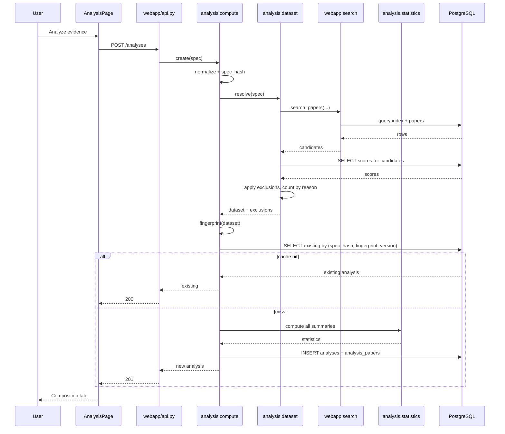

# Interactive Statistical Analysis

Status: Draft for user review
Scope: Sub-project F of the Athena rendered frontend
Depends on: Sub-project A (frontend shell), `evidence_engine` `Score` and `Paper` data, `webapp` search service, PostgreSQL

## 1. Executive Summary

Sub-project F adds an interactive analysis workspace where a user assembles a set of studies — from a search, a topic, or a manual selection — and examines the **composition and characteristics of that evidence base**: what study designs it contains, how large the studies are, when the evidence accumulated, which risk-of-bias issues recur, and how quality is distributed.

**Athena cannot perform a meta-analysis, and F does not claim to.** This is not a scoping preference; it is a hard data constraint. A meta-analysis requires a per-study effect estimate and its variance or confidence interval. Athena stores neither. The `Score` table holds study type, an LLM-extracted sample size, a citation count, a journal SJR, risk-of-bias flags, and a composite quality score (`evidence_engine/db/models.py:77-93`) — and nothing resembling an outcome measure. There is no forest plot, no pooled estimate, no heterogeneity statistic, and no funnel plot in this design, because producing any of them would require inventing numbers the platform has never collected.

What F delivers instead is an **evidence landscape analysis**: rigorous descriptive statistics over study metadata, presented with explicit coverage reporting, minimum-sample rules, and reproducibility guarantees. The reference design's "Interactive Evidence Suite" with Timeline, Regression, and Raw Data tabs maps onto this as Timeline (evidence accumulation over time), Composition (design and quality distributions — replacing "Regression", which the data cannot support), and Raw Data (the underlying table with export).

The audience is a researcher or analyst assessing whether a body of evidence is strong enough to act on, and what its weaknesses are.

The concrete outcome is that a user can select a topic, see that its 44 studies comprise 4 meta-analyses and 26 unclassified papers with a median sample size of 180 (reported for only 61% of studies), that half of them flag "no blinding", and export that table as CSV with a stable analysis identifier a colleague can reproduce.

## 2. Repository Evidence

| Item | Classification | Source | Relevance |
|---|---|---|---|
| Frontend-shell non-goal: "The Interactive Evidence Suite (regression/raw-data views) (sub-project F)" | [EXISTING] | `docs/superpowers/specs/2026-07-05-frontend-shell-design.md:101` | Establishes F's scope |
| `Score` columns: `study_type`, `sample_size`, `citation_count`, `journal_sjr`, `base_score`, `risk_of_bias_flags`, `final_score`, `evidence_tier`, `quality_breakdown`, `is_pending`, `scored_at`, `model_version` | [EXISTING] | `evidence_engine/db/models.py:77-93` | **The complete set of quantitative fields available. None is an effect size.** |
| `Paper` columns: identifiers, `title`, `abstract`, `authors`, `journal`, `journal_issn`, `pub_date`, `publication_types`, `is_retracted`, `raw_metadata` | [EXISTING] | `evidence_engine/db/models.py:49-65` | No outcome, effect, variance, or CI field |
| No effect size, variance, standard error, confidence interval, odds ratio, or hazard ratio exists in any table | [INFERRED] | Exhaustive review of `evidence_engine/db/models.py`, `webapp/models.py`, `digest/models.py`, `enterprise_api/models.py` — the complete set of ORM modules | **This is the single most consequential fact in this document; it makes formal meta-analysis impossible** |
| `sample_size` is LLM-extracted from the abstract and returns `None` when absent or unextractable | [EXISTING] | `evidence_engine/scoring/sample_size.py:18-29`; nullable at `evidence_engine/db/models.py:83` | Sample size is incomplete and imperfect; coverage must be reported, never assumed |
| `extract_sample_size` returns `None` when the paper has no abstract | [EXISTING] | `evidence_engine/scoring/sample_size.py:19-20` | A structural source of missingness, not random |
| `StudyType` enum with 8 values including `UNKNOWN` | [EXISTING] | `evidence_engine/db/models.py:14-22` | `UNKNOWN` is a real category that must be displayed, not hidden |
| `EvidenceTier` enum: established / emerging / speculative | [EXISTING] | `evidence_engine/db/models.py:25-28` | A derived ordinal, not an outcome |
| `risk_of_bias_flags` is a string array | [EXISTING] | `evidence_engine/db/models.py:87` | Enables prevalence counts across a set |
| Risk-of-bias flag vocabulary: `no_control_group`, `no_blinding`, `funding_conflict_of_interest`, `underpowered_sample`, `outcome_switching`, `other` | [EXISTING] | `evidence_engine/scoring/risk_of_bias.py:6-13` | The exact closed vocabulary F aggregates over |
| Flag penalties (15/10/10/15/20/5) capped at `MAX_PENALTY = 50.0` | [EXISTING] | `evidence_engine/scoring/risk_of_bias.py:6-14` | `final_score` is a penalized composite, not an independent measurement |
| `compute_base_score` weights: study_type 0.55, sample_size 0.15, citations 0.15, journal 0.15 | [EXISTING] | `evidence_engine/scoring/formula.py:16` | `final_score` is dominated by study type; correlating the two would be circular |
| `assign_evidence_tier` derives tier from `final_score` and `study_type` | [EXISTING] | `evidence_engine/scoring/assemble.py:13-18` | Tier is a deterministic function of score; cross-tabulating them measures the formula, not the evidence |
| `is_pending` marks unscored papers | [EXISTING] | `evidence_engine/db/models.py:91` | Pending papers must be excluded from statistics but counted in coverage |
| `tier_distribution(session, topic_id)` returns per-tier counts | [EXISTING] | `webapp/visualizations.py:18-34` | An existing single-topic aggregate F generalizes |
| `change_timeline(session, topic_id, window_start, window_end)` buckets events by day | [EXISTING] | `webapp/visualizations.py:44-59` | Existing timeline logic, keyed on `ChangeEvent` rather than publication date |
| `search_papers(session, query, filters, page, page_size)` with `SearchFilters` | [EXISTING] | `webapp/search.py:14-22`, `:33` | The dataset-construction entry point F reuses |
| `SearchFilters`: `topic_id`, `tier`, `study_type`, `date_from`, `date_to`, `include_retracted` | [EXISTING] | `webapp/search.py:14-21` | The exact inclusion criteria available; no numeric filters exist |
| Retracted papers excluded by default | [EXISTING] | `webapp/search.py:20`, `include_retracted: bool = False` | The default exclusion rule F inherits |
| Web-search-UI non-goal: "Numeric threshold filters on citation count or SJR" | [EXISTING] | `docs/superpowers/specs/2026-07-04-web-search-ui-design.md:97` | Numeric filtering is a platform-level deferral |
| Recharts 3.x is a dependency | [EXISTING] | `webapp/frontend/package.json` dependencies | Charting available; no new library needed |
| No numerical/statistical Python library is a dependency | [EXISTING] | `pyproject.toml` dependencies: sqlalchemy, psycopg, alembic, httpx, tenacity, anthropic, pydantic-settings, defusedxml, jinja2, fastapi | **NumPy, SciPy, pandas, and statsmodels are all absent** |
| `app.mount("/", StaticFiles(...))` is the final statement of `webapp/api.py` | [EXISTING] | `webapp/api.py:212` | New routes MUST be declared above it |
| Alembic head `5d7c21d9f44e` | [EXISTING] | `alembic/versions/5d7c21d9f44e_enterprise_api_tables.py:15` | F's migration chains from the head at implementation time |
| Enterprise API delegates to `webapp` service functions rather than reimplementing | [EXISTING] | `docs/superpowers/specs/2026-07-05-enterprise-api-design.md:23` | The precedent for how F's services should be structured for reuse |

## 3. Goals

- G-F-1: A user can construct an analysis dataset from a topic, a search query with filters, or an explicit paper-ID list, and see exactly how many papers were included and how many were excluded by each rule.
- G-F-2: Every statistic displayed reports its own coverage — the count and percentage of the dataset for which the underlying field was non-null.
- G-F-3: No distribution, percentile, or summary statistic is rendered for a dataset with fewer than 5 contributing observations.
- G-F-4: Every analysis is identified by a stable `analysis_id` that reproduces the identical result set and statistics when reopened, given unchanged underlying data.
- G-F-5: A user can export the raw underlying rows as CSV or JSON, including every field the statistics were computed from.
- G-F-6: Every analysis view displays a non-dismissible statement that the analysis describes study metadata and is not a meta-analysis of outcomes.
- G-F-7: No view presents a pooled effect estimate, forest plot, heterogeneity statistic, funnel plot, or any output implying synthesis of study results.
- G-F-8: An analysis over 5,000 papers completes server-side within 10 seconds.

## 4. Non-Goals

These exclusions are load-bearing, not scope trimming. Each names the specific data Athena lacks.

- **Meta-analysis of any kind.** Requires per-study effect estimates and variances. `Score` has neither (`evidence_engine/db/models.py:77-93`).
- **Forest plots.** Require a point estimate and confidence interval per study. Athena stores no interval for anything.
- **Pooled effect estimates**, fixed- or random-effects. Require effect sizes and inverse-variance weights.
- **Heterogeneity statistics** (I², τ², Cochran's Q). All are functions of per-study effect estimates and their variances.
- **Funnel plots and publication-bias tests** (Egger's, Begg's). Require effect size plotted against precision; Athena has no effect size and no standard error.
- **Regression or predictive modelling.** The reference design labels a tab "Regression", but the only continuous variables available are `sample_size`, `citation_count`, `journal_sjr`, and `final_score` — and `final_score` is a deterministic weighted function of the other three plus study type (`evidence_engine/scoring/formula.py:16`, `:44`). Regressing any of these on `final_score` would recover the formula's own coefficients, not a finding about the evidence. This is circularity, not analysis, and F names the tab "Composition" instead.
- **Subgroup analysis by clinical characteristics** (population, dose, comparator). No such fields are extracted.
- **Any causal claim or clinical recommendation.**
- **Statistical hypothesis testing between datasets.** Comparing two topics' quality distributions with a significance test would treat a convenience sample of whatever the adapters ingested as a random sample from a defined population. It is not one, and the resulting p-value would be uninterpretable.
- **User-supplied data upload.** Analysis is over the platform's corpus only.
- **Effect-size extraction from abstracts.** This is the one capability that would unlock genuine meta-analysis, and it is deliberately deferred with a full rationale in OQ-F-001 and §23 rather than being quietly attempted.

## 5. User Roles and Permissions

### Anonymous user

- **Read**: MAY create and view analyses over any corpus data. All inputs are public bibliographic records already exposed by `GET /search` (`webapp/api.py:70`). [PROPOSED]
- **Write**: MAY create analysis definitions and trigger computation, subject to rate limits (FR-F-014). Analyses are content-addressed rather than owned, so two users specifying the same dataset share a cached result. [PROPOSED]
- **Sharing**: an `analysis_id` is a URL-safe handle that anyone may open. Because analyses contain no user data, this carries no privacy consequence; it is deliberately distinct from sub-project E's authenticated share links. [PROPOSED]
- **Retention**: analysis definitions and results are retained 180 days from last access, then pruned. No user-linked data is stored beyond a nullable creator ID for rate-limit accounting, purged at 30 days. [PROPOSED]
- **Failure when absent**: analyses work with no identity at all. `useIdentity()` is not consulted, matching Search and Compare in sub-project A.

### Enterprise organization (service role)

- **Read**: no analysis endpoints in v1. The enterprise surface is scoped to search, comparison, and visualizations (`docs/superpowers/specs/2026-07-05-enterprise-api-design.md:24`).
- **Write / sharing / retention**: not applicable.
- **Failure when absent**: unchanged `401`/`403`/`429`.
- **Deferred**: see OQ-F-005.

### Operator

- **Read**: MAY inspect analysis definitions and job records via direct database access.
- **Write**: MAY prune cached analyses and bump `ANALYSIS_SPEC_VERSION` to invalidate all cached results after a methodology change.
- **Sharing / retention / failure**: no dedicated admin surface; the platform has none.

## 6. User Stories

**US-F-001 — Primary: analyze a topic's evidence base**
Actor: Anonymous user
Precondition: Topic T has 44 scored, non-retracted papers.
Trigger: User clicks "Analyze evidence" on the Topic Detail page.
Main flow: Frontend posts an analysis spec `{source: "topic", topic_id: T}` → server resolves the dataset, applies exclusions, computes statistics, persists → returns `analysis_id` and results.
Expected result: The Analysis page opens on the Composition tab showing study-type counts, the sample-size distribution with its coverage figure, tier counts, and risk-of-bias flag prevalence, above a non-dismissible methodology notice.
Failure result: See US-F-006.
Acceptance criteria: Included and excluded counts sum to the dataset total; every statistic shows coverage; the URL contains the `analysis_id`.

**US-F-002 — Reproduce an analysis from a link**
Actor: Colleague
Precondition: A user shares `/#/analysis/{analysis_id}`.
Trigger: Colleague opens the URL.
Main flow: Server loads the stored definition and results by ID.
Expected result: Identical statistics, with a banner naming the computation date.
Failure result: If the ID is unknown or pruned, a clear "This analysis is no longer available" with an offer to rebuild from the same specification.
Acceptance criteria: Byte-identical statistics to the original; the computation timestamp is the original, not now.

**US-F-003 — Stale analysis**
Actor: Any user
Precondition: An analysis computed 30 days ago; 6 new papers have since been added to the topic.
Trigger: User reopens the analysis.
Main flow: The server compares the stored `dataset_fingerprint` with the current one and finds a mismatch.
Expected result: Stored results render with an amber banner: "Computed 30 days ago. 6 papers have been added since. [Recompute]".
Failure result: Recompute failure leaves the stored result displayed.
Acceptance criteria: The banner states the delta count; the stale result remains visible rather than being replaced by an error; recompute produces a new `analysis_id`, preserving the original.

**US-F-004 — Empty state: dataset too small**
Actor: Anonymous user
Precondition: A topic with 3 scored papers.
Trigger: User requests an analysis.
Main flow: The dataset is built; every statistic falls below the 5-observation minimum.
Expected result: The page renders the dataset summary (3 papers, their titles, the exclusion accounting) and, in place of each chart, "Not enough studies to summarize — at least 5 are required."
Failure result: Not applicable.
Acceptance criteria: No chart, percentile, or median is rendered; the threshold is stated numerically; the raw data tab still works, because listing 3 rows is always valid.

**US-F-005 — Low coverage on a field**
Actor: Anonymous user
Precondition: 44 papers, of which 12 have an extracted `sample_size`.
Trigger: Analysis renders.
Main flow: Sample-size coverage is 27%.
Expected result: The distribution renders with a prominent coverage warning: "Sample size available for 12 of 44 studies (27%). This summary describes only those 12."
Failure result: Below the 5-observation floor the chart is suppressed entirely.
Acceptance criteria: The coverage figure is adjacent to the statistic, not in a footnote; the denominator shown is the contributing count, never the dataset total.

**US-F-006 — Upstream failure during computation**
Actor: Anonymous user
Precondition: The database becomes unavailable mid-computation.
Trigger: Analysis request.
Main flow: The service raises; the transaction rolls back.
Expected result: "Couldn't compute this analysis. Nothing was saved." with a Retry control.
Failure result: Retry re-runs from scratch.
Acceptance criteria: No partial analysis row persists; HTTP 500; the page is otherwise intact.

**US-F-007 — Loading state on a large dataset**
Actor: Anonymous user
Precondition: A 5,000-paper dataset.
Trigger: Analysis request.
Main flow: Computation takes several seconds.
Expected result: A skeleton for each panel with "Computing over 5,000 studies…", `aria-busy="true"`, announced once politely.
Failure result: At 30 seconds the client abandons and offers Retry.
Acceptance criteria: The dataset size appears in the loading copy; the announcement fires once.

**US-F-008 — Export raw data**
Actor: Anonymous user
Precondition: A completed 44-paper analysis.
Trigger: User clicks "Export CSV".
Main flow: The server streams a CSV of every included row with all analysis fields plus the `analysis_id` and computation timestamp in a header comment.
Expected result: A downloaded file whose rows reconcile exactly with the on-screen raw data tab.
Failure result: Export failure shows an inline message; the page is unaffected.
Acceptance criteria: Row count equals the included count; null fields are empty rather than the string "None"; the header carries the `analysis_id`.

**US-F-009 — Invalid input**
Actor: Crafted request
Precondition: None.
Trigger: An analysis spec with 20,000 paper IDs, or `source: "regression"`.
Main flow: Validation rejects.
Expected result: `422` with a field-level message.
Failure result: Not applicable.
Acceptance criteria: `422`; nothing persisted; no computation attempted.

**US-F-010 — Attempting an unsupported analysis**
Actor: Anonymous user
Precondition: User expects a forest plot from prior meta-analysis experience.
Trigger: User looks for pooled results on the Analysis page.
Main flow: No such control exists. A "What this analysis can and cannot tell you" panel is present on every tab.
Expected result: The panel states plainly that Athena does not extract effect sizes and therefore cannot pool results, and points to the individual papers for outcome data.
Failure result: Not applicable.
Acceptance criteria: The explanation is reachable from every tab and names effect sizes specifically, so the limitation is understood rather than merely observed.

**US-F-011 — Comparing two topics**
Actor: Anonymous user
Precondition: Two analyses over different topics.
Trigger: User opens side-by-side comparison.
Main flow: Both analyses' descriptive statistics render adjacently.
Expected result: Counts and distributions shown side by side, with a notice that differences are descriptive and no significance test is performed.
Failure result: If either dataset is under 5, its panels show the insufficient-data state independently.
Acceptance criteria: No p-value, no significance marker, no "significantly higher" language anywhere.

## 7. Functional Requirements

**FR-F-001**: The system MUST allow an analysis dataset to be defined by exactly one of: a topic ID, a search specification (query plus `SearchFilters`), or an explicit paper-ID list of at most 500 entries.
- Classification: [PROPOSED]
- Rationale: G-F-1; these are the three ways a user already assembles papers in sub-project A.
- Inputs: an analysis spec object.
- Outputs: a resolved dataset.
- Failure behavior: more than one source, or none → `422`.
- Acceptance test: `test_spec_requires_exactly_one_source`.

**FR-F-002**: The system MUST report, for every analysis, the count of papers matched, and the count excluded by each rule separately: retracted, unscored (`is_pending`), and no score row.
- Classification: [PROPOSED]
- Rationale: G-F-1; a user cannot judge an evidence base without knowing what was removed from it.
- Inputs: candidate papers and their scores.
- Outputs: an `exclusions` object with a count per reason.
- Failure behavior: none.
- Acceptance test: `test_exclusion_counts_sum_to_matched_total`.

**FR-F-003**: The system MUST exclude retracted papers by default and MUST allow explicit inclusion, reporting the count either way.
- Classification: [EXISTING behavior, extended] — `SearchFilters.include_retracted` defaults to `False` (`webapp/search.py:20`), and the engine excludes retracted work from consensus grounding (`evidence_engine/consensus/synthesizer.py:34`).
- Rationale: consistency with the rest of the platform.
- Inputs: `include_retracted` flag.
- Outputs: dataset and exclusion count.
- Failure behavior: none.
- Acceptance test: `test_retracted_excluded_by_default_and_counted`.

**FR-F-004**: The system MUST exclude papers with `is_pending = true` or no `Score` row from all statistics, and MUST report them as a distinct exclusion category.
- Classification: [INFERRED] — `is_pending` marks papers stored without a completed score (`evidence_engine/db/models.py:91`), a state the engine creates deliberately when scoring fails (`docs/superpowers/specs/2026-07-03-evidence-engine-design.md:65`). Including them would treat default zeros (`base_score`/`final_score` default `0.0`, `evidence_engine/db/models.py:86`, `:88`) as measurements.
- Rationale: default values are not observations.
- Inputs: `Score.is_pending`, score presence.
- Outputs: exclusion counts.
- Failure behavior: none.
- Acceptance test: `test_pending_scores_excluded_and_counted_separately`.

**FR-F-005**: Every statistic MUST be accompanied by its coverage: the count and percentage of included papers contributing a non-null value.
- Classification: [PROPOSED]
- Rationale: G-F-2, US-F-005; `sample_size` is nullable and LLM-extracted (`evidence_engine/scoring/sample_size.py:18-29`), so an uncontextualized median would misrepresent an unknown fraction of the set.
- Inputs: per-field non-null counts.
- Outputs: `coverage: {available, total, percent}` on each statistic.
- Failure behavior: none.
- Acceptance test: `test_every_statistic_carries_coverage`.

**FR-F-006**: The system MUST NOT render a distribution, median, or percentile computed from fewer than 5 non-null observations.
- Classification: [PROPOSED]
- Rationale: G-F-3; a median of 2 values is a midpoint, not a summary, and percentiles are meaningless at that size.
- Inputs: contributing observation count.
- Outputs: a suppressed statistic with `insufficient_data: true`.
- Failure behavior: the UI states the threshold numerically.
- Acceptance test: `test_statistic_suppressed_below_five_observations`.

**FR-F-007**: Sample-size summaries MUST report median and interquartile range, and MUST NOT report the arithmetic mean as the primary measure.
- Classification: [PROPOSED]
- Rationale: clinical study sample sizes are heavily right-skewed — a single large registry study among small trials shifts the mean far from any typical study. The median describes a typical study; the mean does not.
- Inputs: non-null sample sizes.
- Outputs: `median`, `q1`, `q3`, `min`, `max`, `n`.
- Failure behavior: suppressed below 5 observations.
- Acceptance test: `test_sample_size_summary_reports_median_not_mean`.

**FR-F-008**: The system MUST report `unknown` study type as its own visible category and MUST NOT merge it into another category or omit it.
- Classification: [INFERRED] — `StudyType.UNKNOWN` is an explicit enum member (`evidence_engine/db/models.py:22`) and the classifier's fallback. Hiding it would overstate how well-characterized a corpus is.
- Rationale: honest composition reporting.
- Inputs: study-type counts.
- Outputs: a category including `unknown`.
- Failure behavior: none.
- Acceptance test: `test_unknown_study_type_shown_as_category`.

**FR-F-009**: Risk-of-bias prevalence MUST be computed over the closed vocabulary `no_control_group`, `no_blinding`, `funding_conflict_of_interest`, `underpowered_sample`, `outcome_switching`, `other`, reporting each flag's count and percentage of included papers.
- Classification: [EXISTING vocabulary] — Source: `evidence_engine/scoring/risk_of_bias.py:6-13`.
- Rationale: prevalence across a set is the most actionable quality signal the data supports.
- Inputs: `Score.risk_of_bias_flags` arrays.
- Outputs: per-flag counts and percentages.
- Failure behavior: a flag absent from every paper is shown at zero, not omitted, so the vocabulary is visible.
- Acceptance test: `test_all_six_flags_present_with_zero_counts`.

**FR-F-010**: The system MUST NOT compute or display any correlation, regression, or association between `final_score`, `base_score`, `evidence_tier`, and any of `study_type`, `sample_size`, `citation_count`, or `journal_sjr`.
- Classification: [INFERRED] — `final_score` is a deterministic weighted function of exactly those inputs (`evidence_engine/scoring/formula.py:16`, `:37-49`), reduced by risk-of-bias penalties (`evidence_engine/scoring/assemble.py:40`), and `evidence_tier` is a deterministic function of `final_score` and `study_type` (`evidence_engine/scoring/assemble.py:13-18`).
- Rationale: such an analysis would recover the scoring formula's own constants and present them as an empirical finding. That is circular and actively misleading.
- Inputs: none.
- Outputs: none.
- Failure behavior: a test asserting the absence of correlation endpoints and components fails the build if one is added.
- Acceptance test: `test_no_correlation_or_regression_output_exists`.

**FR-F-011**: The system MUST NOT produce a pooled effect estimate, forest plot, heterogeneity statistic, funnel plot, or confidence interval around any synthesized outcome.
- Classification: [PROPOSED]
- Rationale: G-F-7; Athena stores no effect size or variance for any study (`evidence_engine/db/models.py:77-93`), so every such output would be fabricated.
- Inputs: none.
- Outputs: none.
- Failure behavior: build-level test.
- Acceptance test: `test_no_meta_analysis_outputs_in_response_schema`.

**FR-F-012**: Every analysis view MUST display a non-dismissible statement that the analysis describes study metadata, does not synthesize outcomes, and is not a meta-analysis.
- Classification: [PROPOSED]
- Rationale: G-F-6, US-F-010; users arriving with meta-analysis expectations will otherwise read a composition chart as a synthesis result.
- Inputs: none.
- Outputs: the notice.
- Failure behavior: none.
- Acceptance test: `test_methodology_notice_present_on_every_tab_and_not_dismissible`.

**FR-F-013**: The system MUST persist every analysis with a stable `analysis_id`, its full specification, its resolved paper-ID list, its computed statistics, a `dataset_fingerprint`, and `ANALYSIS_SPEC_VERSION`, such that reopening the ID returns identical results.
- Classification: [PROPOSED]
- Rationale: G-F-4; an analysis a colleague cannot reproduce is not evidence.
- Inputs: spec and results.
- Outputs: a persisted row.
- Failure behavior: computation failure persists nothing (US-F-006).
- Acceptance test: `test_reopening_analysis_returns_identical_statistics`.

**FR-F-014**: Analysis creation MUST be rate-limited to 30 per hour per client, and datasets MUST be capped at 5,000 papers.
- Classification: [PROPOSED]
- Rationale: G-F-8; an unbounded dataset over an unbounded request rate is the only expensive path F adds.
- Inputs: request counters; resolved dataset size.
- Outputs: `429`, or `422` when the dataset exceeds the cap.
- Failure behavior: when the cap is exceeded the response names the matched count so the user can narrow their filters.
- Acceptance test: `test_dataset_over_five_thousand_returns_422_with_count`.

**FR-F-015**: The system MUST provide CSV and JSON export of every included row with all fields used in the statistics, plus the `analysis_id` and computation timestamp.
- Classification: [PROPOSED]
- Rationale: G-F-5; the reference design's Raw Data tab, and the minimum needed for a user to verify a statistic independently.
- Inputs: `analysis_id`, format.
- Outputs: a streamed file.
- Failure behavior: unknown ID → `404`.
- Acceptance test: `test_csv_export_row_count_matches_included_count`.

**FR-F-016**: An analysis whose `dataset_fingerprint` no longer matches current data MUST be served with a staleness indicator and the count of papers added or removed since, and MUST NOT be silently recomputed.
- Classification: [PROPOSED]
- Rationale: US-F-003; silent recomputation would break FR-F-013's reproducibility guarantee for a shared link.
- Inputs: stored and current fingerprints.
- Outputs: `is_stale`, `papers_added`, `papers_removed`.
- Failure behavior: fingerprint computation failure renders without the indicator rather than blocking the result.
- Acceptance test: `test_stale_analysis_reports_delta_and_preserves_original`.

**FR-F-017**: Analysis copy MUST NOT use "significant", "significantly", "proves", "demonstrates that", "causes", "effective", or "efficacy" in any generated or static text describing results.
- Classification: [PROPOSED]
- Rationale: "significant" has a specific statistical meaning F never tests for, and causal verbs assert what descriptive metadata statistics cannot support.
- Inputs: none.
- Outputs: UI copy.
- Failure behavior: none.
- Acceptance test: `test_analysis_copy_avoids_prohibited_statistical_and_causal_terms`.

## 8. Information Architecture and UX

### Routes

| Route | Status | Purpose |
|---|---|---|
| `/#/analysis/:analysisId` | New | A computed analysis workspace |
| `/#/analysis/new` | New | Dataset builder |
| `/#/topics/:id` | Modified | Gains an "Analyze evidence" action |
| `/#/search` | Modified | Gains an "Analyze these results" action |

### Entry points

- "Analyze evidence" on Topic Detail (dataset = the topic).
- "Analyze these results" on Search (dataset = the current query and filters).
- Direct `analysis_id` URL from a colleague.
- No sidebar destination. Analysis is always entered from a dataset context; a standalone nav item would land the user on an empty builder with nothing selected.

### Component hierarchy

```
AnalysisPage                          [new]
├── MethodologyNotice                 [new]   non-dismissible, all tabs
├── DatasetSummaryPanel               [new]
│   └── ExclusionBreakdown            [new]
├── StalenessBanner                   [new]   conditional
├── AnalysisTabs                      [new]
│   ├── CompositionTab                [new]
│   │   ├── StudyTypeChart            [new]
│   │   ├── EvidenceTierChart         [new]
│   │   ├── SampleSizeSummary         [new]
│   │   └── RiskOfBiasPrevalence      [new]
│   ├── TimelineTab                   [new]
│   │   └── AccumulationChart         [new]
│   └── RawDataTab                    [new]
│       ├── RawDataTable              [new]
│       └── ExportControls            [new]
├── CoverageBadge                     [new]   reused by every statistic
├── InsufficientDataNote              [new]   reused
└── CapabilityExplainer               [new]   "what this can and cannot tell you"

AnalysisBuilderPage                   [new]
└── reuses FilterSidebar              [existing]
```

### Desktop wireframe — Composition tab

```
┌────────────────────────────────────────────────────────────────┐
│ Evidence analysis · Atrial fibrillation      analysis 7f2a9c1e │
│ ⓘ This describes the characteristics of the studies found.     │
│   It does not combine their results and is not a meta-analysis.│
├────────────────────────────────────────────────────────────────┤
│ 44 studies included                                            │
│ Excluded: 3 retracted · 2 not yet scored · 0 unscored          │
├──────────────────────────┬─────────────────────────────────────┤
│ [Composition] Timeline  Raw data                               │
├──────────────────────────┴─────────────────────────────────────┤
│ STUDY DESIGN                        EVIDENCE TIER              │
│  Meta-analysis        4  ████        Established    7  ███     │
│  Systematic review    3  ███         Emerging      15  ██████  │
│  RCT                 11  ███████     Speculative   22  █████████│
│  Cohort               6  ████                                  │
│  Case-control         2  █           coverage 44 of 44 (100%)  │
│  Unknown             18  ███████████                           │
│  coverage 44 of 44 (100%)                                      │
├────────────────────────────────────────────────────────────────┤
│ SAMPLE SIZE                                                    │
│  Median 180   IQR 64–520   Range 12–4,200                      │
│  ⚠ Available for 27 of 44 studies (61%).                       │
│    This summary describes only those 27.                       │
├────────────────────────────────────────────────────────────────┤
│ RISK-OF-BIAS FLAGS (share of the 44 included studies)          │
│  No blinding                 22  50%  ██████████               │
│  No control group            14  32%  ██████                   │
│  Underpowered sample          9  20%  ████                     │
│  Funding conflict of interest 4   9%  ██                        │
│  Outcome switching            1   2%  ▌                         │
│  Other                        0   0%                            │
├────────────────────────────────────────────────────────────────┤
│ ▸ What this analysis can and cannot tell you                   │
└────────────────────────────────────────────────────────────────┘
```

### Desktop wireframe — insufficient data

```
│ SAMPLE SIZE                                                    │
│  Not enough studies to summarize.                              │
│  Sample size is available for 3 studies; at least 5 are        │
│  required to report a median or range.                         │
```

### Mobile behavior (< 768 px)

At the shell's existing `max-md` breakpoint (`webapp/frontend/src/App.tsx:14`):

- Tabs become a horizontally scrollable strip; the active tab is always scrolled into view on mount.
- Composition panels stack single-column; bar charts keep their labels and counts as text and shrink only the bar.
- The methodology notice remains at the top and does not collapse — it is the one element that must not be reduced on a small screen.
- The raw data table drops to Title, Study type, and Year, with a per-row expander for remaining fields; a wide table must not scroll horizontally.
- Export controls move below the table rather than into a toolbar.

### State matrix

| State | Trigger | Rendering |
|---|---|---|
| Building | Spec submitted, computing | Skeleton panels, "Computing over N studies…", `aria-busy` |
| Ready | Results present | Full workspace |
| Insufficient overall | Fewer than 5 included papers | Dataset summary and raw data render; every chart shows the threshold note |
| Insufficient per-field | A field has fewer than 5 non-null values | That statistic alone shows the note; siblings render |
| Low coverage | Field coverage below 50% | Statistic renders with a prominent warning naming the contributing count |
| Stale | Fingerprint mismatch | Amber banner with the delta and a Recompute action |
| Empty dataset | Zero papers matched | "No studies matched this specification." plus the exclusion breakdown, which explains why |
| Over cap | More than 5,000 matched | `422`; builder shows "This matches N studies. Narrow the filters to 5,000 or fewer." |
| Failed | Computation error | "Couldn't compute this analysis. Nothing was saved." + Retry |
| Not found | Unknown or pruned ID | "This analysis is no longer available." + rebuild offer |
| Export in progress | Download requested | Button shows a busy state; the page stays interactive |

### Accessibility requirements

- Every chart has a text equivalent adjacent to it — the counts are rendered as a definition list, and the chart itself is `aria-hidden="true"`. A bar chart of six categories conveys nothing to a screen reader; duplicating it in a label would be noise, whereas the counts are the actual content.
- Tabs implement the ARIA tabs pattern: `role="tablist"`, `role="tab"` with `aria-selected`, `role="tabpanel"` with `aria-labelledby`, arrow-key navigation, and `Home`/`End`.
- The methodology notice is a `<section role="note">` with a heading, in the reading order before the statistics rather than after.
- Coverage warnings are text, not color-coded alone.
- The raw data table is a real `<table>` with `<caption>`, `<th scope="col">`, and a `<caption>` naming the row count.
- Export buttons announce completion via a polite live region.
- The computing announcement fires once per computation, not per poll.
- All Material Symbols icon spans carry `aria-hidden="true"` — the same defect class found and fixed during sub-project A's review of `IconSidebar.tsx` and `CompareTray.tsx`.

### User-facing terminology

| Use | Never use |
|---|---|
| "Evidence analysis" / "Evidence landscape" | "Meta-analysis", "Synthesis", "Pooled analysis" |
| "Study design" | "Methodology quality" |
| "Composition" | "Regression", "Modelling" |
| "Share of included studies" | "Prevalence rate", "Incidence" |
| "More studies flag X than Y" | "Significantly more", "X is significant" |
| "Sample size available for N of M studies" | "Average sample size" (unqualified) |
| "This describes the studies found" | "This shows what the evidence proves" |
| "Not enough studies to summarize" | "No data", "Insufficient evidence" (which has a specific meaning on `ConsensusSnapshot`, `evidence_engine/db/models.py:104`) |

## 9. System Architecture

### New Python package: `analysis/`

A sibling package alongside `evidence_engine/`, `digest/`, `webapp/`, `enterprise_api/`, following the one-package-per-sub-project convention (`docs/superpowers/specs/2026-07-04-interest-digest-design.md:32`).

- `analysis/models.py` — `Analysis`, `AnalysisPaper`.
- `analysis/spec.py` — the analysis specification, its validation, and `ANALYSIS_SPEC_VERSION`.
- `analysis/dataset.py` — dataset resolution and exclusion accounting; calls `webapp.search.search_papers` (`webapp/search.py:33`) rather than reimplementing filtering, following the enterprise API's precedent of delegating to `webapp` services (`docs/superpowers/specs/2026-07-05-enterprise-api-design.md:23`).
- `analysis/statistics.py` — pure functions: `study_type_counts`, `tier_counts`, `numeric_summary`, `flag_prevalence`, `accumulation_series`. No I/O, fully unit-testable.
- `analysis/compute.py` — orchestration: resolve → compute → fingerprint → persist.
- `analysis/export.py` — CSV and JSON serialization.
- `analysis/fingerprint.py` — dataset fingerprinting for staleness.

### Numerical library decision

**F uses the Python standard library only** — specifically `statistics.median` and `statistics.quantiles`, plus plain arithmetic. It does **not** add NumPy, SciPy, pandas, or statsmodels, none of which is currently a dependency (`pyproject.toml`).

The rationale is that F computes counts, medians, quartiles, and percentages over at most 5,000 values. `statistics.quantiles(data, n=4)` provides quartiles directly, and the entire computation is a handful of passes over a list. Adding a scientific stack would introduce substantial dependency weight, a compiled-binary deployment concern, and — most importantly — the temptation for a future contributor to reach for `scipy.stats` and add a hypothesis test that F's data cannot justify (§4). The absence of the library is itself a guardrail. If OQ-F-001 is ever resolved in favor of effect-size extraction, that project should revisit this decision on its own merits.

### HTTP endpoints (added to `webapp/api.py`, **above** the `StaticFiles` mount at `webapp/api.py:212`)

`POST /analyses`, `GET /analyses/{analysis_id}`, `GET /analyses/{analysis_id}/export`, `POST /analyses/{analysis_id}/recompute`.

### Server-side versus client-side computation

Computation is **server-side**. Three reasons: reproducibility (FR-F-013 requires a stored result an `analysis_id` resolves to, which a client-side computation cannot provide); dataset size (5,000 rows of paper metadata is a large payload to ship to a browser purely to aggregate it); and correctness (one implementation of the median-and-coverage rules, tested once in Python, rather than a parallel TypeScript implementation that can drift). The client renders precomputed numbers and performs no aggregation of its own.

### Background jobs

`scripts/prune_analyses.py` — daily; deletes analyses not accessed in 180 days and purges creator IDs older than 30 days.

### Database ownership

`analysis/` owns `analyses` and `analysis_papers`. It reads `papers`, `scores`, `paper_topics`, `topics`, and the search index through `webapp.search`, and writes none of them.

### External providers

None. F makes no outbound calls and no LLM calls.

### Caching

The `analyses` table is the cache: a content-addressed `spec_hash` means an identical specification returns the existing analysis without recomputation. Client `staleTime` is `Infinity` for a fetched analysis, since a stored analysis is immutable by construction.

### Idempotency

`POST /analyses` is idempotent per `(spec_hash, dataset_fingerprint, spec_version)`: the same specification over unchanged data returns the same `analysis_id`. When data has changed, a new row is created and the old one is preserved, which is what makes a shared link stable.

### Observability

Structured logs plus per-analysis timing (§18).

```mermaid
graph TD
  subgraph Frontend
    AB[AnalysisBuilderPage]
    AP[AnalysisPage]
    CT[CompositionTab]
    TT[TimelineTab]
    RT[RawDataTab]
    H1[useCreateAnalysis]
    H2[useAnalysis]
  end

  subgraph webapp_api
    E1[POST /analyses]
    E2[GET /analyses/id]
    E3[GET /analyses/id/export]
    E4[POST /analyses/id/recompute]
  end

  subgraph analysis_pkg
    SPEC[spec]
    DS[dataset]
    STAT[statistics]
    COMP[compute]
    FP[fingerprint]
    EXP[export]
  end

  subgraph webapp_services
    SEARCH[search.search_papers]
  end

  subgraph Owned[(analysis tables)]
    TA[(analyses)]
    TAP[(analysis_papers)]
  end

  subgraph Engine[(read-only)]
    PA[(papers)]
    SC[(scores)]
    PT[(paper_topics)]
  end

  JOB[scripts/prune_analyses.py]

  AB --> H1 --> E1 --> COMP
  AP --> H2 --> E2 --> TA
  CT --> H2
  TT --> H2
  RT --> E3 --> EXP --> TAP
  AP --> E4 --> COMP
  COMP --> SPEC
  COMP --> DS --> SEARCH --> PA
  DS --> SC
  DS --> PT
  COMP --> STAT
  COMP --> FP
  COMP --> TA
  COMP --> TAP
  JOB --> TA
```

## 10. Data Flow

### Operation 1 — Create an analysis

1. **Trigger**: user clicks "Analyze evidence" on Topic Detail.
2. **Frontend action**: `useCreateAnalysis` mutation with `{source: "topic", topic_id, include_retracted: false}`.
3. **HTTP request**: `POST /analyses`.
4. **Validation**: exactly one source (FR-F-001); paper-ID list ≤ 500; enum membership; rate limit.
5. **Service-layer operation**: `spec.normalize` produces a canonical form and `spec_hash` → `dataset.resolve` calls `webapp.search.search_papers` for search sources or a direct topic join for topic sources, then applies exclusions with per-reason counting → if the resolved size exceeds 5,000, abort with `422` → `fingerprint.compute` over the sorted paper IDs and their `scored_at` values → look up an existing analysis by `(spec_hash, dataset_fingerprint, spec_version)`; if found, return it → otherwise `statistics` computes each summary → persist `analyses` plus one `analysis_papers` row per included paper.
6. **Database reads/writes**: reads `papers`, `scores`, `paper_topics`, `paper_search_index`; writes one `analyses` row and N `analysis_papers` rows.
7. **External API calls**: none.
8. **Response**: `201` with the analysis, or `200` for a cache hit.
9. **Cache invalidation**: none — analyses are immutable.
10. **User-visible result**: the workspace renders on the Composition tab.



### Operation 2 — Open a shared analysis

1. **Trigger**: colleague opens `/#/analysis/{analysis_id}`.
2. **Frontend action**: `useAnalysis(analysisId)`.
3. **HTTP request**: `GET /analyses/{analysis_id}`.
4. **Validation**: UUID format.
5. **Service-layer operation**: load the row; recompute the current fingerprint for the stored spec and compare it with the stored one; if different, count papers added and removed. Statistics are **not** recomputed (FR-F-016).
6. **Database reads/writes**: reads `analyses`, `analysis_papers`, and current `papers`/`scores` for the fingerprint check; updates `last_accessed_at`.
7. **External API calls**: none.
8. **Response**: `200` with stored statistics plus `is_stale` and the deltas.
9. **Cache invalidation**: none.
10. **User-visible result**: identical statistics, with a staleness banner if the data has moved.

### Operation 3 — Export raw data

1. **Trigger**: user clicks "Export CSV".
2. **Frontend action**: a direct browser navigation to the export URL, so the download is handled natively rather than buffered in JavaScript memory.
3. **HTTP request**: `GET /analyses/{analysis_id}/export?format=csv`.
4. **Validation**: UUID; format enum.
5. **Service-layer operation**: `export.stream_rows` joins `analysis_papers` to current `papers` and `scores` and yields rows.
6. **Database reads/writes**: reads only.
7. **External API calls**: none.
8. **Response**: `200` with `Content-Type: text/csv` and a `Content-Disposition` attachment filename containing the `analysis_id`.
9. **Cache invalidation**: none.
10. **User-visible result**: a downloaded file.

**Export reflects current paper and score values, not values frozen at computation time.** `analysis_papers` stores the membership list, not a snapshot of every field. This means an export taken after a rescore can disagree with the on-screen statistics, which were computed earlier. FR-F-016's staleness banner is what makes this visible, and the export header carries the computation timestamp so the discrepancy is explicable rather than mysterious. OQ-F-004 records the alternative.

## 11. Data Model

Migration chains from the head at implementation time.

### Table `analyses` [PROPOSED — new]

| Column | SQL type | Null | Default | Notes |
|---|---|---|---|---|
| `id` | `UUID` | no | `uuid4()` | PK; the user-facing `analysis_id` |
| `spec_hash` | `VARCHAR(64)` | no | — | SHA-256 of the normalized specification |
| `spec` | `JSONB` | no | `{}` | The full normalized specification |
| `spec_version` | `VARCHAR` | no | — | `ANALYSIS_SPEC_VERSION` |
| `dataset_fingerprint` | `VARCHAR(64)` | no | — | SHA-256 over member IDs and `scored_at` values |
| `included_count` | `INTEGER` | no | `0` | |
| `matched_count` | `INTEGER` | no | `0` | Before exclusions |
| `excluded_retracted` | `INTEGER` | no | `0` | |
| `excluded_pending` | `INTEGER` | no | `0` | |
| `excluded_no_score` | `INTEGER` | no | `0` | |
| `statistics` | `JSONB` | no | `{}` | All computed summaries with their coverage |
| `computed_at` | `TIMESTAMP` | no | `utcnow` | |
| `computation_ms` | `INTEGER` | no | `0` | |
| `created_by_user_id` | `UUID` | yes | `NULL` | No FK; nulled at 30 days; rate-limit accounting only |
| `last_accessed_at` | `TIMESTAMP` | no | `utcnow` | Drives 180-day pruning |

- **Unique**: `(spec_hash, dataset_fingerprint, spec_version)` — the basis of idempotency.
- **Indexes**: the unique constraint; btree `(last_accessed_at)` for pruning.
- **FKs**: none. `created_by_user_id` deliberately carries no foreign key so a user deletion (sub-project E, FR-E-017) cannot cascade away a shared analysis that contains no personal data.
- **Ownership**: `analysis/`.
- **Retention**: 180 days from last access. Statistics are recomputable from the spec, so pruning loses no irreplaceable data — unlike sub-project D's snapshots.
- **Migration/rollback**: `DROP TABLE`; shared links break, which is acceptable given recomputability.

### Table `analysis_papers` [PROPOSED — new]

| Column | SQL type | Null | Default | Notes |
|---|---|---|---|---|
| `id` | `UUID` | no | `uuid4()` | PK |
| `analysis_id` | `UUID` | no | — | FK → `analyses.id`, `ON DELETE CASCADE` |
| `paper_id` | `UUID` | no | — | No FK: an analysis's membership record must survive paper deletion |
| `position` | `INTEGER` | no | — | Stable ordering for the raw data table and export |

- **Unique**: `(analysis_id, paper_id)`.
- **Indexes**: btree `(analysis_id, position)` — the exact shape of the raw-data and export queries.
- **Ownership**: `analysis/`.
- **Retention**: cascades with the parent analysis.

### Changed existing tables

None. F adds no column and no index to any engine-owned table.

### Statistics JSONB shape

Stored rather than recomputed on read, which is what makes FR-F-013's reproducibility guarantee hold even if the statistics code changes later.

```json
{
  "study_type": {
    "counts": { "meta_analysis": 4, "systematic_review": 3, "rct": 11, "cohort": 6, "case_control": 2, "case_series": 0, "opinion_editorial": 0, "unknown": 18 },
    "coverage": { "available": 44, "total": 44, "percent": 100.0 },
    "insufficient_data": false
  },
  "evidence_tier": {
    "counts": { "established": 7, "emerging": 15, "speculative": 22 },
    "coverage": { "available": 44, "total": 44, "percent": 100.0 },
    "insufficient_data": false
  },
  "sample_size": {
    "median": 180.0, "q1": 64.0, "q3": 520.0, "min": 12, "max": 4200, "n": 27,
    "coverage": { "available": 27, "total": 44, "percent": 61.4 },
    "insufficient_data": false
  },
  "risk_of_bias": {
    "prevalence": {
      "no_blinding": { "count": 22, "percent": 50.0 },
      "no_control_group": { "count": 14, "percent": 31.8 },
      "underpowered_sample": { "count": 9, "percent": 20.5 },
      "funding_conflict_of_interest": { "count": 4, "percent": 9.1 },
      "outcome_switching": { "count": 1, "percent": 2.3 },
      "other": { "count": 0, "percent": 0.0 }
    },
    "coverage": { "available": 44, "total": 44, "percent": 100.0 },
    "insufficient_data": false
  },
  "accumulation": {
    "series": [ { "year": 2022, "count": 6, "cumulative": 6 }, { "year": 2023, "count": 11, "cumulative": 17 } ],
    "coverage": { "available": 41, "total": 44, "percent": 93.2 },
    "insufficient_data": false
  }
}
```

## 12. API Contracts

### `POST /analyses`

- **Auth / authorization**: none, matching every `webapp/api.py` route.
- **Query parameters**: none.
- **Request body**:

```json
{
  "source": "topic",
  "topic_id": "9c1e77a2-4b3d-4f18-9a2b-6d5e4c3b2a10",
  "include_retracted": false,
  "user_id": "0a1b2c3d-4e5f-4061-8273-849506172839"
}
```

Search-source variant:

```json
{
  "source": "search",
  "search": { "q": "anticoagulation", "tier": "established", "study_type": null, "date_from": "2020-01-01", "date_to": null },
  "include_retracted": false
}
```

- **Success status**: `201` computed, `200` cache hit.
- **Success response**:

```json
{
  "analysis_id": "7f2a9c1e-77a2-4b3d-8f18-9a2b6d5e4c3b",
  "spec_version": "v1",
  "dataset": {
    "matched_count": 49,
    "included_count": 44,
    "exclusions": { "retracted": 3, "pending": 2, "no_score": 0 }
  },
  "statistics": {},
  "is_stale": false,
  "papers_added": 0,
  "papers_removed": 0,
  "computed_at": "2026-08-02T15:04:22Z",
  "computation_ms": 412
}
```

(`statistics` carries the §11 shape; elided here for brevity.)

- **Error statuses**: `422` — more than one or no source, over 500 explicit IDs, malformed filters, or a dataset above 5,000; `404` unknown topic; `429` rate limit.
- **Error responses**:

```json
{ "detail": "This specification matches 12384 studies. Narrow the filters to 5000 or fewer.", "matched_count": 12384 }
```

```json
{ "detail": "Exactly one of topic_id, search, or paper_ids must be provided" }
```

- **Pagination / sorting / filtering**: not applicable to the response; filtering is part of the specification.
- **Idempotency**: idempotent per `(spec_hash, dataset_fingerprint, spec_version)`.
- **Rate-limit implications**: 30/hour per client; this is the only computationally meaningful endpoint F adds.

### `GET /analyses/{analysis_id}`

- **Auth / authorization**: none. An `analysis_id` is a capability handle over public data.
- **Query parameters**: none.
- **Success status**: `200`.
- **Success response**: identical to `POST`, with `is_stale`, `papers_added`, and `papers_removed` reflecting a live fingerprint comparison.
- **Error statuses**: `404` unknown or pruned; `422` malformed UUID.
- **Error response**: `{"detail": "This analysis is no longer available."}`
- **Pagination**: none.
- **Idempotency**: pure read, except that it updates `last_accessed_at`.
- **Rate-limit implications**: none.

### `GET /analyses/{analysis_id}/export`

- **Auth / authorization**: none.
- **Query parameters**: `format` (`csv` \| `json`, required).
- **Success status**: `200`.
- **Success response**: streamed. CSV begins with a comment header, then a row per included paper:

```
# athena_analysis_id=7f2a9c1e-77a2-4b3d-8f18-9a2b6d5e4c3b computed_at=2026-08-02T15:04:22Z spec_version=v1
paper_id,title,journal,pub_date,study_type,evidence_tier,sample_size,citation_count,journal_sjr,final_score,risk_of_bias_flags,is_retracted
3f2a1c88-5b0e-4a19-9c7d-1e2f3a4b5c6d,"Anticoagulation in adults over 85: a pooled analysis",Circulation,2024-11-02,meta_analysis,established,4200,132,4.8,91.4,"no_blinding",false
7e1b9d20-4c6f-4b83-a5e1-9f8d7c6b5a43,"Cognitive offloading: a 10-year systematic review",BMJ,2023-06-18,systematic_review,established,,86,3.1,84.0,"",false
```

The second row shows the required null convention: an unextracted `sample_size` is an **empty field**, never the string `None` or `null` (FR-F-015).

- **Error statuses**: `404` unknown analysis; `422` unknown format.
- **Pagination**: none; streamed, bounded by the 5,000-row dataset cap.
- **Sorting**: fixed by `analysis_papers.position`, so exports are byte-stable across calls.
- **Idempotency**: pure read.
- **Rate-limit implications**: 60/hour per client, since it streams up to 5,000 rows.

### `POST /analyses/{analysis_id}/recompute`

- **Auth / authorization**: none.
- **Request body**: none.
- **Success status**: `201` with a **new** `analysis_id`.
- **Behavior**: re-resolves the stored spec against current data and creates a new analysis. The original is left untouched, so any link already shared keeps resolving to what its recipient was told about.
- **Error statuses**: `404` unknown; `422` if the spec now matches over 5,000 papers; `429`.
- **Idempotency**: shares `POST /analyses`'s idempotency — recomputing twice against unchanged data returns the same new ID both times.
- **Rate-limit implications**: counts against the 30/hour creation limit.

## 13. Frontend Contracts

### `useCreateAnalysis`

- **Name**: `useCreateAnalysis()`
- **Responsibility**: submit a specification and obtain an analysis.
- **Parameters**: mutation input `{source, topicId?, search?, paperIds?, includeRetracted, userId}`.
- **Return type**: mutation result of `AnalysisResponse`.
- **Query key / cache ownership**: none directly; on success it seeds `["analysis", analysisId]` so navigation to the workspace renders instantly without a second fetch.
- **Loading state**: builder disables submission and shows the matched count if known.
- **Error state**: a `422` over the cap renders the matched count and a "narrow your filters" prompt rather than a generic error, because the response carries exactly the number the user needs.
- **Empty state**: not applicable.
- **Accessibility**: none directly.
- **Existing component reused**: mirrors the mutation shape of `useCreateSavedSearch` (`webapp/frontend/src/api/hooks.ts:9`).

### `useAnalysis`

- **Name**: `useAnalysis(analysisId)`
- **Responsibility**: load a stored analysis.
- **Parameters**: `analysisId: string | null`.
- **Return type**: query result of `AnalysisResponse`.
- **Query key**: `["analysis", analysisId]`, `staleTime: Infinity`, `enabled: analysisId !== null`. `Infinity` is correct because a stored analysis is immutable — only the `is_stale` flag can change, and that is surfaced on the next explicit fetch rather than by polling.
- **Loading state**: full-page panel skeletons.
- **Error state**: `404` renders the unavailable page with a rebuild offer, not a generic error.
- **Empty state**: an analysis with zero included papers renders the exclusion breakdown, which explains the emptiness.
- **Accessibility**: consuming components own ARIA.
- **Existing component reused**: mirrors `useTierDistribution` (`webapp/frontend/src/api/hooks.ts:12`).

### `AnalysisPage`

- **Responsibility**: orchestrate tabs, the methodology notice, and the staleness banner.
- **Props**: none; reads `analysisId` from the route.
- **Return type**: `JSX.Element`.
- **Cache ownership**: none.
- **Loading / error / empty**: per the §8 state matrix.
- **Accessibility**: owns the `<h1>`, the ARIA tabs implementation, and the ordering that places the methodology notice before the statistics.
- **Existing component reused**: none.

### `CoverageBadge`

- **Responsibility**: render a statistic's coverage consistently everywhere.
- **Props**: `{ available: number, total: number, percent: number, fieldLabel: string }`.
- **Return type**: `JSX.Element`.
- **Accessibility**: text content, not a color-coded chip; below 50% it adds a warning icon marked `aria-hidden` alongside the same information in text.
- **Existing component reused**: none. This component exists so that FR-F-005 is satisfied by construction — every statistic panel renders one, and a panel without one fails review.

### `InsufficientDataNote`

- **Props**: `{ available: number, threshold: number, fieldLabel: string }`.
- **Return type**: `JSX.Element`.
- **Responsibility**: state the numeric threshold rather than only that data is missing, so the user learns the rule.

### Proposed TypeScript interfaces (documentation examples)

```ts
export interface Coverage { available: number; total: number; percent: number; }

export interface CategoricalStat {
  counts: Record<string, number>;
  coverage: Coverage;
  insufficient_data: boolean;
}

export interface NumericStat {
  median: number | null;
  q1: number | null;
  q3: number | null;
  min: number | null;
  max: number | null;
  n: number;
  coverage: Coverage;
  insufficient_data: boolean;
}

export interface FlagPrevalence {
  prevalence: Record<string, { count: number; percent: number }>;
  coverage: Coverage;
  insufficient_data: boolean;
}

export interface AccumulationStat {
  series: { year: number; count: number; cumulative: number }[];
  coverage: Coverage;
  insufficient_data: boolean;
}

export interface AnalysisStatistics {
  study_type: CategoricalStat;
  evidence_tier: CategoricalStat;
  sample_size: NumericStat;
  risk_of_bias: FlagPrevalence;
  accumulation: AccumulationStat;
}

export interface AnalysisResponse {
  analysis_id: string;
  spec_version: string;
  dataset: {
    matched_count: number;
    included_count: number;
    exclusions: { retracted: number; pending: number; no_score: number };
  };
  statistics: AnalysisStatistics;
  is_stale: boolean;
  papers_added: number;
  papers_removed: number;
  computed_at: string;
  computation_ms: number;
}
```

Note the deliberate absence of any `pooled_effect`, `heterogeneity`, `confidence_interval`, or `forest_plot` field. FR-F-011's test asserts against this schema.

## 14. Algorithms and Domain Rules

### 14.1 Dataset construction and exclusion accounting

- **Inputs**: an analysis specification; the corpus.
- **Units**: paper counts.
- **Rule**:

```
candidates = resolve(spec)                    # topic join, search_papers, or explicit ids
matched_count = |candidates|

for each candidate:
    if paper.is_retracted and not spec.include_retracted:  exclude → retracted
    elif score is None:                                     exclude → no_score
    elif score.is_pending:                                  exclude → pending
    else:                                                   include

included_count + excluded_retracted + excluded_pending + excluded_no_score == matched_count
```

- **Missing-data behavior**: exclusion reasons are evaluated in the order above and each paper is counted exactly once, under its first matching reason. Without a fixed order, a retracted-and-pending paper would be double-counted and the identity above would not hold.
- **Minimum sample requirements**: none for construction; a dataset of zero is valid and renders the exclusion breakdown.
- **Numerical stability**: integer arithmetic only.
- **Worked example**: 49 candidates — 3 retracted (one of which is also pending), 2 pending and not retracted, 44 clean. Result: `retracted = 3`, `pending = 2`, `no_score = 0`, `included = 44`. The retracted-and-pending paper counts only under `retracted`. `3 + 2 + 0 + 44 = 49`.
- **Validation test**: `test_exclusion_counts_sum_to_matched_total`; `test_retracted_and_pending_paper_counted_once_under_retracted`.

### 14.2 Numeric summary (sample size)

- **Inputs**: the list of non-null `sample_size` values among included papers.
- **Units**: participants.
- **Formula**:

```
n = |values|
if n < 5:  insufficient_data = true, all statistics null       (FR-F-006)
else:
  sorted_values = sorted(values)
  median = statistics.median(sorted_values)
  q1, _, q3 = statistics.quantiles(sorted_values, n=4, method="inclusive")
  min = sorted_values[0]
  max = sorted_values[-1]
coverage = { available: n, total: included_count, percent: round(100*n/included_count, 1) }
```

- **Missing-data behavior**: a null `sample_size` — which occurs when the paper has no abstract (`evidence_engine/scoring/sample_size.py:19-20`) or when extraction reported none (`:26-28`) — is excluded from the calculation and reflected in coverage. **This missingness is not random**: papers without abstracts are systematically different from those with them, and the UI's coverage warning is the honest treatment of that fact. No imputation is performed under any circumstance.
- **Minimum sample requirements**: 5 non-null values.
- **Numerical stability**: `method="inclusive"` is specified explicitly because Python's default `"exclusive"` produces different quartiles for small samples, and an unspecified method would make results irreproducible across Python versions — which would break FR-F-013. Values are integers; the median of an even-sized set is a float midpoint. Percentages are rounded once, at the end, to 1 decimal.
- **Worked example**: values `[12, 40, 64, 88, 150, 180, 260, 400, 520, 900, 4200]`, `n = 11`, `included_count = 44`.
  `median = 180` (the 6th of 11).
  `statistics.quantiles(sorted, n=4, method="inclusive")` yields `q1 = 64`, `q3 = 520`.
  `coverage.percent = round(100 × 11 / 44, 1) = 25.0`.
- **Validation test**: `test_numeric_summary_worked_example` asserting `median=180, q1=64, q3=520, n=11, percent=25.0`; `test_numeric_summary_suppressed_at_four_values`; `test_quantile_method_is_inclusive`.

### 14.3 Categorical counts

- **Inputs**: `study_type` or `evidence_tier` values among included papers.
- **Units**: counts.
- **Formula**: count per enum member, initializing **every** enum member to zero so absent categories appear explicitly (FR-F-008). Coverage is the count of papers with a non-null value over `included_count`.
- **Missing-data behavior**: `study_type` is non-nullable with a default of `UNKNOWN` (`evidence_engine/db/models.py:82`), so coverage is 100% for any included paper by construction — and `unknown` is a category, not missing data. This distinction matters: a corpus that is 40% `unknown` is well-covered but poorly characterized, and conflating the two would hide that.
- **Minimum sample requirements**: 5 included papers for the chart to render.
- **Numerical stability**: integer counts; percentages rounded once.
- **Worked example**: 44 papers → `meta_analysis: 4, systematic_review: 3, rct: 11, cohort: 6, case_control: 2, case_series: 0, opinion_editorial: 0, unknown: 18`. Sum = 44. `case_series` and `opinion_editorial` are displayed at zero.
- **Validation test**: `test_all_eight_study_types_present_including_zeros`; `test_category_counts_sum_to_included`.

### 14.4 Risk-of-bias prevalence

- **Inputs**: `risk_of_bias_flags` arrays across included papers.
- **Units**: count and percentage of included papers.
- **Formula**: for each flag in the closed vocabulary (`evidence_engine/scoring/risk_of_bias.py:6-13`), count papers whose array contains it; `percent = round(100 × count / included_count, 1)`.
- **Missing-data behavior**: an empty array means no flags were identified, which is a genuine observation and contributes to every flag's denominator. A paper with no `Score` row was already excluded (§14.1), so it does not silently deflate prevalence.
- **Minimum sample requirements**: 5 included papers.
- **Numerical stability**: percentages sum to more than 100 across flags, because a paper may carry several. The UI must therefore never render these as a pie chart or a stacked bar summing to 100% — a bar per flag against the included total is the only correct presentation, and this is why §8's wireframe shows independent bars.
- **Worked example**: 44 papers; 22 flag `no_blinding` → `50.0%`; 14 flag `no_control_group` → `31.8%`. Total across flags is 113.6%, which is expected.
- **Validation test**: `test_flag_percentages_may_exceed_one_hundred_in_total`; `test_all_six_flags_present_with_zero_counts`.

### 14.5 Evidence accumulation over time

- **Inputs**: `pub_date` values among included papers.
- **Units**: papers per calendar year; cumulative papers.
- **Formula**: group by `pub_date.year`; emit a contiguous series from the earliest to the latest year present, **including years with zero papers**, with a running cumulative total.
- **Missing-data behavior**: `pub_date` is nullable (`evidence_engine/db/models.py:62`); papers without one are excluded from the series and reflected in coverage.
- **Minimum sample requirements**: 5 papers with a non-null `pub_date`.
- **Numerical stability**: integer counts. Contiguity matters: omitting empty years would compress a decade-long gap into a single axis step and make accumulation look continuous when it was not.
- **Worked example**: papers in 2022 (6), 2023 (11), 2025 (9) → series `[{2022, 6, 6}, {2023, 11, 17}, {2024, 0, 17}, {2025, 9, 26}]`. 2024 appears with zero.
- **Validation test**: `test_accumulation_includes_empty_years`; `test_accumulation_excludes_null_pub_date_and_reports_coverage`.

### 14.6 Dataset fingerprint

- **Inputs**: included paper IDs and each one's `Score.scored_at`.
- **Units**: 64-character lowercase hex.
- **Formula**: `sha256("\n".join(f"{paper_id}|{scored_at or 'none'}" for id in sorted(included_ids)))`.
- **Missing-data behavior**: an excluded paper contributes nothing; a paper newly gaining a score changes both membership and the digest.
- **Minimum sample requirements**: none.
- **Numerical stability**: sorting by ID makes the digest independent of query order.
- **Worked example**: two papers → `sha256("3f2a…|2026-07-30T04:00:00\n7e1b…|2026-07-28T02:14:55")`.
- **Validation test**: `test_fingerprint_stable_across_result_ordering`; `test_fingerprint_changes_when_member_rescored`.

### 14.7 Why no regression, correlation, or hypothesis test

This is a domain rule, not an omission, and it is recorded here so a future contributor encounters the reasoning rather than the gap.

`final_score = 0.55·tier_score(study_type) + 0.15·f(sample_size) + 0.15·g(citation_count) + 0.15·h(journal_sjr)`, then reduced by risk-of-bias penalties (`evidence_engine/scoring/formula.py:16`, `:37-49`; `evidence_engine/scoring/assemble.py:40`). `evidence_tier` is then a threshold function of `final_score` and `study_type` (`evidence_engine/scoring/assemble.py:13-18`).

Consequently: regressing `final_score` on `sample_size` recovers `0.15 · 40 · log10(n+1)` — the formula's own constants. Correlating `evidence_tier` with `study_type` recovers the tiering rule. Neither is a finding about the literature; both are restatements of code. Presenting either as an analysis result would be a category error, and a persuasive-looking one.

Separately, no hypothesis test is performed between datasets, because the corpus is a convenience sample of whatever the source adapters ingested for the topics users happened to track (`docs/superpowers/specs/2026-07-03-evidence-engine-design.md:22`, "Topic-driven, not full-corpus"). A p-value computed over it would assume random sampling from a defined population that does not exist.

- **Validation test**: `test_no_correlation_or_regression_output_exists`; `test_no_pvalue_field_in_any_response`.

## 15. Security and Privacy

- **Authentication and authorization**: none, consistent with every `webapp/api.py` route. An `analysis_id` is an unguessable UUID that acts as a capability handle, but it protects nothing sensitive — every input is public bibliographic data already served by `GET /search` (`webapp/api.py:70`).
- **Tenant / user isolation**: analyses are content-addressed, not owned. Two users specifying the same dataset legitimately share a row. `created_by_user_id` exists only for rate-limit accounting, carries no foreign key, and is purged at 30 days.
- **Prompt injection**: not applicable. F makes no LLM calls. Note that the analysis *inputs* include `Score.study_type` and `sample_size`, both of which were produced by LLM extraction upstream (`evidence_engine/scoring/classifier.py`, `sample_size.py:23`). F inherits any extraction error as a data-quality issue, which is precisely why coverage reporting (FR-F-005) is mandatory rather than cosmetic — it is the user's only visibility into how much of the summary rests on successful extraction.
- **Sensitive-data exposure**: none. No user content, no notes, no queries are stored on an analysis beyond the specification itself, which contains only search terms the user typed. A search-sourced analysis's `spec` does persist the user's query text; because analyses are publicly readable by ID, the builder MUST note that the query text is stored and visible to anyone with the link.
- **Shared-link access**: an `analysis_id` in a URL is shareable by design (§5) and is deliberately distinct from sub-project E's revocable share tokens. It grants read access to public-data statistics and nothing else. It cannot be revoked, which is acceptable given the content — but it means a user who included an unusual search phrase cannot un-share it. The builder's notice covers this.
- **Auditability**: analyses are immutable once written; recompute creates a new row rather than mutating one, so a shared result can always be re-verified.
- **Input validation**: exactly-one-source enforcement (FR-F-001), ≤ 500 explicit IDs, ≤ 5,000 resolved papers, enum membership on every filter, UUID typing on every ID, `format` enum on export.
- **Rate limiting**: 30 analysis creations/hour and 60 exports/hour per client. These are the only endpoints in F with meaningful cost.
- **Abuse controls**: the 5,000-paper cap bounds per-request work; the hourly cap bounds aggregate work; the content-addressed cache means repeated identical requests are free after the first.
- **Data deletion**: no user data to delete. `created_by_user_id` purging is automatic. If sub-project E's account deletion (FR-E-017) runs, analyses survive intentionally — they contain no personal data and may be shared with colleagues who would otherwise lose access.
- **Secrets**: none introduced.
- **External-provider data handling**: none. F makes no outbound calls, which makes it the only sub-project in B–F with no external dependency.

## 16. Error Handling and Recovery

| Failure | Detection | User message | Retry policy | Persistence effect | Observability |
|---|---|---|---|---|---|
| Dataset over 5,000 | Resolved count exceeds cap | "This matches N studies. Narrow the filters to 5,000 or fewer." | User narrows filters | Nothing persisted | INFO log with matched count |
| Zero papers matched | Empty resolution | "No studies matched this specification." + exclusion breakdown | User adjusts | Analysis persisted with zero rows, so the link is still shareable | INFO log |
| All papers excluded | Included count zero, matched non-zero | Exclusion breakdown explains which rule removed them | User may enable `include_retracted` | Analysis persisted | INFO log |
| Fewer than 5 for a field | Contributing count below threshold | "Not enough studies to summarize — at least 5 are required." | Not applicable | Statistic stored with `insufficient_data: true` | No log; expected state |
| Coverage below 50% | Coverage computation | Prominent warning naming the contributing count | Not applicable | Stored normally | INFO log with field and percent |
| Computation exception | Exception in `compute` | "Couldn't compute this analysis. Nothing was saved." | Manual Retry | Full rollback; no partial row | ERROR log with stack trace |
| Database unavailable | SQLAlchemy raises; `get_db` rolls back (`webapp/api.py:29`) | Same as above | Manual | Rolled back | ERROR log |
| Unknown analysis ID | Row absent | "This analysis is no longer available." + rebuild offer | User rebuilds | None | INFO log |
| Pruned analysis | Row deleted by retention | Identical message to unknown ID | User rebuilds from the same spec | None | INFO log |
| Stale fingerprint | Stored vs current digest differ | Amber banner with the delta and Recompute | User chooses | Original preserved; recompute creates a new row | INFO log |
| Fingerprint computation fails | Exception during the live check | Result renders without the staleness indicator | Next load | None | WARN log |
| Export unknown format | `format` not in enum | Not user-reachable through the UI | None | None | Access log |
| Export mid-stream failure | Exception during streaming | Partial file; browser reports an incomplete download | Manual retry | None | ERROR log |
| Rate limit exceeded | Counter over 30/hour | "You've run many analyses recently. Try again in M minutes." | Client backs off | Counter only | INFO log |
| Malformed specification | Pydantic `422` | Field-level message in the builder | User corrects | None | Access log |
| Prune job failure | Non-zero exit | None | Next daily run | Old analyses persist one extra day | ERROR log |

## 17. Performance and Scale

- **Expected request shape**: one analysis creation per user session; several reads of a stored analysis; occasional exports.
- **Pagination**: none for statistics. The raw data tab paginates client-side over the already-fetched membership list at 50 rows per page; a 5,000-row table is never rendered at once.
- **Query indexes**: unique `(spec_hash, dataset_fingerprint, spec_version)` makes the cache lookup one probe. `(analysis_id, position)` on `analysis_papers` serves raw data and export as an index range scan. Dataset resolution reuses the existing GIN index on `paper_search_index.search_vector` (`webapp/models.py:13`) and the unique `scores.paper_id` index (`evidence_engine/db/models.py:81`).
- **Caching**: the `analyses` table is the server cache; identical specifications over unchanged data cost one indexed lookup. Client `staleTime: Infinity` for a fetched analysis.
- **Background processing**: none for computation — it is synchronous, which G-F-8 bounds at 10 seconds for 5,000 papers. This is achievable because the work is one indexed query plus a handful of single passes over at most 5,000 small rows in memory. A job queue would add infrastructure the platform lacks for no benefit at this size.
- **Payload limits**: the analysis response is dominated by `statistics`, which is bounded by construction — 8 study types, 3 tiers, 6 flags, and at most ~100 accumulation years, giving roughly 4 KB regardless of dataset size. The membership list is fetched separately for the raw data tab, capped at 5,000 IDs ≈ 180 KB, and only when that tab is opened.
- **Timeouts**: analysis creation 30 s server-side, abandoned by the client at 30 s; reads 5 s; export 60 s because it streams.
- **Rate limits**: 30 creations/hour, 60 exports/hour per client.
- **Rendering concerns**: five charts per analysis, each with at most ~100 data points (the accumulation series is the largest). Recharts handles this comfortably. The raw data table is the only component that could render thousands of rows, and it paginates at 50.
- **Chart / analysis dataset limits**: dataset capped at 5,000 papers; explicit paper-ID lists capped at 500; accumulation series capped at 200 years, which cannot be reached by real publication dates but bounds a corrupt `pub_date`.

## 18. Observability

- **Structured logs** (Python `logging`, matching `scripts/run_daily_cycle.py:10`): `analysis.created` (analysis_id, source type, matched_count, included_count, computation_ms), `analysis.cache_hit`, `analysis.over_cap` (matched_count), `analysis.stale_served` (papers_added, papers_removed), `analysis.low_coverage` (field, percent), `analysis.export` (format, row_count), `analysis.rate_limited`, `analysis.prune_completed` (rows_deleted). No log line contains a user's search query text or a paper title.
- **Metrics** (SQL-computable; the platform has no metrics backend): analyses per day by source type; cache-hit ratio; p50/p95 `computation_ms` against G-F-8's 10-second target; median dataset size; distribution of `sample_size` coverage across analyses — this is the single most useful platform-health metric F produces, because a systematically low value indicates the upstream extractor is underperforming and would be invisible otherwise; share of analyses suppressed by the 5-observation floor; export count by format.
- **Audit events**: none. F stores no user data and performs no security-relevant action, so it has nothing to audit. Sub-project E's audit log is the right home for anything that changes.
- **Traces**: none; no tracing infrastructure exists.
- **Job-run records**: the prune job logs its outcome; it does not warrant a state table, since it holds no watermark and each run is independent.
- **Failure alerts**: none in v1, consistent with the platform-wide gap noted in sub-projects B, C, and D. F's user-facing degradation is explicit — a failed computation says so and saves nothing.
- **Privacy-safe diagnostic context**: logs carry analysis IDs, counts, timings, and field names. They never carry query text, titles, or user identifiers.

## 19. Testing Strategy

- **Unit tests** — `tests/analysis/test_statistics.py`: `test_numeric_summary_worked_example` (asserting `median=180, q1=64, q3=520, n=11, percent=25.0`); `test_numeric_summary_suppressed_at_four_values`; `test_quantile_method_is_inclusive`; `test_sample_size_summary_reports_median_not_mean`; `test_all_eight_study_types_present_including_zeros`; `test_category_counts_sum_to_included`; `test_all_six_flags_present_with_zero_counts`; `test_flag_percentages_may_exceed_one_hundred_in_total`; `test_accumulation_includes_empty_years`; `test_accumulation_excludes_null_pub_date_and_reports_coverage`; `test_every_statistic_carries_coverage`.
- **Unit tests** — `tests/analysis/test_dataset.py`: `test_exclusion_counts_sum_to_matched_total`; `test_retracted_and_pending_paper_counted_once_under_retracted`; `test_retracted_excluded_by_default_and_counted`; `test_include_retracted_flag_changes_membership`; `test_pending_scores_excluded_and_counted_separately`.
- **Unit tests** — `tests/analysis/test_fingerprint.py`: `test_fingerprint_stable_across_result_ordering`; `test_fingerprint_changes_when_member_rescored`; `test_fingerprint_changes_when_member_added`.
- **Unit tests** — `tests/analysis/test_spec.py`: `test_spec_requires_exactly_one_source`; `test_spec_normalization_is_order_independent`; `test_spec_hash_changes_with_version_bump`.
- **Service tests** — `tests/analysis/test_compute.py` (real Postgres via the existing `db_session` fixture, `tests/conftest.py`): `test_analysis_persists_statistics_and_membership`; `test_identical_spec_returns_cached_analysis`; `test_changed_data_creates_new_analysis_preserving_original`; `test_dataset_over_five_thousand_returns_422_with_count`; `test_computation_failure_persists_nothing`; `test_reopening_analysis_returns_identical_statistics`; `test_stale_analysis_reports_delta_and_preserves_original`.
- **API tests** — added to `tests/webapp/test_api.py`: `test_create_analysis_from_topic`; `test_create_analysis_from_search_spec`; `test_create_analysis_rejects_two_sources_with_422`; `test_create_analysis_rejects_501_paper_ids_with_422`; `test_get_analysis_404_for_unknown_id`; `test_recompute_creates_new_id_and_preserves_original`; `test_csv_export_row_count_matches_included_count`; `test_json_export_matches_csv_row_count`.
- **Database tests** — `tests/analysis/test_models.py`: `test_analysis_unique_on_spec_fingerprint_version`; `test_analysis_papers_cascade_on_analysis_delete`; `test_analysis_survives_paper_deletion` (proving the absent FK on `analysis_papers.paper_id`).
- **Frontend component tests** — Vitest + Testing Library + MSW, following `webapp/frontend/src/pages/TopicDetailPage.test.tsx`: `test_composition_tab_renders_all_panels`; `test_insufficient_data_note_states_threshold`; `test_coverage_badge_shown_on_every_statistic`; `test_low_coverage_warning_names_contributing_count`; `test_methodology_notice_present_on_every_tab_and_not_dismissible`; `test_stale_banner_shows_delta_and_recompute`; `test_over_cap_error_shows_matched_count`; `test_raw_data_table_paginates_at_fifty`; `test_analysis_copy_avoids_prohibited_statistical_and_causal_terms`; `test_capability_explainer_mentions_effect_sizes`.
- **Schema-guard tests** (the enforcement mechanism for §4's exclusions) — `tests/analysis/test_no_meta_analysis.py`: `test_no_meta_analysis_outputs_in_response_schema` (asserting the response model has no field whose name contains `pooled`, `forest`, `heterogeneity`, `funnel`, `odds_ratio`, `hazard_ratio`, `effect_size`, or `confidence_interval`); `test_no_correlation_or_regression_output_exists`; `test_no_pvalue_field_in_any_response`; `test_analysis_package_does_not_import_scipy_numpy_pandas_or_statsmodels`. These tests exist so that the boundary is enforced by the build rather than by reviewer memory.
- **Accessibility tests**: `test_tabs_implement_aria_tabs_pattern`; `test_charts_are_aria_hidden_with_text_equivalents`; `test_raw_data_table_has_caption_and_scoped_headers`; `test_methodology_notice_precedes_statistics_in_dom_order`; `test_computing_announcement_fires_once`; `test_all_icon_spans_are_aria_hidden`.
- **Playwright flows** — extending `webapp/frontend/e2e/smoke.spec.ts`: `analysis golden path` — seed a topic with a mixed corpus including one retracted and one pending paper, open Topic Detail, click "Analyze evidence", assert the exclusion breakdown shows the retracted and pending counts, switch to Raw data, assert the row count matches the included count, trigger a CSV export and assert the downloaded file's row count. The seeded corpus deliberately includes a field with under 5 non-null values so the suppression path is exercised end to end.
- **Background-job tests** — `tests/scripts/test_prune_analyses.py`: `test_prune_removes_analyses_past_retention`; `test_prune_nulls_creator_id_at_thirty_days`; `test_prune_retains_recently_accessed`.
- **Failure-injection tests**: `test_database_failure_mid_computation_rolls_back`; `test_fingerprint_failure_renders_without_staleness_indicator`; `test_export_of_analysis_with_deleted_paper_omits_row_gracefully`.
- **Security tests**: `test_logs_exclude_query_text_and_titles`; `test_analysis_endpoints_perform_no_engine_writes`.
- **Performance tests**: `test_five_thousand_paper_analysis_completes_within_ten_seconds` (against a seeded corpus, asserting G-F-8); `test_statistics_computation_is_single_pass_per_field`; `test_cache_hit_executes_at_most_two_queries`.

## 20. Delivery and Migration

- **Migration order**: one Alembic revision `analysis_tables`, `down_revision` = the head at implementation time, creating `analyses` and `analysis_papers` with their indexes. No existing table is altered, and no index is added to an engine table.
- **Backfill requirements**: none. Analyses are created on demand and are fully recomputable from their specifications, which is what makes F the least operationally risky of B–F.
- **Feature flags**: `ANALYSIS_ENABLED` (default `false`) in `Settings`. When false, the four endpoints return `404` and the "Analyze evidence" entry points are hidden. A single flag suffices because F has no partially-shippable subsets — the workspace is only useful whole.
- **Compatibility with existing clients**: purely additive. No existing endpoint or type changes; `PaperRow` is untouched; the enterprise API is unaffected; every sub-project-A test continues to pass unmodified.
- **Deployment order**: (1) run the migration; (2) deploy the backend with the flag false; (3) exercise `POST /analyses` directly against a real topic and verify the exclusion accounting identity of §14.1 holds against production data — this is the check most likely to surface a data-shape surprise; (4) deploy the frontend; (5) set `ANALYSIS_ENABLED=true`; (6) monitor p95 `computation_ms` and the `sample_size` coverage distribution for the first day.
- **Rollback behavior**: set `ANALYSIS_ENABLED=false` — an instant rollback with no deploy. Schema rollback drops two tables; because every analysis is recomputable from its specification, nothing irreplaceable is lost. Shared `analysis_id` links break, which is the honest consequence of removing the feature.
- **Seed or demo data**: extend `scripts/seed_demo_data.py` with `--with-analysis-corpus`, seeding a topic with roughly 30 papers deliberately spanning the interesting cases: several study types including `unknown`, some with null `sample_size` so coverage is below 100%, at least one field with fewer than 5 non-null values so the suppression path renders, one retracted paper, one `is_pending` paper, and a publication-year gap so the empty-year contiguity rule of §14.5 is visible. Without this, local development would exercise only the happy path.
- **Documentation updates**: `webapp/frontend/README.md` gains an analysis section with the flag; a new `docs/analysis-methodology.md` records every formula, the minimum-sample and coverage rules, and — most importantly — the §4 exclusions with their reasoning, so that a future contributor who wonders "why is there no forest plot?" finds the answer in the repository rather than reinventing the question. That document should be treated as the canonical statement of what Athena's analysis does and does not claim.

## 21. Acceptance Matrix

| Requirement ID | User-visible outcome | Automated verification | Manual verification | Blocking dependency |
|---|---|---|---|---|
| FR-F-001 | Datasets can be built three ways | `test_spec_requires_exactly_one_source` | Analyze from a topic and from a search | None |
| FR-F-002 | Exclusions are visible | `test_exclusion_counts_sum_to_matched_total` | Read the dataset summary | FR-F-001 |
| FR-F-003 | Retracted work handled consistently | `test_retracted_excluded_by_default_and_counted` | Analyze a topic containing a retraction | FR-F-002 |
| FR-F-004 | Unscored work never counted as zero | `test_pending_scores_excluded_and_counted_separately` | Seed a pending paper, analyze | FR-F-002 |
| FR-F-005 | Coverage always shown | `test_every_statistic_carries_coverage` | Read any statistic panel | FR-F-001 |
| FR-F-006 | Tiny samples not summarized | `test_statistic_suppressed_below_five_observations` | Analyze a 3-paper topic | FR-F-005 |
| FR-F-007 | Skew not misrepresented | `test_sample_size_summary_reports_median_not_mean` | Read the sample-size panel | FR-F-006 |
| FR-F-008 | Unclassified studies visible | `test_unknown_study_type_shown_as_category` | Analyze a corpus with unknowns | FR-F-005 |
| FR-F-009 | Quality issues quantified | `test_all_six_flags_present_with_zero_counts` | Read the risk-of-bias panel | FR-F-005 |
| FR-F-010 | No circular findings presented | `test_no_correlation_or_regression_output_exists` | Inspect the response schema | None |
| FR-F-011 | No fabricated synthesis | `test_no_meta_analysis_outputs_in_response_schema` | Inspect the response schema | None |
| FR-F-012 | Limitation always stated | `test_methodology_notice_present_on_every_tab_and_not_dismissible` | Visit all three tabs | FR-F-001 |
| FR-F-013 | Analyses are reproducible | `test_reopening_analysis_returns_identical_statistics` | Open a shared link | FR-F-001 |
| FR-F-014 | Cost is bounded | `test_dataset_over_five_thousand_returns_422_with_count` | Analyze an over-cap search | FR-F-001 |
| FR-F-015 | Raw data is exportable | `test_csv_export_row_count_matches_included_count` | Export and open the CSV | FR-F-013 |
| FR-F-016 | Drift is disclosed, not hidden | `test_stale_analysis_reports_delta_and_preserves_original` | Add a paper, reopen the analysis | FR-F-013 |
| FR-F-017 | No overclaiming language | `test_analysis_copy_avoids_prohibited_statistical_and_causal_terms` | Read all analysis copy | FR-F-012 |

## 22. Open Questions

**OQ-F-001**
Decision: Should Athena extract effect sizes from abstracts, which is the only path to genuine meta-analysis?
Why unresolved: This is the largest open question in the entire B–F set. Extraction would unlock forest plots, pooled estimates, and heterogeneity statistics — the capabilities users most associate with "evidence analysis". But it is also the highest-risk feature the platform could build. Abstracts report effects in heterogeneous, often incomplete forms; extracting an effect size requires identifying the outcome, the comparator, the measure type, the point estimate, and its interval, then judging whether two studies' effects are commensurable enough to pool. LLM extraction error rates on this task are materially higher than on the sample-size extraction the platform already does (`evidence_engine/scoring/sample_size.py`), and a wrong pooled estimate in a biomedical context is far more consequential than a wrong sample size, because it looks authoritative and invites clinical inference.
Option A: Never extract effect sizes. Athena remains an evidence-discovery and quality-assessment tool, and users go to the papers for outcomes.
Option B: Extract effect sizes as a separate, explicitly labeled sub-project with its own accuracy evaluation against a hand-labeled golden set — mirroring the discipline the engine already applies to study-type classification (`docs/superpowers/specs/2026-07-03-evidence-engine-design.md:73`, evaluation gated on not regressing a golden set) — and only enable pooling for study sets that pass strict commensurability checks.
Option C: Extract effect sizes and display them per study without ever pooling. Lower risk than pooling; still surfaces useful structured data.
Recommended option: A for now, with C as the credible next step if users ask, and B only with a dedicated clinical reviewer involved in defining the golden set and the commensurability rules. **Option B must not be attempted as an incremental extension of F**; it is a separate sub-project with a different risk profile and needs its own design document.
Consequence if deferred: F ships as an evidence-landscape tool and some users will be disappointed that it is not a meta-analysis tool. FR-F-012's notice and the capability explainer exist to set that expectation honestly and immediately.
Required decision-maker: Repository owner, with clinical input.

**OQ-F-002**
Decision: Is 5 the right minimum-observation threshold?
Why unresolved: The value is proposed on the general principle that medians and quartiles are uninformative at very small n, not derived from this corpus. A higher threshold would suppress more, showing fewer but more trustworthy statistics; a lower one shows more, with more noise.
Option A: 5 for all statistics, as specified.
Option B: 5 for categorical counts and 10 for numeric summaries, on the grounds that quartiles need more data than counts do.
Recommended option: B is arguably more defensible statistically, but A is recommended for v1 because a single, stated, easily explained threshold is more likely to be understood by users than two, and the coverage reporting (FR-F-005) already communicates the reliability caveat. The threshold must live in one module constant so revising it is a one-line change.
Consequence if deferred: some sample-size summaries computed from 5–9 values will be noisier than the presentation implies, partly mitigated by the displayed `n` and IQR.
Required decision-maker: Repository owner.

**OQ-F-003**
Decision: Should the Timeline tab plot publication year or `ChangeEvent` detection date?
Why unresolved: These measure different things and users will conflate them. Publication year shows when the science was produced; detection date shows when Athena found it. The existing `change_timeline` uses detection (`webapp/visualizations.py:47`), and the Topic Detail page already renders that (sub-project A), so plotting publication year in F creates two similar-looking charts with different meanings.
Option A: Publication year only, labeled "Studies by publication year". Answers the scientifically meaningful question.
Option B: Both series on one chart, showing the ingestion lag between them.
Recommended option: A. Option B's second series answers a question about Athena rather than about the evidence, which belongs on an operational surface rather than in a user's evidence analysis. The label must be explicit so it is not confused with the Topic Detail timeline.
Consequence if deferred: A is assumed by §14.5; switching to B later is additive.
Required decision-maker: Product owner.

**OQ-F-004**
Decision: Should export reflect current data or the values as of computation?
Why unresolved: §10 specifies current values, because `analysis_papers` stores membership rather than a field snapshot. That means an export taken after a rescore disagrees with the statistics on screen. Snapshotting every field would make export perfectly consistent with the statistics but would multiply storage by the dataset size and duplicate data the engine owns.
Option A: Export current values; rely on the staleness banner (FR-F-016) and the export header's computation timestamp to explain any discrepancy.
Option B: Snapshot all analysis fields into `analysis_papers` at computation time. Perfect internal consistency; roughly 12 additional columns × up to 5,000 rows per analysis.
Recommended option: A for v1. The discrepancy only arises for a stale analysis, which the UI already flags prominently, and Option B duplicates engine-owned data that could then silently diverge from the source of truth.
Consequence if deferred: a user exporting a stale analysis gets current values while reading older statistics. The timestamp in the CSV header is what makes this detectable.
Required decision-maker: Whoever writes the F implementation plan.

**OQ-F-005**
Decision: Should the enterprise API expose analysis?
Why unresolved: `enterprise_api` is scoped to search, comparison, and visualizations (`docs/superpowers/specs/2026-07-05-enterprise-api-design.md:24`) and defines its own serializers separately from `webapp` (`enterprise_api/api.py:55`), so nothing propagates automatically. Analysis is computationally heavier than the existing query routes, and the org rate limit counts requests rather than work.
Option A: Not in v1.
Option B: Add `POST /v1/analyses` with a separate, stricter analysis quota on `Organization`.
Recommended option: A for v1, matching the same recommendation made for sub-projects B and D. Adding a compute-heavy endpoint under a request-count limit lets one organization consume disproportionate resources within its quota, and fixing that properly is a quota-model change rather than a route addition.
Consequence if deferred: enterprise clients cannot run analyses programmatically. Adding it later is one route plus one column.
Required decision-maker: Product owner.

## 23. Future Extensions

- **Effect-size extraction and true meta-analysis**: see OQ-F-001. Excluded from v1 because Athena stores no effect data and building it responsibly requires a clinical-review process the project does not yet have. This is the single largest capability gap between Athena and a dedicated systematic-review tool, and naming it plainly is more useful than approximating it.
- **Per-study effect display without pooling** (OQ-F-001 Option C): the most credible intermediate step — structured outcome data per study, shown in the raw data tab, with no synthesis. Excluded from v1 because it still requires the extraction pipeline and its evaluation harness.
- **Saved analyses tied to a user account**: analyses are currently content-addressed and unowned. Attaching them to an identity would let a user list their past analyses, but that needs sub-project E's ownership model and adds a privacy dimension (stored query text becomes user-linked) that the current design deliberately avoids.
- **Comparison of more than two analyses**: US-F-011 covers two side by side; N-way comparison is a layout problem more than a data problem, deferred until two-way proves useful.
- **Numeric filters in the dataset builder** (minimum sample size, minimum citations): would make datasets more precise, but numeric threshold filters are an explicit platform non-goal (`docs/superpowers/specs/2026-07-04-web-search-ui-design.md:97`) and should be lifted platform-wide rather than only inside F.
- **Author and institution analysis**: `Paper.authors` is a string array (`evidence_engine/db/models.py:59`) with no disambiguation, so counting authors would conflate distinct people sharing a name and split individuals across name variants. Doing it properly requires author disambiguation, which is its own project.
- **Journal-level analysis**: `journal_issn` and `JournalSJR` exist (`evidence_engine/db/models.py:61`, `:121`), making journal-distribution analysis genuinely feasible — this is the cheapest credible extension in this document, excluded from v1 only to keep the first release's surface small.
- **Scheduled re-analysis with change notification**: overlaps sub-project E's alert engine and should be designed there.
- **Enterprise exposure**: see OQ-F-005.

## 24. Implementation Boundaries

### Existing files likely modified

- `webapp/api.py` — add four routes **above** the `StaticFiles` mount at line 212.
- `webapp/frontend/src/App.tsx` — add `/analysis/new` and `/analysis/:analysisId` routes.
- `webapp/frontend/src/pages/TopicDetailPage.tsx` — add the "Analyze evidence" action.
- `webapp/frontend/src/pages/SearchPage.tsx` — add the "Analyze these results" action.
- `webapp/frontend/src/api/types.ts`, `hooks.ts` — add analysis types and hooks.
- `evidence_engine/config.py` — add `analysis_enabled`.
- `scripts/seed_demo_data.py` — add `--with-analysis-corpus`.
- `webapp/frontend/README.md` — document the flag and the methodology reference.

### New files likely created

- `analysis/__init__.py`, `models.py`, `spec.py`, `dataset.py`, `statistics.py`, `compute.py`, `fingerprint.py`, `export.py`
- `alembic/versions/<hash>_analysis_tables.py`
- `scripts/prune_analyses.py`
- `webapp/frontend/src/pages/AnalysisPage.tsx`, `AnalysisBuilderPage.tsx`
- `webapp/frontend/src/components/MethodologyNotice.tsx`, `CoverageBadge.tsx`, `InsufficientDataNote.tsx`, `DatasetSummaryPanel.tsx`, `CompositionTab.tsx`, `TimelineTab.tsx`, `RawDataTab.tsx`, `CapabilityExplainer.tsx`
- `tests/analysis/` — `test_models.py`, `test_spec.py`, `test_dataset.py`, `test_statistics.py`, `test_fingerprint.py`, `test_compute.py`, `test_no_meta_analysis.py`
- `tests/scripts/test_prune_analyses.py`
- `webapp/frontend/src/pages/AnalysisPage.test.tsx`
- `docs/analysis-methodology.md`

### Systems explicitly untouched

- `evidence_engine/scoring/` — F reads `Score` and modifies no scoring logic. It does not "improve" the formula, and FR-F-010 forbids re-deriving it.
- `evidence_engine/consensus/`, `adapters/`, `orchestrator/`, `topics/` — no changes.
- `digest/`, `enterprise_api/` — no changes (OQ-F-005).
- `webapp/search.py` — **called, not modified.** F reuses `search_papers` for dataset resolution rather than reimplementing filtering, following the enterprise API's delegation precedent.
- `webapp/compare.py`, `visualizations.py`, `saved_searches.py`, `search_index.py` — unchanged.
- `pyproject.toml` dependencies — **deliberately unchanged.** No NumPy, SciPy, pandas, or statsmodels is added (§9), and a test asserts the `analysis` package imports none of them.
- Existing Alembic revisions — F appends one and rewrites none.
