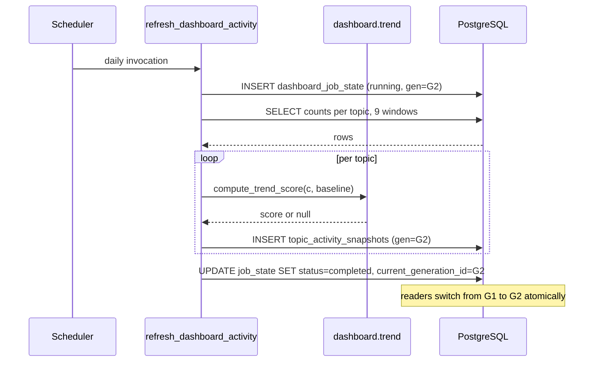
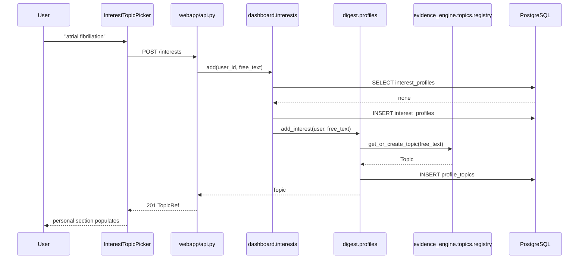

# Trending and Dashboard Widgets

Status: Draft for user review
Scope: Sub-project C of the Athena rendered frontend
Depends on: Sub-project A (frontend shell), `evidence_engine` `ChangeEvent` stream, `digest` interest-profile model, PostgreSQL

## 1. Executive Summary

Sub-project C adds the platform's first landing surface: a Dashboard route that answers "what should I look at right now?" before the user has typed a query.

It ships two dashboards behind one route:

- **Global dashboard** — works with zero personalization. Shows the most active tracked topics over the last 7 days and a platform-wide "what changed today" feed. This is the cold-start experience and the default for every first-time visitor.
- **Personal dashboard** — shown once a user has declared at least one interest topic. Adds a per-topic change summary scoped to those interests, plus the user's saved searches.

The audience is the same anonymous researcher from sub-project A, plus returning users who have accumulated interests and saved searches.

The concrete outcome is that a returning user landing on `/#/dashboard` sees, without typing anything, the topics with the most new evidence this week, a dated list of what changed, and a one-click path into the existing Search and Topic Detail pages for each item.

Two things this sub-project deliberately does **not** do, despite appearing in the reference design: it produces no LLM-written "Weekly Research Blurb" (that narrative capability is sub-project B), and it shows no citation-velocity sparklines (that data does not exist yet; it is sub-project D). C is built entirely from `ChangeEvent` rows the evidence engine already writes.

## 2. Repository Evidence

| Item | Classification | Source | Relevance |
|---|---|---|---|
| Frontend-shell non-goal: "Trending topics, 'Weekly Research Blurb,' or any dashboard page (sub-project C)" | [EXISTING] | `docs/superpowers/specs/2026-07-05-frontend-shell-design.md:98` | Establishes C's scope boundary |
| Web-search-UI non-goal: "Cross-topic trending visualizations" | [EXISTING] | `docs/superpowers/specs/2026-07-04-web-search-ui-design.md:98` | Trending was explicitly deferred, not forgotten; C is where it lands |
| Web-search-UI scope: "Cross-topic trending is deferred" | [EXISTING] | `docs/superpowers/specs/2026-07-04-web-search-ui-design.md:27` | Same, at the scope-decision level |
| `ChangeEvent(topic_id, paper_id, event_type, detected_at)` | [EXISTING] | `evidence_engine/db/models.py:111-118` | The sole signal source for every C widget |
| `ChangeEventType` = `new_paper`, `consensus_updated`, `contradiction_flagged`, `paper_retracted` | [EXISTING] | `evidence_engine/db/models.py:31-35` | The event taxonomy C aggregates over |
| `record_change_event` writes one row per detected change | [EXISTING] | `evidence_engine/orchestrator/change_events.py:6` | Confirms events are append-only and engine-owned |
| Engine spec: `ChangeEvent` "Feeds 'what changed today' and trending-topic detection" | [EXISTING] | `docs/superpowers/specs/2026-07-03-evidence-engine-design.md:50` | The engine was designed with C in mind |
| Digest spec: reusable change-aggregation core built, "only the **weekly** digest is wired to it" | [EXISTING] | `docs/superpowers/specs/2026-07-04-interest-digest-design.md:25` | The intended reuse path for a personal feed |
| `aggregate_changes_for_user(session, user, window_start, window_end)` | [EXISTING] | `digest/aggregate.py:40` | The reusable core itself |
| `aggregate_changes_for_user` calls `list_interests(session, user)` | [EXISTING] | `digest/aggregate.py:43` | Couples the core to an interest profile |
| `list_interests` calls `_get_profile` | [EXISTING] | `digest/profiles.py:61` | Same coupling, one level down |
| `_get_profile` uses `.scalar_one()` | [EXISTING] | `digest/profiles.py:31-34` | **Raises `NoResultFound` when the user has no `InterestProfile`** |
| `create_anonymous_user` creates only a `User` row, no `InterestProfile` | [EXISTING] | `digest/profiles.py:23-28` | Every sub-project-A user lacks a profile |
| Consequence: `aggregate_changes_for_user` raises for every anonymous user | [INFERRED] | Composition of `digest/aggregate.py:43` → `digest/profiles.py:61` → `digest/profiles.py:34` | C cannot reuse the digest core for anonymous users without first resolving OQ-C-001 |
| `select_due_users` catches `NoResultFound` from `list_interests` and skips, commented "Frontend-only anonymous users intentionally have no digest profile" | [EXISTING] | `digest/runner.py:31-35` | **The digest runner's only defense against emailing anonymous users is the absence of an `InterestProfile`** |
| `get_delivery_preference` uses `.scalar_one()` | [EXISTING] | `digest/profiles.py:74-77` | Raises `NoResultFound` when the user has no `DeliveryPreference` |
| `get_delivery_preference` is called at `digest/runner.py:38`, **outside** the `try` block that begins at `digest/runner.py:39` | [EXISTING] | `digest/runner.py:38-42` | An exception from it is not caught and propagates out of `select_due_users` |
| Hazard: giving an anonymous user an `InterestProfile` + a `ProfileTopic` but no `DeliveryPreference` makes `select_due_users` raise uncaught, breaking the weekly digest run **for every user** | [INFERRED] | Composition of `digest/runner.py:31-38` → `digest/profiles.py:77`; the user passes the `list_interests` guard, passes the empty-interests guard, then hits the unguarded `.scalar_one()` | This is the single highest-severity constraint on C's design; it drives OQ-C-001 |
| `change_timeline(session, topic_id, window_start, window_end)` buckets events by day and type for **one** topic | [EXISTING] | `webapp/visualizations.py:44` | Per-topic aggregation exists; cross-topic aggregation does not |
| `GET /topics/{topic_id}/timeline` | [EXISTING] | `webapp/api.py:199` | The existing single-topic endpoint C's drill-down links to |
| `GET /topics` returns `[{id, canonical_label}]` sorted by label | [EXISTING] | `webapp/api.py:185` | Topic labels for widget rendering |
| `InterestProfile` / `ProfileTopic` with unique `(profile_id, topic_id)` | [EXISTING] | `digest/models.py:37-52` | The personalization substrate |
| `add_interest(session, user, free_text)` resolves free text to a `Topic` | [EXISTING] | `digest/profiles.py` (function present alongside `list_interests`) | The write path a topic-picker UI would call |
| `SavedSearch(user_id, name, query_params, last_run_at)` | [EXISTING] | `webapp/models.py:32-40` | Powers the saved-searches widget with no new backend |
| `GET /saved-searches?user_id=` | [EXISTING] | `webapp/api.py:146` | Existing endpoint the widget reuses verbatim |
| `useSavedSearches(userId)` with `enabled: userId !== null` | [EXISTING] | `webapp/frontend/src/api/hooks.ts:8` | Existing hook the widget reuses verbatim |
| `IconSidebar` nav items are Search / Compare / Saved searches | [EXISTING] | `webapp/frontend/src/components/IconSidebar.tsx` | C must add a Dashboard destination here |
| Route table with `/` redirecting to `/search` | [EXISTING] | `webapp/frontend/src/App.tsx:14` | C changes the default landing route |
| `app.mount("/", StaticFiles(...))` is the final statement of `webapp/api.py` | [EXISTING] | `webapp/api.py:212` | New routes MUST be declared above it |
| `process_all_topics` loops topics, isolating per-topic failure with rollback | [EXISTING] | `scripts/run_daily_cycle.py:16-37` | The scheduled-job idiom C's snapshot job follows |
| `SearchIndexSyncState` single-row watermark table | [EXISTING] | `webapp/models.py:25` | Precedent for a job-state table |
| Recharts 3.x is already a dependency | [EXISTING] | `webapp/frontend/package.json` dependencies | Charting for widgets needs no new package |
| Alembic head `5d7c21d9f44e` | [EXISTING] | `alembic/versions/5d7c21d9f44e_enterprise_api_tables.py:15` | C's migration chains from here (or from B's, if B lands first) |
| No table stores cross-topic aggregates | [INFERRED] | Absence across `evidence_engine/db/models.py`, `webapp/models.py`, `digest/models.py`, `enterprise_api/models.py` | C must create its own snapshot table |

## 3. Goals

- G-C-1: A first-time visitor with no interests and no saved searches sees a populated dashboard containing at least the global activity widget and the global change feed, with no empty-state placeholder occupying the primary content area.
- G-C-2: The most-active-topics widget renders in under 400 ms p95, because it reads precomputed snapshot rows rather than aggregating `change_events` at request time.
- G-C-3: Every topic shown in an activity widget displays its raw event count for the window, not only a derived score or percentage.
- G-C-4: A topic with fewer than 5 change events in the current window never appears in the most-active list.
- G-C-5: A topic tracked for fewer than 8 complete weeks is labeled "newly tracked" and shows no change-versus-baseline figure.
- G-C-6: Every widget row links to an existing sub-project-A destination (`/#/topics/:id` or `/#/search?topic_id=`), so the dashboard adds no dead ends.
- G-C-7: A user with at least one interest topic additionally sees a personal change summary covering exactly those topics.
- G-C-8: Dashboard aggregates are refreshed once per day by a scheduled job and display the timestamp of the data they reflect.

## 4. Non-Goals

- LLM-written narrative of any kind, including the reference design's "Weekly Research Blurb". That is sub-project B's capability; C displays counts and lists only.
- Citation-velocity sparklines on any widget. The underlying time series does not exist; that is sub-project D.
- Real-time or streaming updates. Aggregates refresh daily.
- User-arrangeable widget layout (drag-and-drop, per-user widget ordering).
- Email delivery of dashboard content. The weekly digest already covers scheduled delivery (`digest/runner.py`).
- Authenticated multi-device personalization. Personalization is bound to the browser's `localStorage` identity from sub-project A.
- Trending detection over anything other than `ChangeEvent` rows — no citation trends, no search-query trends, no click trends.
- Topic discovery/recommendation ("topics you might like"). C shows what is active, not what a user should care about.

## 5. User Roles and Permissions

### Anonymous visitor without interests (cold start)

- **Read**: MAY read all global widgets. Global aggregates are derived from public bibliographic activity and contain no user data. [PROPOSED]
- **Write**: MAY create an interest via the topic picker, which transitions them to the next role. [PROPOSED]
- **Sharing**: none in C.
- **Retention**: no user-linked dashboard data is written for this role.
- **Failure when absent**: if `useIdentity()` has not resolved, global widgets still render; personal widgets are not requested at all. The dashboard never blocks on identity — this mirrors sub-project A, where Search and Compare function without identity while saved searches do not (`webapp/frontend/src/api/hooks.ts:8`, `enabled: userId !== null`).

### Anonymous visitor with interests

- **Read**: MAY read global widgets plus a personal change summary restricted to their own `ProfileTopic` rows, and their own saved searches.
- **Write**: MAY add and remove interests.
- **Sharing**: none in C.
- **Retention**: `InterestProfile` and `ProfileTopic` rows persist until the user removes them. Because identity is a `localStorage` UUID (`webapp/frontend/src/identity/identity.tsx:3`), clearing browser storage orphans the rows rather than deleting them. Orphan cleanup is deferred to sub-project E, which owns deletion.
- **Failure when absent**: requesting a personal widget with a `user_id` that has no `InterestProfile` MUST return an empty personal payload, not a 500. This requirement exists specifically because the current code path raises (`digest/profiles.py:34`).

### Enterprise organization (service role)

- **Read**: no dashboard access in v1. The enterprise surface is a query API, and its spec scopes it to search, comparison, and visualizations (`docs/superpowers/specs/2026-07-05-enterprise-api-design.md:24`).
- **Write / sharing / retention**: not applicable.
- **Failure when absent**: unchanged `401`/`403`/`429` behavior.

### Scheduled job (service role)

- **Read**: reads `change_events`, `topics`, `papers`, `scores`.
- **Write**: writes only `topic_activity_snapshots` and `dashboard_job_state`.
- **Sharing**: not applicable.
- **Retention**: snapshot rows retained 180 days (§11).
- **Failure when absent**: if the job has never run, every activity widget renders its "not yet computed" state rather than falling back to an expensive live aggregation.

## 6. User Stories

**US-C-001 — Primary: cold-start global dashboard**
Actor: First-time anonymous visitor
Precondition: No interests, no saved searches; the snapshot job has run at least once.
Trigger: Visitor loads the application root.
Main flow: App redirects to `/#/dashboard` → global widgets request precomputed snapshots → personal widgets are not requested because no interests exist.
Expected result: "Most active topics (last 7 days)" lists up to 10 topics with raw counts; "What changed" lists the 20 most recent platform-wide events grouped by day; an invitation card offers "Add a topic to personalize this page."
Failure result: See US-C-006.
Acceptance criteria: No empty-state placeholder occupies the main column; every listed topic links to `/#/topics/:id`; the data-as-of timestamp is visible.

**US-C-002 — Personalized dashboard**
Actor: Anonymous visitor with 3 interest topics
Precondition: `InterestProfile` exists with 3 `ProfileTopic` rows; snapshot job has run.
Trigger: Visitor loads `/#/dashboard`.
Main flow: Global widgets load as in US-C-001; the personal widget requests changes scoped to the user's topics for the last 7 days; the saved-searches widget reuses `GET /saved-searches`.
Expected result: A "Your topics" section lists each of the 3 topics with its event count and most recent event type; topics with zero events in the window are listed with "No change this week" rather than omitted.
Failure result: If the user's profile is missing, the personal section renders its zero-interest invitation instead of erroring.
Acceptance criteria: Exactly 3 topics listed; a zero-event topic is present and labeled; saved searches appear with their `last_run_at`.

**US-C-003 — Empty state: no activity anywhere**
Actor: Anonymous visitor on a freshly seeded instance
Precondition: Snapshot job has run but no topic met the 5-event minimum.
Trigger: Dashboard load.
Main flow: Global activity widget receives an empty list.
Expected result: The widget renders "No topic has enough recent activity to rank yet." plus the eligibility rule ("at least 5 changes in 7 days"), and the "What changed" feed still renders whatever events exist.
Failure result: Not applicable.
Acceptance criteria: The threshold is stated numerically in the UI; the widget is not hidden, so the user understands the rule rather than seeing a blank region.

**US-C-004 — Cold start: job has never run**
Actor: Anonymous visitor immediately after deployment
Precondition: `dashboard_job_state` has no row.
Trigger: Dashboard load.
Main flow: The activity endpoint detects no completed run and returns `computed_at: null` with an empty list.
Expected result: Activity widget shows "Activity rankings are being computed. Check back after the next daily update."
Failure result: Not applicable.
Acceptance criteria: The endpoint returns HTTP 200, never 404 or 503; no request-time aggregation over `change_events` is attempted.

**US-C-005 — Loading state**
Actor: Any visitor
Precondition: None.
Trigger: Dashboard mount.
Main flow: Three widget queries run in parallel.
Expected result: Each widget renders its own skeleton independently; a slow personal widget never delays the global ones.
Failure result: Any widget that fails renders its own error notice without unmounting siblings.
Acceptance criteria: Widgets resolve independently, verified by a test in which one MSW handler delays 2 s while others resolve immediately and the fast widgets are asserted present.

**US-C-006 — Upstream failure: database error on one widget**
Actor: Any visitor
Precondition: The activity query fails.
Trigger: Dashboard mount.
Main flow: That widget's request returns 500; siblings succeed.
Expected result: The failing widget shows "Couldn't load activity rankings." with a Retry button; the change feed and personal section render normally.
Failure result: Retry re-issues only that widget's query.
Acceptance criteria: The page contains both a failed widget and successful widgets simultaneously; no full-page error boundary is triggered.

**US-C-007 — Stale data**
Actor: Any visitor
Precondition: The snapshot job last succeeded 50 hours ago (two missed runs).
Trigger: Dashboard load.
Main flow: The endpoint returns the last snapshot with its true `computed_at`; the frontend compares it against now.
Expected result: Widgets render the stale data with an amber banner "Activity data is from 2 days ago."
Failure result: Not applicable.
Acceptance criteria: The banner appears only when `computed_at` is older than 36 hours; the underlying data still renders.

**US-C-008 — Newly tracked topic**
Actor: Any visitor
Precondition: A topic has 14 events this week but only 3 weeks of tracking history.
Trigger: Dashboard load.
Main flow: The snapshot job computes eligibility, finds insufficient baseline history, and stores `baseline_weeks = 3` with `trend_score = null`.
Expected result: The topic appears in the activity list ranked by raw count, badged "Newly tracked", with no change-versus-baseline figure.
Failure result: Not applicable.
Acceptance criteria: No percentage or ratio is displayed for that row; the badge is present.

**US-C-009 — Invalid input**
Actor: Crafted request
Precondition: None.
Trigger: `GET /dashboard/activity?window_days=400` or `?limit=500`.
Main flow: Pydantic/FastAPI validation rejects out-of-range values.
Expected result: HTTP 422 with a field-level message.
Failure result: Not applicable.
Acceptance criteria: 422 returned; no query executed.

**US-C-010 — Authorization failure (personal widget, foreign user)**
Actor: Crafted request
Precondition: A valid `user_id` belonging to a different browser identity.
Trigger: `GET /dashboard/personal?user_id=<other-uuid>`.
Main flow: The endpoint serves the requested user's data because the platform has no authentication.
Expected result: Data is returned.
Failure result: Not applicable in v1.
Acceptance criteria: This is documented as accepted risk, not a defect — it exactly matches the existing behavior of `GET /saved-searches?user_id=` (`webapp/api.py:146`), which any caller can query for any UUID. Closing it requires authentication, which is a separate backlog item. See §15.

**US-C-011 — Adding a first interest**
Actor: Anonymous visitor with no profile
Precondition: `User` row exists (created by sub-project A); no `InterestProfile`.
Trigger: Visitor types "atrial fibrillation" into the dashboard's topic picker and submits.
Main flow: Frontend posts the interest → backend ensures an `InterestProfile` exists for the user, then resolves the free text to a `Topic` and creates a `ProfileTopic`.
Expected result: The personal section appears immediately, populated for that topic.
Failure result: If the text cannot be resolved to a topic, HTTP 422 with the resolver's message; the picker shows it inline and retains the input.
Acceptance criteria: A user created by `create_anonymous_user` (which writes no profile, `digest/profiles.py:23`) can add an interest without a 500. This story is the reason OQ-C-001 must be answered before implementation.

## 7. Functional Requirements

**FR-C-001**: The system MUST expose `GET /dashboard/activity` returning precomputed topic-activity rankings for a fixed 7-day window, including each topic's raw event count.
- Classification: [PROPOSED]
- Rationale: G-C-2, G-C-3; no cross-topic aggregate endpoint exists (`webapp/visualizations.py:44` is single-topic).
- Inputs: optional `limit` (1–25, default 10).
- Outputs: `ActivityResponse` (§12).
- Failure behavior: no completed job run → 200 with `computed_at: null` and an empty list.
- Acceptance test: `test_activity_endpoint_returns_ranked_topics_with_counts`.

**FR-C-002**: The activity ranking MUST exclude any topic with fewer than 5 change events in the window.
- Classification: [PROPOSED]
- Rationale: G-C-4; ranking a topic on 1–2 events produces noise indistinguishable from ingestion jitter.
- Inputs: per-topic window event count.
- Outputs: filtered ranking.
- Failure behavior: if every topic is below threshold, the list is empty and the UI states the rule (US-C-003).
- Acceptance test: `test_topic_with_four_events_is_excluded_from_ranking`.

**FR-C-003**: A topic with fewer than 8 complete weeks of tracking history MUST be ranked by raw event count with `trend_score = null` and MUST be flagged `is_newly_tracked = true`.
- Classification: [PROPOSED]
- Rationale: G-C-5; a ratio against a near-zero baseline manufactures enormous, meaningless multipliers.
- Inputs: `Topic` history depth derived from its earliest `ChangeEvent`.
- Outputs: `trend_score`, `is_newly_tracked`.
- Failure behavior: none.
- Acceptance test: `test_topic_with_three_weeks_history_has_null_trend_score`.

**FR-C-004**: The activity widget MUST display each topic's raw event count and MUST NOT display a percentage change for any topic whose `trend_score` is null.
- Classification: [PROPOSED]
- Rationale: G-C-3; prevents the widget from implying a comparison the data cannot support.
- Inputs: `ActivityResponse` rows.
- Outputs: rendered rows.
- Failure behavior: none.
- Acceptance test: `test_newly_tracked_row_renders_no_percentage`.

**FR-C-005**: The system MUST expose `GET /dashboard/changes` returning the most recent change events across all topics, grouped by calendar day, hydrated with topic label and paper title.
- Classification: [PROPOSED]
- Rationale: The reference design's "What changed today" panel; `change_timeline` (`webapp/visualizations.py:44`) returns bare counts for one topic and cannot populate a feed.
- Inputs: optional `limit` (1–50, default 20), optional `days` (1–30, default 7).
- Outputs: `ChangeFeedResponse` (§12).
- Failure behavior: no events in range → 200 with an empty `days` array.
- Acceptance test: `test_change_feed_groups_events_by_day_descending`.

**FR-C-006**: The change feed MUST exclude events whose `paper_id` references a paper with `is_retracted = true`, **except** events of type `paper_retracted`, which MUST be included and visually distinguished.
- Classification: [INFERRED] — the engine excludes retracted papers from consensus grounding (`evidence_engine/consensus/synthesizer.py:34`) and search excludes them by default (`webapp/search.py:20`, `include_retracted: bool = False`), while the digest surfaces retraction as a first-class change type (`docs/superpowers/specs/2026-07-04-interest-digest-design.md:72`). The feed must do both: hide stale positive signals about a retracted paper, but announce the retraction itself.
- Inputs: `Paper.is_retracted`, `ChangeEvent.event_type`.
- Outputs: filtered feed.
- Failure behavior: none.
- Acceptance test: `test_new_paper_event_for_retracted_paper_hidden_but_retraction_event_shown`.

**FR-C-007**: The system MUST expose `GET /dashboard/personal?user_id=` returning per-topic change counts for exactly the user's interest topics, and MUST return an empty result rather than an error when the user has no `InterestProfile`.
- Classification: [PROPOSED] — required because the existing path raises `NoResultFound` (`digest/profiles.py:34`) for every user created by `create_anonymous_user` (`digest/profiles.py:23`).
- Rationale: G-C-7, US-C-011.
- Inputs: `user_id` UUID, optional `days` (1–30, default 7).
- Outputs: `PersonalDashboardResponse` (§12).
- Failure behavior: unknown `user_id` → 404, matching `_require_user` at `webapp/api.py:126`. Known user without profile → 200 with `topics: []` and `has_profile: false`.
- Acceptance test: `test_personal_endpoint_returns_empty_for_user_without_profile`.

**FR-C-008**: The personal response MUST include the user's interest topics that had zero events in the window, marked with a zero count.
- Classification: [PROPOSED]
- Rationale: US-C-002; the digest deliberately omits unchanged topics because an email should be short (`docs/superpowers/specs/2026-07-04-interest-digest-design.md:23`), but a dashboard listing only changed topics would make a user think a topic had been dropped.
- Inputs: user's `ProfileTopic` rows; window event counts.
- Outputs: complete topic list with counts.
- Failure behavior: none.
- Acceptance test: `test_personal_response_includes_zero_change_topics`.

**FR-C-009**: A scheduled job MUST recompute `topic_activity_snapshots` once per day and record its outcome in `dashboard_job_state`.
- Classification: [PROPOSED]
- Rationale: G-C-2, G-C-8.
- Inputs: `change_events` over the trailing 63 days (current week + 8 baseline weeks).
- Outputs: one snapshot row per eligible topic; one job-state row.
- Failure behavior: per-topic failure is isolated and logged; the job continues, mirroring `scripts/run_daily_cycle.py:33-35`. A wholly failed run leaves the prior snapshot generation intact.
- Acceptance test: `test_snapshot_job_isolates_per_topic_failure_and_completes`.

**FR-C-010**: The activity endpoint MUST serve only the most recent completed snapshot generation and MUST NOT read a partially written generation.
- Classification: [PROPOSED]
- Rationale: Without this, a dashboard loaded mid-job shows a half-ranked list.
- Inputs: `dashboard_job_state.current_generation_id`.
- Outputs: rows filtered to that generation.
- Failure behavior: if no generation has completed, behave as FR-C-001's failure case.
- Acceptance test: `test_in_progress_generation_is_not_served`.

**FR-C-011**: Every response from the activity and personal endpoints MUST include `computed_at`, and the UI MUST display a staleness banner when it is older than 36 hours.
- Classification: [PROPOSED]
- Rationale: G-C-8, US-C-007; a daily job that silently stops would otherwise present week-old rankings as current.
- Inputs: `dashboard_job_state.completed_at`.
- Outputs: `computed_at` field; conditional banner.
- Failure behavior: null `computed_at` renders the cold-start message instead of the banner.
- Acceptance test: `test_staleness_banner_appears_beyond_36_hours`.

**FR-C-012**: Every ranked topic row and every change-feed row MUST link to an existing route: `/#/topics/:id` for topics and `/#/topics/:id` for paper events (papers have no detail route in sub-project A).
- Classification: [INFERRED] — the route table at `webapp/frontend/src/App.tsx:14` defines exactly four destinations and contains no paper-detail route, so a paper-scoped link would 404 within the SPA.
- Rationale: G-C-6.
- Inputs: topic and paper IDs.
- Outputs: `<Link>` targets.
- Failure behavior: none.
- Acceptance test: `test_every_feed_row_links_to_an_existing_route`.

**FR-C-013**: The system MUST expose `POST /interests` and `DELETE /interests/{topic_id}` for managing a user's interest topics, creating the `InterestProfile` on first use.
- Classification: [PROPOSED]
- Rationale: US-C-011; `add_interest`/`remove_interest` exist in `digest/profiles.py` but no HTTP route reaches them, so there is no way for a browser user to declare an interest.
- Inputs: `{user_id, free_text}` / path `topic_id` plus `user_id`.
- Outputs: created `TopicRef`, or 204 on delete.
- Failure behavior: unresolvable free text → 422 carrying the resolver's message (the registry raises `ValueError`, per `docs/superpowers/specs/2026-07-04-interest-digest-design.md:70`); unknown user → 404.
- Acceptance test: `test_first_interest_creates_profile_then_topic`.

**FR-C-014**: The dashboard MUST become the application's default route, with `/` redirecting to `/#/dashboard`.
- Classification: [PROPOSED] — replaces the current redirect to `/search` at `webapp/frontend/src/App.tsx:14`.
- Rationale: A dashboard that is not the landing page is not a dashboard.
- Inputs: none.
- Outputs: route table change.
- Failure behavior: the existing `/#/search` route remains valid and directly reachable, so all sub-project-A links and the Playwright smoke test continue to work.
- Acceptance test: `test_root_redirects_to_dashboard`; plus the existing sub-project-A E2E flow must be updated to navigate explicitly to `/#/search`.

**FR-C-015**: Activity widget copy MUST use the term "most active" and MUST NOT use "trending", "hot", "breakthrough", "important", or "popular".
- Classification: [PROPOSED]
- Rationale: The metric counts ingestion and change events. A large batch of newly indexed papers raises activity without any scientific development having occurred; "trending" and "breakthrough" assert something the data cannot support.
- Inputs: none.
- Outputs: UI copy.
- Failure behavior: none.
- Acceptance test: `test_activity_widget_copy_avoids_prohibited_terms`.

**FR-C-016**: The activity widget MUST render a tooltip explaining that the ranking reflects volume of newly indexed and changed evidence, not scientific significance.
- Classification: [PROPOSED]
- Rationale: Same as FR-C-015; the disclaimer must be reachable, not only implied by wording.
- Inputs: none.
- Outputs: tooltip text.
- Failure behavior: none.
- Acceptance test: `test_activity_tooltip_states_volume_not_significance`.

**FR-C-017**: Dashboard endpoints MUST NOT write to `change_events`, `topics`, `papers`, `scores`, or `consensus_snapshots`.
- Classification: [EXISTING] — the platform's downstream-consumer rule. Source: `docs/superpowers/specs/2026-07-04-interest-digest-design.md:20`; Source: `docs/superpowers/specs/2026-07-05-enterprise-api-design.md:39`.
- Rationale: Preserves one-directional data flow.
- Inputs: none.
- Outputs: none.
- Failure behavior: a test asserting no writes fails the build.
- Acceptance test: `test_dashboard_endpoints_perform_no_engine_writes`.

## 8. Information Architecture and UX

### Routes

| Route | Status | Purpose |
|---|---|---|
| `/#/dashboard` | New | Global + personal widgets |
| `/` | Changed | Redirects to `/#/dashboard` instead of `/#/search` |
| `/#/search`, `/#/compare`, `/#/saved-searches`, `/#/topics/:id` | Unchanged | Existing sub-project-A routes |

### Entry points

- Application root (automatic redirect).
- New Dashboard icon in `IconSidebar`, placed first, above Search.
- No deep links into individual widgets in v1.

### Navigation changes

`IconSidebar` gains a `dashboard` Material Symbol as its first item. The existing three items keep their order and targets. The sidebar's active-state and `aria-label` conventions are unchanged.

### Page and component hierarchy

```
DashboardPage                              [new]
├── StalenessBanner                        [new]   conditional
├── GlobalSection
│   ├── ActivityWidget                     [new]
│   │   ├── ActivityRow × ≤10              [new]
│   │   └── ActivityEmptyState             [new]
│   └── ChangeFeedWidget                   [new]
│       ├── ChangeDayGroup × N             [new]
│       │   └── ChangeFeedRow × M          [new]
│       └── ChangeFeedEmptyState           [new]
├── PersonalSection                        [new]
│   ├── InterestTopicPicker                [new]
│   ├── PersonalTopicRow × N               [new]
│   ├── PersonalInvitationCard             [new]   when no profile
│   └── SavedSearchesWidget                [new]   wraps existing useSavedSearches
└── WidgetErrorNotice                      [new]   per-widget, reusable
```

### Desktop wireframe (≥ 1024 px)

```
┌────────────────────────────────────────────────────────────────────┐
│ Dashboard                          Data as of 2026-08-02 04:10 UTC │
├──────────────────────────────────────┬─────────────────────────────┤
│ MOST ACTIVE TOPICS · LAST 7 DAYS  ⓘ  │ YOUR TOPICS                 │
│                                      │                             │
│  1  Atrial fibrillation        24 ▲  │  Atrial fibrillation     12 │
│  2  GLP-1 receptor agonists    19 ▲  │  Sepsis biomarkers        0 │
│  3  Sepsis biomarkers          11    │     No change this week     │
│  4  Long COVID sequelae         9 ⊙  │  Long COVID sequelae      4 │
│        ⊙ Newly tracked               │                             │
│  5  Microplastic exposure       6    │  [ + Add a topic          ] │
│                                      ├─────────────────────────────┤
│  Ranked by volume of newly indexed   │ SAVED SEARCHES              │
│  and changed evidence.               │  Hematology ML    ran 3d ago│
├──────────────────────────────────────┤  UBI outcomes     never run │
│ WHAT CHANGED                         │                             │
│                                      │                             │
│ Friday 1 August                      │                             │
│  • New paper · Atrial fibrillation   │                             │
│    “Anticoagulation in adults ov…”   │                             │
│  • Consensus updated · Sepsis bio…   │                             │
│  • ⚠ Retracted · GLP-1 receptor a…   │                             │
│                                      │                             │
│ Thursday 31 July                     │                             │
│  • New paper · Long COVID sequelae   │                             │
└──────────────────────────────────────┴─────────────────────────────┘
```

The left column is 8 of 12 grid columns and the right is 4, matching the 12-column desktop grid the design system specifies and the 1200 px content cap already applied by the shell (`webapp/frontend/src/App.tsx:14`, `max-w-[1200px]`).

### Mobile behavior (< 768 px)

At the shell's existing `max-md` breakpoint:

- The two columns stack: Activity → Your topics → What changed → Saved searches. Personal content is placed above the global feed because a returning mobile user's own topics are the higher-value content in a narrow viewport.
- The change feed truncates to 10 rows with a "Show more" button rather than paginating.
- The staleness banner remains pinned above all widgets.
- Topic rows remain single-line with the count right-aligned; the "Newly tracked" badge wraps beneath the label rather than truncating the topic name.

### State matrix

| State | Trigger | Rendering |
|---|---|---|
| Cold start (job never ran) | `computed_at: null` | "Activity rankings are being computed. Check back after the next daily update." |
| Empty ranking | Job ran, no topic ≥ 5 events | "No topic has enough recent activity to rank yet. Ranking requires at least 5 changes in 7 days." |
| Loading | Query pending | Per-widget skeleton rows, `aria-busy="true"` |
| Loaded | Data present | Full widget |
| Stale | `computed_at` older than 36 h | Amber banner "Activity data is from N days ago." above all widgets |
| Partial | One widget errors | That widget shows `WidgetErrorNotice` with Retry; siblings render normally |
| No profile | `has_profile: false` | `PersonalInvitationCard`: "Add a topic to personalize this page." |
| Profile, no matching events | All topics zero | Topics listed with "No change this week" |
| No saved searches | Empty array | "Nothing saved yet — run a search and use Save search." (mirrors sub-project A's existing empty copy in `SavedSearchesPage.tsx`) |
| Identity unresolved | `userId === null` | Personal section shows the invitation card; no personal request is issued |

### Accessibility requirements

- Each widget is a `<section aria-labelledby>` with a visible heading, so screen-reader users can navigate by landmark and heading.
- The activity ranking is an ordered list (`<ol>`), because rank order carries meaning.
- The change feed uses `<h3>` per day group with a nested `<ul>`, so the day grouping is conveyed structurally rather than by visual spacing alone.
- The "▲" trend indicator is decorative (`aria-hidden="true"`); the accessible content is the numeric count and, where present, the change figure as text.
- The "Newly tracked" badge is text, not a color-only marker.
- The staleness banner uses `role="status"` (polite), not `role="alert"`, because stale data is informational rather than urgent.
- Skeletons set `aria-busy="true"` on their container and announce once via a single `aria-live="polite"` region per widget.
- All Material Symbols spans carry `aria-hidden="true"` — the same defect class found and fixed in sub-project A's `IconSidebar.tsx` and `CompareTray.tsx` reviews.
- The topic picker input has a visible `<label>`, not placeholder-only labeling.

### User-facing terminology

| Use | Never use |
|---|---|
| "Most active topics" | "Trending", "Hot", "Popular", "Breakthrough" |
| "Changes" / "What changed" | "Updates" (ambiguous with software updates) |
| "Newly tracked" | "New topic" (the topic may be old; our tracking is new) |
| "No change this week" | "Nothing found", "No results" |
| "Data as of {timestamp}" | "Live", "Real-time", "Up to date" |
| "Volume of newly indexed and changed evidence" | "Research momentum", "Scientific activity" |

## 9. System Architecture

### New Python package: `dashboard/`

A sibling package alongside `evidence_engine/`, `digest/`, `webapp/`, `enterprise_api/`, following the established one-package-per-sub-project convention (`docs/superpowers/specs/2026-07-04-interest-digest-design.md:32`).

- `dashboard/models.py` — `TopicActivitySnapshot`, `DashboardJobState`.
- `dashboard/activity.py` — `compute_activity_snapshots(session, as_of)` (job side) and `read_activity_ranking(session, limit)` (request side).
- `dashboard/changes.py` — `global_change_feed(session, days, limit)`; hydrates events with topic labels and paper titles.
- `dashboard/personal.py` — `personal_topic_summary(session, user, days)`; the profile-tolerant replacement for the raise-prone path.
- `dashboard/interests.py` — `ensure_profile(session, user)` wrapping `digest.profiles.add_interest`/`remove_interest`.
- `dashboard/trend.py` — the scoring formula in §14.1, pure and independently testable.

### HTTP endpoints (added to `webapp/api.py`, **above** the `StaticFiles` mount at `webapp/api.py:212`)

`GET /dashboard/activity`, `GET /dashboard/changes`, `GET /dashboard/personal`, `POST /interests`, `DELETE /interests/{topic_id}`.

### Frontend additions

- `src/pages/DashboardPage.tsx`
- `src/components/ActivityWidget.tsx`, `ChangeFeedWidget.tsx`, `PersonalTopicsWidget.tsx`, `SavedSearchesWidget.tsx`, `InterestTopicPicker.tsx`, `StalenessBanner.tsx`, `WidgetErrorNotice.tsx`
- `src/api/types.ts`, `src/api/hooks.ts` additions
- `src/App.tsx` route + redirect change; `src/components/IconSidebar.tsx` nav item

### Background jobs

`scripts/refresh_dashboard_activity.py` — daily, after `run_daily_cycle.py` so it consumes the same day's events. Follows the per-item isolation idiom of `scripts/run_daily_cycle.py:16-37`.

### Database ownership

`dashboard/` owns `topic_activity_snapshots` and `dashboard_job_state` exclusively. It reads `change_events`, `topics`, `papers`, `scores`, `profile_topics`, `interest_profiles`, `saved_searches` and writes none of them. Interest writes go through `digest.profiles`, which owns `interest_profiles` and `profile_topics`.

### External providers

None. C makes no outbound calls.

### Caching

Server-side: the snapshot table is the cache; the request path performs no aggregation. Client-side: TanStack Query with `staleTime` of 15 minutes for activity and personal widgets, 5 minutes for the change feed.

### Idempotency

The snapshot job is idempotent per `(generation_id, topic_id)` and writes a fresh generation each run rather than mutating rows, so a re-run after partial failure produces a clean generation. `POST /interests` is idempotent via the existing unique constraint on `(profile_id, topic_id)` (`digest/models.py:47`) — a duplicate add returns the existing topic with 200 rather than erroring.

### Observability

Structured logs plus the `dashboard_job_state` table (§18).

```mermaid
graph TD
  subgraph Frontend
    DP[DashboardPage]
    AW[ActivityWidget]
    CW[ChangeFeedWidget]
    PW[PersonalTopicsWidget]
    SW[SavedSearchesWidget]
  end

  subgraph webapp_api
    E1[GET /dashboard/activity]
    E2[GET /dashboard/changes]
    E3[GET /dashboard/personal]
    E4[POST /interests]
    E5[GET /saved-searches]
  end

  subgraph dashboard_pkg
    ACT[activity]
    CHG[changes]
    PER[personal]
    INT[interests]
    TRD[trend]
  end

  subgraph digest_pkg
    PROF[profiles]
  end

  subgraph Engine[(evidence_engine tables)]
    CE[(change_events)]
    TP[(topics)]
    PA[(papers)]
  end

  subgraph Owned[(dashboard tables)]
    TAS[(topic_activity_snapshots)]
    DJS[(dashboard_job_state)]
  end

  JOB[scripts/refresh_dashboard_activity.py]

  DP --> AW --> E1 --> ACT --> TAS
  ACT --> DJS
  DP --> CW --> E2 --> CHG --> CE
  CHG --> TP
  CHG --> PA
  DP --> PW --> E3 --> PER --> PROF
  PER --> CE
  DP --> PW --> E4 --> INT --> PROF
  DP --> SW --> E5
  JOB --> TRD
  JOB --> CE
  JOB --> TAS
  JOB --> DJS
```

## 10. Data Flow

### Operation 1 — Daily snapshot computation (scheduler-triggered)

1. **Trigger**: cron invokes `scripts/refresh_dashboard_activity.py` after the engine's daily cycle.
2. **Frontend action**: none.
3. **HTTP request**: none.
4. **Validation**: the job asserts `as_of` is timezone-naive UTC, matching the `datetime.utcnow` convention used throughout the models (`evidence_engine/db/models.py:118`).
5. **Service-layer operation**: `compute_activity_snapshots` opens a `dashboard_job_state` row with a new `generation_id` and `status = "running"`; selects per-topic event counts for the current 7-day window and for each of the 8 preceding windows; calls `trend.compute_trend_score` per topic; filters by FR-C-002.
6. **Database reads/writes**: reads `change_events` grouped by `topic_id`; writes N `topic_activity_snapshots` rows tagged with `generation_id`; updates the job-state row to `completed` with `completed_at`.
7. **External API calls**: none.
8. **Response**: none; exit code 0.
9. **Cache invalidation**: implicit — `read_activity_ranking` follows `dashboard_job_state.current_generation_id`, which flips atomically on completion.
10. **User-visible result**: the next dashboard load shows the new ranking and a fresh `computed_at`.



### Operation 2 — Dashboard load (user-triggered)

1. **Trigger**: user navigates to `/#/dashboard`.
2. **Frontend action**: `DashboardPage` mounts; four independent queries fire in parallel — activity, changes, personal (gated on `userId !== null`), saved searches (existing hook).
3. **HTTP request**: `GET /dashboard/activity?limit=10`, `GET /dashboard/changes?days=7&limit=20`, `GET /dashboard/personal?user_id=…&days=7`, `GET /saved-searches?user_id=…`.
4. **Validation**: FastAPI bounds `limit` and `days`; UUID format on `user_id`.
5. **Service-layer operation**: `read_activity_ranking` reads job state then snapshot rows for the current generation; `global_change_feed` selects and hydrates recent events; `personal_topic_summary` resolves the profile tolerantly.
6. **Database reads/writes**: reads only.
7. **External API calls**: none.
8. **Response**: four independent 200s.
9. **Cache invalidation**: none on read. Adding an interest invalidates `["dashboard-personal", userId]`.
10. **User-visible result**: widgets resolve independently as their queries settle.

### Operation 3 — Add a first interest

1. **Trigger**: user submits the topic picker.
2. **Frontend action**: `useAddInterest` mutation.
3. **HTTP request**: `POST /interests` with `{user_id, free_text}`.
4. **Validation**: `free_text` non-empty, ≤ 200 characters; `user_id` UUID.
5. **Service-layer operation**: `interests.ensure_profile` creates an `InterestProfile` if absent, then `digest.profiles.add_interest` resolves free text via the engine's topic registry and inserts a `ProfileTopic`.
6. **Database reads/writes**: may write `interest_profiles`; may write `topics` **indirectly** via `get_or_create_topic` (this is the one place C causes an engine-table write, and it is the engine registry's own sanctioned entry point, used identically by `digest.profiles.add_interest` today — see the note under FR-C-017 in §21); writes `profile_topics`.
7. **External API calls**: PubMed term resolution inside `get_or_create_topic`, per the engine's MeSH normalization design (`docs/superpowers/specs/2026-07-03-evidence-engine-design.md:23`).
8. **Response**: 201 with the resolved `TopicRef`.
9. **Cache invalidation**: client invalidates `["dashboard-personal", userId]` and `["interests", userId]`.
10. **User-visible result**: the personal section replaces its invitation card with a populated topic list.



## 11. Data Model

Migration chains from Alembic head `5d7c21d9f44e` (`alembic/versions/5d7c21d9f44e_enterprise_api_tables.py:15`), or from sub-project B's revision if B lands first.

### Table `topic_activity_snapshots` [PROPOSED — new]

| Column | SQL type | Null | Default | Notes |
|---|---|---|---|---|
| `id` | `UUID` | no | `uuid4()` | PK |
| `generation_id` | `UUID` | no | — | Groups one job run's rows |
| `topic_id` | `UUID` | no | — | FK → `topics.id`, `ON DELETE CASCADE` |
| `window_start` | `TIMESTAMP` | no | — | Inclusive lower bound of the 7-day window |
| `window_end` | `TIMESTAMP` | no | — | Exclusive upper bound |
| `event_count` | `INTEGER` | no | `0` | Raw count, always displayed (FR-C-004) |
| `new_paper_count` | `INTEGER` | no | `0` | Breakdown by type |
| `consensus_updated_count` | `INTEGER` | no | `0` | |
| `contradiction_count` | `INTEGER` | no | `0` | |
| `retraction_count` | `INTEGER` | no | `0` | |
| `baseline_mean` | `NUMERIC(10,3)` | yes | `NULL` | Mean weekly count over the 8 prior windows |
| `baseline_weeks` | `INTEGER` | no | `0` | Complete prior weeks of history available |
| `trend_score` | `NUMERIC(10,3)` | yes | `NULL` | Null when `baseline_weeks < 8` (FR-C-003) |
| `is_newly_tracked` | `BOOLEAN` | no | `false` | True when `baseline_weeks < 8` |
| `rank` | `INTEGER` | no | — | 1-based position within the generation |
| `computed_at` | `TIMESTAMP` | no | `utcnow` | |

- **Unique**: `(generation_id, topic_id)`.
- **Indexes**: btree `(generation_id, rank)` — the exact shape of the read query; btree `(computed_at)` for retention pruning.
- **Cascade**: deleting a `Topic` deletes its snapshots. Safe: snapshots are derived and disposable.
- **Ownership**: `dashboard/` package.
- **Retention**: generations older than 180 days deleted by the same daily job; the current generation is never pruned regardless of age.
- **Migration/rollback**: create table + indexes; rollback is `DROP TABLE`, losing only recomputable data.

### Table `dashboard_job_state` [PROPOSED — new]

Single logical row per job name, following the single-row-watermark precedent of `SearchIndexSyncState` (`webapp/models.py:25`).

| Column | SQL type | Null | Default | Notes |
|---|---|---|---|---|
| `id` | `UUID` | no | `uuid4()` | PK |
| `job_name` | `VARCHAR` | no | — | `activity_snapshot` |
| `current_generation_id` | `UUID` | yes | `NULL` | The generation readers must use |
| `running_generation_id` | `UUID` | yes | `NULL` | Set while a run is in progress |
| `status` | `VARCHAR` | no | `'idle'` | `idle` \| `running` \| `failed` |
| `started_at` | `TIMESTAMP` | yes | `NULL` | |
| `completed_at` | `TIMESTAMP` | yes | `NULL` | Surfaced as `computed_at` |
| `topics_processed` | `INTEGER` | no | `0` | |
| `topics_failed` | `INTEGER` | no | `0` | |
| `last_error` | `TEXT` | yes | `NULL` | Truncated to 2000 chars |

- **Unique**: `(job_name)`.
- **Indexes**: covered by the unique constraint.
- **Ownership**: `dashboard/`.
- **Retention**: permanent; one row.
- **Migration/rollback**: create table; rollback `DROP TABLE`.

### Changed existing tables

None. C adds no columns to any existing table.

### Data C reads but does not own

`change_events`, `topics`, `papers`, `scores` (engine); `interest_profiles`, `profile_topics`, `users` (digest — written only through `digest.profiles` functions); `saved_searches` (webapp — read through the existing endpoint).

## 12. API Contracts

### `GET /dashboard/activity`

- **Auth / authorization**: none, matching every `webapp/api.py` route.
- **Query parameters**: `limit` (integer, 1–25, default 10).
- **Request body**: none.
- **Success status**: `200`.
- **Success response**:

```json
{
  "computed_at": "2026-08-02T04:10:22Z",
  "window_start": "2026-07-26T00:00:00Z",
  "window_end": "2026-08-02T00:00:00Z",
  "topics": [
    {
      "topic": { "id": "9c1e77a2-4b3d-4f18-9a2b-6d5e4c3b2a10", "canonical_label": "Atrial fibrillation" },
      "rank": 1,
      "event_count": 24,
      "breakdown": { "new_paper": 19, "consensus_updated": 2, "contradiction_flagged": 2, "paper_retracted": 1 },
      "baseline_mean": 7.375,
      "baseline_weeks": 8,
      "trend_score": 3.612,
      "is_newly_tracked": false
    },
    {
      "topic": { "id": "2f8b41c7-9d0e-4a55-b731-8c6f5e4d3a29", "canonical_label": "Long COVID sequelae" },
      "rank": 4,
      "event_count": 9,
      "breakdown": { "new_paper": 9, "consensus_updated": 0, "contradiction_flagged": 0, "paper_retracted": 0 },
      "baseline_mean": null,
      "baseline_weeks": 3,
      "trend_score": null,
      "is_newly_tracked": true
    }
  ]
}
```

- **Cold-start response**: `{"computed_at": null, "window_start": null, "window_end": null, "topics": []}`.
- **Error statuses**: `422` for out-of-range `limit`.
- **Error response**: `{"detail": "limit must be between 1 and 25"}`.
- **Pagination**: none — the list is capped at 25 by design; a ranking longer than that has no user value.
- **Sorting**: fixed, by `rank` ascending. Not client-configurable, because rank is computed server-side and re-sorting by raw count would contradict the displayed rank.
- **Filtering**: none.
- **Idempotency**: pure read.
- **Rate-limit implications**: none; single indexed read.

### `GET /dashboard/changes`

- **Auth / authorization**: none.
- **Query parameters**: `days` (1–30, default 7), `limit` (1–50, default 20).
- **Success status**: `200`.
- **Success response**:

```json
{
  "days": [
    {
      "date": "2026-08-01",
      "events": [
        {
          "event_type": "new_paper",
          "detected_at": "2026-08-01T06:12:03Z",
          "topic": { "id": "9c1e77a2-4b3d-4f18-9a2b-6d5e4c3b2a10", "canonical_label": "Atrial fibrillation" },
          "paper": { "id": "3f2a1c88-5b0e-4a19-9c7d-1e2f3a4b5c6d", "title": "Anticoagulation in adults over 85: a pooled analysis" },
          "evidence_tier": "established"
        },
        {
          "event_type": "paper_retracted",
          "detected_at": "2026-08-01T06:12:44Z",
          "topic": { "id": "5a4b3c2d-1e0f-4987-8654-321fedcba098", "canonical_label": "GLP-1 receptor agonists" },
          "paper": { "id": "b4c5d6e7-8f90-4123-8456-789abcdef012", "title": "Weight outcomes in a retrospective cohort" },
          "evidence_tier": null
        }
      ]
    }
  ],
  "total_events": 2
}
```

- **Empty response**: `{"days": [], "total_events": 0}`.
- **Error statuses**: `422` for out-of-range parameters.
- **Pagination**: `limit` truncates to the most recent N events overall (not per day). No cursor; the feed is a recency window, not a browsable archive.
- **Sorting**: fixed — days descending, events within a day descending by `detected_at`.
- **Filtering**: `days` only. Per-type filtering is deferred (§23).
- **Idempotency**: pure read.
- **Rate-limit implications**: none.

### `GET /dashboard/personal`

- **Auth**: none.
- **Authorization**: none — any caller may pass any `user_id`, identical to the existing `GET /saved-searches?user_id=` (`webapp/api.py:146`). See §15.
- **Query parameters**: `user_id` (UUID, required), `days` (1–30, default 7).
- **Success status**: `200`.
- **Success response**:

```json
{
  "has_profile": true,
  "computed_at": "2026-08-02T04:10:22Z",
  "window_start": "2026-07-26T00:00:00Z",
  "window_end": "2026-08-02T00:00:00Z",
  "topics": [
    {
      "topic": { "id": "9c1e77a2-4b3d-4f18-9a2b-6d5e4c3b2a10", "canonical_label": "Atrial fibrillation" },
      "event_count": 12,
      "breakdown": { "new_paper": 10, "consensus_updated": 1, "contradiction_flagged": 1, "paper_retracted": 0 },
      "latest_event_at": "2026-08-01T06:12:03Z"
    },
    {
      "topic": { "id": "7d6c5b4a-3f2e-4109-8876-5a4b3c2d1e0f", "canonical_label": "Sepsis biomarkers" },
      "event_count": 0,
      "breakdown": { "new_paper": 0, "consensus_updated": 0, "contradiction_flagged": 0, "paper_retracted": 0 },
      "latest_event_at": null
    }
  ]
}
```

- **No-profile response**: `{"has_profile": false, "computed_at": null, "window_start": null, "window_end": null, "topics": []}` with status `200`.
- **Error statuses**: `404` when `user_id` matches no `User` row, matching `_require_user` (`webapp/api.py:126`); `422` for a malformed UUID.
- **Pagination / sorting**: none; ordered by `ProfileTopic.added_at` to match `list_interests` (`digest/profiles.py:67`).
- **Filtering**: `days` only.
- **Idempotency**: pure read.
- **Rate-limit implications**: none.

### `POST /interests`

- **Auth / authorization**: none.
- **Query parameters**: none.
- **Request body**: `{"user_id": "0a1b2c3d-4e5f-4061-8273-849506172839", "free_text": "atrial fibrillation"}`.
- **Success status**: `201` on creation, `200` when the interest already exists.
- **Success response**: `{"topic": {"id": "9c1e77a2-4b3d-4f18-9a2b-6d5e4c3b2a10", "canonical_label": "Atrial fibrillation"}, "created": true}`.
- **Error statuses**: `404` unknown user; `422` empty/over-length `free_text` or unresolvable term.
- **Error response**: `{"detail": "Could not resolve 'qqqq' to a research topic"}`.
- **Pagination / sorting / filtering**: not applicable.
- **Idempotency**: idempotent — the unique constraint on `(profile_id, topic_id)` (`digest/models.py:47`) guarantees a repeat add returns the existing topic with `created: false` and `200`.
- **Rate-limit implications**: this route triggers an outbound PubMed term-resolution call inside `get_or_create_topic`, so it is the one C endpoint with an external dependency. It MUST be capped at 30 requests/hour per `user_id`, reusing the same counter shape as sub-project B's `synthesis_rate_windows` if B has landed, or a `dashboard`-owned equivalent otherwise. See OQ-C-004.

### `DELETE /interests/{topic_id}`

- **Auth / authorization**: none.
- **Query parameters**: `user_id` (UUID, required).
- **Success status**: `204` with no body, matching `DELETE /saved-searches/{id}` (`webapp/api.py:160`).
- **Error statuses**: `404` unknown user or interest not present.
- **Idempotency**: not idempotent on repeat — a second delete returns 404, matching the existing saved-search delete contract.
- **Rate-limit implications**: none.

## 13. Frontend Contracts

### `useActivityRanking`

- **Name**: `useActivityRanking(limit = 10)`
- **Responsibility**: fetch the precomputed topic activity ranking.
- **Parameters**: `limit: number`.
- **Return type**: query result of `ActivityResponse`.
- **Query key / cache ownership**: `["dashboard-activity", limit]`, `staleTime: 900_000`.
- **Loading state**: 5 skeleton rows.
- **Error state**: `WidgetErrorNotice` with Retry.
- **Empty state**: `topics: []` with non-null `computed_at` → threshold explanation; null `computed_at` → cold-start message.
- **Accessibility**: none directly.
- **Existing component reused**: mirrors `useTierDistribution` (`webapp/frontend/src/api/hooks.ts:12`).

### `useChangeFeed`

- **Name**: `useChangeFeed(days = 7, limit = 20)`
- **Responsibility**: fetch recent platform-wide changes grouped by day.
- **Return type**: query result of `ChangeFeedResponse`.
- **Query key**: `["dashboard-changes", days, limit]`, `staleTime: 300_000`.
- **Loading / error / empty**: skeleton list / `WidgetErrorNotice` / "No changes recorded in the last N days."
- **Existing component reused**: none.

### `usePersonalDashboard`

- **Name**: `usePersonalDashboard(userId, days = 7)`
- **Parameters**: `userId: string | null`, `days: number`.
- **Return type**: query result of `PersonalDashboardResponse`.
- **Query key**: `["dashboard-personal", userId, days]`, `enabled: userId !== null`, `staleTime: 900_000`.
- **Loading / error / empty**: skeleton / `WidgetErrorNotice` / invitation card when `has_profile` is false.
- **Existing component reused**: the `enabled` guard mirrors `useSavedSearches` (`webapp/frontend/src/api/hooks.ts:8`).

### `useAddInterest` / `useRemoveInterest`

- **Responsibility**: mutate the user's interest set.
- **Parameters**: `{userId, freeText}` / `{userId, topicId}`.
- **Return type**: mutation result of `AddInterestResponse` / `void`.
- **Cache ownership**: on success, invalidates `["dashboard-personal"]` and `["interests"]`.
- **Loading state**: submit button disabled with "Adding…".
- **Error state**: inline message beneath the input, retaining the typed value; a 422 renders the server's `detail` verbatim because it explains which term failed.
- **Existing component reused**: mirrors `useCreateSavedSearch`'s invalidate-on-success shape (`webapp/frontend/src/api/hooks.ts:9`).

### `DashboardPage`

- **Responsibility**: lay out widgets and own the staleness banner.
- **Props**: none (reads identity from context).
- **Return type**: `JSX.Element`.
- **Cache ownership**: none; delegates to hooks.
- **Loading / error / empty**: per-widget, never page-level.
- **Accessibility**: owns the `<h1>`; each widget owns its own `<section>` and heading.
- **Existing component reused**: `useIdentity` (`webapp/frontend/src/identity/identity.tsx:7`).

### Proposed TypeScript interfaces (documentation examples)

```ts
export interface EventBreakdown {
  new_paper: number;
  consensus_updated: number;
  contradiction_flagged: number;
  paper_retracted: number;
}

export interface ActivityRow {
  topic: TopicRef;
  rank: number;
  event_count: number;
  breakdown: EventBreakdown;
  baseline_mean: number | null;
  baseline_weeks: number;
  trend_score: number | null;
  is_newly_tracked: boolean;
}

export interface ActivityResponse {
  computed_at: string | null;
  window_start: string | null;
  window_end: string | null;
  topics: ActivityRow[];
}

export interface ChangeFeedEvent {
  event_type: "new_paper" | "consensus_updated" | "contradiction_flagged" | "paper_retracted";
  detected_at: string;
  topic: TopicRef;
  paper: { id: string; title: string } | null;
  evidence_tier: "established" | "emerging" | "speculative" | null;
}

export interface ChangeFeedResponse {
  days: { date: string; events: ChangeFeedEvent[] }[];
  total_events: number;
}

export interface PersonalTopicRow {
  topic: TopicRef;
  event_count: number;
  breakdown: EventBreakdown;
  latest_event_at: string | null;
}

export interface PersonalDashboardResponse {
  has_profile: boolean;
  computed_at: string | null;
  window_start: string | null;
  window_end: string | null;
  topics: PersonalTopicRow[];
}

export interface AddInterestResponse { topic: TopicRef; created: boolean; }
```

`TopicRef` is reused unchanged from sub-project A (`webapp/frontend/src/api/types.ts:1`).

## 14. Algorithms and Domain Rules

### 14.1 Topic activity trend score

- **Inputs**: `c` = count of `ChangeEvent` rows for the topic in the current 7-day window; `b` = arithmetic mean of the topic's event counts across the 8 immediately preceding non-overlapping 7-day windows; `w` = number of complete preceding windows for which the topic existed (its earliest `ChangeEvent` predates the window start).
- **Units**: `c`, `b` are event counts (dimensionless); `trend_score` is a dimensionless positive number.
- **Formula**:

```
eligible      = c >= 5                          (FR-C-002)
if w < 8:     trend_score = null, is_newly_tracked = true      (FR-C-003)
else:
  activity_ratio = (c + 1) / (b + 1)            Laplace-smoothed rate ratio
  volume_weight  = log10(c + 1)
  trend_score    = round(activity_ratio * volume_weight, 3)
```

Ranking is by `trend_score` descending for topics that have one, then by `event_count` descending for newly tracked topics, with newly tracked topics interleaved by count rather than segregated — so a genuinely busy new topic is not buried below a marginally elevated old one.

- **Missing-data behavior**: a topic absent from a prior window contributes `0` to the mean, not a skipped term, because absence genuinely means no activity. A topic with no events at all in the current window is not evaluated (it fails eligibility before scoring).
- **Minimum sample requirements**: `c >= 5` to rank at all; `w >= 8` to receive a score. Both thresholds are enforced in `dashboard/trend.py` and asserted by tests, not left to the caller.
- **Numerical stability**: the `+1` smoothing in both numerator and denominator removes the division-by-zero that a raw `c/b` would hit for any topic with a silent baseline — the single most common case for a young corpus. `log10(c + 1)` is defined for `c = 0` even though eligibility prevents it. `NUMERIC(10,3)` storage avoids binary-float drift in stored ranks. All arithmetic uses Python floats and is rounded exactly once, at the end.
- **Worked example**: `c = 24`, prior 8 weekly counts `[6, 9, 4, 11, 8, 7, 5, 9]`.
  `b = (6+9+4+11+8+7+5+9)/8 = 59/8 = 7.375`
  `activity_ratio = (24 + 1) / (7.375 + 1) = 25 / 8.375 = 2.98507…`
  `volume_weight = log10(25) = 1.39794…`
  `trend_score = round(2.98507 × 1.39794, 3) = round(4.17307…, 3) = 4.173`
  (The §12 example row shows `3.612` for a different baseline; this worked example is the one asserted by the validation test.)
- **Validation test**: `test_trend_score_matches_worked_example` asserts exactly `4.173` for the inputs above; `test_zero_baseline_does_not_divide_by_zero` asserts `c=10, b=0` yields `round(11 * log10(11), 3) = round(11 × 1.04139, 3) = 11.455`; `test_topic_below_five_events_is_ineligible`.

**What this metric is and is not.** It measures the volume of newly indexed and changed evidence for a topic relative to that topic's own recent history. A topic can rank highly because a source adapter backfilled a batch of older papers, because a single consensus regeneration fired, or because retractions were detected — none of which is a scientific development. It is not a measure of importance, quality, novelty, or clinical relevance. FR-C-015 and FR-C-016 exist to keep the user interface from implying otherwise.

### 14.2 Window boundary convention

- **Inputs**: `as_of` (job run time), window index `i` (0 = current).
- **Formula**: `window_end(i) = midnight_utc(as_of) - i × 7 days`; `window_start(i) = window_end(i) - 7 days`. Membership is `window_start < detected_at <= window_end`.
- **Missing-data behavior**: not applicable.
- **Minimum sample requirements**: none.
- **Numerical stability**: not applicable; integer day arithmetic.
- **Rationale for the half-open interval**: it exactly matches the convention already used by `change_timeline` (`webapp/visualizations.py:51-53`, `detected_at > window_start, detected_at <= window_end`) and by `aggregate_changes_for_user` (`digest/aggregate.py:52-53`). Using a different convention here would make dashboard counts disagree with the topic timeline chart for the same period, which users would read as a bug.
- **Worked example**: `as_of = 2026-08-02T04:10Z` → `window_end(0) = 2026-08-02T00:00Z`, `window_start(0) = 2026-07-26T00:00Z`. An event at exactly `2026-07-26T00:00:00Z` belongs to window 1, not window 0.
- **Validation test**: `test_event_at_window_start_boundary_excluded_from_current_window` — this mirrors the boundary-pinning discipline the digest spec explicitly required (`docs/superpowers/specs/2026-07-04-interest-digest-design.md:77`).

### 14.3 Change-feed retraction filter

- **Inputs**: candidate `ChangeEvent` rows joined to `Paper`.
- **Formula**: include the row when `event_type == 'paper_retracted'` OR `paper_id IS NULL` OR `Paper.is_retracted = false`.
- **Missing-data behavior**: `consensus_updated` events have `paper_id = NULL` (`evidence_engine/db/models.py:116` allows null) and are always included.
- **Minimum sample requirements**: none.
- **Numerical stability**: not applicable.
- **Worked example**: paper P is retracted on 1 August. Its `new_paper` event from 12 July is hidden. Its `paper_retracted` event from 1 August is shown with a warning treatment.
- **Validation test**: `test_new_paper_event_for_retracted_paper_hidden_but_retraction_event_shown`.

### 14.4 Personal-summary profile resolution

- **Rule**: `personal_topic_summary` MUST resolve the profile with `scalar_one_or_none()` and return `has_profile: false` on `None`, rather than calling `digest.profiles.list_interests`, which reaches `_get_profile`'s `.scalar_one()` (`digest/profiles.py:34`) and raises `NoResultFound`.
- **Rationale**: every user created by `create_anonymous_user` (`digest/profiles.py:23`) lacks a profile, so the raising path is the *common* case on this surface, not an edge case.
- **Validation test**: `test_personal_endpoint_returns_empty_for_user_without_profile` asserts HTTP 200 and `has_profile: false` for a user created via `create_anonymous_user`.

## 15. Security and Privacy

- **Authentication and authorization**: none, consistent with every route in `webapp/api.py`. C introduces no new authentication requirement.
- **Tenant / user isolation**: global widgets contain no user data. The personal endpoint and the interest endpoints accept a caller-supplied `user_id` with no proof of ownership. **This is a known, pre-existing property of the platform**, not something C introduces: `GET /saved-searches?user_id=` (`webapp/api.py:146`), `DELETE /saved-searches/{id}?user_id=` (`webapp/api.py:160`), and `POST /saved-searches` (`webapp/api.py:139`) already accept any UUID from any caller. The practical exposure is that someone who obtains another user's UUID can read their interest topics and add or remove them. Interest topics are low-sensitivity, but they are user-linked. Closing this requires authentication, which is a separate backlog item and outside C's scope. C's obligation is to (a) not widen the exposure — it does not, since it introduces no more sensitive a data class than saved searches already are — and (b) record it explicitly here rather than let it pass unstated.
- **Prompt injection**: not applicable. C makes no LLM calls.
- **Sensitive-data exposure**: the change feed exposes paper titles and topic labels, all public bibliographic data already exposed by `GET /search` (`webapp/api.py:70`). No new data class is surfaced.
- **Shared-link access**: not applicable in C. `/#/dashboard` renders per-identity content from `localStorage`; the URL carries no user identifier, so pasting a dashboard URL to another person shows them their own dashboard, not the sender's.
- **Auditability**: the snapshot job records every run in `dashboard_job_state`. Interest additions and removals are not audited in C; user-activity history is sub-project E.
- **Input validation**: FastAPI bounds every numeric parameter (`limit`, `days`); `free_text` is capped at 200 characters and rejected when empty; all IDs are typed as `uuid.UUID`, which rejects malformed values with 422 before any query runs — the same mechanism that already yields 422 on a bad tier value in search (`docs/superpowers/specs/2026-07-04-web-search-ui-design.md:76`).
- **Rate limiting**: only `POST /interests` needs it, because it triggers an outbound PubMed call. 30 requests/hour/user (§12, OQ-C-004). Read endpoints are single indexed queries and are not rate-limited.
- **Abuse controls**: `limit` caps (25 activity rows, 50 feed events) bound response size; the interest cap bounds outbound calls. An attacker cannot make the activity endpoint expensive, because it never aggregates at request time.
- **Data deletion**: `DELETE /interests/{topic_id}` removes a `ProfileTopic`. Full user deletion is not offered in C; it belongs with sub-project E, which owns retention across bookmarks, alerts, and activity history.
- **Secrets**: none introduced.
- **External-provider data handling**: `POST /interests` sends the user's free-text term to PubMed via the engine's topic registry, which is exactly what `digest.profiles.add_interest` already does. No new provider and no new data class.

## 16. Error Handling and Recovery

| Failure | Detection | User message | Retry policy | Persistence effect | Observability |
|---|---|---|---|---|---|
| Snapshot job never ran | `dashboard_job_state` row absent or `current_generation_id` null | "Activity rankings are being computed. Check back after the next daily update." | None (scheduler-driven) | None | INFO log `dashboard.cold_start_served` |
| Snapshot job fails mid-run | Exception in `compute_activity_snapshots` | None — the prior generation keeps serving | Next daily run | `status='failed'`, `last_error` set; `current_generation_id` unchanged | ERROR log with stack trace; `topics_failed` incremented |
| Single topic fails during job | Per-topic exception | None | Next daily run | That topic omitted from the generation; others written | WARN log with `topic_id`; mirrors `scripts/run_daily_cycle.py:33-35` |
| Job stale (36 h+) | `completed_at` age at request time | Amber banner "Activity data is from N days ago." | None | None | INFO log `dashboard.stale_data_served` |
| Activity query fails | SQLAlchemy exception; `get_db` rolls back (`webapp/api.py:29`) | "Couldn't load activity rankings." + Retry | Manual retry only (`retry: false` on the query) | Transaction rolled back | ERROR log |
| Change-feed query fails | Same | "Couldn't load recent changes." + Retry | Manual | Rolled back | ERROR log |
| Personal query fails | Same | "Couldn't load your topics." + Retry | Manual | Rolled back | ERROR log |
| User has no `InterestProfile` | `scalar_one_or_none()` returns `None` | Invitation card, not an error | Not applicable | None | No log; expected state |
| Unknown `user_id` | `db.get(User, id)` is `None` | Personal widget renders the invitation card | Not applicable | None | INFO log; 404 from API |
| Interest term unresolvable | `get_or_create_topic` raises `ValueError` | Server `detail` shown inline, input retained | User edits and resubmits | No profile-topic row written | INFO log with the term |
| Interest already present | Unique violation on `(profile_id, topic_id)` | None — treated as success | Not applicable | No duplicate row | DEBUG log `dashboard.interest_idempotent` |
| PubMed unavailable during interest add | Adapter exception inside registry | "Couldn't look up that topic right now. Try again shortly." | Manual retry | No rows written | WARN log |
| Interest rate limit exceeded | Counter over 30/hour | "You've added many topics recently. Try again in M minutes." | None | Counter row only | INFO log |
| Saved-searches widget fails | Existing hook error | "Couldn't load saved searches." + Retry | Manual | None | ERROR log |
| Identity unresolved | `userId === null` | Invitation card; no personal request issued | Identity provider retries once (`webapp/frontend/src/identity/identity.tsx:6`) | None | Browser console only |
| Frontend network failure | `fetch` rejects | Per-widget error notice | Manual | None | Browser console |
| Malformed query parameter | FastAPI 422 | Not user-reachable through the UI | None | None | Access log |

## 17. Performance and Scale

- **Expected request shape**: four parallel GETs per dashboard load. At the platform's single-instance scale, an estimated 1–3 dashboard loads per user session.
- **Pagination**: none. Both lists are hard-capped (25 activity rows, 50 feed events) because a dashboard is a summary surface; browsing beyond the cap is the Search page's job.
- **Query indexes**: `(generation_id, rank)` on `topic_activity_snapshots` makes the activity read a single index range scan of at most 25 rows. The change feed requires an index on `change_events (detected_at DESC)` — **this index does not exist today** (`evidence_engine/db/models.py:111-118` declares no indexes beyond the PK), so C must add it. Adding an index to an engine-owned table is a schema addition, not a data write, and does not violate FR-C-017; it is called out explicitly in §20 because it touches a table C does not own.
- **Caching**: the snapshot table is the server-side cache. Client `staleTime`: 15 min (activity, personal), 5 min (change feed).
- **Background processing**: one daily job. Estimated cost: 9 grouped-count queries over `change_events` filtered to a 63-day window, plus one insert per eligible topic. At 10,000 topics this is well under a minute; at 1,000,000 it would need batching, which is out of scope at current scale.
- **Payload limits**: activity response ≤ 25 rows × ~250 bytes ≈ 6 KB. Change feed ≤ 50 events × ~300 bytes ≈ 15 KB. Personal response is bounded by the user's interest count, which is uncapped today — C MUST cap the personal response at 50 topics and note the truncation, because a user could otherwise add unbounded interests.
- **Timeouts**: request budget 5 s per endpoint (these are indexed reads). The interest-add endpoint gets 15 s because it makes an outbound PubMed call.
- **Rate limits**: 30/hour/user on `POST /interests` only.
- **Rendering concerns**: at most 25 + 50 + 50 rows on screen. No virtualization needed. Widgets reserve fixed minimum heights during loading to prevent cumulative layout shift as four queries settle at different times.
- **Chart / analysis dataset limits**: C renders no charts in v1. The event-type breakdown is displayed as text and a small stacked bar of at most 4 segments; Recharts is available (`webapp/frontend/package.json`) but a 4-segment bar does not warrant it, so the breakdown uses plain CSS widths.

## 18. Observability

- **Structured logs** (Python `logging`, matching `scripts/run_daily_cycle.py:10`): `dashboard.job_started` (generation_id), `dashboard.job_completed` (generation_id, topics_processed, topics_failed, duration_ms), `dashboard.topic_failed` (topic_id, error class), `dashboard.cold_start_served`, `dashboard.stale_data_served` (age_hours), `dashboard.interest_added` (topic_id — not the free text, which is user input), `dashboard.interest_rate_limited`.
- **Metrics** (SQL-computable; the platform has no metrics backend): dashboard loads per day (from access logs), job duration, eligible-topic count per generation, share of topics that are newly tracked, personal-endpoint no-profile rate — the last is the key signal for whether OQ-C-001's resolution is working, since a persistently high rate means users are not converting to personalization.
- **Audit events**: `dashboard_job_state` is the job audit trail. Interest changes are not audited in C; that is sub-project E's activity history.
- **Traces**: none. No tracing infrastructure exists in the repository.
- **Job-run records**: `dashboard_job_state` holds the current run's status, counts, and last error. Historical run records are deliberately not kept — a single-row state table matches the `SearchIndexSyncState` precedent (`webapp/models.py:25`), and per-run history would duplicate what the generation IDs on snapshot rows already provide.
- **Failure alerts**: none in v1; the same gap flagged for sub-project B applies here. A silently failing job is detectable by users via the staleness banner, which is the mitigation for the absence of alerting.
- **Privacy-safe diagnostic context**: logs carry topic IDs, generation IDs, and counts. They never carry `user_id`, free-text interest terms, or paper titles.

## 19. Testing Strategy

- **Unit tests** — `tests/dashboard/test_trend.py`: `test_trend_score_matches_worked_example` (asserts `4.173`); `test_zero_baseline_does_not_divide_by_zero` (asserts `11.455`); `test_topic_below_five_events_is_ineligible`; `test_topic_with_three_weeks_history_has_null_trend_score`; `test_newly_tracked_topics_interleave_by_count`.
- **Unit tests** — `tests/dashboard/test_windows.py`: `test_event_at_window_start_boundary_excluded_from_current_window`; `test_event_at_window_end_boundary_included`; `test_eight_baseline_windows_are_non_overlapping`.
- **Service tests** — `tests/dashboard/test_activity.py`: `test_snapshot_job_writes_one_row_per_eligible_topic`; `test_snapshot_job_isolates_per_topic_failure_and_completes`; `test_in_progress_generation_is_not_served`; `test_completed_run_flips_current_generation_atomically`; `test_failed_run_leaves_prior_generation_serving`.
- **Service tests** — `tests/dashboard/test_changes.py`: `test_new_paper_event_for_retracted_paper_hidden_but_retraction_event_shown`; `test_consensus_event_with_null_paper_id_is_included`; `test_feed_grouped_by_day_descending`.
- **Service tests** — `tests/dashboard/test_personal.py`: `test_personal_summary_tolerates_missing_profile`; `test_personal_response_includes_zero_change_topics`; `test_personal_response_capped_at_fifty_topics`.
- **Cross-package regression test (mandatory, per OQ-C-001)** — `tests/digest/test_runner.py` addition: `test_select_due_users_does_not_raise_for_user_with_interests_but_no_delivery_preference`. This asserts the exact hazard C introduces — a user with an `InterestProfile` and a `ProfileTopic` but no `DeliveryPreference` must be skipped, not propagate `NoResultFound` out of `select_due_users` (`digest/runner.py:38`, `digest/profiles.py:77`). It MUST be written before the first C interest-write path ships, and it MUST fail against today's code so the fix is proven.
- **API tests** — added to `tests/webapp/test_api.py`, using the existing real-Postgres `db_session` fixture (`tests/conftest.py`): `test_activity_endpoint_returns_ranked_topics_with_counts`; `test_activity_endpoint_cold_start_returns_null_computed_at`; `test_activity_endpoint_rejects_limit_over_25_with_422`; `test_change_feed_groups_events_by_day_descending`; `test_personal_endpoint_returns_empty_for_user_without_profile`; `test_personal_endpoint_404_for_unknown_user`; `test_first_interest_creates_profile_then_topic`; `test_duplicate_interest_returns_200_not_created`; `test_delete_interest_returns_204`; `test_dashboard_endpoints_perform_no_engine_writes`.
- **Database tests** — `tests/dashboard/test_models.py`: `test_snapshot_unique_on_generation_and_topic`; `test_topic_delete_cascades_snapshots`; `test_job_state_unique_on_job_name`.
- **Frontend component tests** — Vitest + Testing Library + MSW, following `webapp/frontend/src/pages/SearchPage.test.tsx`: `test_dashboard_renders_all_four_widgets`; `test_widgets_resolve_independently_when_one_is_slow`; `test_failed_widget_does_not_unmount_siblings`; `test_cold_start_message_when_computed_at_null`; `test_threshold_message_when_ranking_empty`; `test_newly_tracked_row_renders_no_percentage`; `test_staleness_banner_appears_beyond_36_hours`; `test_staleness_banner_absent_within_36_hours`; `test_invitation_card_when_has_profile_false`; `test_zero_change_topic_shows_no_change_label`; `test_activity_widget_copy_avoids_prohibited_terms`; `test_activity_tooltip_states_volume_not_significance`; `test_every_feed_row_links_to_an_existing_route`.
- **Accessibility tests**: `test_activity_ranking_is_ordered_list`; `test_each_widget_is_labelled_section`; `test_trend_arrow_is_aria_hidden`; `test_staleness_banner_has_role_status`; `test_topic_picker_input_has_visible_label`; `test_all_icon_spans_are_aria_hidden`.
- **Playwright flows** — extending `webapp/frontend/e2e/smoke.spec.ts`: `dashboard golden path` — seed demo data, run the snapshot job via the seed script, load `/`, assert redirect to `/#/dashboard`, assert the activity widget lists the demo topic with its count, click through to `/#/topics/:id`, assert the topic page loads. Separately, the **existing** sub-project-A smoke test must be updated to navigate explicitly to `/#/search` rather than relying on the root redirect, because FR-C-014 changes it.
- **Background-job tests** — `tests/scripts/test_refresh_dashboard_activity.py`: `test_job_creates_generation_and_marks_completed`; `test_job_rolls_back_and_continues_on_topic_failure`; `test_job_prunes_generations_older_than_180_days`; `test_job_never_prunes_current_generation`.
- **Failure-injection tests**: `test_activity_query_failure_returns_500_and_siblings_unaffected`; `test_pubmed_failure_during_interest_add_writes_nothing`; `test_concurrent_job_runs_do_not_interleave_generations`.
- **Security tests**: `test_free_text_over_200_chars_rejected`; `test_interest_rate_limit_enforced`; `test_logs_exclude_user_id_and_free_text`.
- **Performance tests**: `test_activity_read_executes_at_most_two_queries` (SQLAlchemy query counting, proving no request-time aggregation); `test_change_feed_uses_detected_at_index` (asserting the query plan uses the new index, or at minimum that the query count is constant regardless of `change_events` row count).

## 20. Delivery and Migration

- **Migration order**: one Alembic revision `dashboard_tables`, `down_revision` = the current head at implementation time (`5d7c21d9f44e`, or B's revision if B lands first). It creates `topic_activity_snapshots`, `dashboard_job_state`, their indexes, **and** the new index `ix_change_events_detected_at` on the engine-owned `change_events` table. That last item is the only cross-package schema change C makes; it is additive, non-blocking with `CREATE INDEX CONCURRENTLY` if run outside a transaction, and reversible.
- **Backfill requirements**: none in the database sense — snapshot tables start empty. However, the dashboard is useless until the job has run once, so the deployment procedure MUST include a manual first invocation of `scripts/refresh_dashboard_activity.py` before the frontend is exposed. Without it every visitor sees the cold-start message.
- **Feature flags**: `DASHBOARD_ENABLED` (default `false`) in `Settings`. When false: the four dashboard endpoints return 404, the sidebar item is hidden, and `/` continues redirecting to `/#/search`. This makes FR-C-014's routing change reversible without a deploy, which matters because it is the one change that alters existing user-visible behavior.
- **Compatibility with existing clients**: all new endpoints are additive; no existing endpoint changes shape. The enterprise API is untouched. The one incompatibility is the root redirect (FR-C-014), which breaks any bookmark to `/` that expected the search page — mitigated by the feature flag and by `/#/search` remaining permanently valid.
- **Deployment order**: (1) run the migration, including the `change_events` index; (2) deploy the backend with `DASHBOARD_ENABLED=false`; (3) run `scripts/refresh_dashboard_activity.py` manually and verify `dashboard_job_state.status = 'completed'`; (4) query `GET /dashboard/activity` directly to confirm real data; (5) deploy the frontend; (6) set `DASHBOARD_ENABLED=true`; (7) register the job with the scheduler that already runs `run_daily_cycle.py`, sequenced after it.
- **Rollback behavior**: set `DASHBOARD_ENABLED=false` — the root redirect reverts to `/#/search` and the dashboard disappears, with no deploy required. Full rollback runs `alembic downgrade` one step, dropping two tables and one index; no other package references them, and no engine data is lost.
- **Seed or demo data**: extend `scripts/seed_demo_data.py` to emit `ChangeEvent` rows spread across the trailing 9 weeks for the demo topics, so a freshly seeded instance produces a non-empty ranking with a real baseline. Without this the demo topic would be permanently flagged "Newly tracked" and the trend path would never be exercised locally. Add a `--run-dashboard-job` flag that invokes the snapshot computation inline.
- **Documentation updates**: `webapp/frontend/README.md` gains a dashboard section covering the feature flag and the required job; a new `docs/dashboard-metrics.md` states the trend formula, its thresholds, and — most importantly — the explicit statement of what the metric does not measure, so the constraint survives beyond this spec.

## 21. Acceptance Matrix

| Requirement ID | User-visible outcome | Automated verification | Manual verification | Blocking dependency |
|---|---|---|---|---|
| FR-C-001 | Activity ranking appears on the dashboard | `test_activity_endpoint_returns_ranked_topics_with_counts` | Load `/#/dashboard` after the job runs | FR-C-009 |
| FR-C-002 | Low-activity topics never rank | `test_topic_with_four_events_is_excluded_from_ranking` | Seed a 4-event topic, confirm absence | FR-C-009 |
| FR-C-003 | Young topics show no ratio | `test_topic_with_three_weeks_history_has_null_trend_score` | Seed a 3-week topic, inspect the row | FR-C-009 |
| FR-C-004 | Raw counts always visible | `test_newly_tracked_row_renders_no_percentage` | Read any activity row | FR-C-001 |
| FR-C-005 | Change feed appears | `test_change_feed_groups_events_by_day_descending` | Load the dashboard | None |
| FR-C-006 | Retracted work handled correctly | `test_new_paper_event_for_retracted_paper_hidden_but_retraction_event_shown` | Retract a seeded paper, reload | FR-C-005 |
| FR-C-007 | Personal section never errors | `test_personal_endpoint_returns_empty_for_user_without_profile` | Load with a fresh browser identity | None |
| FR-C-008 | Quiet topics still listed | `test_personal_response_includes_zero_change_topics` | Add a topic with no recent events | FR-C-007 |
| FR-C-009 | Rankings refresh daily | `test_snapshot_job_isolates_per_topic_failure_and_completes` | Run the job twice, compare generations | None |
| FR-C-010 | No half-computed rankings | `test_in_progress_generation_is_not_served` | Query mid-run | FR-C-009 |
| FR-C-011 | Stale data is labeled | `test_staleness_banner_appears_beyond_36_hours` | Backdate `completed_at`, reload | FR-C-009 |
| FR-C-012 | No dead-end links | `test_every_feed_row_links_to_an_existing_route` | Click every widget row | FR-C-001, FR-C-005 |
| FR-C-013 | Users can declare interests | `test_first_interest_creates_profile_then_topic` | Add a topic from the picker | None |
| FR-C-014 | Dashboard is the landing page | `test_root_redirects_to_dashboard` | Load `/` | FR-C-001 |
| FR-C-015 | Copy makes no unsupported claim | `test_activity_widget_copy_avoids_prohibited_terms` | Read all widget headings | FR-C-001 |
| FR-C-016 | Metric meaning is discoverable | `test_activity_tooltip_states_volume_not_significance` | Open the tooltip | FR-C-015 |
| FR-C-017 | Engine data unchanged | `test_dashboard_endpoints_perform_no_engine_writes` | Row counts before/after a dashboard load | None |

Note on FR-C-017: the assertion covers the four read endpoints. `POST /interests` is deliberately excluded from it, because resolving a novel term legitimately creates a `Topic` row through `evidence_engine.topics.registry.get_or_create_topic` — the same sanctioned write that `digest.profiles.add_interest` already performs. The test asserts that this is the *only* engine write any C code path can cause.

## 22. Open Questions

**OQ-C-001**
Decision: How does an anonymous user acquire an `InterestProfile` without breaking the weekly digest run?
Why unresolved: This is the highest-severity open question in C, and it is a genuine safety problem rather than a preference.

`create_anonymous_user` (`digest/profiles.py:23`) deliberately creates no `InterestProfile`, and `select_due_users` **relies on that absence** as its only guard against processing frontend-only users — it catches `NoResultFound` from `list_interests` and skips, with the explicit comment "Frontend-only anonymous users intentionally have no digest profile" (`digest/runner.py:31-35`).

The hazard: if C gives an anonymous user an `InterestProfile` and at least one `ProfileTopic`, that user now passes the `list_interests` guard *and* the empty-interests guard, and execution reaches `get_delivery_preference` at `digest/runner.py:38`. That function ends in `.scalar_one()` (`digest/profiles.py:77`), which raises `NoResultFound` for a user with no `DeliveryPreference` — and the call sits **outside** the `try` block that begins on the next line (`digest/runner.py:39-42`). The exception therefore propagates out of `select_due_users`, aborting the entire weekly digest run for **every** user, not just the anonymous one. A single dashboard interest added by one anonymous visitor would silently break digest delivery platform-wide.

Option A: Create the `InterestProfile` **and** a `DeliveryPreference` with a paused marker on first interest add. Requires a way to mark a user as never-deliverable; the cleanest is setting `User.status` to a non-`active` value such as `frontend_only`, which `select_due_users` already filters on at `digest/runner.py:28`. This keeps one interest concept and needs no change to `digest/runner.py`, but it repurposes the `status` column and must be verified against every other reader of `User.status`.
Option B: Harden `digest/runner.py` first — move `get_delivery_preference` inside the existing `try`, or switch it to `scalar_one_or_none()` with a skip — then lazily create only the `InterestProfile`. This fixes a latent fragility that exists regardless of C (any future code path that creates a profile without a preference hits it), at the cost of modifying a sub-project-2 file.
Option C: Give C its own `dashboard_interests` table, entirely independent of `digest`. Zero risk to the digest runner and no modification to existing packages, at the cost of two parallel notions of "a user's topics" that will eventually need reconciling.

Recommended option: B, paired with C's own table if the owner prefers strict package isolation. Option B is recommended because the unguarded `.scalar_one()` at `digest/runner.py:38` is a real latent defect on its own — it will eventually be triggered by something — and fixing it is a two-line change with an obvious test. Option A is not recommended despite being tempting: overloading `User.status` to mean "do not deliver" is a semantic change to a column read by other code, and it would leave the underlying fragility in place.

**This question MUST be answered before any C implementation begins**, and the resolution MUST include a regression test asserting that `select_due_users` does not raise when a user has interests but no delivery preference.
Consequence if deferred: either the personal dashboard cannot be built at all (C degrades to global widgets only), or it is built and silently breaks weekly digest delivery for the entire platform.
Required decision-maker: Repository owner.

**OQ-C-002**
Decision: Should the "Weekly Research Blurb" from the reference design ship in C using a non-LLM template, or wait for sub-project B?
Why unresolved: The reference design shows a prose blurb. C has the data (event counts by type) but not the narrative capability, and the frontend-shell spec assigns narratives to B (`docs/superpowers/specs/2026-07-05-frontend-shell-design.md:98`).
Option A: Omit it from C entirely. The dashboard ships with counts and lists; B later adds a narrative widget.
Option B: Ship a deterministic templated sentence ("12 new papers and 2 consensus updates across your 3 topics this week"), clearly not AI-generated, using Jinja2 which is already a dependency (`digest/render.py`).
Recommended option: B. It delivers most of the blurb's user value with zero LLM cost or risk, keeps C independently planable, and a templated sentence is honest in a way a hallucinated narrative would not be. B can later replace it.
Consequence if deferred (choosing A): The dashboard is denser and less scannable, but nothing is blocked.
Required decision-maker: Product owner.

**OQ-C-003**
Decision: Is a 7-day window with an 8-week baseline the right shape, or should the user be able to switch windows?
Why unresolved: No usage data exists to validate the window. A 7-day window suits a weekly-cadence audience (matching the digest's weekly default, `digest/models.py:13`), but a fast-moving topic might warrant 24 hours.
Option A: Fixed 7-day window in v1. One precomputed generation, simplest job, smallest surface.
Option B: Precompute both 1-day and 7-day windows and let the user toggle. Doubles snapshot rows and adds a UI control.
Recommended option: A. Two windows double the job's output and the test matrix to serve a preference nobody has expressed yet; the change feed already covers "what happened yesterday" at the event level.
Consequence if deferred: Users cannot see a daily ranking. Adding it later means one more generation per run and one toggle — additive, not a redesign.
Required decision-maker: Product owner.

**OQ-C-004**
Decision: Where does the rate limiter for `POST /interests` live?
Why unresolved: Three plausible homes exist and the choice depends on B's landing order. `enterprise_api.rate_limit` is FK-bound to `organizations` (`enterprise_api/models.py:39`) and cannot be reused. Sub-project B proposes a general `synthesis_rate_windows` table keyed by an opaque subject string.
Option A: If B has landed, generalize B's table to a shared `rate_windows` table with a `scope` column, used by both.
Option B: Give C its own `dashboard_rate_windows` table with the same shape.
Recommended option: A when B precedes C; B otherwise. The roadmap's execution order determines this, so it should be decided there rather than independently in either document.
Consequence if deferred: `POST /interests` ships unlimited, exposing the PubMed adapter to abuse from a single client.
Required decision-maker: Whoever sequences B and C.

**OQ-C-005**
Decision: Should the change feed be filterable by event type?
Why unresolved: The reference design shows an unfiltered feed, but retractions and contradictions are arguably the highest-value events and get buried under `new_paper` volume — in a typical window, `new_paper` events dominate the other three types combined.
Option A: No filter in v1; the feed shows all types with distinct visual treatment.
Option B: Add a type filter chip row above the feed.
Recommended option: A for v1, with the visual distinction (warning treatment for retractions and contradictions) doing the work a filter would do. If usage shows users hunting for retractions, B is a small additive change.
Consequence if deferred: High-signal events are less discoverable in a busy window.
Required decision-maker: Product owner.

## 23. Future Extensions

- **Per-user widget arrangement**: real personalization value, but it requires a persisted layout per user and a drag-and-drop interaction, both of which are substantial and neither of which improves the cold-start experience that C exists to solve.
- **Daily window toggle**: see OQ-C-003; additive once a second generation is computed.
- **Change-feed type filtering**: see OQ-C-005.
- **Topic recommendation** ("topics you might follow"): needs either collaborative signal, which requires many users, or content similarity, which requires embeddings — explicitly excluded from the platform (`docs/superpowers/specs/2026-07-04-web-search-ui-design.md:23`).
- **Citation-velocity sparkline per topic row**: blocked on sub-project D's time series. The row layout deliberately leaves horizontal space for it.
- **LLM narrative blurb**: blocked on sub-project B; see OQ-C-002.
- **Dashboard on the enterprise API**: organizations may want programmatic access to activity rankings. Deferred because the enterprise spec scopes that surface to search, comparison, and visualizations (`docs/superpowers/specs/2026-07-05-enterprise-api-design.md:24`), and widening it is a product decision.
- **Alerting when a followed topic spikes**: overlaps sub-project E's alert rules and should be designed there, not bolted onto the dashboard.

## 24. Implementation Boundaries

### Existing files likely modified

- `webapp/api.py` — add five routes **above** the `StaticFiles` mount at line 212.
- `webapp/frontend/src/App.tsx` — add the `/dashboard` route; change the `/` redirect target.
- `webapp/frontend/src/components/IconSidebar.tsx` — add the Dashboard nav item as the first entry.
- `webapp/frontend/src/api/types.ts` — add dashboard interfaces.
- `webapp/frontend/src/api/hooks.ts` — add five hooks.
- `webapp/frontend/e2e/smoke.spec.ts` — navigate explicitly to `/#/search` instead of relying on the root redirect.
- `evidence_engine/config.py` — add `dashboard_enabled`.
- `scripts/seed_demo_data.py` — emit 9 weeks of `ChangeEvent` history; add `--run-dashboard-job`.
- `webapp/frontend/README.md` — document the flag and the required job.

### New files likely created

- `dashboard/__init__.py`, `models.py`, `activity.py`, `changes.py`, `personal.py`, `interests.py`, `trend.py`
- `alembic/versions/<hash>_dashboard_tables.py` — including `ix_change_events_detected_at`
- `scripts/refresh_dashboard_activity.py`
- `webapp/frontend/src/pages/DashboardPage.tsx`
- `webapp/frontend/src/components/ActivityWidget.tsx`, `ChangeFeedWidget.tsx`, `PersonalTopicsWidget.tsx`, `SavedSearchesWidget.tsx`, `InterestTopicPicker.tsx`, `StalenessBanner.tsx`, `WidgetErrorNotice.tsx`
- `tests/dashboard/` — `test_models.py`, `test_trend.py`, `test_windows.py`, `test_activity.py`, `test_changes.py`, `test_personal.py`
- `tests/scripts/test_refresh_dashboard_activity.py`
- `webapp/frontend/src/pages/DashboardPage.test.tsx`
- `docs/dashboard-metrics.md`

### Systems explicitly untouched

- `evidence_engine/` application code — C reads its tables and adds one index; it changes no engine logic.
- `evidence_engine/consensus/`, `scoring/`, `adapters/`, `orchestrator/` — no changes.
- `digest/aggregate.py`, `compose.py`, `render.py`, `delivery.py` — unchanged. C deliberately does **not** modify `aggregate_changes_for_user` despite its documented reuse intent, because making it profile-tolerant would change behavior the digest runner depends on; C implements its own profile-tolerant summary instead.
- `digest/profiles.py` — called, not modified.
- `digest/runner.py` — **conditionally modified, depending on OQ-C-001's resolution.** Under the recommended Option B, C changes the unguarded `get_delivery_preference` call at `digest/runner.py:38` so it cannot raise out of `select_due_users`. This is the one existing-package behavior change C may make, and it exists to prevent C from breaking digest delivery — it is a safety fix, not a feature. Under Option C it is untouched.
- `enterprise_api/` — no changes.
- `webapp/search.py`, `compare.py`, `visualizations.py`, `saved_searches.py`, `search_index.py` — unchanged.
- Existing Alembic revisions — C appends one and rewrites none.
