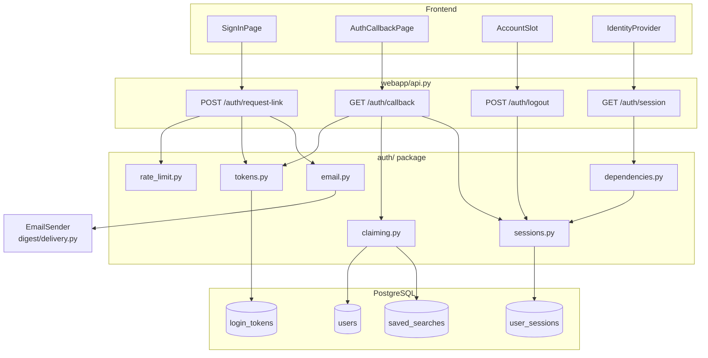
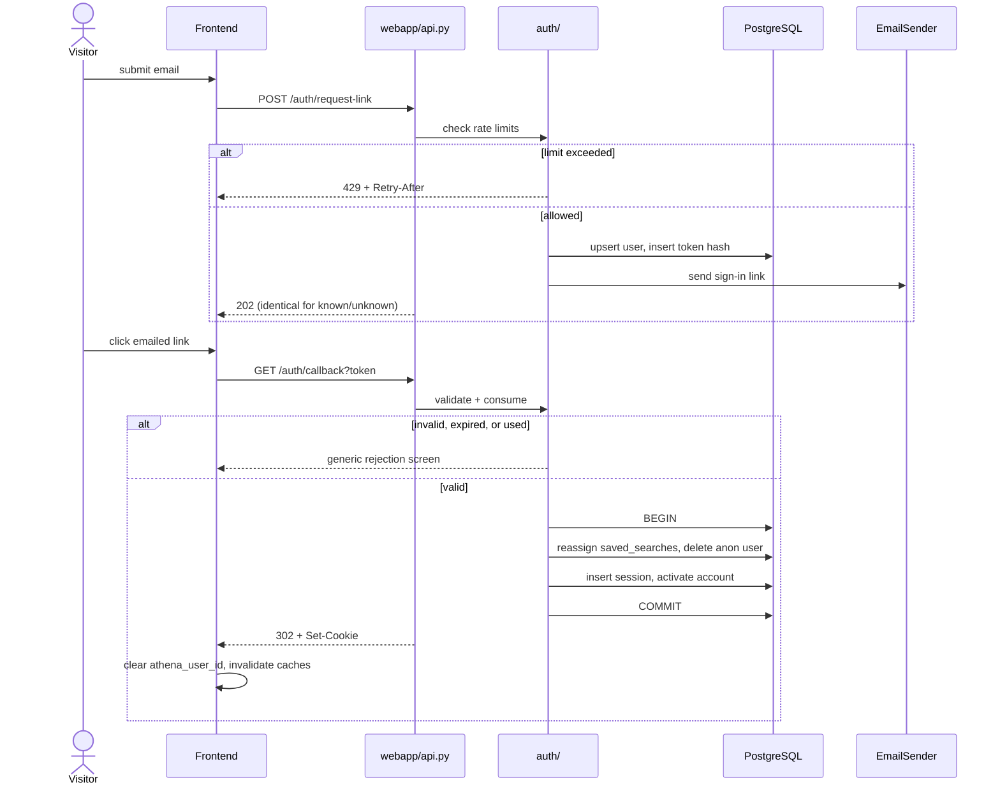

# Individual-User Authentication

Status: Draft for user review
Scope: Prerequisite sub-project for the Athena rendered frontend — unblocks E3 (sharing) and E4 (alerts)
Depends on: Sub-project A (frontend shell, anonymous identity), `digest.models.User`, `digest.delivery.EmailSender`

## 1. Executive Summary

Athena has no way to prove that a person is who they claim to be. Today's identity is a `user_id` minted by `POST /users/anonymous` and stored in `localStorage` — unverified, device-bound, and guessable in the sense that possessing any `user_id` grants full access to that user's data.

This sub-project adds **passwordless email authentication**. A visitor enters an email address, receives a single-use link, and clicking it establishes a signed session. On first sign-in the visitor's existing anonymous data — saved searches, and later bookmarks — is claimed into the authenticated account rather than orphaned.

Who uses it: every individual user of the rendered frontend. It is invisible to the enterprise API, which authenticates organizations by API key through a separate path.

Concrete outcome: three things become safe that are unsafe today — sending email on a user's behalf (E4), exposing a user's data through a shared link (E3), and destroying a user's data via `DELETE /me`. It resolves roadmap decisions **D-2** and **D-3** together.

## 2. Repository Evidence

| Item | Classification | Source | Relevance |
|---|---|---|---|
| `User` has `id`, `email` (unique, not null), `status`, `created_at` — no password, no verification state | [EXISTING] | `digest/models.py:28-34` | The table this sub-project extends; it has no column capable of holding a credential |
| `POST /users/anonymous` mints a `User` with a placeholder `anon-<uuid>@no-reply.local` email | [EXISTING] | Sub-project A, `digest/profiles.py` (`create_anonymous_user`), branch `worktree-frontend-shell` | The identity being upgraded; its placeholder email is the marker distinguishing claimed from unclaimed accounts |
| Frontend stores `user_id` in `localStorage` under `athena_user_id` and sends it as a query parameter | [EXISTING] | `webapp/frontend/src/identity/identity.tsx`; `docs/superpowers/specs/2026-07-05-frontend-shell-design.md` | The mechanism being replaced for authenticated users; it must keep working for anonymous ones |
| `authenticate_api_key` reads a `Bearer` header, hashes it, and looks up a non-revoked row | [EXISTING] | `enterprise_api/auth.py:16-24` | The house pattern for credential checking: **hash, then compare hashes** — never store the secret |
| `hash_api_key` is plain SHA-256 | [EXISTING] | `enterprise_api/provisioning.py:13-14` | Correct for a high-entropy random key. **It would be wrong for a password.** This is a direct argument for a passwordless design — see §14 |
| `EmailSender` protocol with `ConsoleSender` and `SmtpSender` implementations | [EXISTING] | `digest/delivery.py:20-40` | Magic-link delivery reuses this; no new mail infrastructure |
| `EmailSendOutcome` records success/failure without raising | [EXISTING] | `digest/delivery.py:15` | Login-email failures can be surfaced without aborting a request |
| `enforce_rate_limit` exists but keys on `Organization` | [EXISTING] | `enterprise_api/rate_limit.py:20` | Cannot be reused as-is; auth needs per-email and per-IP windows. See OQ-AUTH-003 |
| No password-hashing or token library is installed (`bcrypt`, `argon2`, `passlib`, `itsdangerous`, `jose`, `jwt` all absent) | [EXISTING] | `pyproject.toml:5-16`; verified by import probe 2026-08-03 | A password design would require adding and correctly configuring a KDF; a magic-link design requires only `secrets` from the standard library |
| Alembic manages migrations | [EXISTING] | `alembic/versions/` | New tables follow the existing migration workflow |
| `get_db` commits on the way out | [EXISTING] | `webapp/api.py` (`get_db`) | Session-token writes commit automatically; relevant to the single-use guarantee in §14 |
| E3 and E4 are blocked pending authentication | [EXISTING] | `docs/superpowers/specs/2026-08-02-engagement-sharing-audit-design.md`; roadmap D-2, D-3 | This document exists to unblock them |
| Sessions should be `httpOnly` cookies rather than `localStorage` tokens | [PROPOSED] | — | `localStorage` is readable by any script on the origin; an `httpOnly` cookie is not. See §15 |
| Anonymous data is claimed on first sign-in | [PROPOSED] | — | Without it, a visitor who saves searches then signs in silently loses them |

## 3. Goals

1. A visitor can sign in with only an email address and no password, in at most two steps.
2. A magic link is single-use and expires 15 minutes after issuance.
3. A session survives a browser restart and expires 30 days after issuance.
4. Signing in for the first time from a browser holding an anonymous `user_id` claims that user's saved searches into the authenticated account, with zero data loss.
5. Every endpoint that today accepts `user_id` as a query parameter accepts a session cookie instead, and rejects the query parameter for accounts that have been claimed.
6. An authenticated user's email address is verified by construction — possession of the mailbox is what produced the session.
7. Sign-in requests are rate-limited per email address and per client IP.
8. Anonymous browsing continues to work unchanged for visitors who never sign in.

## 4. Non-Goals

- Passwords, password reset, and password strength policy — excluded because the magic-link flow makes them unnecessary, and adding a KDF is a separate security surface.
- OAuth or social sign-in (Google, ORCID, institutional SSO) — excluded from v1; ORCID is credible later given the research audience, see §23.
- Multi-factor authentication — excluded; the email round-trip is already a possession factor.
- Organization or team membership for individual users — the enterprise API's `Organization` model is deliberately untouched.
- Account merging between two *already-authenticated* accounts — only anonymous-to-authenticated claiming is in scope.
- Changing an account's email address after sign-in — deferred, see §23.
- Session revocation UI ("sign out everywhere") — the data model supports it, but no screen ships in v1.

## 5. User Roles and Permissions

**Anonymous visitor** (no session cookie; may hold a `localStorage` `user_id`)
- Read: public evidence data — search, compare, topic detail. Own saved searches, addressed by `user_id`.
- Write: own saved searches. May request a magic link.
- Sharing: none. E3 sharing MUST NOT be exposed to this role.
- Retention: unclaimed anonymous users and their rows are deleted after 180 days of inactivity (§11).
- Absent-permission behavior: endpoints requiring a session return `401` with `{"detail": "Authentication required"}`.

**Authenticated user** (valid session cookie)
- Read: all anonymous reads, plus own account record and own activity history.
- Write: everything an anonymous visitor may write, plus account-scoped resources. Once E3/E4 ship: shared links and alert rules.
- Sharing: may create and revoke share links to resources they own.
- Retention: account and data persist until the user deletes the account.
- Absent-permission behavior: acting on a resource owned by another user returns `404`, never `403` — a `403` confirms the resource exists. This matches the indistinguishable-failure requirement already specified for E3.

**Service / background job** (no HTTP identity)
- Read/write: operates with a database session directly; never presents a session cookie.
- Sharing: not applicable.
- Retention: enforces the retention rules rather than being subject to them.
- Absent-permission behavior: not applicable — jobs are not reachable over HTTP.

**Enterprise API consumer** — out of scope and explicitly unchanged. It authenticates organizations via `Bearer` API key at `enterprise_api/auth.py:16` and shares no code path with user sessions.

## 6. User Stories

**US-AUTH-001 — First sign-in claims anonymous data**
Actor: Anonymous visitor with 3 saved searches
Precondition: Browser holds `athena_user_id`; no session cookie
Trigger: Enters `researcher@university.edu` and submits the sign-in form
Main flow: Frontend `POST /auth/request-link` with the email and current anonymous `user_id` → backend rate-check → mint token, store hash, email link → visitor clicks → `GET /auth/callback?token=…` → token validated and consumed → anonymous user's rows reassigned to the account → session cookie set → redirect to `/#/search`
Expected result: Signed in; all 3 saved searches present
Failure result: If the token is expired or already used, the callback shows "This link has expired or was already used" with a control to request a new one; no session is created
Acceptance criteria: Session cookie set with `HttpOnly`, `Secure`, `SameSite=Lax`; `saved_searches.user_id` for all 3 rows now references the authenticated account; the anonymous `User` row is deleted; `localStorage.athena_user_id` cleared

**US-AUTH-002 — Returning user signs in on a new device**
Actor: User with an existing account
Precondition: No session cookie; no anonymous `user_id` on this device
Trigger: Requests a magic link
Main flow: As US-AUTH-001, minus the claiming step
Expected result: Session established; existing data visible
Failure result: Mail delivery failure returns `502` with "We could not send the sign-in email. Try again in a moment." — no token row is left usable
Acceptance criteria: No new `User` row is created; the existing account is reused by email match

**US-AUTH-003 — Unknown email address**
Actor: Visitor typing an address with no account
Precondition: No `User` has that email
Trigger: Requests a link
Main flow: Account created in `pending` status, link sent, session established on click, status becomes `active`
Expected result: Sign-up and sign-in are the same flow
Failure result: None distinguishable to the caller
Acceptance criteria: The response is byte-identical to US-AUTH-002's. **Account existence MUST NOT be inferable** from status code, body, or response timing

**US-AUTH-004 — Loading state**
Actor: Any visitor
Precondition: Sign-in form submitted
Trigger: Request in flight
Main flow: Submit button disabled and labeled "Sending…"
Expected result: Confirmation screen "Check your email — we sent a link to {email}"
Failure result: On network error, the form re-enables with an inline error; the address is preserved
Acceptance criteria: Double-submission cannot issue two tokens; the control is disabled for the whole request

**US-AUTH-005 — Rate limit exceeded**
Actor: Visitor requesting many links
Precondition: 5 requests already sent for this email within the hour
Trigger: Sixth request
Main flow: Backend rejects before minting a token or sending mail
Expected result: `429` with "Too many sign-in attempts. Try again in {n} minutes."
Failure result: Not applicable
Acceptance criteria: No sixth email is sent; no token row created; `Retry-After` header present

**US-AUTH-006 — Tampered or forged token**
Actor: Attacker
Precondition: Holds a guessed or modified token
Trigger: `GET /auth/callback?token=…`
Main flow: Hash lookup misses
Expected result: Same expired-or-used screen as US-AUTH-001's failure
Failure result: Not applicable
Acceptance criteria: Forged, expired, and already-used tokens are **indistinguishable** in status, body, and timing. A failed attempt is recorded for observability

**US-AUTH-007 — Session expiry mid-use**
Actor: Authenticated user returning after 31 days
Precondition: Session past its 30-day expiry
Trigger: Any authenticated request
Main flow: Session lookup finds an expired row and deletes it
Expected result: `401`; frontend clears cached identity and routes to sign-in with an explanatory banner
Failure result: Not applicable
Acceptance criteria: No authenticated data renders after expiry; TanStack Query cache for user-scoped keys is cleared

**US-AUTH-008 — Anonymous visitor never signs in**
Actor: Visitor who ignores authentication
Precondition: Anonymous `user_id` only
Trigger: Normal browsing
Main flow: Unchanged from sub-project A
Expected result: Search, compare, and saved searches work exactly as before
Failure result: Not applicable
Acceptance criteria: No regression in sub-project A's Playwright smoke test

**US-AUTH-009 — Claim collision**
Actor: Visitor with anonymous data signing in to an account that already has data
Precondition: Both the anonymous user and the target account own saved searches
Trigger: Callback completes
Main flow: Anonymous rows are reassigned and appended; nothing is overwritten
Expected result: Union of both sets, target account's rows untouched
Failure result: If reassignment fails, the whole callback rolls back and no session is created — the user retries with a fresh link rather than losing data
Acceptance criteria: Row counts sum exactly; duplicate names are permitted, consistent with saved searches having no uniqueness constraint

**US-AUTH-010 — Sign out**
Actor: Authenticated user
Precondition: Valid session
Trigger: Clicks "Sign out"
Main flow: `POST /auth/logout` deletes the session row and clears the cookie
Expected result: Returned to anonymous browsing
Failure result: If the request fails, the cookie is cleared client-side regardless; the server row expires on its own
Acceptance criteria: The session token is unusable afterwards even if captured

## 7. Functional Requirements

**FR-AUTH-001**: The system MUST authenticate individual users by emailed single-use link, and MUST NOT store user passwords.
Classification: [PROPOSED] · Rationale: No KDF library is installed (`pyproject.toml:5-16`); the existing SHA-256 helper is unsuitable for passwords, and the email round-trip doubles as verification, resolving D-3. · Inputs: email · Outputs: emailed link · Failure: mail failure → `502`, no session · Acceptance: `test_no_password_column_exists_on_user` asserts the `users` table has no password-like column

**FR-AUTH-002**: A magic-link token MUST be single-use and MUST expire 15 minutes after issuance.
Classification: [PROPOSED] · Rationale: Bounds the window in which an intercepted email grants access · Inputs: token · Outputs: session or rejection · Failure: expired/used → generic rejection · Acceptance: `test_token_rejected_after_first_use`, `test_token_rejected_after_15_minutes`

**FR-AUTH-003**: Tokens MUST be stored as SHA-256 hashes, never plaintext.
Classification: [INFERRED] · Rationale: Mirrors `enterprise_api/auth.py:16-24` and `provisioning.py:13-14`; a database leak must not yield usable tokens. Appropriate here precisely because tokens are high-entropy random values, unlike passwords · Inputs: plaintext token · Outputs: stored hash · Failure: n/a · Acceptance: `test_token_plaintext_never_persisted` scans the row for the plaintext

**FR-AUTH-004**: Tokens MUST contain at least 256 bits of entropy from `secrets.token_urlsafe(32)`.
Classification: [PROPOSED] · Rationale: Makes guessing infeasible, which is what justifies unsalted SHA-256 storage · Inputs: none · Outputs: token string · Failure: n/a · Acceptance: `test_token_length_and_alphabet`

**FR-AUTH-005**: The system MUST establish sessions via an `HttpOnly`, `Secure`, `SameSite=Lax` cookie.
Classification: [PROPOSED] · Rationale: `localStorage` is script-readable, so any XSS yields a durable credential; `HttpOnly` removes that. `Lax` allows the top-level redirect from the email client to carry the cookie · Inputs: validated token · Outputs: `Set-Cookie` · Failure: n/a · Acceptance: `test_session_cookie_flags`

**FR-AUTH-006**: Sessions MUST expire 30 days after issuance, and expired sessions MUST be deleted on encounter.
Classification: [PROPOSED] · Rationale: Bounds credential lifetime and bounds table growth without a dedicated job · Inputs: cookie · Outputs: `401` when expired · Failure: n/a · Acceptance: `test_expired_session_returns_401_and_deletes_row`

**FR-AUTH-007**: On first sign-in, the system MUST reassign the anonymous user's saved searches to the authenticated account and delete the anonymous `User` row, in one transaction.
Classification: [PROPOSED] · Rationale: Prevents silent data loss (US-AUTH-001); atomicity prevents a half-claimed state · Inputs: anonymous `user_id`, target account · Outputs: reassigned rows · Failure: any error rolls back the entire callback; no session is created · Acceptance: `test_claim_reassigns_saved_searches_and_deletes_anonymous_user`, `test_claim_rolls_back_entirely_on_failure`

**FR-AUTH-008**: The claim operation MUST NOT overwrite or delete rows already owned by the target account.
Classification: [PROPOSED] · Rationale: US-AUTH-009; the user's existing data is the more valuable side · Inputs: both row sets · Outputs: union · Failure: n/a · Acceptance: `test_claim_preserves_existing_account_rows`

**FR-AUTH-009**: `POST /auth/request-link` MUST return an identical response whether or not an account exists.
Classification: [PROPOSED] · Rationale: Prevents account enumeration (US-AUTH-003) · Inputs: email · Outputs: `202` fixed body · Failure: n/a · Acceptance: `test_request_link_response_identical_for_known_and_unknown_email`

**FR-AUTH-010**: `POST /auth/request-link` MUST be rate-limited to 5 requests per email per hour and 20 per client IP per hour.
Classification: [PROPOSED] · Rationale: Limits mailbox flooding and blind enumeration; the per-IP limit is looser so shared institutional networks are not locked out · Inputs: email, IP · Outputs: `429` + `Retry-After` · Failure: n/a · Acceptance: `test_sixth_request_for_same_email_returns_429`, `test_rate_limit_is_per_email_not_global`

**FR-AUTH-011**: Endpoints owning user data MUST accept a session cookie, and MUST reject a `user_id` query parameter for a claimed account.
Classification: [PROPOSED] · Rationale: Without rejection, the pre-auth path remains a full bypass · Inputs: cookie or `user_id` · Outputs: data or `401` · Failure: claimed account addressed by `user_id` → `401` · Acceptance: `test_user_id_query_param_rejected_for_claimed_account`, `test_user_id_query_param_still_works_for_anonymous_user`

**FR-AUTH-012**: Accessing a resource owned by another user MUST return `404`, not `403`.
Classification: [INFERRED] · Rationale: E's sharing design already requires indistinguishable failure; a `403` confirms existence · Inputs: resource id, session · Outputs: `404` · Failure: n/a · Acceptance: `test_other_users_saved_search_returns_404`

**FR-AUTH-013**: `POST /auth/logout` MUST delete the session row server-side, not merely clear the cookie.
Classification: [PROPOSED] · Rationale: A cleared cookie leaves a captured token valid · Inputs: cookie · Outputs: `204` · Failure: already-invalid session still returns `204` · Acceptance: `test_logout_invalidates_token_server_side`

**FR-AUTH-014**: A magic-link email MUST NOT be sent to an address matching the anonymous placeholder pattern `anon-%@no-reply.local`.
Classification: [PROPOSED] · Rationale: Those addresses are synthetic and undeliverable; attempting delivery wastes quota and pollutes bounce metrics · Inputs: email · Outputs: `400` · Failure: n/a · Acceptance: `test_request_link_rejects_placeholder_address`

**FR-AUTH-015**: Unclaimed anonymous users inactive for 180 days SHOULD be deleted by a scheduled job, along with their saved searches.
Classification: [PROPOSED] · Rationale: `POST /users/anonymous` mints a row per browser and grows unbounded — 8 already accumulated in dev from test traffic alone · Inputs: cutoff · Outputs: deleted rows · Failure: per-user failures isolated and logged, matching the engine's convention · Acceptance: `test_cleanup_deletes_only_unclaimed_users_past_cutoff`

**FR-AUTH-016**: The frontend MUST clear `localStorage.athena_user_id` and all user-scoped query caches on successful sign-in and on sign-out.
Classification: [PROPOSED] · Rationale: A stale anonymous id after claiming would address a deleted row; a stale cache after sign-out would leak the previous user's data on a shared machine · Inputs: auth state change · Outputs: cleared storage and cache · Failure: n/a · Acceptance: `test_identity_cleared_on_signout`

## 8. Information Architecture and UX

**Routes** (hash router, matching sub-project A)
- `/#/signin` — email entry, then confirmation. New.
- `/#/auth/callback` — transient; consumes the token, shows a spinner, then redirects. New.
- All existing routes unchanged.

**Entry points**: a "Sign in" control in the `IconSidebar` footer for anonymous visitors; the same slot shows the account email and a "Sign out" control when authenticated.

**Navigation changes**: none to existing items. The sidebar gains one footer slot.

**Component hierarchy**
```
App
├── IdentityProvider              (extended: session-aware, not just localStorage)
├── IconSidebar
│   └── AccountSlot               (new)
│       ├── SignInLink            (anonymous)
│       └── AccountMenu           (authenticated: email + Sign out)
└── Routes
    ├── SignInPage                (new)
    │   ├── EmailForm
    │   └── LinkSentConfirmation
    └── AuthCallbackPage          (new)
```

**Text wireframe — sign-in**
```
┌───────────────────────────────────────────┐
│  Sign in to Athena                        │
│                                           │
│  Email address                            │
│  ┌─────────────────────────────────────┐  │
│  │ researcher@university.edu           │  │
│  └─────────────────────────────────────┘  │
│                                           │
│  ┌─────────────────────────────────────┐  │
│  │           Email me a link           │  │
│  └─────────────────────────────────────┘  │
│                                           │
│  No password needed. We'll send a link    │
│  that signs you in for 30 days.           │
└───────────────────────────────────────────┘
```

**Confirmation state** replaces the form in place — heading "Check your email", body "We sent a sign-in link to {email}. It expires in 15 minutes.", plus a "Use a different address" control returning to the form.

**Desktop**: the form is capped at 420px and centered in the 1200px content area.
**Mobile**: full width at 16px margins; the sidebar's account slot moves into the bottom bar per sub-project A's responsive rule.

**States**
- Loading: submit disabled, labeled "Sending…"; callback shows a centered spinner with "Signing you in…"
- Empty: not applicable — the sign-in page has no data
- Error: inline text below the field, red per `--color-error`, field value preserved
- Stale: an expired session produces a one-time banner "Your session expired. Sign in again." on the sign-in page
- Partial: not applicable — sign-in either succeeds or does not

**Accessibility**: the email input has a visible `<label>` (not a placeholder alone); errors are wired via `aria-describedby` and announced through an `aria-live="polite"` region; the callback spinner is labeled; focus moves to the confirmation heading after submission; the account menu is keyboard-operable and its trigger carries `aria-expanded`. Contrast follows the Scholastic Precision tokens already validated in sub-project A.

**Terminology**: "Sign in" (not "log in"), "sign-in link" (not "magic link" — that phrase reads as jargon to a research audience), "Sign out", "Your account".

## 9. System Architecture

**Frontend components**: `SignInPage`, `AuthCallbackPage`, `AccountSlot`, and an extended `IdentityProvider` that resolves identity from the session endpoint first and falls back to the anonymous `localStorage` id.

**Frontend hooks and API functions**: `useSession()`, `useRequestSignInLink()`, `useCompleteSignIn()`, `useSignOut()`; API functions `requestSignInLink`, `completeSignIn`, `getSession`, `signOut`. All fetches must send `credentials: "include"` so the cookie travels.

**HTTP endpoints**: `POST /auth/request-link`, `GET /auth/callback`, `GET /auth/session`, `POST /auth/logout`. Full contracts in §12.

**Backend services**: a new `auth/` package — `auth/tokens.py` (mint, hash, validate, consume), `auth/sessions.py` (create, resolve, delete, expire), `auth/claiming.py` (anonymous-to-account transfer), `auth/email.py` (compose the sign-in email via `render`/`EmailSender`), `auth/rate_limit.py` (per-email and per-IP windows), `auth/dependencies.py` (FastAPI dependencies `current_user` and `current_user_optional`).

**Background jobs**: `scripts/cleanup_anonymous_users.py` implementing FR-AUTH-015, following the existing script-runner convention rather than a daemon.

**Database ownership**: the `auth/` package owns `login_tokens` and `user_sessions`. It adds two columns to `users`, a table owned by `digest/` — the only cross-package schema change, justified in §11.

**External providers**: none beyond the SMTP server already configured for `SmtpSender`.

**Caching**: `GET /auth/session` is cached by TanStack Query under `["session"]` with a 5-minute stale time; it is invalidated on sign-in and sign-out. No server-side cache — session lookup is a single indexed primary-key-adjacent query.

**Idempotency**: `GET /auth/callback` is not idempotent by design — the second call with the same token must fail (FR-AUTH-002). `POST /auth/logout` is idempotent and returns `204` even when the session is already gone.

**Observability**: see §18.



## 10. Data Flow

**Operation 1 — Request a sign-in link**
1. Trigger: visitor submits the email form.
2. Frontend: `useRequestSignInLink` mutates; button disabled.
3. Request: `POST /auth/request-link` with `{email, anonymous_user_id?}`.
4. Validation: email shape via Pydantic `EmailStr`; placeholder pattern rejected (FR-AUTH-014); rate limits checked (FR-AUTH-010).
5. Service: `auth.tokens.mint_login_token` generates the token, stores its hash with a 15-minute expiry and the optional anonymous id.
6. Database: insert into `login_tokens`; insert into `users` if the email is new (status `pending`).
7. External: `EmailSender.send` delivers the link.
8. Response: `202` with a fixed body regardless of prior account existence.
9. Cache: none invalidated.
10. Result: confirmation screen.

**Operation 2 — Complete sign-in**
1. Trigger: visitor clicks the emailed link.
2. Frontend: `AuthCallbackPage` reads the token from the query string.
3. Request: `GET /auth/callback?token=…`.
4. Validation: hash lookup; reject if missing, expired, or already consumed.
5. Service: `consume_login_token` marks it used; `claiming.claim_anonymous_user` runs if an anonymous id was recorded; `sessions.create_session` mints the session.
6. Database: update `login_tokens.used_at`; update `saved_searches.user_id`; delete the anonymous `users` row; insert `user_sessions`; set `users.status` to `active`.
7. External: none.
8. Response: `302` to `/#/search` with `Set-Cookie`.
9. Cache: frontend clears `athena_user_id` and invalidates `["session"]` and all user-scoped keys.
10. Result: signed in with data intact.

Steps 5–6 execute in a single transaction; any failure rolls the whole thing back and no session is created (FR-AUTH-007).



**Operation 3 — Authenticated request**: cookie → `current_user` dependency → session lookup → expiry check (delete and `401` if past) → handler receives the `User`.

**Operation 4 — Sign out**: `POST /auth/logout` → delete the session row → clear cookie → frontend invalidates `["session"]` → anonymous browsing resumes.

## 11. Data Model

**`login_tokens`** — new, owned by `auth/`

| Column | Type | Null | Default | Notes |
|---|---|---|---|---|
| `id` | `UUID` | no | `uuid4` | PK |
| `user_id` | `UUID` | no | — | FK → `users.id`, `ON DELETE CASCADE` |
| `token_hash` | `String(64)` | no | — | SHA-256 hex; **unique** |
| `anonymous_user_id` | `UUID` | yes | `NULL` | FK → `users.id`, `ON DELETE SET NULL`; the account to claim |
| `expires_at` | `DateTime` | no | — | issuance + 15 minutes |
| `used_at` | `DateTime` | yes | `NULL` | non-null means consumed |
| `created_at` | `DateTime` | no | `utcnow` | |

Indexes: unique on `token_hash` (the lookup path); btree on `expires_at` for cleanup.
Retention: rows deleted 24 hours after `expires_at` by the cleanup script.

**`user_sessions`** — new, owned by `auth/`

| Column | Type | Null | Default | Notes |
|---|---|---|---|---|
| `id` | `UUID` | no | `uuid4` | PK |
| `user_id` | `UUID` | no | — | FK → `users.id`, `ON DELETE CASCADE` |
| `token_hash` | `String(64)` | no | — | SHA-256 hex; **unique** |
| `expires_at` | `DateTime` | no | — | issuance + 30 days |
| `created_at` | `DateTime` | no | `utcnow` | |
| `last_seen_at` | `DateTime` | yes | `NULL` | updated at most hourly to limit write amplification |
| `user_agent` | `String(256)` | yes | `NULL` | truncated; for the future session-list screen |

Indexes: unique on `token_hash`; btree on `user_id`; btree on `expires_at`.
Retention: deleted on encounter past expiry, and swept by the cleanup script.

**`auth_rate_windows`** — new, owned by `auth/`

| Column | Type | Null | Default | Notes |
|---|---|---|---|---|
| `id` | `UUID` | no | `uuid4` | PK |
| `scope` | `String(32)` | no | — | `email` or `ip` |
| `key` | `String(320)` | no | — | the address or IP |
| `window_start` | `DateTime` | no | — | truncated to the hour |
| `count` | `Integer` | no | `0` | |

Unique constraint on `(scope, key, window_start)`. Retention: windows older than 24 hours deleted by the cleanup script. This is deliberately shaped to serve as the shared limiter the roadmap's D-5 calls for — other sub-projects add `scope` values rather than new tables.

**`users`** — existing table (`digest/models.py:28`), two **proposed** columns

| Column | Type | Null | Default | Notes |
|---|---|---|---|---|
| `email_verified_at` | `DateTime` | yes | `NULL` | set on first successful callback; **resolves D-3** |
| `claimed_at` | `DateTime` | yes | `NULL` | non-null marks the account as authenticated; drives FR-AUTH-011's rejection of `user_id` |

Existing columns `id`, `email`, `status`, `created_at` are unchanged. `status` gains one permitted value, `pending`, alongside today's `active` and `paused`. **No existing reader of `status` treats unknown values as active** — `select_due_users` filters on `status == "active"` (`digest/runner.py:27`), so a `pending` account is excluded from digests until it signs in, which is the desired behavior.

Cross-package note: `auth/` modifies a `digest/`-owned table. This is accepted rather than duplicating identity, and mirrors the precedent that `webapp/` already depends on `digest.models.User` for saved searches. The alternative — a parallel `auth_users` table — would create two competing notions of a user.

**Migration order**: (1) add the two `users` columns, both nullable, so the migration is non-breaking and existing rows need no backfill; (2) create `login_tokens`; (3) create `user_sessions`; (4) create `auth_rate_windows`.
**Backfill**: none. Existing users have `claimed_at = NULL` and continue to work through the `user_id` path until they sign in.
**Rollback**: drop the three new tables, then drop the two columns. No data outside `auth/`'s own tables is destroyed, because the claim operation only rewrites `saved_searches.user_id` — and that rewrite is not reversed by rollback, which is safe since the rows remain valid and owned by a real account.

## 12. API Contracts

### `POST /auth/request-link`
Auth: none · Authorization: public · Query: none
Request:
```json
{ "email": "researcher@university.edu", "anonymous_user_id": "3f2a…" }
```
`anonymous_user_id` is optional.
Success `202`:
```json
{ "status": "sent", "message": "If that address can receive mail, a sign-in link is on its way." }
```
Errors: `400` malformed or placeholder address; `429` rate limited (with `Retry-After`); `502` mail delivery failed.
```json
{ "detail": "Too many sign-in attempts. Try again in 42 minutes." }
```
Pagination/sorting/filtering: not applicable. Idempotency: not idempotent — each call issues a new token, bounded by FR-AUTH-010. Rate limits: 5/email/hour, 20/IP/hour.

### `GET /auth/callback`
Auth: none (the token is the credential) · Query: `token` (required, string)
Success `302` to `/#/search` with:
```
Set-Cookie: athena_session=<token>; HttpOnly; Secure; SameSite=Lax; Path=/; Max-Age=2592000
```
Errors: `400` missing token; `302` to `/#/signin?error=link_invalid` for invalid, expired, or already-used tokens — deliberately one outcome for all three (FR-AUTH-006 of §6, US-AUTH-006).
Idempotency: explicitly non-idempotent. Rate limits: 20/IP/hour on failures only, so a valid click is never blocked.

### `GET /auth/session`
Auth: session cookie, optional · Authorization: returns only the caller's own record
Success `200` — authenticated:
```json
{
  "authenticated": true,
  "user": {
    "id": "8c1d…",
    "email": "researcher@university.edu",
    "email_verified_at": "2026-08-03T14:22:10Z",
    "claimed_at": "2026-08-03T14:22:10Z"
  }
}
```
Success `200` — anonymous:
```json
{ "authenticated": false, "user": null }
```
Returning `200` in both cases lets the frontend treat "not signed in" as a state rather than an error. Errors: none under normal operation. Rate limits: none — called on every page load.

### `POST /auth/logout`
Auth: session cookie, optional · Success `204` with a cookie-clearing `Set-Cookie` · Errors: none; `204` even when no session exists · Idempotency: fully idempotent.

**Changes to existing endpoints**: every endpoint currently taking `user_id` as a query parameter — `GET /saved-searches`, `DELETE /saved-searches/{id}`, `POST /saved-searches/{id}/run`, and `POST /saved-searches` — gains the `current_user_optional` dependency. When a session is present it wins and `user_id` is ignored. When absent and the addressed account has `claimed_at IS NOT NULL`, the request is rejected `401` (FR-AUTH-011). When absent and the account is unclaimed, behavior is unchanged, preserving sub-project A.

All identifiers are UUIDs, all timestamps ISO-8601 UTC with a trailing `Z`, and nullable fields are emitted as `null` — consistent with the serialization already used in `webapp/api.py`.

## 13. Frontend Contracts

**`SignInPage`** — collects the address and renders the confirmation. Props: none (routed). Cache: none; uses a mutation. Loading: submit disabled, "Sending…". Error: inline, `aria-describedby`. Empty: not applicable. Accessibility: labeled input, `aria-live` errors, focus moves to the confirmation heading. Reuses sub-project A's form styling and `--color-error`.

**`AuthCallbackPage`** — exchanges the token. Props: none; reads `token` from the query string. Cache: invalidates `["session"]` on success. Loading: labeled spinner. Error: redirects to `/#/signin?error=link_invalid`. Accessibility: spinner has an accessible name; the outcome is announced.

**`AccountSlot`** — sidebar footer showing sign-in or the account menu. Props: none; reads `useSession()`. Loading: renders nothing rather than a flicker. Error: falls back to the anonymous presentation. Empty: shows "Sign in". Accessibility: menu trigger carries `aria-expanded` and is keyboard-operable. Reuses `IconSidebar`.

**`IdentityProvider`** — extended, not replaced. Resolves the session first; falls back to the anonymous `localStorage` id when unauthenticated; clears that id once claimed (FR-AUTH-016).

**Hooks**
- `useSession(): UseQueryResult<SessionResponse>` — key `["session"]`, 5-minute stale time.
- `useRequestSignInLink(): UseMutationResult<RequestLinkResponse, ApiError, {email: string}>` — attaches the anonymous id automatically.
- `useSignOut(): UseMutationResult<void, ApiError, void>` — clears the whole query cache on success.

**Proposed interfaces** (documentation examples, not implementation):
```ts
export interface SessionUser {
  id: string;
  email: string;
  email_verified_at: string | null;
  claimed_at: string | null;
}

export interface SessionResponse {
  authenticated: boolean;
  user: SessionUser | null;
}

export interface RequestLinkResponse {
  status: "sent";
  message: string;
}
```

`ApiError` from sub-project A is reused unchanged, as is its `.status` field for distinguishing `429` from `502`.

## 14. Algorithms and Domain Rules

**Token generation**
Inputs: none. Units: bytes of entropy. Rule: `secrets.token_urlsafe(32)` — 32 random bytes, URL-safe base64, 43 characters. Missing-data behavior: not applicable. Minimum sample: not applicable. Numerical stability: not applicable. Worked example: `secrets.token_urlsafe(32)` → `"kJ8x…"` (43 chars); stored as `sha256(token).hexdigest()` (64 chars). Validation test: `test_token_length_and_alphabet` asserts length 43 and the URL-safe alphabet.

**Why unsalted SHA-256 is correct here and wrong for passwords**
A password has low entropy, so an attacker holding hashes can brute-force or use rainbow tables — which is why passwords need a slow, salted KDF. A 256-bit random token has no such structure: there is nothing to guess, and a per-row salt adds nothing because the input is already unique and unpredictable. This is the same reasoning that makes `hash_api_key`'s SHA-256 appropriate at `enterprise_api/provisioning.py:13`. **Adopting passwords later would require replacing this scheme, not extending it.**

**Token validation**
Inputs: plaintext token, current time. Rule: a token is valid if and only if a row exists whose `token_hash` equals `sha256(plaintext)`, **and** `used_at IS NULL`, **and** `expires_at > now`. Missing-data behavior: any miss produces the identical generic rejection. Worked example: token issued 14:00:00 with `expires_at` 14:15:00; a click at 14:14:59 succeeds and sets `used_at`; a second click at 14:15:00 fails on `used_at`, not expiry — order of checks is unobservable because the outcome is identical. Validation test: `test_token_rejected_after_first_use`, `test_token_rejected_after_15_minutes`.

**Single-use enforcement under concurrency**
Two simultaneous clicks must not both create a session. Rule: consume with a conditional update — `UPDATE login_tokens SET used_at = now() WHERE id = :id AND used_at IS NULL` — and treat a zero-row result as already-consumed. The database, not application logic, arbitrates. Validation test: `test_concurrent_callback_creates_exactly_one_session` issues two overlapping requests and asserts exactly one `user_sessions` row.

**Rate-limit window**
Inputs: scope, key, current time. Units: requests per hour. Rule: fixed hourly windows, `window_start = now.replace(minute=0, second=0, microsecond=0)`. A request is allowed if the row's `count` is below the limit; the counter increments atomically via `INSERT … ON CONFLICT (scope, key, window_start) DO UPDATE SET count = auth_rate_windows.count + 1 RETURNING count`. Missing-data behavior: no row means count zero. Minimum sample: not applicable. Numerical stability: `count` is an integer; the atomic increment prevents lost updates under concurrency. Worked example: requests at 14:05, 14:20, 14:31, 14:44, 14:59 all fall in the `14:00` window and consume the 5-per-email budget; a request at 15:01 opens a new window and is allowed. `Retry-After` is the seconds remaining to the next hour boundary. Validation test: `test_rate_limit_window_boundary` asserts the sixth request at 14:59 is refused and the next at 15:00 is allowed.

Fixed windows permit a burst of up to twice the limit across a boundary. That is accepted for v1: the limit exists to prevent mailbox flooding, not to smooth traffic, and a sliding window costs materially more per request.

**Claim algorithm**
Inputs: anonymous `user_id`, target account id. Rule, in one transaction: (1) verify the anonymous user exists and has `claimed_at IS NULL` and a placeholder email, aborting otherwise; (2) `UPDATE saved_searches SET user_id = :target WHERE user_id = :anonymous`; (3) `DELETE FROM users WHERE id = :anonymous`; (4) set the target's `claimed_at` and `email_verified_at` if unset. Missing-data behavior: a missing or already-claimed anonymous user is not an error — the sign-in proceeds without claiming, since the common cause is a second sign-in from the same browser. Minimum sample: not applicable. Worked example: anonymous user with 3 saved searches signs in to an account with 2; the account ends with 5 and the anonymous row is gone. Validation test: `test_claim_reassigns_saved_searches_and_deletes_anonymous_user`, `test_claim_is_noop_for_already_claimed_anonymous_user`.

Step 2 must be extended by any later sub-project that adds user-owned tables — E1's bookmarks in particular. §20 records this as a delivery obligation rather than leaving it implicit.

## 15. Security and Privacy

**Authentication and authorization**: possession of a mailbox is the sole factor. Sessions are bearer credentials in `HttpOnly` cookies; every user-owned endpoint resolves ownership from the session rather than from a client-supplied id.

**User isolation**: enforced at the query level — user-scoped queries filter on the session's user id. Cross-user access returns `404` (FR-AUTH-012).

**Prompt injection**: not applicable; no LLM is involved in this sub-project. Sub-project B must not incorporate an email address into any prompt.

**Sensitive-data exposure**: the only personal datum stored is the email address. It is never logged in full — logs record a SHA-256 prefix (§18). Sign-in emails contain no data beyond the link itself.

**Shared-link access**: out of scope here; E3 depends on this document being implemented first.

**Auditability**: sign-in success, sign-in failure, sign-out, and claim events are recorded. Under E2's classification these are **security audit** events, not product activity, and must be append-only.

**Input validation**: email via Pydantic `EmailStr`; token as a bounded-length string matching the URL-safe alphabet; `user_agent` truncated to 256 characters before storage.

**Rate limiting**: FR-AUTH-010. Failed callbacks are limited per IP so token guessing cannot run unbounded, while successful clicks are never blocked.

**Abuse controls**: identical responses prevent enumeration; the placeholder-address rejection prevents using Athena as a mail relay to synthetic addresses; single-use tokens prevent replay.

**Data deletion**: `DELETE /me` remains **out of scope for v1** even though authentication now makes it safe — it needs a full cascade inventory across every user-owned table, which is better done once E1 and E3 have added theirs. FR-AUTH-015's cleanup job deletes only unclaimed anonymous users.

**Secrets**: no new secrets. SMTP credentials already exist for `SmtpSender`. Tokens are generated per request and never configured.

**External-provider data handling**: email addresses reach only the configured SMTP server. No third-party identity provider is contacted.

**Cookie scope**: `Path=/` and no `Domain` attribute, so the cookie is host-only and not shared with subdomains. `Secure` means local HTTP development requires either a `localhost` exemption or HTTPS — see OQ-AUTH-002.

**CSRF**: `SameSite=Lax` blocks cross-site POSTs while permitting the top-level GET redirect from the email client. Because every state-changing endpoint is `POST`/`DELETE` and `Lax` withholds the cookie from cross-site requests with those methods, no separate CSRF token ships in v1. Any future state-changing `GET` would break this assumption and must not be added.

## 16. Error Handling and Recovery

| Failure | Detection | User message | Retry policy | Persistence effect | Observability |
|---|---|---|---|---|---|
| Malformed email | Pydantic validation | "Enter a valid email address." | User corrects inline | None | `warn`, no address logged |
| Placeholder address submitted | Pattern match (FR-AUTH-014) | "That address cannot receive mail." | None | None | `warn` with the pattern, not the value |
| Rate limit exceeded | Counter ≥ limit | "Too many sign-in attempts. Try again in {n} minutes." | Automatic at the next window | Counter incremented | `warn` + `auth_rate_limited` metric |
| SMTP send failure | `EmailSendOutcome.result` is failure | "We could not send the sign-in email. Try again in a moment." | User retries; counts against the limit | Token row exists but is unreachable; expires in 15 minutes | `error` with the provider's message; `auth_email_failed` metric |
| Token not found | Hash lookup miss | "This link has expired or was already used." | Request a new link | None | `warn`, hash prefix only |
| Token expired | `expires_at <= now` | Identical to above | Request a new link | None | `warn` + `auth_token_expired` |
| Token already used | `used_at` non-null | Identical to above | Request a new link | None | `warn` + `auth_token_reused` — **elevated**, may indicate interception |
| Concurrent callback race | Conditional update returns zero rows | Identical to above | None | Exactly one session created | `info`; expected under double-click |
| Claim fails mid-transaction | Exception in the claim block | "Something went wrong signing you in. Request a new link." | New link | **Entire callback rolled back**; no session, no partial move | `error` with both user ids |
| Session expired | `expires_at <= now` | "Your session expired. Sign in again." | Re-authenticate | Expired row deleted on encounter | `info` |
| Session cookie absent | No cookie on a protected route | `401`; frontend routes to sign-in | Re-authenticate | None | `info` |
| Database unavailable | Connection error | "Athena is temporarily unavailable." | Client retries | None | `error` + alert |
| Cleanup job failure | Exception per user | Not user-facing | Next scheduled run | Per-user isolation; other users still processed | `error` per user; job-run record |

## 17. Performance and Scale

**Expected request shape**: `GET /auth/session` on every page load — the hot path. Sign-in requests are rare, bounded by FR-AUTH-010.

**Pagination**: not applicable; no endpoint returns a collection.

**Query indexes**: unique on `user_sessions.token_hash` and `login_tokens.token_hash` (both lookups are single-row on a unique index); btree on `expires_at` for cleanup scans; unique composite on `(scope, key, window_start)` for the atomic rate-limit upsert.

**Caching**: `["session"]` cached 5 minutes client-side, cutting session lookups roughly to one per five minutes per active tab. `last_seen_at` is updated at most hourly per session, so the hot path is read-only in the common case.

**Background processing**: only the cleanup script, run daily.

**Payload limits**: request bodies capped at 4 KB — the largest legitimate body is an email plus a UUID, under 400 bytes. `user_agent` truncated to 256 characters.

**Timeouts**: SMTP send capped at 10 seconds, after which the request returns `502` rather than holding the connection. Database statements use the pool's existing defaults.

**Rate limits**: 5/email/hour and 20/IP/hour on link requests; 20/IP/hour on **failed** callbacks only.

**Rendering concerns**: `AccountSlot` renders nothing until the session query resolves, avoiding a sign-in/signed-in flicker on every load.

**Dataset limits**: `login_tokens` is bounded by the rate limit times the active user count and pruned after 24 hours. `user_sessions` is bounded by devices per user; the cleanup script deletes expired rows daily. Neither grows unbounded.

## 18. Observability

**Structured logs**, logger `auth`, with `event`, `user_id` where known, `token_hash_prefix` (first 8 hex characters only), and outcome. **Email addresses MUST NOT be logged in full** — an address is logged as its SHA-256 prefix, sufficient to correlate reports without storing a plaintext identifier in log storage.

**Metrics**: `auth_link_requested`, `auth_link_sent`, `auth_email_failed`, `auth_signin_succeeded`, `auth_token_expired`, `auth_token_reused`, `auth_rate_limited`, `auth_claim_succeeded`, `auth_claim_failed`, `auth_session_expired`.

**Audit events**: `signin.succeeded`, `signin.failed`, `signout`, `account.claimed` — security-audit class under E2's taxonomy, append-only.

**Traces**: the callback is the multi-step path worth tracing — validate, claim, create session — so a latency regression can be attributed to a stage.

**Job-run records**: the cleanup script records start, end, counts of deleted tokens, sessions, and anonymous users, and any per-user failures, matching the `DigestRun` convention.

**Failure alerts**: alert when `auth_email_failed` exceeds 5% of `auth_link_requested` over 15 minutes (delivery is broken and users cannot sign in), and on any `auth_token_reused` (possible interception).

**Privacy-safe diagnostic context**: hash prefixes, user ids, and timestamps only — never addresses, tokens, or cookie values.

## 19. Testing Strategy

**Unit** — `test_token_length_and_alphabet`; `test_token_hash_is_sha256_of_plaintext`; `test_rate_limit_window_boundary` (sixth at 14:59 refused, next at 15:00 allowed); `test_claim_is_noop_for_already_claimed_anonymous_user`.

**Service** — `test_token_rejected_after_first_use`; `test_token_rejected_after_15_minutes`; `test_claim_reassigns_saved_searches_and_deletes_anonymous_user`; `test_claim_preserves_existing_account_rows` (3 + 2 = 5); `test_claim_rolls_back_entirely_on_failure` asserting no session and no moved rows.

**API** — `test_request_link_response_identical_for_known_and_unknown_email` comparing status and body bytes; `test_request_link_rejects_placeholder_address`; `test_sixth_request_for_same_email_returns_429`; `test_callback_sets_httponly_secure_samesite_cookie`; `test_callback_invalid_expired_and_used_are_indistinguishable` asserting all three produce the same redirect; `test_session_endpoint_returns_200_and_false_when_anonymous`; `test_logout_invalidates_token_server_side`; `test_user_id_query_param_rejected_for_claimed_account`; `test_user_id_query_param_still_works_for_anonymous_user`; `test_other_users_saved_search_returns_404`.

**Database** — `test_token_hash_unique_constraint`; `test_session_cascade_deletes_with_user`; `test_rate_window_unique_constraint_permits_atomic_upsert`; `test_no_password_column_exists_on_user` (a schema guard, in the spirit of F's boundary tests).

**Frontend component** — `test_signin_form_disables_submit_while_pending`; `test_signin_shows_confirmation_with_entered_address`; `test_callback_redirects_to_signin_on_invalid_token`; `test_account_slot_renders_signin_when_anonymous`; `test_signout_clears_query_cache`. MSW mocks all four endpoints; no real backend.

**Accessibility** — `test_signin_input_has_associated_label`; `test_error_is_announced_via_aria_live`; `test_account_menu_is_keyboard_operable`.

**Playwright** — one flow extending sub-project A's smoke test: save a search anonymously → request a link → read the token from `ConsoleSender` output → visit the callback → assert signed in and the saved search survived. This exercises FR-AUTH-007 end to end without a live mailbox.

**Background job** — `test_cleanup_deletes_only_unclaimed_users_past_cutoff`; `test_cleanup_isolates_per_user_failure_and_continues`; `test_cleanup_deletes_expired_tokens_and_sessions`.

**Failure injection** — `test_smtp_failure_returns_502_and_leaves_no_usable_session`; `test_database_error_during_claim_leaves_no_partial_state`.

**Security** — `test_token_plaintext_never_persisted`; `test_email_never_appears_in_logs` capturing log output and asserting the address is absent; `test_concurrent_callback_creates_exactly_one_session`; `test_session_cookie_is_not_readable_from_javascript` asserting the `HttpOnly` attribute.

**Performance** — `test_session_lookup_uses_unique_index` asserting an index scan rather than a sequential scan via `EXPLAIN`, which is the assertion that keeps the hot path fast as `user_sessions` grows.

## 20. Delivery and Migration

**Migration order**: (1) `users` columns, both nullable; (2) `login_tokens`; (3) `user_sessions`; (4) `auth_rate_windows`. Each is independently reversible.

**Backfill**: none required.

**Feature flags**: `AUTH_ENABLED` gates the sign-in UI and the four endpoints. When off, the frontend renders no account slot and the backend returns `404` for `/auth/*`, leaving sub-project A's anonymous path exactly as it is today. This makes the whole sub-project revertible without a schema rollback.

**Compatibility with existing clients**: the `user_id` query parameter keeps working for unclaimed accounts indefinitely, so sub-project A's frontend continues to function unchanged. Only claimed accounts require a session (FR-AUTH-011).

**Deployment order**: migrations → backend with `AUTH_ENABLED=false` → verify no regression → frontend → enable the flag.

**Rollback**: set `AUTH_ENABLED=false`. Sessions become unusable and users fall back to anonymous browsing; already-claimed saved searches stay with their accounts and are reachable again once the flag returns. Schema rollback is a separate, rarely-needed step.

**Seed and demo data**: extend `scripts/seed_demo_data.py` with one claimed account owning a saved search, so the signed-in state is demonstrable without a mailbox. `ConsoleSender` prints the link in development, which is also what the Playwright flow reads.

**Documentation updates**: the roadmap's D-2 and D-3 entries close and E3/E4 are reclassified; the frontend-shell spec gains a pointer noting that anonymous identity is now the unauthenticated tier rather than the only tier; the E design's authentication preconditions reference this document.

**Obligation on later sub-projects**: any sub-project adding a user-owned table MUST extend the claim algorithm (§14, step 2) and the cleanup job's cascade. E1's bookmarks is the first such case. Leaving this implicit would silently orphan bookmarks on sign-in.

## 21. Acceptance Matrix

| Requirement ID | User-visible outcome | Automated verification | Manual verification | Blocking dependency |
|---|---|---|---|---|
| FR-AUTH-001 | Sign in without a password | `test_no_password_column_exists_on_user` | Complete a sign-in end to end | None |
| FR-AUTH-002 | Links expire and work once | `test_token_rejected_after_first_use`, `test_token_rejected_after_15_minutes` | Click a link twice | None |
| FR-AUTH-003 | Leaked database yields no usable tokens | `test_token_plaintext_never_persisted` | Inspect a `login_tokens` row | None |
| FR-AUTH-004 | Links are unguessable | `test_token_length_and_alphabet` | Inspect a generated link | None |
| FR-AUTH-005 | Session survives restart, unreadable by scripts | `test_callback_sets_httponly_secure_samesite_cookie` | Restart browser; check DevTools | None |
| FR-AUTH-006 | Sessions expire after 30 days | `test_expired_session_returns_401_and_deletes_row` | Backdate `expires_at`; reload | None |
| FR-AUTH-007 | Anonymous data survives sign-in | `test_claim_reassigns_saved_searches_and_deletes_anonymous_user`, Playwright flow | Save anonymously, sign in, confirm | None |
| FR-AUTH-008 | Existing account data is never lost | `test_claim_preserves_existing_account_rows` | Sign in from a browser holding other data | None |
| FR-AUTH-009 | Account existence is not disclosed | `test_request_link_response_identical_for_known_and_unknown_email` | Compare both responses | None |
| FR-AUTH-010 | Mailbox cannot be flooded | `test_sixth_request_for_same_email_returns_429`, `test_rate_limit_is_per_email_not_global` | Request six links | None |
| FR-AUTH-011 | Claimed accounts unreachable by id alone | `test_user_id_query_param_rejected_for_claimed_account`, `test_user_id_query_param_still_works_for_anonymous_user` | Call with a claimed `user_id` | Sub-project A endpoints |
| FR-AUTH-012 | Others' resources appear absent | `test_other_users_saved_search_returns_404` | Request another account's saved search | None |
| FR-AUTH-013 | Sign-out invalidates the credential | `test_logout_invalidates_token_server_side` | Sign out, replay the cookie | None |
| FR-AUTH-014 | Synthetic addresses are refused | `test_request_link_rejects_placeholder_address` | Submit an `anon-…@no-reply.local` address | Sub-project A |
| FR-AUTH-015 | Abandoned anonymous rows are reclaimed | `test_cleanup_deletes_only_unclaimed_users_past_cutoff`, `test_cleanup_isolates_per_user_failure_and_continues` | Run the script against backdated rows | None |
| FR-AUTH-016 | No stale identity or cross-user cache | `test_signout_clears_query_cache`, `test_identity_cleared_on_signout` | Sign in and out; inspect `localStorage` | Sub-project A `IdentityProvider` |

## 22. Open Questions

**OQ-AUTH-001**
Decision: Should the session cookie be refreshed on use (sliding expiry) or fixed at 30 days from issuance?
Why unresolved: A trade-off between convenience and credential lifetime, with no repository precedent — the only comparable credential, the enterprise API key, never expires (`enterprise_api/auth.py:24` checks only revocation).
Option A: Fixed 30 days. Simplest; every session has a hard end. An active daily user is signed out monthly.
Option B: Sliding — extend to 30 days from each use, capped at 90 days absolute. Active users are never interrupted; an intercepted cookie can be kept alive up to the cap.
Recommended option: A for v1. It is simpler to reason about and to test, and 30 days is long enough that monthly re-authentication is not burdensome. B is a small follow-up if users complain.
Consequence if deferred: none — A is the default and B is additive.
Required decision-maker: Repository owner.

**OQ-AUTH-002**
Decision: How is the `Secure` cookie attribute handled in local development over plain HTTP?
Why unresolved: `Secure` cookies are rejected over HTTP by browsers, except that Chrome and Firefox both exempt `http://localhost`. Whether that exemption covers this setup depends on the host used, and the repository has no documented local HTTPS story.
Option A: Rely on the `localhost` exemption and always set `Secure`. No configuration, no risk of shipping insecure cookies, but it breaks if anyone develops against a LAN IP or a custom hostname.
Option B: Derive the attribute from a `COOKIE_SECURE` setting defaulting to `true`. Flexible, but a misconfigured deployment could ship `Secure=false` to production.
Recommended option: A, with the Playwright suite pinned to `http://localhost` so the exemption always applies. It removes a footgun that Option B introduces for the sake of an uncommon workflow.
Consequence if deferred: sign-in appears silently broken in a non-`localhost` local setup, and the cause is hard to diagnose.
Required decision-maker: Repository owner.

**OQ-AUTH-003**
Decision: Should `auth_rate_windows` be built as the shared limiter the roadmap's D-5 anticipates, or as an auth-private table?
Why unresolved: D-5 recommends that the first sub-project needing a limiter build the shared one, but it assumed that would be B or C. If authentication ships first, it inherits the obligation.
Option A: Build it shared now — the `scope` column already anticipates this, and B, C, D, and F add scope values later. Slightly more design work now; one limiter for the platform.
Option B: Keep it auth-private and let whichever sub-project ships next build the general one, accepting two limiters.
Recommended option: A. The table as specified in §11 is already scope-keyed, so the cost is only in naming and documenting it as shared — and the alternative guarantees duplicate implementations.
Consequence if deferred: B and C each build their own limiter and the platform ends with three.
Required decision-maker: Whoever sequences authentication against B and C.

**OQ-AUTH-004**
Decision: Should sign-in be rejected when `SmtpSender` is unconfigured, or should `ConsoleSender` remain an acceptable fallback outside development?
Why unresolved: `get_email_sender` chooses the implementation, and `ConsoleSender` silently succeeds by printing. In production that would mean sign-in "succeeds" while no mail is sent, and the token is exposed in logs.
Option A: Fail fast at startup — refuse to boot with `AUTH_ENABLED=true` and `ConsoleSender` selected outside development. Loud and safe.
Option B: Allow it and rely on the `auth_email_failed` alert. But `ConsoleSender` does not fail, so the alert would never fire.
Recommended option: A. Option B has a concrete hole: the failure mode it relies on detecting does not produce a failure. Mirrors D-4's reasoning about failing fast on missing configuration.
Consequence if deferred: a production deployment could print sign-in links to its logs while appearing healthy.
Required decision-maker: Repository owner (controls deployment configuration).

## 23. Future Extensions

- **`DELETE /me` (account deletion).** Excluded from v1 because a correct cascade must cover every user-owned table, and E1's bookmarks and E3's shares do not exist yet. Building it now guarantees revisiting it twice.
- **Session management screen** ("your active sessions", "sign out everywhere"). Excluded because `user_sessions` already carries `user_agent` and `last_seen_at` to support it later; the screen is additive and not needed to make E3/E4 safe.
- **Email address change.** Excluded because it requires verifying the new address while keeping the old one active, which is its own flow with its own failure modes.
- **ORCID sign-in.** Credible for this audience and would supply a verified researcher identity, but it adds an external provider, a second identity path, and an account-linking problem. Deferred until there is evidence users want it.
- **Sliding session expiry.** See OQ-AUTH-001; additive if adopted.
- **Passwords as an alternative factor.** Explicitly discouraged: it would require a KDF, reset flows, and strength policy, all to reintroduce the failure modes the magic-link design avoids. Recorded here only to note that the SHA-256 token scheme must not be reused for it (§14).

## 24. Implementation Boundaries

**Existing files likely modified**
- `digest/models.py` — two nullable columns on `User`.
- `webapp/api.py` — four `/auth/*` routes; `current_user_optional` added to the four saved-search endpoints.
- `webapp/frontend/src/identity/identity.tsx` — session-aware resolution with anonymous fallback.
- `webapp/frontend/src/App.tsx` — two routes.
- `webapp/frontend/src/components/IconSidebar.tsx` — the account slot.
- `webapp/frontend/src/api/types.ts`, `hooks.ts` — session types and hooks.
- `scripts/seed_demo_data.py` — one claimed demo account.
- `pyproject.toml` — no new runtime dependency; `secrets` and `hashlib` are standard library. An email-validation extra may be needed if Pydantic's `EmailStr` is not already available.

**New files likely created**
- `auth/__init__.py`, `auth/models.py`, `auth/tokens.py`, `auth/sessions.py`, `auth/claiming.py`, `auth/email.py`, `auth/rate_limit.py`, `auth/dependencies.py`
- `alembic/versions/<hash>_auth_tables.py`
- `scripts/cleanup_anonymous_users.py`
- `webapp/frontend/src/pages/SignInPage.tsx`, `AuthCallbackPage.tsx`
- `webapp/frontend/src/components/AccountSlot.tsx`
- `tests/auth/` — `test_tokens.py`, `test_sessions.py`, `test_claiming.py`, `test_rate_limit.py`, `test_cleanup.py`
- `webapp/frontend/src/pages/SignInPage.test.tsx`, `AuthCallbackPage.test.tsx`
- `webapp/frontend/e2e/auth.spec.ts`

**Systems explicitly untouched**
- `enterprise_api/` — organization API-key authentication is a separate path and shares no code with user sessions.
- `evidence_engine/` — no user concept; entirely unaffected.
- `digest/runner.py`, `aggregate.py`, `compose.py`, `render.py`, `delivery.py` — delivery logic is unchanged; `EmailSender` is consumed, not modified.
- `webapp/search.py`, `compare.py`, `visualizations.py`, `search_index.py` — the service layer is not user-scoped and needs no change.
